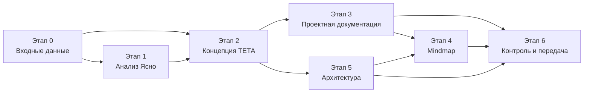

# План работ: продуктовый анализ и проектная документация платформы ТЕТА

> Версия 2.1 · 11.09.2026 · Статус: **доработка v2 выполнена, пакет передан на утверждение**
> Область: аналитика и документация. **Программный код платформы на этом этапе не пишется** — разработка стартует отдельно после утверждения документации.

## План доработки v2

Основание — указания заказчика от 11.09.2026 и обновлённое ТЗ ([tz_v2.md](../01_inputs/tz_v2.md)). Все решения собраны в [реестре решений v2](../01_inputs/decisions_v2.md): это единый источник для каждой задачи ниже.

**Главные изменения:** полноценный продукт по этапам ТЗ вместо MVP/R2/R3; стек Laravel + Next.js + PostgreSQL + Redis; видео — TetaMeet; собственные email-рассылки и техподдержка; финансовая модель «агрегатор, НПД, комиссия 30 %, еженедельные выплаты, обязательная ежемесячная супервизия»; кабинет психолога строго по этапу 2; новые модули RBAC, SUPERV, INTERV, MAILING; 43 запроса с посадочными; только шрифт Onest, корпоративные цвета и логотипы заказчика; удалены Jivo, DashaMail, iCal, соцвходы, Health-интеграции, 2FA, кабинет партнёра, скрининг в анкете, согласие на сведения о здоровье.

| № | Задача | Документы | Зависит от | Статус |
|---|---|---|---|---|
| V2.0 | ТЗ v2 в проект; реестр решений; реестр вопросов v2; фирменные материалы; поддержка `DEC-` и решённых вопросов в `check_docs.py` | `01_inputs/tz_v2.md`, `decisions_v2.md`, `open_questions.md`, `brand/`, `_tools/check_docs.py` | — | ✅ |
| V2.1 | Блоки и разделы платформы: 116 разделов | `03_product/teta_platform_blocks.md` | V2.0 | ✅ |
| V2.2 | Архитектура продукта и её диаграммы | `06_architecture/product_architecture.md`, `diagrams/product_*` | V2.0 | ✅ |
| V2.3 | Бизнес-правила и параметры: 283 правила, 92 параметра | `04_project_docs/03_business_rules.md` | V2.0 | ✅ |
| V2.4 | Интеграции: 172 требования | `04_project_docs/05_integrations.md` | V2.0 | ✅ |
| V2.5 | Право и комплаенс | `04_project_docs/06_legal_compliance.md` | V2.0 | ✅ |
| V2.6 | Конкурентный анализ, разбор экранов, аудит, матрица функций | `02_competitor_analysis/*` | V2.0 | ✅ |
| V2.7 | Концепция, персоны и сценарии, сводка входных данных, глоссарий | `01_vision_scope.md`, `personas_cjm_flows.md`, `inputs_digest.md`, `11_glossary.md` | V2.0 | ✅ |
| V2.8 | Роадмап по этапам и спринтам (44 спринта), риски | `09_roadmap_releases.md`, `10_risks.md` | V2.0 | ✅ |
| V2.9 | Техническая архитектура (23 ADR) и её диаграммы | `06_architecture/technical_architecture.md`, `diagrams/c4_*`, `tech_*`, `backend_modules`, `cicd_pipeline`, `outbox_flow`, `llm_gateway_pipeline` | V2.0 | ✅ |
| V2.10 | Функциональные требования: 738 FR по 34 модулям, трассировка | `04_project_docs/02_functional_requirements.md` | V2.1, V2.3 | ✅ |
| V2.11 | Нефункциональные требования (172), уведомления (134), метрики (57) | `04_…`, `07_…`, `08_…` | V2.1, V2.3 | ✅ |
| V2.12 | Модель данных (212 сущностей), 22 последовательности и 20 машин состояний, их диаграммы | `data_model.md`, `sequences_states.md`, `diagrams/dm_*`, `seq_*`, `st_*` | V2.3, V2.9 | ✅ |
| V2.13 | Роли и права (12 ролей × 116 разделов), карта сайта (59 страниц, 43 посадочные, 109 маршрутов), бэклог (48 эпиков, 341 история, 1 708 SP) | `roles_permissions.xlsx`, `sitemap.xlsx`, `backlog.xlsx` | V2.1, V2.10 | ✅ |
| V2.14 | Mindmap: 425 узлов с тегами этапов | `05_mindmap/*` | V2.1 | ✅ |
| V2.15 | HTML-сводка пакета: Onest, корпоративные цвета, логотип заказчика; переопубликована по прежней ссылке | `00_plan/package_overview.html` | V2.1–V2.12 | ✅ |
| V2.16 | Сводный DOCX: 16 глав и 4 приложения (~224 страницы), только Onest, логотип заказчика, 12 рисунков в фирменном оформлении | `TETA_project_documentation.docx` | V2.1–V2.12 | ✅ |
| V2.17 | README, проектный skill, рендер 92 диаграмм; две сквозные сверки расхождений между документами (включая 27 пунктов модели данных); `check_docs.py` — 0 ошибок и 0 предупреждений; контрольный поиск удалённого | `README.md`, `.claude/skills/teta-docs/SKILL.md`, `06_architecture/diagrams/` | всё выше | ✅ |

Порядок: V2.1–V2.9 выполнялись параллельно; V2.10–V2.12 — после бизнес-правил и блоков; V2.13–V2.17 — в конце.

**v2.1 (11.09.2026, в ходе доработки):** заказчик ответил на открытые вопросы — реестр решений дополнен DEC-36…DEC-58; в реестре вопросов открыты Q-43 и новые вопросы Q-52…Q-56, выявленные при детализации. Документы V2.1–V2.9, начатые до ответов, получают точечную правку по этим решениям сразу после завершения; задачи V2.10 и дальше выполняются уже по реестру 2.1. Главные изменения: хостинг — VDS Timeweb; платёжный сервис подключается последним этапом, а деньги до этого работают на абстракции с эмулятором; white-label — отдельный инстанс на отдельном сервере вместо мультиарендности (модуль INSTANCE); баланс личного кабинета клиента; собственный почтовый сервер; ценовые категории до 3 500, 3 500–5 500 и от 5 500 ₽; дежурство администратора 10:00–20:00 МСК.

### Итог доработки v2

| Область | Результат v2.1 |
|---|---|
| Решения и вопросы | 58 решений заказчика в реестре; вопросы: 6 открытых (все P1, блокеров нет), 49 решённых или снятых |
| Продукт | 116 разделов интерфейса; 43 запроса с посадочными; 10 персон и 23 сценария; 12 ролей × 116 разделов; бэклог — 48 эпиков, 341 история, 1 708 SP |
| Требования | 738 FR по 34 модулям с трассировкой к пунктам ТЗ; 283 бизнес-правила и 92 параметра; 172 NFR; 172 требования к 11 интеграциям; 50 норм юридического контура; 134 уведомления; 57 метрик |
| План и риски | Роадмап по этапам ТЗ — 44 недельных спринта до 11.07.2027, платёжный сервис подключается последним этапом; 34 риска, из них 5 критических |
| Архитектура | 34 модуля, white-label как отдельные инстансы; 23 ADR; модель данных — 212 сущностей; 22 последовательности и 20 машин состояний; 92 диаграммы в фирменном оформлении |
| Конкуренты | Анализ «Ясно» с таксономией запросов, разбор 45 экранов, аудит текущих сайтов, матрица 124 функций |
| Оформление | Только Onest, корпоративные цвета `#4A4A4A` и `#4D427A`, логотип — файлы заказчика; mindmap на 425 узлов; HTML-сводка переопубликована |
| Контроль | `check_docs.py` — 0 ошибок и 0 предупреждений; контрольный поиск удалённого — совпадения только в допустимых контекстах (таблицы «Что удалено», факты о конкуренте, Won't-требования) |

---

## Итог выполнения v1

| Этап | Статус | Результат |
|---|---|---|
| 0. Входные данные | ✅ | 4 исследования с источниками; сводка материалов; 41 открытый вопрос, из них 15 — P0 |
| 1. Анализ «Ясно» | ✅ | Продуктовый анализ (23 раздела); покадровый разбор 45 экранов; аудит teta.su, OnDoc и test.teta.su; матрица 82 функций |
| 2. Концепция ТЕТА | ✅ | Все контуры, разделы, блоки и состояния; 8 персон, JTBD, CJM, 12 сценариев; матрица прав на 16 ролей |
| 3. Проектная документация | ✅ | Концепция и границы; 426 FR; 114 бизнес-правил и 37 параметров; 175 NFR; 192 требований к интеграциям; 45 строк карты норм; 70 уведомлений; 31 метрика; роадмап; 28 рисков; глоссарий; бэклог и сводный DOCX — `03_product/backlog.xlsx`, `04_project_docs/TETA_project_documentation.docx` |
| 4. Mindmap | ✅ | 383 узла: HTML, FreeMind, OPML, Mermaid, JSON |
| 5. Архитектура | ✅ | Продуктовая архитектура (32 модуля), техническая (22 ADR), модель данных (152 сущности), 13 последовательностей и 12 машин состояний, 61 диаграмма с SVG, реестр 73 страниц сайта и 70 редиректов |
| 6. Инструменты и контроль | ✅ | `check_docs.py`, `build_mindmap.py`, проектный skill `teta-docs`; семь раундов сквозных правок по итогам ревью; все диаграммы проверены mermaid-cli; визуальная сводка `package_overview.html` |

**Отклонения от плана:** добавлены аудит прототипа test.teta.su и OnDoc, визуальная HTML-сводка пакета, реестр редиректов; уведомления и параметры вынесены в отдельные реестры. Решения, требующие заказчика и юриста, не приняты молча — они в `01_inputs/open_questions.md`.

---

## 1. Цель

Подготовить полный пакет проектной документации новой платформы онлайн-психологии ТЕТА (teta.su), основанный на:

- детальном продуктовом анализе главного конкурента — «Ясно» (yasno.live);
- аудите текущего сайта teta.su и тестовой версии test.teta.su;
- материалах заказчика: бриф, ТЗ, ДНК бренда, фирменный стиль, логотипы, 45 скриншотов пути клиента в Ясно.

Пакет должен быть достаточным, чтобы (а) заказчик утвердил состав и границы продукта, (б) дизайнеры начали wireframes/CJM, (в) разработка через Claude Code стартовала без повторного сбора требований.

## 2. Входные данные (инвентаризация)

| # | Файл / источник | Содержание | Как использован |
|---|---|---|---|
| 1 | `brief.md` | Бриф: ЦА, боли, монетизация, дизайн, контент, интеграции, пожелания к кабинетам | Требования, бизнес-правила, вопросы |
| 2 | `prd.md` | ТЗ: роли, функции клиента/психолога/админа, уникальные функции, стек, этапы | Каркас SRS и архитектуры |
| 3 | `teta_info/DNK_TETA.pdf` (9 слайдов) | Суть, ЦА, цели, ценности, характер бренда, УТП, преимущества, отличия от конкурентов | Vision, позиционирование, tone of voice |
| 4 | `teta_info/ТЕТА фирм стиль.pdf` (4 слайда) | Цвета, шрифты Staatliches & Alata, референсы сайта, носители | Требования к дизайну |
| 5 | `teta_info/*.jpg` | Логотип (black/white), корпоративные цвета | Дизайн-требования |
| 6 | `Информация/скриншоты платформы конкурента Ясно/` (45 PNG) | Путь клиента Ясно от регистрации до повторной записи | Покадровый разбор, UX-паттерны |
| 7 | https://yasno.live | Публичный сайт конкурента | Карта сайта, офферы, цены, B2B, контент |
| 8 | https://teta.su, https://test.teta.su | Текущий сайт и тестовая версия ТЕТА | Аудит «как есть», что сохранить |
| 9 | Внешние источники | Сторы, отзывы, пресса, регуляторика РФ, документация интеграций | Сигналы рынка, комплаенс, интеграции |

## 3. Структура результата (папки и форматы)

Все материалы — в папке `docs/` (ASCII-имена папок и файлов, чтобы избежать проблем с Unicode-нормализацией кириллицы в путях macOS; содержимое — на русском).

```
docs/
├── README.md                          навигация по пакету, статусы, порядок чтения
├── 00_plan/
│   └── work_plan.md                   этот план (MD)
├── 01_inputs/
│   ├── inputs_digest.md               сводка исходных материалов (MD)
│   └── open_questions.md              противоречия и вопросы к заказчику (MD)
├── 02_competitor_analysis/
│   ├── yasno_product_analysis.md      детальный продуктовый анализ Ясно (MD)
│   ├── yasno_screens_teardown.md      покадровый разбор 45 скриншотов (MD)
│   ├── teta_current_sites_audit.md    аудит teta.su и test.teta.su (MD)
│   └── feature_matrix.xlsx            матрица функций Ясно / рынок / ТЕТА (XLSX)
├── 03_product/
│   ├── teta_platform_blocks.md        ГЛАВНЫЙ: блоки и разделы новой платформы (MD)
│   ├── personas_cjm_flows.md          персоны, JTBD, CJM, user flows (MD + Mermaid)
│   ├── roles_permissions.xlsx         ролевая модель и матрица прав (XLSX)
│   └── backlog.xlsx                   эпики → user stories, MoSCoW, релизы (XLSX)
├── 04_project_docs/
│   ├── 01_vision_scope.md             концепция, цели, KPI, границы
│   ├── 02_functional_requirements.md  SRS: требования по модулям с ID
│   ├── 03_business_rules.md           оплата, отмены, выплаты, промокоды, B2B, отзывы
│   ├── 04_nonfunctional_requirements.md безопасность, 152-ФЗ, производительность
│   ├── 05_integrations.md             CloudPayments/CloudKassir, видео, Jivo, DashaMail, Дзен, Метрика, LLM
│   ├── 06_legal_compliance.md         152-ФЗ, 54-ФЗ, НПД, реклама, документы сайта
│   ├── 07_notifications.md            матрица уведомлений и email-сценариев
│   ├── 08_analytics_metrics.md        метрики, воронки, события, дашборды
│   ├── 09_roadmap_releases.md         этапы, MVP/релизы, оценка, зависимости
│   ├── 10_risks.md                    реестр рисков
│   ├── 11_glossary.md                 глоссарий
│   └── TETA_project_documentation.docx сводный документ для согласования (DOCX)
├── 05_mindmap/
│   ├── teta_mindmap.md                источник (Markdown, markmap-совместимый)
│   ├── teta_mindmap.html              интерактивная карта (HTML)
│   ├── teta_mindmap.mm                FreeMind/Freeplane → открывается в XMind, MindManager
│   ├── teta_mindmap.opml              OPML (универсальный импорт)
│   └── teta_mindmap.mmd               Mermaid mindmap
├── 06_architecture/
│   ├── product_architecture.md        блочная архитектура: проект, сайт, ЛК клиента, ЛК психолога, админка, B2B/WL
│   ├── sitemap.xlsx                   реестр страниц сайта: URL, назначение, SEO, доступ (XLSX)
│   ├── technical_architecture.md      контейнеры, модули бэкенда, стек, инфраструктура
│   ├── data_model.md                  сущности и связи (ER)
│   ├── sequences_states.md            последовательности и машины состояний
│   └── diagrams/                      исходники диаграмм (.mmd) + рендеры (.svg)
├── 99_sources/
│   ├── research_yasno_public_site.md  сырой отчёт исследования
│   ├── research_yasno_external.md
│   ├── research_teta_sites.md
│   ├── research_legal_integrations.md
│   └── screenshots_index.md           соответствие скриншотов экранам
└── _tools/
    ├── build_mindmap.py               генератор форматов mindmap из одного источника
    └── check_docs.py                  проверка ссылок, ID требований, открытых вопросов
.claude/skills/teta-docs/SKILL.md      проектный skill: правила ведения документации в Claude Code
```

## 4. Этапы и задачи

Легенда статусов: ✅ выполнено · 🔄 в работе · ⏳ ожидает

### Этап 0. Сбор и изучение входных данных

| ID | Задача | Результат | Статус |
|---|---|---|---|
| 0.1 | Инвентаризация всех файлов проекта | Таблица входных данных (раздел 2) | ✅ |
| 0.2 | Извлечение содержимого PDF (текст закодирован кастомными шрифтами → рендер страниц и визуальное чтение) | Тезисы ДНК и фирстиля | ✅ |
| 0.3 | Просмотр и расшифровка 45 скриншотов Ясно | Черновик покадрового разбора | ✅ |
| 0.4 | Исследование публичного сайта yasno.live (фоновый агент) | `99_sources/research_yasno_public_site.md` | ✅ |
| 0.5 | Аудит teta.su и test.teta.su (фоновый агент) | `99_sources/research_teta_sites.md` | ✅ |
| 0.6 | Внешние сигналы о Ясно: сторы, отзывы, пресса, сторона психолога, рынок (фоновый агент) | `99_sources/research_yasno_external.md` | ✅ |
| 0.7 | Регуляторика РФ и интеграции (фоновый агент) | `99_sources/research_legal_integrations.md` | ✅ |
| 0.8 | Сводка входных данных, выявление противоречий бриф ↔ ТЗ | `01_inputs/inputs_digest.md`, `open_questions.md` | ✅ |

### Этап 1. Продуктовый анализ конкурента «Ясно»

| ID | Задача | Результат |
|---|---|---|
| 1.1 | Информационная архитектура и карта сайта | Раздел анализа + дерево разделов |
| 1.2 | Покадровый разбор пути клиента: регистрация → анкета → подбор → карточка психолога → расписание → оплата/привязка карты → ЛК → перенос/отмена → оценка → реферальная программа | `yasno_screens_teardown.md` |
| 1.3 | Монетизация: цены, уровни психологов, модель списания, промокоды, сертификаты, реферальная программа | Раздел анализа |
| 1.4 | Механики подбора (показатель соответствия, фильтры по времени, видеопрофили) | Раздел анализа |
| 1.5 | Механики удержания и роста (удержание при отмене, повторная запись, приложение, тесты, курсы, рефералка) | Раздел анализа |
| 1.6 | Сторона психолога: отбор, условия, супервизии, кабинет | Раздел анализа |
| 1.7 | B2B: «Ясно для бизнеса» | Раздел анализа |
| 1.8 | Контент и SEO: журнал, тесты, курсы, посадочные страницы | Раздел анализа |
| 1.9 | Сильные и слабые стороны, паттерны «взять / улучшить / избежать» | Раздел анализа |
| 1.10 | Матрица функций Ясно × рынок × ТЕТА (MVP / релиз 2 / позже) | `feature_matrix.xlsx` |
| 1.11 | Выводы: где ТЕТА выигрывает (позиционирование «качество, этичность, без переплат») | Раздел анализа |

### Этап 2. Продуктовая концепция ТЕТА

| ID | Задача | Результат |
|---|---|---|
| 2.1 | Позиционирование, УТП, принципы продукта из ДНК бренда | `01_vision_scope.md` |
| 2.2 | Персоны и JTBD: клиент (3 сегмента), психолог, администратор, HR-менеджер компании, партнёр white-label | `personas_cjm_flows.md` |
| 2.3 | CJM клиента и психолога; ключевые user flows | `personas_cjm_flows.md` (Mermaid) |
| 2.4 | **Детальный перечень блоков и разделов**: сайт, ЛК клиента, ЛК психолога, админ-панель, корпоративный кабинет, white-label | `teta_platform_blocks.md` |
| 2.5 | Ролевая модель и матрица прав | `roles_permissions.xlsx` |

### Этап 3. Проектная документация

| ID | Задача | Результат |
|---|---|---|
| 3.1 | Vision & Scope: цели, метрики успеха, границы MVP, допущения | `01_vision_scope.md` |
| 3.2 | Функциональные требования по модулям с ID (`FR-<модуль>-NNN`), приоритет MoSCoW, критерии приёмки | `02_functional_requirements.md` |
| 3.3 | Бизнес-правила: привязка карты и списание за 12 ч, отмена/перенос, неявка, возвраты, смена психолога, промокоды, B2B-счета, выплаты психологам, модерация отзывов и статей | `03_business_rules.md` |
| 3.4 | Нефункциональные требования: безопасность, ПДн спецкатегорий, доступность, производительность, браузеры/устройства, резервирование | `04_nonfunctional_requirements.md` |
| 3.5 | Интеграции: схемы, события, вебхуки, ответственность | `05_integrations.md` |
| 3.6 | Юридический контур: 152-ФЗ, 54-ФЗ, НПД, реклама и маркировка, пакет документов сайта | `06_legal_compliance.md` |
| 3.7 | Матрица уведомлений (событие → получатель → канал → шаблон → триггер) | `07_notifications.md` |
| 3.8 | Метрики и аналитика: North Star, воронки, события Яндекс Метрики, отчёты админки | `08_analytics_metrics.md` |
| 3.9 | Роадмап и релизы: MVP → R2 → R3; сверка с 13-недельным планом из ТЗ, реалистичная оценка | `09_roadmap_releases.md` |
| 3.10 | Реестр рисков (продукт, право, технологии, сроки) | `10_risks.md` |
| 3.11 | Глоссарий | `11_glossary.md` |
| 3.12 | Бэклог: эпики и user stories с привязкой к FR | `backlog.xlsx` |
| 3.13 | Сводный документ для согласования | `TETA_project_documentation.docx` |

### Этап 4. Mindmap

| ID | Задача | Результат |
|---|---|---|
| 4.1 | Единый источник mindmap: продукт → роли → разделы → функции → интеграции → релизы | `teta_mindmap.md` |
| 4.2 | Утилита генерации форматов | `_tools/build_mindmap.py` |
| 4.3 | Генерация: интерактивный HTML, FreeMind `.mm`, OPML, Mermaid | `05_mindmap/*` |

### Этап 5. Архитектура продукта

| ID | Задача | Результат |
|---|---|---|
| 5.1 | Контекстная схема: пользователи, платформа, внешние системы | Mermaid + SVG |
| 5.2 | Блочная структура платформы: публичный сайт, ЛК клиента, ЛК психолога, админ-панель, корпоративный кабинет, white-label | `product_architecture.md` |
| 5.3 | Карта сайта с реестром страниц | `sitemap.xlsx` + дерево |
| 5.4 | Структура ЛК клиента (разделы, виджеты, состояния) | `product_architecture.md` |
| 5.5 | Структура ЛК психолога | `product_architecture.md` |
| 5.6 | Структура админ-панели | `product_architecture.md` |
| 5.7 | Корпоративный кабинет (HR) и white-label (мультиарендность) | `product_architecture.md` |
| 5.8 | Техническая архитектура: контейнеры, доменные модули бэкенда, рекомендации по стеку в рамках ТЗ | `technical_architecture.md` |
| 5.9 | Модель данных: сущности, ключевые поля, связи | `data_model.md` |
| 5.10 | Последовательности: запись и привязка карты, списание за 12 ч, перенос/отмена, видеосессия, выплата, статья → Дзен, дневник эмоций | `sequences_states.md` |
| 5.11 | Машины состояний: сессия, платёж, выплата, психолог (онбординг), статья, отзыв | `sequences_states.md` |

### Этап 6. Инструменты, контроль качества, передача

| ID | Задача | Результат |
|---|---|---|
| 6.1 | Утилита проверки документации: битые ссылки, дубли и «висячие» ID требований, счётчик открытых вопросов | `_tools/check_docs.py` |
| 6.2 | Проектный skill для последующей работы в Claude Code | `.claude/skills/teta-docs/SKILL.md` |
| 6.3 | README-навигация по пакету | `docs/README.md` |
| 6.4 | Сквозная проверка согласованности (термины, ID, цифры, ссылки) | Отчёт `check_docs.py` |
| 6.5 | Итоговое резюме и список решений на утверждение | Сообщение заказчику |

## 5. Порядок выполнения и зависимости



Параллельно: исследования 0.4–0.7 идут в фоне, пока пишутся разбор скриншотов, перечень блоков и архитектура. Документы, зависящие от исследований (анализ Ясно, интеграции, юридический контур, аудит teta.su), дописываются по мере поступления результатов.

## 6. Принципы работы

1. **Без кода платформы.** Создаются только документы, диаграммы и вспомогательные утилиты для документации.
2. **Исходные файлы заказчика не изменяются и не перемещаются.**
3. **Факт ≠ гипотеза.** В анализе явно помечается: наблюдение по скриншоту, факт с сайта (с URL), внешний источник, экспертное предположение.
4. **Трассируемость.** Каждое требование имеет ID; бэклог и матрица функций ссылаются на ID; противоречия бриф ↔ ТЗ вынесены в открытые вопросы, а не решены молча.
5. **Приоритет ТЗ заказчика.** Рекомендации, расширяющие ТЗ, помечаются как «рекомендация» и не включаются в MVP без согласования.
6. **Ограничения безопасности исследования.** На сайтах конкурента не выполняются регистрация, отправка форм и оплата; используются только публичные страницы и предоставленные скриншоты.

## 7. Критерии готовности пакета

- [ ] Все разделы сайта, ЛК клиента, ЛК психолога, админ-панели, корпоративного кабинета и white-label описаны на уровне блоков, полей и состояний.
- [ ] Каждая функция из брифа и ТЗ отражена минимум в одном требовании с ID.
- [ ] Бизнес-правила оплаты, отмен, выплат и B2B-биллинга описаны без противоречий.
- [ ] Mindmap открывается в браузере и импортируется в XMind/Freeplane.
- [ ] Диаграммы архитектуры имеют исходник и рендер.
- [ ] `check_docs.py` проходит без ошибок.
- [ ] Сформирован список решений, которые должен утвердить заказчик.
