# Последовательности и машины состояний платформы ТЕТА

> Версия 2.1 · 11.09.2026 · Статус: черновик на утверждение
> Изменения v2: документ переписан по [реестру решений v2](../01_inputs/decisions_v2.md) (DEC-01…DEC-58) и [ТЗ v2](../01_inputs/tz_v2.md): 22 последовательности и 20 машин состояний вместо 12 и 11. Добавлены смена психолога с возвратом на баланс личного кабинета, неявка психолога с передачей администратору, жалоба на списание, перенос после списания, еженедельная выплата при ежемесячной супервизии, контроль и оплата супервизии, интервизия, проверка квалификации, бот Герман с дежурством администратора, техподдержка, email-рассылки через собственный почтовый сервер, отзывы с согласием на публикацию, подарочные сертификаты, «Пригласи друга», корпоративный сотрудник и партнёрский инстанс white-label. Деньги идут через абстракцию платёжного сервиса с тестовым эмулятором (DEC-38), видео — через TetaMeet (DEC-07). Удалены сценарии v1, противоречащие решениям v2: двухстадийная оплата с холдом, подписание отдельного согласия на сведения клиента, проверка налогового статуса перед выплатой, доступ к дневнику по отдельному согласию, кризисные инциденты как отдельная сущность.
> Связанные документы: [реестр решений v2](../01_inputs/decisions_v2.md) · [открытые вопросы](../01_inputs/open_questions.md) · [техническая архитектура](technical_architecture.md) · [архитектура продукта](product_architecture.md) · [модель данных](data_model.md) · [исходники диаграмм](diagrams/README.md) · [бизнес-правила](../04_project_docs/03_business_rules.md) · [интеграции](../04_project_docs/05_integrations.md) · [правовой контур](../04_project_docs/06_legal_compliance.md) · [блоки и разделы](../03_product/teta_platform_blocks.md)

Документ фиксирует сквозные сценарии взаимодействия людей, приложений и внешних систем (раздел A) и жизненные циклы ключевых сущностей (раздел B). Контейнеры, очереди, планировщик и доменные события взяты из [технической архитектуры](technical_architecture.md), сквозные процессы — из [архитектуры продукта](product_architecture.md), контракты внешних систем — из [интеграций](../04_project_docs/05_integrations.md), сроки и суммы — параметры `P-…` [бизнес-правил](../04_project_docs/03_business_rules.md). При расхождении с бизнес-правилами действует [реестр решений](../01_inputs/decisions_v2.md). Код платформы на этапе документации не пишется.

Обозначения: **[Ф]** — факт из ТЗ v2 или решения заказчика; **[П]** — интерпретация; **[допущение]** — рабочее решение до ответа на открытый вопрос Q-NN; **[Рек.]** — рекомендация аналитика; **[ПРОВЕРИТЬ]** — сверить с платёжным сервисом, TetaMeet или бухгалтером; **[ЮРИСТ]** — нужна позиция юриста.

## Содержание

**[0. Соглашения](#0-соглашения)**

**[A. Последовательности](#a-последовательности)**
1. [SEQ-01. Подбор, регистрация и привязка карты](#seq-01-подбор-регистрация-и-привязка-карты)
2. [SEQ-02. Автосписание за 12 часов](#seq-02-автосписание-за-12-часов)
3. [SEQ-03. Перенос и отмена клиентом](#seq-03-перенос-и-отмена-клиентом)
4. [SEQ-04. Смена психолога](#seq-04-смена-психолога)
5. [SEQ-05. Отмена или неявка психолога](#seq-05-отмена-или-неявка-психолога)
6. [SEQ-06. Жалоба на списание](#seq-06-жалоба-на-списание)
7. [SEQ-07. Видеосессия в TetaMeet](#seq-07-видеосессия-в-tetameet)
8. [SEQ-08. Еженедельная выплата](#seq-08-еженедельная-выплата)
9. [SEQ-09. Ежемесячный контроль супервизии](#seq-09-ежемесячный-контроль-супервизии)
10. [SEQ-10. Заявка и оплата супервизии](#seq-10-заявка-и-оплата-супервизии)
11. [SEQ-11. Запись в группу интервизии](#seq-11-запись-в-группу-интервизии)
12. [SEQ-12. Проверка квалификации психолога](#seq-12-проверка-квалификации-психолога)
13. [SEQ-13. Статья и автопостинг в Дзен](#seq-13-статья-и-автопостинг-в-дзен)
14. [SEQ-14. Диалог с ботом Германом](#seq-14-диалог-с-ботом-германом)
15. [SEQ-15. Обращение в техподдержку](#seq-15-обращение-в-техподдержку)
16. [SEQ-16. Email-рассылка по сегменту](#seq-16-email-рассылка-по-сегменту)
17. [SEQ-17. Отзыв с согласием на публикацию](#seq-17-отзыв-с-согласием-на-публикацию)
18. [SEQ-18. Подарочный сертификат](#seq-18-подарочный-сертификат)
19. [SEQ-19. Программа «Пригласи друга»](#seq-19-программа-пригласи-друга)
20. [SEQ-20. Корпоративный сотрудник](#seq-20-корпоративный-сотрудник)
21. [SEQ-21. Подключение партнёра white-label](#seq-21-подключение-партнёра-white-label)
22. [SEQ-22. Удаление аккаунта по запросу](#seq-22-удаление-аккаунта-по-запросу)

**[B. Машины состояний](#b-машины-состояний)**
[ST-01. Сессия](#st-01-сессия) · [ST-02. Задание на списание](#st-02-задание-на-списание) · [ST-03. Платёж](#st-03-платёж) · [ST-04. Движение баланса клиента](#st-04-движение-баланса-клиента) · [ST-05. Жалоба на списание](#st-05-жалоба-на-списание) · [ST-06. Начисление психологу](#st-06-начисление-психологу) · [ST-07. Выплата](#st-07-выплата) · [ST-08. Проверка квалификации психолога](#st-08-проверка-квалификации-психолога) · [ST-09. Активность психолога по супервизии](#st-09-активность-психолога-по-супервизии) · [ST-10. Заявка и встреча супервизии](#st-10-заявка-и-встреча-супервизии) · [ST-11. Участие в группе интервизии](#st-11-участие-в-группе-интервизии) · [ST-12. Статья](#st-12-статья) · [ST-13. Отзыв](#st-13-отзыв) · [ST-14. Обращение в техподдержку](#st-14-обращение-в-техподдержку) · [ST-15. Диалог с Германом и передача](#st-15-диалог-с-германом-и-передача) · [ST-16. Рассылка](#st-16-рассылка) · [ST-17. Промокод](#st-17-промокод) · [ST-18. Подарочный сертификат](#st-18-подарочный-сертификат) · [ST-19. Участие в корпоративной программе](#st-19-участие-в-корпоративной-программе) · [ST-20. Партнёрский инстанс](#st-20-партнёрский-инстанс)

**[C. Сводка](#c-сводка)**

---

## 0. Соглашения

### Участники диаграмм

| Участник | Что это | Источник |
|---|---|---|
| Клиент, Психолог, Супервизор, Администратор | Роли RBAC (DEC-30). «Администратор» на диаграммах — роль с нужным правом, в том числе Супер-администратор. Сотрудник компании, HR-менеджер, покупатель сертификата и команда партнёра показаны отдельно там, где участвуют | Реестр решений, раздел 3 |
| Next.js | Приложения `web` (SITE, WIZ, CL, PRO, HR и веб-клиент TetaMeet) и `admin` (ADM) | Техническая архитектура, раздел 3 |
| Laravel API | Бэкенд Laravel 13 — модульный монолит: процессы `api`, `webhooks`, `realtime`, `llm-gateway` и обработчики очередей `horizon`. Модули указаны в подписи шага кодами реестра | Техническая архитектура, разделы 3 и 5 |
| Очередь Redis | Очереди Horizon: `payments`, `payouts`, `webhooks`, `outbox`, `mail-transactional`, `mailing`, `mail-events`, `meet`, `exports`, `content`, `files` | Техническая архитектура, раздел 9.2 |
| Планировщик | Контейнер `scheduler`: периодические команды по московскому времени с блокировкой от повторного запуска | Техническая архитектура, раздел 9.3 |
| Платёжный адаптер или эмулятор | Реализация контракта платёжного сервиса в модуле PAY, включая кассу 54-ФЗ и выплаты. До подключения реального сервиса — тестовый эмулятор, после — адаптер выбранного сервиса; модули BOOK, SUPERV, PAYOUT, PROMO и B2B от замены не меняются (DEC-38, Q-43) | Интеграции, разделы 5–7 |
| TetaMeet | Серверная часть TetaMeet: комнаты, токены участников, допуск, вебхуки журнала сессий. Записи нет (DEC-07) | Интеграции, раздел 13 |
| Почтовый сервер | Собственный почтовый сервер проекта, письма уходят по SMTP; на dev и stage — тестовый SMTP без доставки реальным адресатам (DEC-51) | Интеграции, раздел 8 |
| LLM | Модель бота Германа: российский провайдер или локальная открытая модель на серверах в РФ (DEC-54) | Интеграции, раздел 12 |
| Дзен | «Яндекс Дзен» проекта ТЕТА: периодически забирает RSS-ленту статей | Интеграции, раздел 10 |

### Общие правила сценариев

1. **Время.** Хранится в UTC, показывается в часовом поясе получателя с указанием пояса (BR-SCHED-01, BR-NOTIF-05). Команды планировщика и календарный месяц супервизии считаются по московскому времени (DEC-37).
2. **События.** Модуль меняет свои данные и в той же транзакции пишет доменное событие в outbox; подписчики получают его через очередь Redis «как минимум один раз» и обрабатывают идемпотентно. На диаграммах доставка события показана одной стрелкой.
3. **Письма.** NOTIF ставит письмо в очередь `mail-transactional` и пишет уведомление в центр уведомлений; письмо уходит по SMTP на почтовый сервер. В письмах нет сведений о состоянии (BR-NOTIF-04). Если письмо не ушло после повторов, процесс не останавливается (BR-NOTIF-09).
4. **Деньги.** Модули работают с деньгами только через публичные сервисы PAY и PAYOUT. У каждой операции есть ключ идемпотентности; вебхуки проверяются по подписи и пишутся в inbox до обработки. Скидка по промокоду уменьшает только долю платформы, психологу начисляется 70 % полной цены (DEC-57).
5. **Машины состояний.** Каждый переход пишет запись в историю сущности и доменное событие; недопустимый переход отклоняет доменная модель модуля-владельца. Значения параметров, действовавшие в момент события, сохраняются в сущности.
6. **Допущения по открытым вопросам.** Q-43 — какой платёжный сервис подключается; Q-52 — все возвраты зачисляются на баланс личного кабинета, при оплате сначала расходуется баланс, затем карта, остаток выводится на карту по заявке клиента; Q-53 — требование супервизии действует на супервизоров, которые ведут клиентов; Q-54 — второй участник парной сессии приходит по приглашению со своей учётной записью; Q-56 — при неявке клиента и отмене клиентом после списания психологу начисляется 70 %, при возврате по жалобе начисление сторнируется.
7. **Формат.** Последовательность: участники и предусловия → диаграмма, шаги пронумерованы → ошибки и исключения → связанные правила. Машина состояний: диаграмма → таблица переходов «из → событие → в, условия, кто инициирует». ID `SEQ-NN` и `ST-NN` действуют внутри документа. Перед каждой диаграммой стоит комментарий с именем исходника в папке [diagrams](diagrams/README.md).

---

# A. Последовательности

## SEQ-01. Подбор, регистрация и привязка карты

**Участники:** клиент, психолог, Next.js (SITE-06, WIZ-01…WIZ-07), Laravel API (MATCH, SCHED, AUTH, CONSENT, BOOK, PAY, PROMO, NOTIF), очередь Redis, платёжный адаптер или эмулятор, почтовый сервер. **Этап ТЗ:** Э3.
**Предусловия:** клиент пришёл с посадочной по запросу, главной или статьи. Путь через Германа (WIZ-02b) описан в SEQ-14 и возвращается в этот сценарий на шаге подбора; путь через каталог начинается с выбора времени.

<!-- diagram: seq_01_booking_card -->
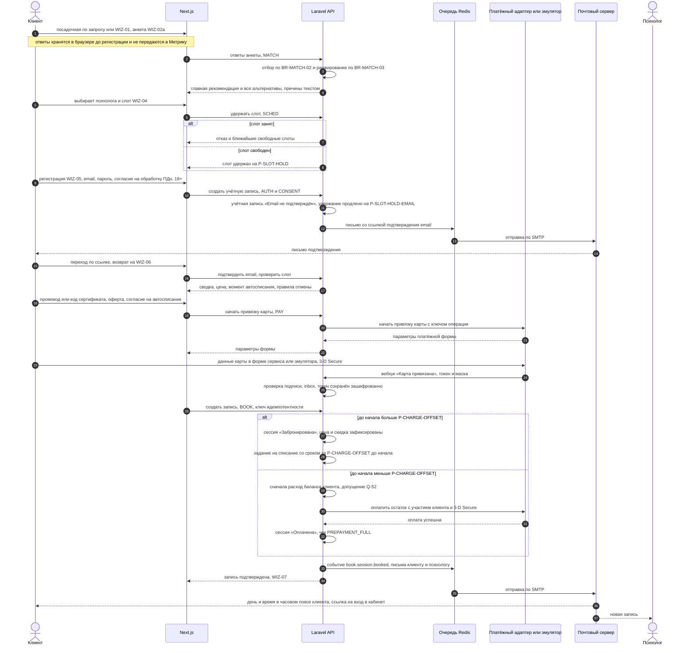
```mermaid
sequenceDiagram
  autonumber
  actor C as Клиент
  participant WEB as Next.js
  participant API as Laravel API
  participant Q as Очередь Redis
  participant PAY as Платёжный адаптер или эмулятор
  participant MAIL as Почтовый сервер
  actor P as Психолог

  C->>WEB: посадочная по запросу или WIZ-01, анкета WIZ-02a
  Note over C,WEB: ответы хранятся в браузере до регистрации и не передаются в Метрику
  WEB->>API: ответы анкеты, MATCH
  API->>API: отбор по BR-MATCH-02 и ранжирование по BR-MATCH-03
  API-->>WEB: главная рекомендация и все альтернативы, причины текстом
  C->>WEB: выбирает психолога и слот WIZ-04
  WEB->>API: удержать слот, SCHED
  alt слот занят
    API-->>WEB: отказ и ближайшие свободные слоты
  else слот свободен
    API-->>WEB: слот удержан на P-SLOT-HOLD
  end
  C->>WEB: регистрация WIZ-05, email, пароль, согласие на обработку ПДн, 18+
  WEB->>API: создать учётную запись, AUTH и CONSENT
  API->>API: учётная запись «Email не подтверждён», удержание продлено на P-SLOT-HOLD-EMAIL
  API->>Q: письмо со ссылкой подтверждения email
  Q->>MAIL: отправка по SMTP
  MAIL-->>C: письмо подтверждения
  C->>WEB: переход по ссылке, возврат на WIZ-06
  WEB->>API: подтвердить email, проверить слот
  API-->>WEB: сводка, цена, момент автосписания, правила отмены
  C->>WEB: промокод или код сертификата, оферта, согласие на автосписание
  WEB->>API: начать привязку карты, PAY
  API->>PAY: начать привязку карты с ключом операции
  PAY-->>API: параметры платёжной формы
  API-->>WEB: параметры формы
  C->>PAY: данные карты в форме сервиса или эмулятора, 3-D Secure
  PAY->>API: вебхук «Карта привязана», токен и маска
  API->>API: проверка подписи, inbox, токен сохранён зашифрованно
  WEB->>API: создать запись, BOOK, ключ идемпотентности
  alt до начала больше P-CHARGE-OFFSET
    API->>API: сессия «Забронирована», цена и скидка зафиксированы
    API->>API: задание на списание со сроком за P-CHARGE-OFFSET до начала
  else до начала меньше P-CHARGE-OFFSET
    API->>API: сначала расход баланса клиента, допущение Q-52
    API->>PAY: оплатить остаток с участием клиента и 3-D Secure
    PAY-->>API: оплата успешна
    API->>API: сессия «Оплачена», чек PREPAYMENT_FULL
  end
  API->>Q: событие book.session.booked, письма клиенту и психологу
  API-->>WEB: запись подтверждена, WIZ-07
  Q->>MAIL: отправка по SMTP
  MAIL-->>C: день и время в часовом поясе клиента, ссылка на вход в кабинет
  MAIL-->>P: новая запись
```

| Ситуация | Поведение | Основание |
|---|---|---|
| Слот занят или удержание истекло | Отказ и ближайшие свободные слоты; после перехода по ссылке из письма слот проверяется заново | BR-BOOK-02, BR-ACC-08 |
| Email не подтверждён | Привязка карты и создание записи недоступны; повторное письмо — не чаще `P-EMAIL-RESEND-INTERVAL` | BR-ACC-03, BR-ACC-08 |
| Клиенту нет 18 лет | Регистрация и запись не выполняются | DEC-49 |
| Подходящих психологов нет | Клиент видит условия, которые сузили выбор, и может смягчить их, перейти в каталог или к Герману | BR-MATCH-06 |
| Привязка карты не удалась или форма закрыта | Событие «Привязка не удалась», причина на WIZ-06; запись не создаётся, слот удерживается до конца срока | BR-PAY-01, BR-BOOK-04 |
| Запись меньше чем за `P-CHARGE-OFFSET`, оплата отклонена | Запись не создаётся, клиенту предлагается другая карта; расход баланса отменяется обратной проводкой [допущение Q-52] | BR-BOOK-04 |
| Превышен лимит предстоящих сессий у психолога | Отказ с объяснением | BR-BOOK-05 |
| Корпоративный сотрудник с остатком лимита | Привязка карты пропускается, сессия помечается «оплачивает компания» (SEQ-20) | BR-BOOK-01, BR-B2B-04 |
| Парная сессия | Клиент указывает email второго участника; приглашение уходит письмом, вход — со своей учётной записью (SEQ-07) [допущение Q-54] | BR-BOOK-16 |
| Письмо не отправлено после всех повторов | Запись действует, уведомление остаётся в центре уведомлений CL-14 | BR-NOTIF-09 |

**Связанные правила:** DEC-15, DEC-16, DEC-38, DEC-49, BR-MATCH-01…BR-MATCH-07, BR-ACC-02, BR-ACC-08, BR-BOOK-01…BR-BOOK-06, BR-PAY-01, BR-PAY-02, BR-PROMO-05; параметры `P-SLOT-HOLD`, `P-SLOT-HOLD-EMAIL`, `P-CHARGE-OFFSET`.

---

## SEQ-02. Автосписание за 12 часов

**Участники:** планировщик, очередь Redis, Laravel API (PAY, BOOK, PROMO, NOTIF), платёжный адаптер или эмулятор, почтовый сервер, клиент, психолог. **Этап ТЗ:** Э3.
**Предусловия:** сессия «Забронирована», задание на списание создано по событию `book.session.booked` со сроком за `P-CHARGE-OFFSET` до начала и крайним сроком за `P-CHARGE-DEADLINE` до начала. Сумма — цена, зафиксированная при записи, за вычетом скидки промокода.

<!-- diagram: seq_02_charge_retries -->
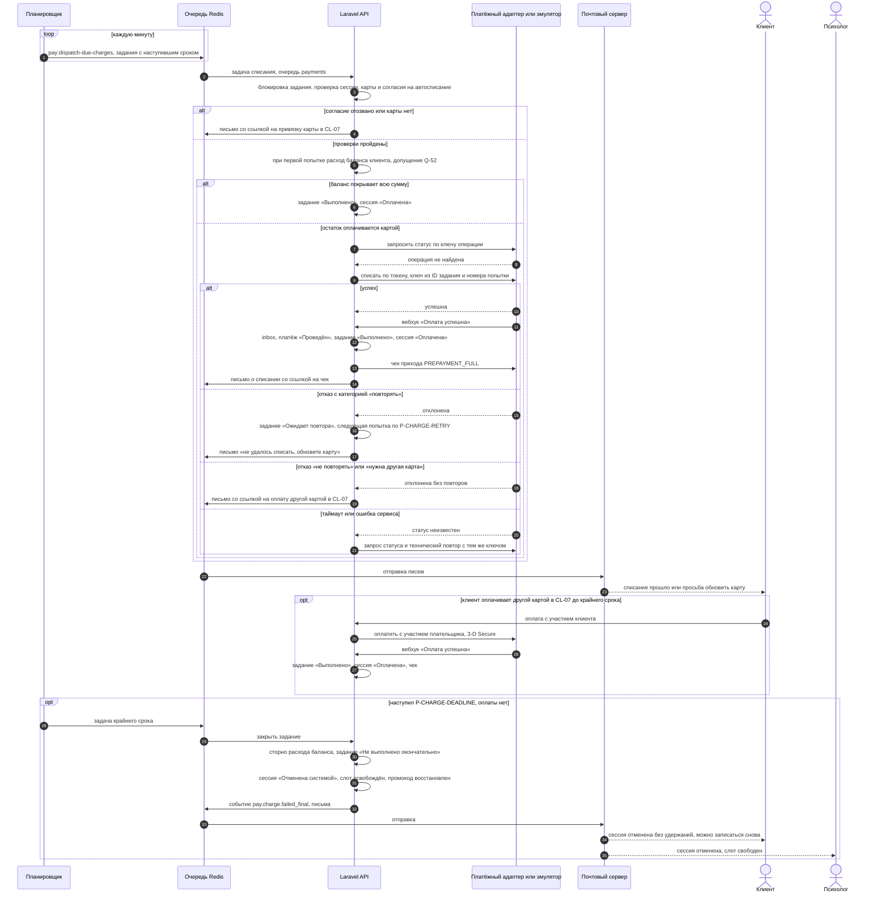
```mermaid
sequenceDiagram
  autonumber
  participant SCH as Планировщик
  participant Q as Очередь Redis
  participant API as Laravel API
  participant PAY as Платёжный адаптер или эмулятор
  participant MAIL as Почтовый сервер
  actor C as Клиент
  actor P as Психолог

  loop каждую минуту
    SCH->>Q: pay:dispatch-due-charges, задания с наступившим сроком
  end
  Q->>API: задача списания, очередь payments
  API->>API: блокировка задания, проверка сессии, карты и согласия на автосписание
  alt согласие отозвано или карты нет
    API->>Q: письмо со ссылкой на привязку карты в CL-07
  else проверки пройдены
    API->>API: при первой попытке расход баланса клиента, допущение Q-52
    alt баланс покрывает всю сумму
      API->>API: задание «Выполнено», сессия «Оплачена»
    else остаток оплачивается картой
      API->>PAY: запросить статус по ключу операции
      PAY-->>API: операция не найдена
      API->>PAY: списать по токену, ключ из ID задания и номера попытки
      alt успех
        PAY-->>API: успешна
        PAY->>API: вебхук «Оплата успешна»
        API->>API: inbox, платёж «Проведён», задание «Выполнено», сессия «Оплачена»
        API->>PAY: чек прихода PREPAYMENT_FULL
        API->>Q: письмо о списании со ссылкой на чек
      else отказ с категорией «повторять»
        PAY-->>API: отклонена
        API->>API: задание «Ожидает повтора», следующая попытка по P-CHARGE-RETRY
        API->>Q: письмо «не удалось списать, обновите карту»
      else отказ «не повторять» или «нужна другая карта»
        PAY-->>API: отклонена без повторов
        API->>Q: письмо со ссылкой на оплату другой картой в CL-07
      else таймаут или ошибка сервиса
        PAY-->>API: статус неизвестен
        API->>PAY: запрос статуса и технический повтор с тем же ключом
      end
    end
  end
  Q->>MAIL: отправка писем
  MAIL-->>C: списание прошло или просьба обновить карту
  opt клиент оплачивает другой картой в CL-07 до крайнего срока
    C->>API: оплата с участием клиента
    API->>PAY: оплатить с участием плательщика, 3-D Secure
    PAY->>API: вебхук «Оплата успешна»
    API->>API: задание «Выполнено», сессия «Оплачена», чек
  end
  opt наступил P-CHARGE-DEADLINE, оплаты нет
    SCH->>Q: задача крайнего срока
    Q->>API: закрыть задание
    API->>API: сторно расхода баланса, задание «Не выполнено окончательно»
    API->>API: сессия «Отменена системой», слот освобождён, промокод восстановлен
    API->>Q: событие pay.charge.failed_final, письма
    Q->>MAIL: отправка
    MAIL-->>C: сессия отменена без удержаний, можно записаться снова
    MAIL-->>P: сессия отменена, слот свободен
  end
```

| Ситуация | Поведение | Основание |
|---|---|---|
| Повторный или запоздавший вебхук | Ответ 2xx без повторной обработки; второе успешное списание по сессии невозможно | BR-PAY-06 |
| Вебхук потерян, задание зависло в обработке | Команда `pay:recover-stuck-charges` каждые 5 мин запрашивает статус операции у сервиса | BR-PAY-13 |
| Клиент удалил карту или отказался от автосписаний | Токен больше не используется, клиенту предлагается привязать другую карту; без оплаты к `P-CHARGE-DEADLINE` сессия отменяется без удержаний | BR-PAY-09 |
| Клиент отменил сессию до успешного списания | Задание «Отменено», расход баланса сторнируется, отмена бесплатна (SEQ-03) | BR-CANC-01 |
| Скидка покрывает всю цену | Списание не выполняется, в срок задания сессия получает статус «Оплачена» | BR-PROMO-08 |
| Корпоративная сессия в пределах лимита | Задания на списание нет; в срок `P-CHARGE-OFFSET` списывается лимит сотрудника (SEQ-20) | BR-B2B-05 |
| Массовый сбой платёжного сервиса | Повторы до крайнего срока; Супер-администратор может отложить автоотмену неоплаченных сессий [Рек.] | BR-PAY-05 |
| Реальный сервис ещё не подключён | Все вызовы обслуживает тестовый эмулятор с теми же статусами, категориями отказа и вебхуками | DEC-38 |

**Связанные правила:** DEC-22, DEC-23, DEC-38, Q-52, BR-PAY-04…BR-PAY-07, BR-PAY-09, BR-PAY-13, BR-PROMO-08, BR-PROMO-09, BR-B2B-05; параметры `P-CHARGE-OFFSET`, `P-CHARGE-RETRY`, `P-CHARGE-DEADLINE`.

---

## SEQ-03. Перенос и отмена клиентом

**Участники:** клиент, психолог, Next.js (CL-03), Laravel API (BOOK, SCHED, PAY, PROMO, PAYOUT, MEET, NOTIF), очередь Redis, TetaMeet, почтовый сервер. **Этап ТЗ:** Э3.
**Предусловия:** сессия «Забронирована» или «Оплачена» и ещё не началась. Интерфейс получает от API вычисленные признаки: списана ли оплата, до какого времени отмена бесплатна, какие слоты доступны для переноса.

<!-- diagram: seq_03_client_reschedule_cancel -->
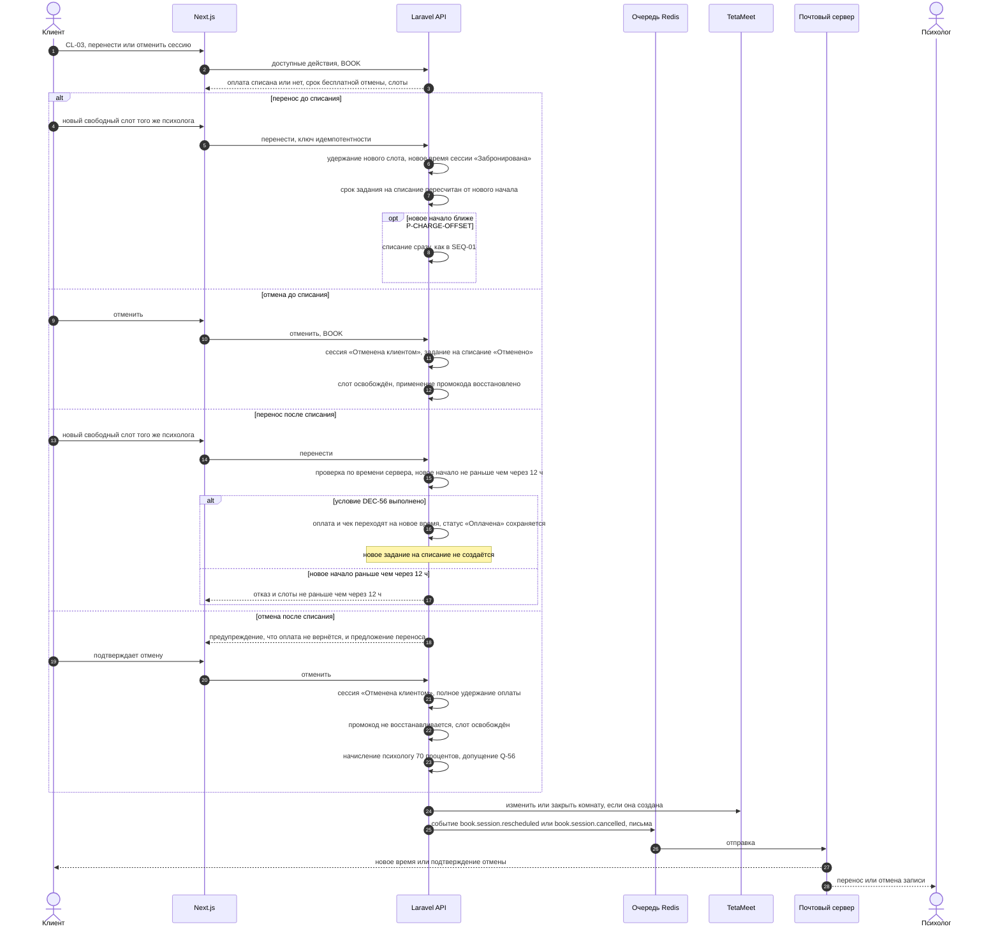
```mermaid
sequenceDiagram
  autonumber
  actor C as Клиент
  participant WEB as Next.js
  participant API as Laravel API
  participant Q as Очередь Redis
  participant TM as TetaMeet
  participant MAIL as Почтовый сервер
  actor P as Психолог

  C->>WEB: CL-03, перенести или отменить сессию
  WEB->>API: доступные действия, BOOK
  API-->>WEB: оплата списана или нет, срок бесплатной отмены, слоты
  alt перенос до списания
    C->>WEB: новый свободный слот того же психолога
    WEB->>API: перенести, ключ идемпотентности
    API->>API: удержание нового слота, новое время сессии «Забронирована»
    API->>API: срок задания на списание пересчитан от нового начала
    opt новое начало ближе P-CHARGE-OFFSET
      API->>API: списание сразу, как в SEQ-01
    end
  else отмена до списания
    C->>WEB: отменить
    WEB->>API: отменить, BOOK
    API->>API: сессия «Отменена клиентом», задание на списание «Отменено»
    API->>API: слот освобождён, применение промокода восстановлено
  else перенос после списания
    C->>WEB: новый свободный слот того же психолога
    WEB->>API: перенести
    API->>API: проверка по времени сервера, новое начало не раньше чем через 12 ч
    alt условие DEC-56 выполнено
      API->>API: оплата и чек переходят на новое время, статус «Оплачена» сохраняется
      Note over API: новое задание на списание не создаётся
    else новое начало раньше чем через 12 ч
      API-->>WEB: отказ и слоты не раньше чем через 12 ч
    end
  else отмена после списания
    API-->>WEB: предупреждение, что оплата не вернётся, и предложение переноса
    C->>WEB: подтверждает отмену
    WEB->>API: отменить
    API->>API: сессия «Отменена клиентом», полное удержание оплаты
    API->>API: промокод не восстанавливается, слот освобождён
    API->>API: начисление психологу 70 процентов, допущение Q-56
  end
  API->>TM: изменить или закрыть комнату, если она создана
  API->>Q: событие book.session.rescheduled или book.session.cancelled, письма
  Q->>MAIL: отправка
  MAIL-->>C: новое время или подтверждение отмены
  MAIL-->>P: перенос или отмена записи
```

| Ситуация | Поведение | Основание |
|---|---|---|
| Сессия уже началась | Перенос и отмена недоступны; дальше действуют итоговые статусы SEQ-07 | BR-CANC-10 |
| Новый слот занят | Отказ и ближайшие свободные слоты | BR-BOOK-02 |
| Перенос после списания на время раньше чем через 12 ч | Отказ; клиент выбирает другой слот или оставляет исходное время | DEC-56 |
| Отмена после списания | Полное удержание; клиент может подать жалобу на списание (SEQ-06) | DEC-23, BR-CANC-03, BR-CANC-05 |
| Число переносов | До списания не ограничено; после списания ограничено только условием DEC-56 [П] | BR-CANC-02, BR-CANC-04 |
| Цена при переносе | Не меняется, даже если психолог изменил цену | BR-PRICE-04 |
| Корпоративная сессия | До `P-CHARGE-OFFSET` отмена сохраняет лимит; после — сессия засчитывается в лимит | BR-B2B-05, BR-CANC-11 |
| Отмена при смене психолога | Отдельный сценарий с зачислением оплаты на баланс (SEQ-04) | DEC-48 |

**Связанные правила:** DEC-23, DEC-56, Q-56, BR-CANC-01…BR-CANC-05, BR-CANC-10, BR-CANC-11, BR-PROMO-09, BR-PAYOUT-02, BR-PRICE-04; параметр `P-CHARGE-OFFSET`.

---

## SEQ-04. Смена психолога

**Участники:** клиент, прежний психолог, Next.js (CL-04, WIZ-02a…WIZ-07), Laravel API (BOOK, PAY, PROMO, B2B, MATCH, NOTIF), очередь Redis, почтовый сервер. **Этап ТЗ:** Э3.
**Предусловия:** у клиента есть назначенные, но не проведённые сессии с прежним психологом, или клиент просто хочет выбрать другого специалиста. Смена психолога бесплатна и не ограничена по числу.

<!-- diagram: seq_04_change_psychologist -->
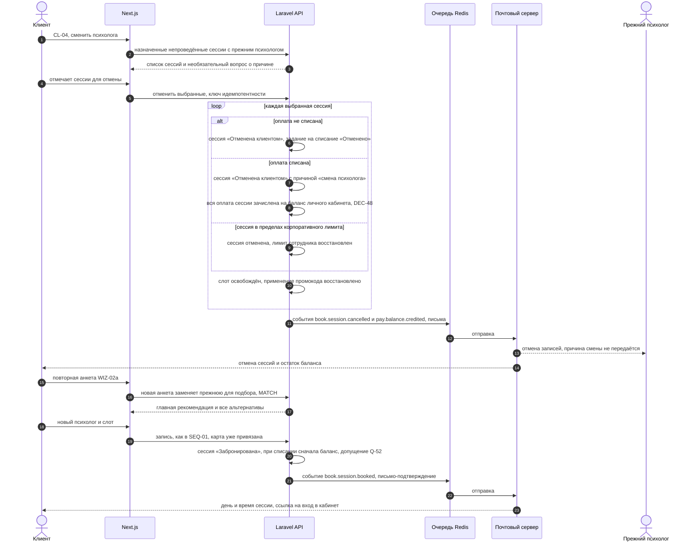
```mermaid
sequenceDiagram
  autonumber
  actor C as Клиент
  participant WEB as Next.js
  participant API as Laravel API
  participant Q as Очередь Redis
  participant MAIL as Почтовый сервер
  actor P as Прежний психолог

  C->>WEB: CL-04, сменить психолога
  WEB->>API: назначенные непроведённые сессии с прежним психологом
  API-->>WEB: список сессий и необязательный вопрос о причине
  C->>WEB: отмечает сессии для отмены
  WEB->>API: отменить выбранные, ключ идемпотентности
  loop каждая выбранная сессия
    alt оплата не списана
      API->>API: сессия «Отменена клиентом», задание на списание «Отменено»
    else оплата списана
      API->>API: сессия «Отменена клиентом» с причиной «смена психолога»
      API->>API: вся оплата сессии зачислена на баланс личного кабинета, DEC-48
    else сессия в пределах корпоративного лимита
      API->>API: сессия отменена, лимит сотрудника восстановлен
    end
    API->>API: слот освобождён, применение промокода восстановлено
  end
  API->>Q: события book.session.cancelled и pay.balance.credited, письма
  Q->>MAIL: отправка
  MAIL-->>P: отмена записей, причина смены не передаётся
  MAIL-->>C: отмена сессий и остаток баланса
  C->>WEB: повторная анкета WIZ-02a
  WEB->>API: новая анкета заменяет прежнюю для подбора, MATCH
  API-->>WEB: главная рекомендация и все альтернативы
  C->>WEB: новый психолог и слот
  WEB->>API: запись, как в SEQ-01, карта уже привязана
  API->>API: сессия «Забронирована», при списании сначала баланс, допущение Q-52
  API->>Q: событие book.session.booked, письмо-подтверждение
  Q->>MAIL: отправка
  MAIL-->>C: день и время сессии, ссылка на вход в кабинет
```

| Ситуация | Поведение | Основание |
|---|---|---|
| Клиент не отменяет назначенные сессии | Сессии с прежним психологом сохраняются и проводятся по общим правилам | BR-MATCH-10 |
| Оплата сессии уже списана, до начала меньше 12 ч | Оплата зачисляется на баланс: для смены психолога действует DEC-48, а не полное удержание DEC-23 [П] | DEC-23, DEC-48 |
| Сессия уже началась | Отмена недоступна | BR-CANC-10 |
| Часть оплаты была списана с баланса | На баланс зачисляется вся оплата сессии — и часть с баланса, и часть с карты [допущение Q-52] | Q-52 |
| Начисление прежнему психологу | Не создаётся: сессия не проведена, оплата возвращена клиенту на баланс | BR-PAYOUT-01 |
| Клиент хочет вернуть деньги на карту | Заявка на вывод остатка в CL-07 (ST-04) [допущение Q-52] [ЮРИСТ] | Q-52 |
| Доступ нового психолога к истории | Новый психолог не видит историю сессий клиента с прежним | BR-RBAC-08 |
| Клиент прошёл анкету, но не записался | Новая анкета сохраняется для подбора, записи не меняются | BR-MATCH-09 |

**Связанные правила:** DEC-15, DEC-48, Q-52, BR-MATCH-09, BR-MATCH-10, BR-CANC-10, BR-CANC-11, BR-PROMO-09, BR-RBAC-08.

---

## SEQ-05. Отмена или неявка психолога

**Участники:** психолог, клиент, администратор, Next.js (PRO-04, CL-03, CL-12, ADM-04, ADM-19), Laravel API (BOOK, MEET, PAY, PROMO, PAYOUT, SUPPORT, NOTIF), очередь Redis, планировщик, TetaMeet, почтовый сервер. **Этап ТЗ:** Э2, Э3.
**Предусловия:** сессия «Забронирована» или «Оплачена». Отмену психолог выполняет до начала сессии; неявка фиксируется, если психолог не вошёл в комнату в течение `P-NOSHOW-WAIT` после начала по журналу сессий.

<!-- diagram: seq_05_psychologist_cancel_noshow -->
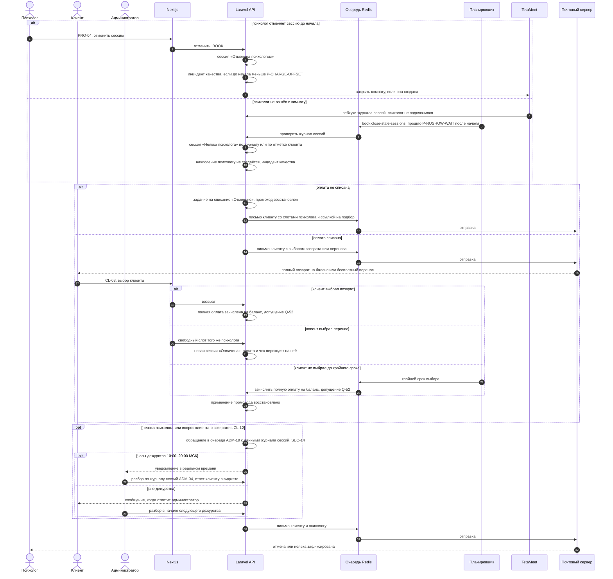
```mermaid
sequenceDiagram
  autonumber
  actor P as Психолог
  actor C as Клиент
  actor A as Администратор
  participant WEB as Next.js
  participant API as Laravel API
  participant Q as Очередь Redis
  participant SCH as Планировщик
  participant TM as TetaMeet
  participant MAIL as Почтовый сервер

  alt психолог отменяет сессию до начала
    P->>WEB: PRO-04, отменить сессию
    WEB->>API: отменить, BOOK
    API->>API: сессия «Отменена психологом»
    API->>API: инцидент качества, если до начала меньше P-CHARGE-OFFSET
    API->>TM: закрыть комнату, если она создана
  else психолог не вошёл в комнату
    TM->>API: вебхуки журнала сессий, психолог не подключился
    SCH->>Q: book:close-stale-sessions, прошло P-NOSHOW-WAIT после начала
    Q->>API: проверить журнал сессий
    API->>API: сессия «Неявка психолога» по журналу или по отметке клиента
    API->>API: начисление психологу не создаётся, инцидент качества
  end
  alt оплата не списана
    API->>API: задание на списание «Отменено», промокод восстановлен
    API->>Q: письмо клиенту со слотами психолога и ссылкой на подбор
    Q->>MAIL: отправка
  else оплата списана
    API->>Q: письмо клиенту с выбором возврата или переноса
    Q->>MAIL: отправка
    MAIL-->>C: полный возврат на баланс или бесплатный перенос
    C->>WEB: CL-03, выбор клиента
    alt клиент выбрал возврат
      WEB->>API: возврат
      API->>API: полная оплата зачислена на баланс, допущение Q-52
    else клиент выбрал перенос
      WEB->>API: свободный слот того же психолога
      API->>API: новая сессия «Оплачена», оплата и чек переходят на неё
    else клиент не выбрал до крайнего срока
      SCH->>Q: крайний срок выбора
      Q->>API: зачислить полную оплату на баланс, допущение Q-52
    end
    API->>API: применение промокода восстановлено
  end
  opt неявка психолога или вопрос клиента о возврате в CL-12
    API->>API: обращение в очереди ADM-19 с данными журнала сессий, SEQ-14
    alt часы дежурства 10:00–20:00 МСК
      API-->>A: уведомление в реальном времени
      A->>API: разбор по журналу сессий ADM-04, ответ клиенту в виджете
    else вне дежурства
      API-->>C: сообщение, когда ответит администратор
      A->>API: разбор в начале следующего дежурства
    end
  end
  API->>Q: письма клиенту и психологу
  Q->>MAIL: отправка
  MAIL-->>P: отмена или неявка зафиксирована
```

| Ситуация | Поведение | Основание |
|---|---|---|
| Психолог отменяет сессию меньше чем за `P-CHARGE-OFFSET` | Отмена фиксируется как инцидент качества; при `P-QUALITY-INCIDENT-THRESHOLD` администратору создаётся задача на разбор; денежных удержаний с психолога нет | BR-CANC-08 |
| Журнал сессий противоречит отметке клиента | Итоговый статус ставит администратор по журналу сессий в ADM-04 | BR-CANC-07, BR-RBAC-10 |
| Психолог вошёл, но связь оборвалась | Сценарий технической проблемы: при длительности меньше `P-AUTO-COMPLETE-MIN` клиент выбирает перенос или возврат, начисления нет (SEQ-07) | BR-BOOK-15 |
| Клиент не выбрал возврат или перенос | При отмене — полный возврат на баланс в исходное время начала; при неявке — через `P-OUTCOME-DEADLINE` после начала [Рек.] | BR-CANC-06 |
| Корпоративная сессия | Вместо денежного возврата восстанавливается лимит сотрудника | BR-B2B-05, BR-CANC-11 |
| Статус исправлен после выплаты начисления | Отрицательная корректировка удерживается из следующих начислений (ST-06) | BR-PAYOUT-12 |
| Психолог заблокирован или покинул платформу | Предстоящие сессии отменяются по инициативе платформы с полным возвратом | BR-CANC-09, BR-ACC-17 |
| Вопрос не требует администратора | Герман отвечает сам; администратору передаются только очень сложные случаи | DEC-54 |

**Связанные правила:** DEC-23, DEC-54, Q-52, BR-CANC-06…BR-CANC-09, BR-BOOK-15, BR-PROMO-09, BR-AIBOT-06, BR-PAYOUT-01; параметры `P-NOSHOW-WAIT`, `P-OUTCOME-DEADLINE`, `P-QUALITY-INCIDENT-THRESHOLD`.

---

## SEQ-06. Жалоба на списание

**Участники:** клиент, администратор, Next.js (CL-07, ADM-07, ADM-19), Laravel API (PAY, PAYOUT, SUPPORT, NOTIF), очередь Redis, планировщик, почтовый сервер. **Этап ТЗ:** Э3, Э4.
**Предусловия:** оплата по сессии списана и удержана — после отмены клиентом, неявки клиента или проведённой сессии, с которой клиент не согласен.

<!-- diagram: seq_06_charge_complaint -->
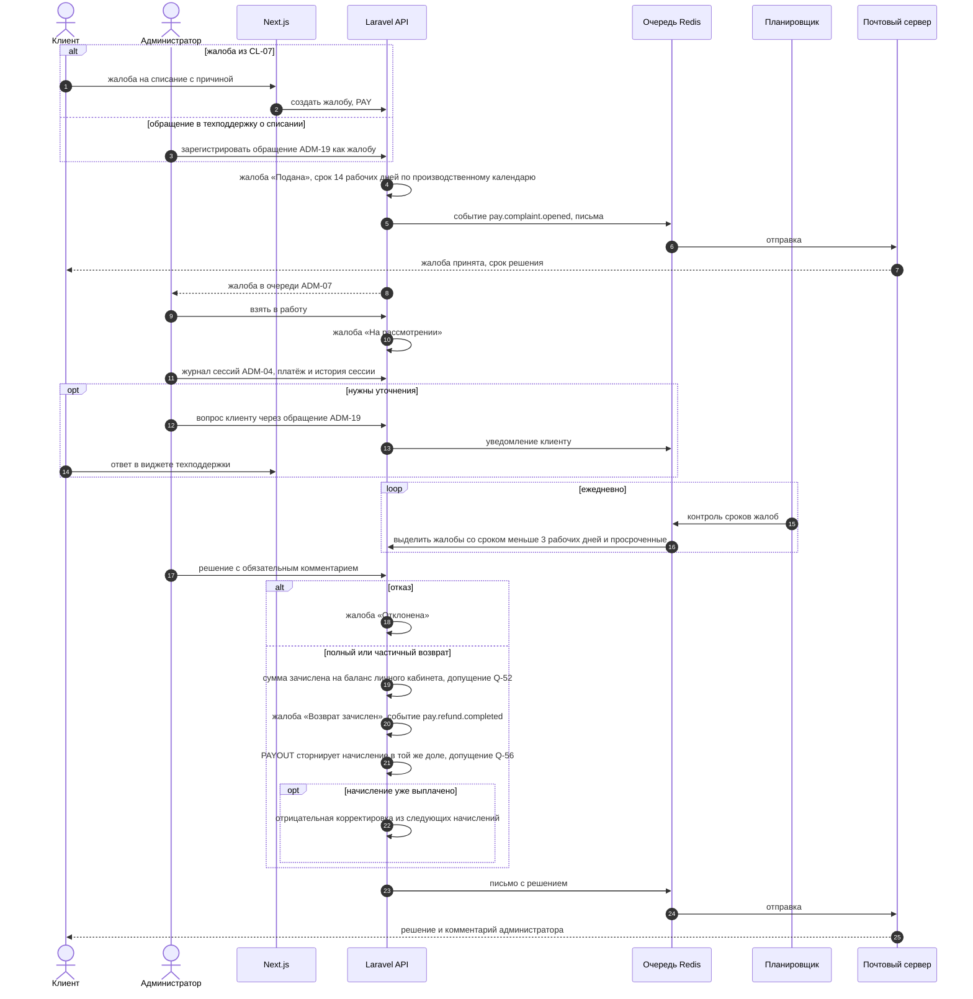
```mermaid
sequenceDiagram
  autonumber
  actor C as Клиент
  actor A as Администратор
  participant WEB as Next.js
  participant API as Laravel API
  participant Q as Очередь Redis
  participant SCH as Планировщик
  participant MAIL as Почтовый сервер

  alt жалоба из CL-07
    C->>WEB: жалоба на списание с причиной
    WEB->>API: создать жалобу, PAY
  else обращение в техподдержку о списании
    A->>API: зарегистрировать обращение ADM-19 как жалобу
  end
  API->>API: жалоба «Подана», срок 14 рабочих дней по производственному календарю
  API->>Q: событие pay.complaint.opened, письма
  Q->>MAIL: отправка
  MAIL-->>C: жалоба принята, срок решения
  API-->>A: жалоба в очереди ADM-07
  A->>API: взять в работу
  API->>API: жалоба «На рассмотрении»
  A->>API: журнал сессий ADM-04, платёж и история сессии
  opt нужны уточнения
    A->>API: вопрос клиенту через обращение ADM-19
    API->>Q: уведомление клиенту
    C->>WEB: ответ в виджете техподдержки
  end
  loop ежедневно
    SCH->>Q: контроль сроков жалоб
    Q->>API: выделить жалобы со сроком меньше 3 рабочих дней и просроченные
  end
  A->>API: решение с обязательным комментарием
  alt отказ
    API->>API: жалоба «Отклонена»
  else полный или частичный возврат
    API->>API: сумма зачислена на баланс личного кабинета, допущение Q-52
    API->>API: жалоба «Возврат зачислен», событие pay.refund.completed
    API->>API: PAYOUT сторнирует начисление в той же доле, допущение Q-56
    opt начисление уже выплачено
      API->>API: отрицательная корректировка из следующих начислений
    end
  end
  API->>Q: письмо с решением
  Q->>MAIL: отправка
  MAIL-->>C: решение и комментарий администратора
```

| Ситуация | Поведение | Основание |
|---|---|---|
| Оплата по сессии не списана | Жалоба не принимается: отмена до списания бесплатна (SEQ-03) | BR-CANC-01 |
| По платежу уже есть открытая жалоба | Новое сообщение добавляется к открытой жалобе [Рек.] | BR-CANC-05 |
| Срок подходит к концу | За 3 рабочих дня жалоба выделяется в ADM-07; просроченная — алерт Супер-администратору [Рек.] | BR-CANC-05 |
| Корпоративная сессия | При удовлетворении восстанавливается лимит сотрудника вместо денежного возврата | BR-CANC-11 |
| Клиент просит вернуть деньги на карту | Заявка на вывод остатка баланса (ST-04) [допущение Q-52] [ЮРИСТ] | Q-52 |
| Чеки при зачислении на баланс | Порядок подтверждает бухгалтер [ПРОВЕРИТЬ] | DEC-22 |
| Жалоба на неявку психолога | Возврат уже выполнен по SEQ-05; жалоба закрывается со ссылкой на решение [П] | BR-CANC-07 |

**Связанные правила:** DEC-23, Q-52, Q-56, BR-CANC-05, BR-SUPPORT-09, BR-PAYOUT-02, BR-PAYOUT-12; параметр `P-COMPLAINT-REVIEW`.

---

## SEQ-07. Видеосессия в TetaMeet

**Участники:** психолог, клиент, второй участник парной сессии, Next.js (PRO-11, CL-03, ROOM-01…ROOM-05), Laravel API (MEET, BOOK, PAYOUT, NOTIF), очередь Redis, планировщик, TetaMeet, почтовый сервер. **Этап ТЗ:** Э3.
**Предусловия:** сессия «Оплачена». Вход — только из кабинета: ссылка на комнату в письма не включается (BR-BOOK-06).

<!-- diagram: seq_07_video_session -->
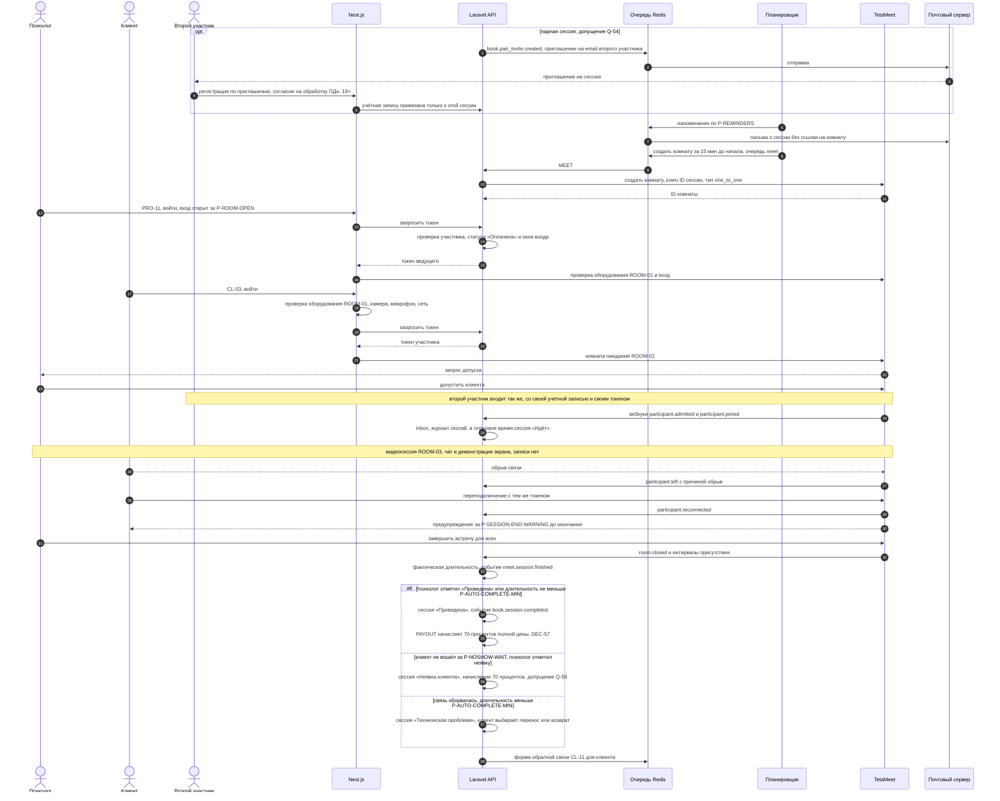
```mermaid
sequenceDiagram
  autonumber
  actor P as Психолог
  actor C as Клиент
  actor C2 as Второй участник
  participant WEB as Next.js
  participant API as Laravel API
  participant Q as Очередь Redis
  participant SCH as Планировщик
  participant TM as TetaMeet
  participant MAIL as Почтовый сервер

  opt парная сессия, допущение Q-54
    API->>Q: book.pair_invite.created, приглашение на email второго участника
    Q->>MAIL: отправка
    MAIL-->>C2: приглашение на сессию
    C2->>WEB: регистрация по приглашению, согласие на обработку ПДн, 18+
    WEB->>API: учётная запись привязана только к этой сессии
  end
  SCH->>Q: напоминания по P-REMINDERS
  Q->>MAIL: письма о сессии без ссылки на комнату
  SCH->>Q: создать комнату за 15 мин до начала, очередь meet
  Q->>API: MEET
  API->>TM: создать комнату, ключ ID сессии, тип one_to_one
  TM-->>API: ID комнаты
  P->>WEB: PRO-11, войти, вход открыт за P-ROOM-OPEN
  WEB->>API: запросить токен
  API->>API: проверка участника, статуса «Оплачена» и окна входа
  API-->>WEB: токен ведущего
  WEB->>TM: проверка оборудования ROOM-01 и вход
  C->>WEB: CL-03, войти
  WEB->>WEB: проверка оборудования ROOM-01, камера, микрофон, сеть
  WEB->>API: запросить токен
  API-->>WEB: токен участника
  WEB->>TM: комната ожидания ROOM-02
  TM-->>P: запрос допуска
  P->>TM: допустить клиента
  Note over C2,TM: второй участник входит так же, со своей учётной записью и своим токеном
  TM->>API: вебхуки participant.admitted и participant.joined
  API->>API: inbox, журнал сессий, в плановое время сессия «Идёт»
  Note over P,TM: видеосессия ROOM-03, чат и демонстрация экрана, записи нет
  C--xTM: обрыв связи
  TM->>API: participant.left с причиной обрыв
  C->>TM: переподключение с тем же токеном
  TM->>API: participant.reconnected
  TM-->>C: предупреждение за P-SESSION-END-WARNING до окончания
  P->>TM: завершить встречу для всех
  TM->>API: room.closed и интервалы присутствия
  API->>API: фактическая длительность, событие meet.session.finished
  alt психолог отметил «Проведена» или длительность не меньше P-AUTO-COMPLETE-MIN
    API->>API: сессия «Проведена», событие book.session.completed
    API->>API: PAYOUT начисляет 70 процентов полной цены, DEC-57
  else клиент не вошёл за P-NOSHOW-WAIT, психолог отметил неявку
    API->>API: сессия «Неявка клиента», начисление 70 процентов, допущение Q-56
  else связь оборвалась, длительность меньше P-AUTO-COMPLETE-MIN
    API->>API: сессия «Техническая проблема», клиент выбирает перенос или возврат
  end
  API->>Q: форма обратной связи CL-11 для клиента
```

| Ситуация | Поведение | Основание |
|---|---|---|
| Токен запрошен вне окна входа, сессия не оплачена или отменена | Отказ, кнопка входа неактивна | BR-BOOK-10 |
| Браузер не дал доступ к камере или микрофону | ROOM-01 показывает инструкцию и повторную проверку; режима без видео нет | DEC-07 |
| Фактическая длительность | Время одновременного присутствия психолога и клиента по журналу сессий с суммированием интервалов при переподключениях | BR-BOOK-12 |
| Клиент не вошёл за `P-NOSHOW-WAIT` | Психолог отмечает «Неявка клиента», журнал подтверждает; оплата не возвращается, психологу начисляется 70 % [допущение Q-56] | BR-BOOK-14, BR-PAYOUT-02 |
| Психолог не вошёл за `P-NOSHOW-WAIT` | Сценарий SEQ-05 | BR-CANC-07 |
| Техническая проблема, длительность меньше `P-AUTO-COMPLETE-MIN` | Клиент выбирает бесплатный перенос или полный возврат на баланс [допущение Q-52]; начисления нет | BR-BOOK-15 |
| Итоговый статус не определён за `P-OUTCOME-DEADLINE` | Сессия уходит администратору на разбор в ADM-04 | BR-BOOK-13 |
| Вебхук TetaMeet потерян | Сверка состояния комнаты через API TetaMeet при закрытии окна входа [Рек.] | BR-BOOK-12 |
| Короткий обрыв, свёрнутый мобильный браузер | Автоматическое переподключение; разрыв до 60 с не прерывает интервал присутствия [Рек.] | DEC-08 |
| Второй участник не зарегистрировался | В комнату не допускается, сессия проходит с клиентом [допущение Q-54] | BR-BOOK-16 |
| Корпоративная сессия проведена | Сессия засчитана в лимит и попадёт в ежемесячный счёт компании (SEQ-20) | BR-B2B-06 |

**Связанные правила:** DEC-07, DEC-08, DEC-57, Q-54, Q-56, BR-BOOK-10…BR-BOOK-16, BR-PAYOUT-01, BR-PAYOUT-02, BR-REVIEW-12; параметры `P-REMINDERS`, `P-ROOM-OPEN`, `P-ROOM-CLOSE`, `P-SESSION-END-WARNING`, `P-NOSHOW-WAIT`, `P-AUTO-COMPLETE-MIN`, `P-OUTCOME-DEADLINE`.

---

## SEQ-08. Еженедельная выплата

**Участники:** планировщик, очередь Redis, Laravel API (PAYOUT, SUPERV, PAY, NOTIF, AUDIT), администратор (ADM-08), платёжный адаптер или эмулятор, почтовый сервер, психолог или супервизор (PRO-08, PRO-09). **Этап ТЗ:** Э2, Э4, Э5.
**Предусловия:** на балансе психолога есть начисления (ST-06); карта для выплат привязана в PRO-09. Налоговый статус психолога и его годовой доход платформа не проверяет (DEC-20).

<!-- diagram: seq_08_weekly_payout -->
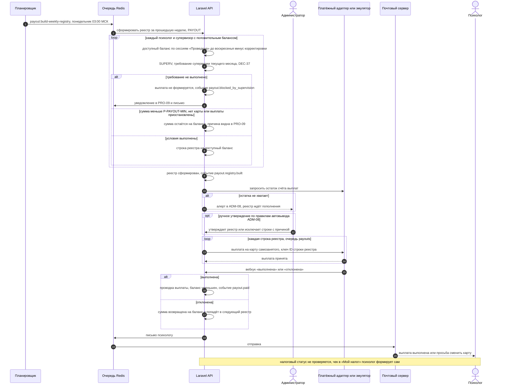
```mermaid
sequenceDiagram
  autonumber
  participant SCH as Планировщик
  participant Q as Очередь Redis
  participant API as Laravel API
  actor A as Администратор
  participant PAY as Платёжный адаптер или эмулятор
  participant MAIL as Почтовый сервер
  actor P as Психолог

  SCH->>Q: payout:build-weekly-registry, понедельник 03:00 МСК
  Q->>API: сформировать реестр за прошедшую неделю, PAYOUT
  loop каждый психолог и супервизор с положительным балансом
    API->>API: доступный баланс по сессиям «Проведена» до воскресенья минус корректировки
    API->>API: SUPERV, требование супервизии текущего месяца, DEC-37
    alt требование не выполнено
      API->>API: выплата не формируется, событие payout.blocked_by_supervision
      API->>Q: уведомление в PRO-09 и письмо
    else сумма меньше P-PAYOUT-MIN, нет карты или выплаты приостановлены
      API->>API: сумма остаётся на балансе, причина видна в PRO-09
    else условия выполнены
      API->>API: строка реестра на доступный баланс
    end
  end
  API->>API: реестр сформирован, событие payout.registry.built
  API->>PAY: запросить остаток счёта выплат
  alt остатка не хватает
    API-->>A: алерт в ADM-08, реестр ждёт пополнения
  end
  opt ручное утверждение по правилам автовывода ADM-08
    A->>API: утверждает реестр или исключает строки с причиной
  end
  loop каждая строка реестра, очередь payouts
    API->>PAY: выплата на карту самозанятого, ключ ID строки реестра
    PAY-->>API: выплата принята
  end
  PAY->>API: вебхук «выполнена» или «отклонена»
  alt выполнена
    API->>API: проводка выплаты, баланс уменьшен, событие payout.paid
  else отклонена
    API->>API: сумма возвращена на баланс и попадёт в следующий реестр
  end
  API->>Q: письмо психологу
  Q->>MAIL: отправка
  MAIL-->>P: выплата выполнена или просьба сменить карту
  Note over API,P: налоговый статус не проверяется, чек в «Мой налог» психолог формирует сам
```

| Ситуация | Поведение | Основание |
|---|---|---|
| Требование супервизии текущего месяца не выполнено | Выплата не формируется, начисления копятся; статус виден в PRO-09 и ADM-08. После засчитанной супервизии выплата пройдёт в ближайший понедельник | DEC-37, BR-PAYOUT-06 |
| Первый неполный месяц после подтверждения квалификации | Требование не действует, выплата по общему правилу | DEC-37 |
| Супервизор не ведёт клиентов | Выплаты за супервизии не блокируются [допущение Q-53] | Q-53 |
| Нет карты для выплат или токен недействителен | Строка не формируется, психолог получает письмо со ссылкой на привязку карты в PRO-09 | BR-PAYOUT-05, BR-PAYOUT-09 |
| Выплаты приостановлены администратором | Строка исключается, причина видна психологу и пишется в журнал аудита | BR-PAYOUT-13 |
| Сервис отклонил выплату | Сумма возвращается на баланс и попадает в следующий реестр | BR-PAYOUT-14 |
| Вебхук о статусе не пришёл | Запрос статуса выплаты с тем же ключом; при расхождении — ручной разбор в ADM-08 | BR-PAYOUT-14 |
| Баланс отрицательный после сторно | Выплата не формируется, пока корректировка не покрыта новыми начислениями | BR-PAYOUT-12 |
| Реальный сервис выплат не подключён | Выплаты проходят на тестовом эмуляторе с теми же статусами | DEC-38 |

**Связанные правила:** DEC-20, DEC-37, DEC-38, Q-53, BR-PAYOUT-04…BR-PAYOUT-06, BR-PAYOUT-09…BR-PAYOUT-15; параметры `P-PAYOUT-PERIOD`, `P-PAYOUT-MIN`.

---

## SEQ-09. Ежемесячный контроль супервизии

**Участники:** планировщик, очередь Redis, Laravel API (SUPERV, PSY, CATALOG, MATCH, SEARCH, SCHED, PAYOUT, NOTIF, AUDIT), Next.js (SITE-03, PRO-09, PRO-12, ADM-15), почтовый сервер, психолог, администратор. **Этап ТЗ:** Э5.
**Предусловия:** квалификация психолога «Подтверждён»; месяц календарный по московскому времени; требование действует с первого полного календарного месяца после подтверждения квалификации (DEC-37).

<!-- diagram: seq_09_supervision_monthly_control -->
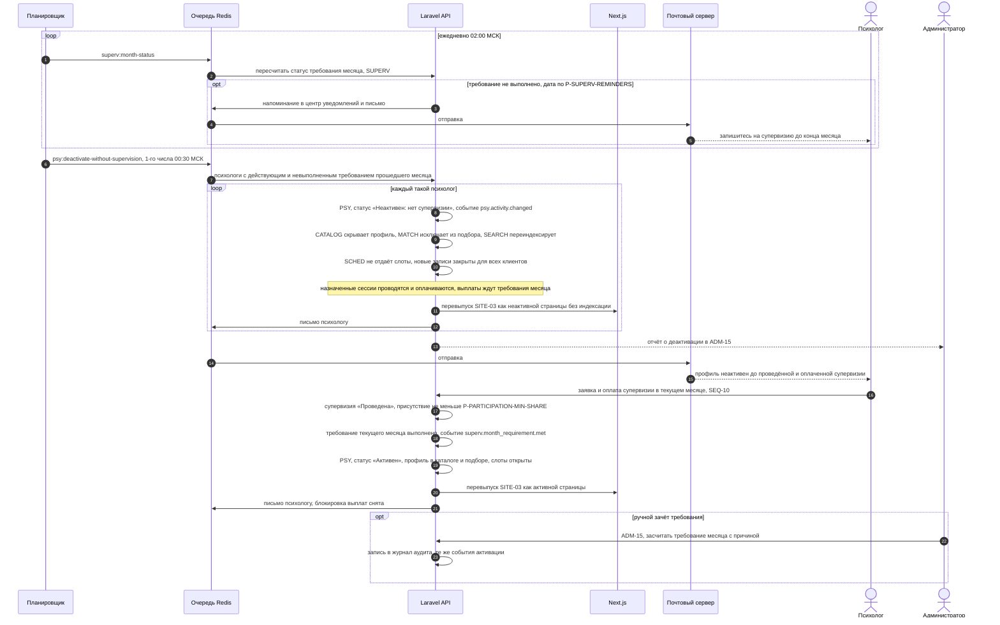
```mermaid
sequenceDiagram
  autonumber
  participant SCH as Планировщик
  participant Q as Очередь Redis
  participant API as Laravel API
  participant WEB as Next.js
  participant MAIL as Почтовый сервер
  actor P as Психолог
  actor A as Администратор

  loop ежедневно 02:00 МСК
    SCH->>Q: superv:month-status
    Q->>API: пересчитать статус требования месяца, SUPERV
    opt требование не выполнено, дата по P-SUPERV-REMINDERS
      API->>Q: напоминание в центр уведомлений и письмо
      Q->>MAIL: отправка
      MAIL-->>P: запишитесь на супервизию до конца месяца
    end
  end
  SCH->>Q: psy:deactivate-without-supervision, 1-го числа 00:30 МСК
  Q->>API: психологи с действующим и невыполненным требованием прошедшего месяца
  loop каждый такой психолог
    API->>API: PSY, статус «Неактивен: нет супервизии», событие psy.activity.changed
    API->>API: CATALOG скрывает профиль, MATCH исключает из подбора, SEARCH переиндексирует
    API->>API: SCHED не отдаёт слоты, новые записи закрыты для всех клиентов
    Note over API: назначенные сессии проводятся и оплачиваются, выплаты ждут требования месяца
    API->>WEB: перевыпуск SITE-03 как неактивной страницы без индексации
    API->>Q: письмо психологу
  end
  API-->>A: отчёт о деактивации в ADM-15
  Q->>MAIL: отправка
  MAIL-->>P: профиль неактивен до проведённой и оплаченной супервизии
  P->>API: заявка и оплата супервизии в текущем месяце, SEQ-10
  API->>API: супервизия «Проведена», присутствие не меньше P-PARTICIPATION-MIN-SHARE
  API->>API: требование текущего месяца выполнено, событие superv.month_requirement.met
  API->>API: PSY, статус «Активен», профиль в каталоге и подборе, слоты открыты
  API->>WEB: перевыпуск SITE-03 как активной страницы
  API->>Q: письмо психологу, блокировка выплат снята
  opt ручной зачёт требования
    A->>API: ADM-15, засчитать требование месяца с причиной
    API->>API: запись в журнал аудита, те же события активации
  end
```

| Ситуация | Поведение | Основание |
|---|---|---|
| Квалификация подтверждена в текущем месяце | Требование действует с первого полного календарного месяца; до этого деактивации нет | DEC-37, BR-SUPERV-12 |
| Супервизия проведена после окончания месяца | Засчитывается в месяц проведения [П]; за прошедший месяц профиль деактивируется | DEC-37 |
| Режим `P-SUPERV-MODE` — «учёт» | Требование засчитывается после статуса «Проведена», который ставит супервизор [П] | BR-SUPERV-07 |
| Психолог присутствовал меньше `P-PARTICIPATION-MIN-SHARE` | Супервизия не засчитывается, профиль остаётся неактивным | BR-SUPERV-08 |
| Супервизор ведёт клиентов | Проходит супервизию у другого супервизора по общему правилу; к супервизору без клиентов требование не применяется [допущение Q-53] | Q-53 |
| В месяце была только интервизия | Требование не выполнено: интервизия не засчитывается | DEC-37, BR-INTERV-09 |
| Сбой команды деактивации | Алерт; повторный запуск идемпотентен и не меняет уже обработанных психологов [Рек.] | BR-SUPERV-13 |
| Инстанс партнёра white-label | Требование включается или выключается параметром в ADM-26 инстанса [Рек.] | DEC-52 |

**Связанные правила:** DEC-21, DEC-37, Q-53, BR-PSY-06, BR-PSY-07, BR-MATCH-02, BR-MATCH-08, BR-SUPERV-12…BR-SUPERV-15, BR-PAYOUT-06; параметры `P-SUPERV-MONTHLY`, `P-SUPERV-GRACE`, `P-SUPERV-REMINDERS`.

---

## SEQ-10. Заявка и оплата супервизии

**Участники:** психолог, супервизор, Next.js (PRO-12, PRO-13, ROOM-04), Laravel API (SUPERV, PAYOUT, PAY, MEET, NOTIF), очередь Redis, платёжный адаптер или эмулятор, TetaMeet, почтовый сервер. **Этап ТЗ:** Э5.
**Предусловия:** психолог «Подтверждён», супервизор включён в реестр (ADM-15). В режиме «оплата» у психолога положительный баланс или привязанная в PRO-09 карта с согласием на списание за супервизию.

<!-- diagram: seq_10_supervision_request -->
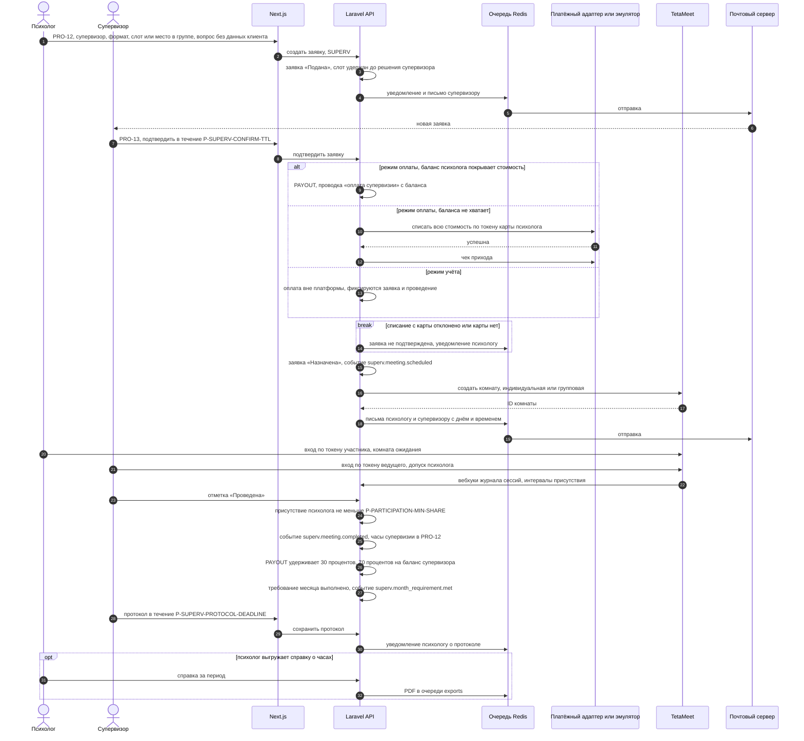
```mermaid
sequenceDiagram
  autonumber
  actor P as Психолог
  actor S as Супервизор
  participant WEB as Next.js
  participant API as Laravel API
  participant Q as Очередь Redis
  participant PAY as Платёжный адаптер или эмулятор
  participant TM as TetaMeet
  participant MAIL as Почтовый сервер

  P->>WEB: PRO-12, супервизор, формат, слот или место в группе, вопрос без данных клиента
  WEB->>API: создать заявку, SUPERV
  API->>API: заявка «Подана», слот удержан до решения супервизора
  API->>Q: уведомление и письмо супервизору
  Q->>MAIL: отправка
  MAIL-->>S: новая заявка
  S->>WEB: PRO-13, подтвердить в течение P-SUPERV-CONFIRM-TTL
  WEB->>API: подтвердить заявку
  alt режим оплаты, баланс психолога покрывает стоимость
    API->>API: PAYOUT, проводка «оплата супервизии» с баланса
  else режим оплаты, баланса не хватает
    API->>PAY: списать всю стоимость по токену карты психолога
    PAY-->>API: успешна
    API->>PAY: чек прихода
  else режим учёта
    API->>API: оплата вне платформы, фиксируются заявка и проведение
  end
  break списание с карты отклонено или карты нет
    API->>Q: заявка не подтверждена, уведомление психологу
  end
  API->>API: заявка «Назначена», событие superv.meeting.scheduled
  API->>TM: создать комнату, индивидуальная или групповая
  TM-->>API: ID комнаты
  API->>Q: письма психологу и супервизору с днём и временем
  Q->>MAIL: отправка
  P->>TM: вход по токену участника, комната ожидания
  S->>TM: вход по токену ведущего, допуск психолога
  TM->>API: вебхуки журнала сессий, интервалы присутствия
  S->>API: отметка «Проведена»
  API->>API: присутствие психолога не меньше P-PARTICIPATION-MIN-SHARE
  API->>API: событие superv.meeting.completed, часы супервизии в PRO-12
  API->>API: PAYOUT удерживает 30 процентов, 70 процентов на баланс супервизора
  API->>API: требование месяца выполнено, событие superv.month_requirement.met
  S->>WEB: протокол в течение P-SUPERV-PROTOCOL-DEADLINE
  WEB->>API: сохранить протокол
  API->>Q: уведомление психологу о протоколе
  opt психолог выгружает справку о часах
    P->>API: справка за период
    API->>Q: PDF в очереди exports
  end
```

| Ситуация | Поведение | Основание |
|---|---|---|
| Супервизор отклонил заявку или не ответил за `P-SUPERV-CONFIRM-TTL` | Заявка «Отклонена», слот освобождён, оплата не списывается | BR-SUPERV-05 |
| Списание с карты не прошло или карты нет | Заявка не подтверждается, психолог получает уведомление | BR-PAYOUT-07 |
| Психолог отменяет не позднее `P-SUPERV-FREE-CANCEL` до начала | Возврат туда, откуда списано: на баланс психолога или на карту | BR-SUPERV-06 |
| Психолог отменяет позже | Оплата не возвращается | BR-SUPERV-06 |
| Супервизор отменил встречу или не пришёл | Психологу возвращается вся оплата и предлагается перенос; начисления супервизору нет | BR-SUPERV-06 |
| Психолог присутствовал меньше `P-PARTICIPATION-MIN-SHARE` | Супервизия не засчитывается ни в часы, ни в требование месяца | BR-SUPERV-08, BR-SUPERV-10 |
| Групповая супервизия заполнена | Место недоступно, психолог выбирает другую встречу | BR-SUPERV-03 |
| Психолог сам является супервизором | Провести супервизию для себя нельзя | BR-ACC-13 |
| Протокол не заполнен в срок | Напоминание супервизору и отметка в ADM-15 [Рек.] | BR-SUPERV-09 |
| Реальный сервис не подключён | Списание с карты психолога проходит на тестовом эмуляторе | DEC-38 |

**Связанные правила:** DEC-21, DEC-37, DEC-38, BR-SUPERV-01…BR-SUPERV-11, BR-PAYOUT-07, BR-PAYOUT-08, BR-RBAC-09; параметры `P-SUPERV-MODE`, `P-SUPERV-COMMISSION`, `P-SUPERV-CONFIRM-TTL`, `P-SUPERV-FREE-CANCEL`, `P-SUPERV-PROTOCOL-DEADLINE`, `P-PARTICIPATION-MIN-SHARE`.

---

## SEQ-11. Запись в группу интервизии

**Участники:** администратор (ADM-16), психолог, ведущий группы, Next.js (PRO-14, ROOM-04), Laravel API (INTERV, MEET, NOTIF), очередь Redis, планировщик, TetaMeet, почтовый сервер. **Этап ТЗ:** Э6.
**Предусловия:** психолог и ведущий — со статусом квалификации «Подтверждён»; участие бесплатно [Рек.].

<!-- diagram: seq_11_intervision_signup -->
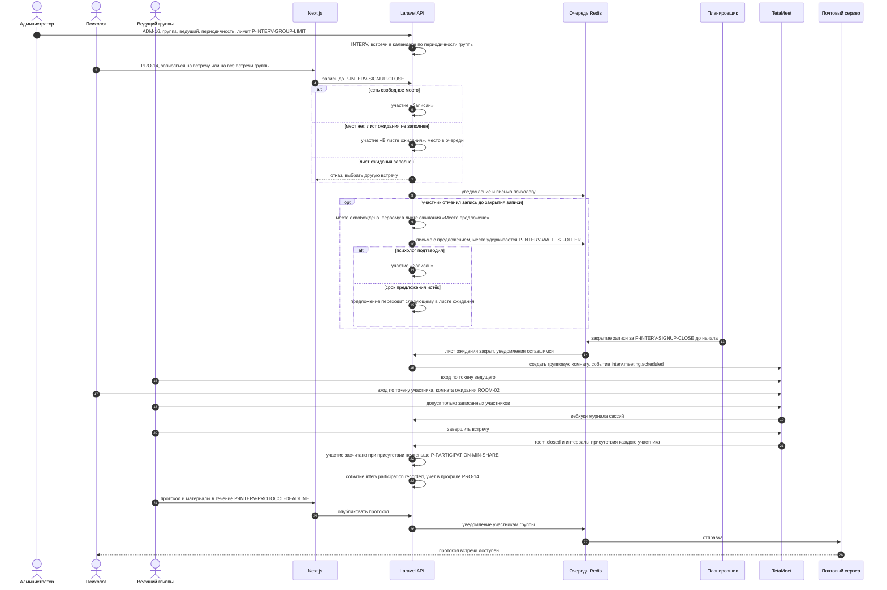
```mermaid
sequenceDiagram
  autonumber
  actor A as Администратор
  actor P as Психолог
  actor L as Ведущий группы
  participant WEB as Next.js
  participant API as Laravel API
  participant Q as Очередь Redis
  participant SCH as Планировщик
  participant TM as TetaMeet
  participant MAIL as Почтовый сервер

  A->>API: ADM-16, группа, ведущий, периодичность, лимит P-INTERV-GROUP-LIMIT
  API->>API: INTERV, встречи в календаре по периодичности группы
  P->>WEB: PRO-14, записаться на встречу или на все встречи группы
  WEB->>API: запись до P-INTERV-SIGNUP-CLOSE
  alt есть свободное место
    API->>API: участие «Записан»
  else мест нет, лист ожидания не заполнен
    API->>API: участие «В листе ожидания», место в очереди
  else лист ожидания заполнен
    API-->>WEB: отказ, выбрать другую встречу
  end
  API->>Q: уведомление и письмо психологу
  opt участник отменил запись до закрытия записи
    API->>API: место освобождено, первому в листе ожидания «Место предложено»
    API->>Q: письмо с предложением, место удерживается P-INTERV-WAITLIST-OFFER
    alt психолог подтвердил
      API->>API: участие «Записан»
    else срок предложения истёк
      API->>API: предложение переходит следующему в листе ожидания
    end
  end
  SCH->>Q: закрытие записи за P-INTERV-SIGNUP-CLOSE до начала
  Q->>API: лист ожидания закрыт, уведомления оставшимся
  API->>TM: создать групповую комнату, событие interv.meeting.scheduled
  L->>TM: вход по токену ведущего
  P->>TM: вход по токену участника, комната ожидания ROOM-02
  L->>TM: допуск только записанных участников
  TM->>API: вебхуки журнала сессий
  L->>TM: завершить встречу
  TM->>API: room.closed и интервалы присутствия каждого участника
  API->>API: участие засчитано при присутствии не меньше P-PARTICIPATION-MIN-SHARE
  API->>API: событие interv.participation.recorded, учёт в профиле PRO-14
  L->>WEB: протокол и материалы в течение P-INTERV-PROTOCOL-DEADLINE
  WEB->>API: опубликовать протокол
  API->>Q: уведомление участникам группы
  Q->>MAIL: отправка
  MAIL-->>P: протокол встречи доступен
```

| Ситуация | Поведение | Основание |
|---|---|---|
| Запись или отмена после `P-INTERV-SIGNUP-CLOSE` | Недоступны | BR-INTERV-05 |
| Срок предложения места выходит за закрытие записи | Место удерживается не дольше закрытия записи | BR-INTERV-06 |
| Ведущий или администратор отменил встречу | Участники и лист ожидания получают уведомление, комната закрывается | BR-INTERV-07 |
| Незаписанный психолог пытается войти | Токен не выдаётся | BR-INTERV-07 |
| Присутствие меньше `P-PARTICIPATION-MIN-SHARE` | Участие не засчитывается | BR-INTERV-09 |
| Интервизия и требование супервизии | Участие в интервизии не засчитывается в требование месяца | DEC-37 |
| Протокол не опубликован в срок | Напоминание ведущему и отметка в ADM-16 [Рек.] | BR-INTERV-08 |
| Данные, позволяющие установить личность клиента | Запрещены в обсуждении; ведущий и участники не получают доступа к карточкам клиентов | BR-RBAC-09, BR-INTERV-03 |

**Связанные правила:** DEC-33, DEC-37, BR-INTERV-04…BR-INTERV-09, BR-RBAC-09; параметры `P-INTERV-GROUP-LIMIT`, `P-INTERV-WAITLIST-LIMIT`, `P-INTERV-WAITLIST-OFFER`, `P-INTERV-SIGNUP-CLOSE`, `P-INTERV-PROTOCOL-DEADLINE`, `P-PARTICIPATION-MIN-SHARE`.

---

## SEQ-12. Проверка квалификации психолога

**Участники:** психолог, администратор, Next.js (SITE-11, PRO-01, PRO-02, PRO-03, PRO-09, ADM-03), Laravel API (AUTH, CONSENT, PSY, FILES, CATALOG, SEARCH, AUDIT, NOTIF), очередь Redis, почтовый сервер. **Этап ТЗ:** Э2, Э4.
**Предусловия:** психолог пришёл со страницы «Для психологов». Подтверждённая квалификация — основа УТП «Только дипломированные специалисты» (DEC-10).

<!-- diagram: seq_12_qualification_check -->
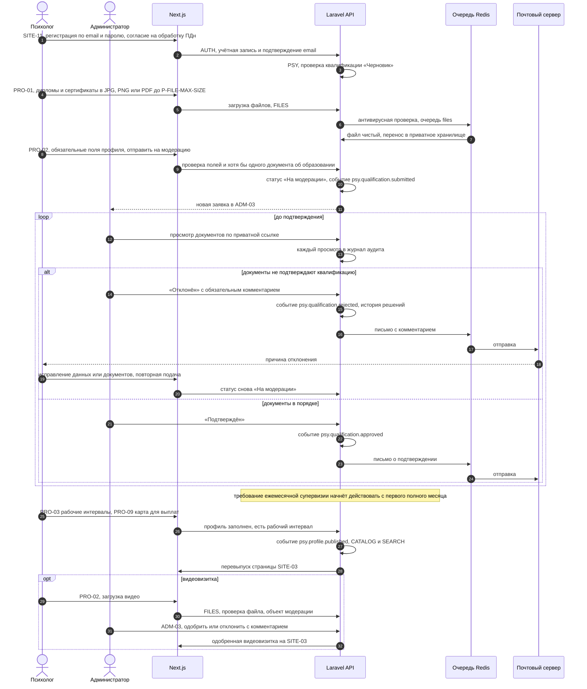
```mermaid
sequenceDiagram
  autonumber
  actor P as Психолог
  actor A as Администратор
  participant WEB as Next.js
  participant API as Laravel API
  participant Q as Очередь Redis
  participant MAIL as Почтовый сервер

  P->>WEB: SITE-11, регистрация по email и паролю, согласие на обработку ПДн
  WEB->>API: AUTH, учётная запись и подтверждение email
  API->>API: PSY, проверка квалификации «Черновик»
  P->>WEB: PRO-01, дипломы и сертификаты в JPG, PNG или PDF до P-FILE-MAX-SIZE
  WEB->>API: загрузка файлов, FILES
  API->>Q: антивирусная проверка, очередь files
  Q->>API: файл чистый, перенос в приватное хранилище
  P->>WEB: PRO-02, обязательные поля профиля, отправить на модерацию
  WEB->>API: проверка полей и хотя бы одного документа об образовании
  API->>API: статус «На модерации», событие psy.qualification.submitted
  API-->>A: новая заявка в ADM-03
  loop до подтверждения
    A->>API: просмотр документов по приватной ссылке
    API->>API: каждый просмотр в журнал аудита
    alt документы не подтверждают квалификацию
      A->>API: «Отклонён» с обязательным комментарием
      API->>API: событие psy.qualification.rejected, история решений
      API->>Q: письмо с комментарием
      Q->>MAIL: отправка
      MAIL-->>P: причина отклонения
      P->>WEB: исправление данных или документов, повторная подача
      WEB->>API: статус снова «На модерации»
    else документы в порядке
      A->>API: «Подтверждён»
      API->>API: событие psy.qualification.approved
      API->>Q: письмо о подтверждении
      Q->>MAIL: отправка
    end
  end
  Note over API: требование ежемесячной супервизии начнёт действовать с первого полного месяца
  P->>WEB: PRO-03 рабочие интервалы, PRO-09 карта для выплат
  WEB->>API: профиль заполнен, есть рабочий интервал
  API->>API: событие psy.profile.published, CATALOG и SEARCH
  API->>WEB: перевыпуск страницы SITE-03
  opt видеовизитка
    P->>WEB: PRO-02, загрузка видео
    WEB->>API: FILES, проверка файла, объект модерации
    A->>API: ADM-03, одобрить или отклонить с комментарием
    API->>WEB: одобренная видеовизитка на SITE-03
  end
```

| Ситуация | Поведение | Основание |
|---|---|---|
| Не заполнены обязательные поля или нет документа об образовании | Отправка на модерацию недоступна, психолог видит, чего не хватает | BR-PSY-02 |
| Файл не прошёл антивирусную проверку или недопустимого типа | Файл отклонён, психолог получает сообщение | BR-PSY-02, BR-PSY-08 |
| Отклонение без комментария | Сохранить нельзя | BR-PSY-01 |
| Повторные подачи | Не ограничены; история подач и решений видна психологу и администратору | BR-PSY-03 |
| Новый диплом или изменение публичных полей после подтверждения | Проверяются отдельно за `P-CONTENT-MODERATION-SLA`; статус «Подтверждён» сохраняется, на сайте до решения видна прежняя версия | BR-PSY-05 |
| Видеовизитка отклонена | Не показывается, профиль остаётся опубликованным | DEC-44 |
| Нет рабочего интервала | Профиль не публикуется | BR-PSY-04 |
| Нет карты для выплат | Страница появляется в каталоге после привязки карты [Рек.] | BR-PAYOUT-09 |
| Квалификация не подтверждена | Календарь, клиенты, доход и видеосессии недоступны, запись к психологу невозможна | DEC-10, BR-MATCH-02 |

**Связанные правила:** DEC-10, DEC-37, DEC-44, BR-PSY-01…BR-PSY-05, BR-PSY-08, BR-RBAC-01; параметры `P-FILE-MAX-SIZE`, `P-CONTENT-MODERATION-SLA`.

---

## SEQ-13. Статья и автопостинг в Дзен

**Участники:** психолог (автор), администратор (модератор), Next.js (PRO-15, ADM-17, SITE-07, SITE-08), Laravel API (CONTENT, FILES, SEARCH, NOTIF), очередь Redis, планировщик, Дзен, почтовый сервер. **Этап ТЗ:** Э9.
**Предусловия:** автор — психолог со статусом «Подтверждён». Статьи с текущего сайта и из текущего канала в Дзене не переносятся (DEC-45).

<!-- diagram: seq_13_article_dzen -->
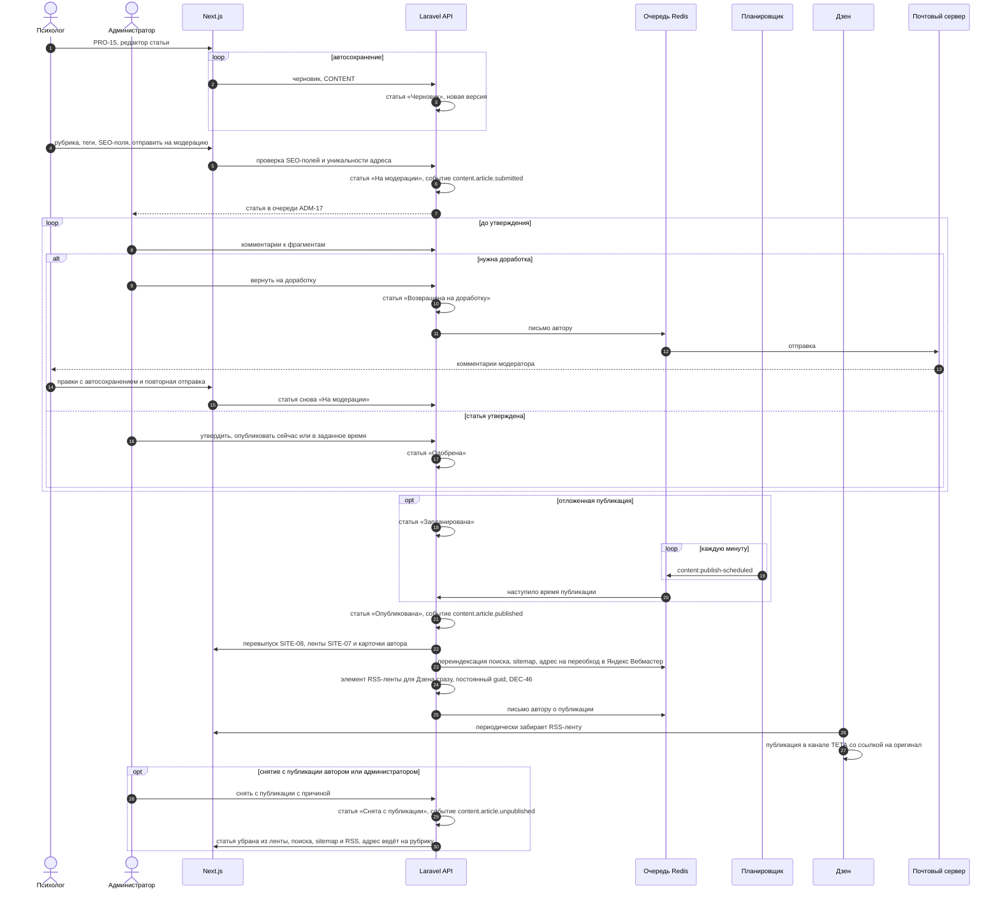
```mermaid
sequenceDiagram
  autonumber
  actor P as Психолог
  actor A as Администратор
  participant WEB as Next.js
  participant API as Laravel API
  participant Q as Очередь Redis
  participant SCH as Планировщик
  participant DZ as Дзен
  participant MAIL as Почтовый сервер

  P->>WEB: PRO-15, редактор статьи
  loop автосохранение
    WEB->>API: черновик, CONTENT
    API->>API: статья «Черновик», новая версия
  end
  P->>WEB: рубрика, теги, SEO-поля, отправить на модерацию
  WEB->>API: проверка SEO-полей и уникальности адреса
  API->>API: статья «На модерации», событие content.article.submitted
  API-->>A: статья в очереди ADM-17
  loop до утверждения
    A->>API: комментарии к фрагментам
    alt нужна доработка
      A->>API: вернуть на доработку
      API->>API: статья «Возвращена на доработку»
      API->>Q: письмо автору
      Q->>MAIL: отправка
      MAIL-->>P: комментарии модератора
      P->>WEB: правки с автосохранением и повторная отправка
      WEB->>API: статья снова «На модерации»
    else статья утверждена
      A->>API: утвердить, опубликовать сейчас или в заданное время
      API->>API: статья «Одобрена»
    end
  end
  opt отложенная публикация
    API->>API: статья «Запланирована»
    loop каждую минуту
      SCH->>Q: content:publish-scheduled
    end
    Q->>API: наступило время публикации
  end
  API->>API: статья «Опубликована», событие content.article.published
  API->>WEB: перевыпуск SITE-08, ленты SITE-07 и карточки автора
  API->>Q: переиндексация поиска, sitemap, адрес на переобход в Яндекс Вебмастер
  API->>API: элемент RSS-ленты для Дзена сразу, постоянный guid, DEC-46
  API->>Q: письмо автору о публикации
  DZ->>WEB: периодически забирает RSS-ленту
  DZ->>DZ: публикация в канале ТЕТА со ссылкой на оригинал
  opt снятие с публикации автором или администратором
    A->>API: снять с публикации с причиной
    API->>API: статья «Снята с публикации», событие content.article.unpublished
    API->>WEB: статья убрана из ленты, поиска, sitemap и RSS, адрес ведёт на рубрику
  end
```

| Ситуация | Поведение | Основание |
|---|---|---|
| Нет SEO-полей или адрес не уникален | Статья не публикуется | BR-CONTENT-09 |
| Нарушены правила публикации | Возврат на доработку с комментарием | BR-CONTENT-07 |
| Модератор сам правит текст | Автор получает уведомление о правках до публикации | BR-CONTENT-03 |
| Отложенную публикацию отменили или перенесли | Статья возвращается в «Одобрена» или получает новое время | BR-CONTENT-04 |
| Правка опубликованной статьи | Новая версия проходит модерацию, до утверждения на сайте прежняя [Рек.]; элемент ленты Дзена обновляется с прежним guid | BR-CONTENT-06 |
| Лента недоступна или XML невалиден | Алерт мониторинга; Дзен заберёт ленту после исправления | DEC-46 |
| Автор неактивен или покинул платформу | Статья остаётся опубликованной без кнопки записи | BR-CONTENT-08 |
| Статью пишет администратор с правом публикации | Публикация без премодерации [Рек.] | BR-CONTENT-02 |
| Нарушен срок модерации `P-CONTENT-MODERATION-SLA` | Статья выделяется в очереди ADM-17 | BR-CONTENT-02 |

**Связанные правила:** DEC-45, DEC-46, BR-CONTENT-01…BR-CONTENT-09; параметр `P-CONTENT-MODERATION-SLA`.

---

## SEQ-14. Диалог с ботом Германом

**Участники:** клиент или гость, администратор, Next.js (SITE-00, WIZ-02b, CL-12, PRO-17, ADM-19), Laravel API (AIBOT в процессе `llm-gateway`, SUPPORT, MATCH, NOTIF), LLM, очередь Redis, почтовый сервер. **Этап ТЗ:** Э3.
**Предусловия:** база знаний Германа загружена в ADM-14, тексты готовит заказчик (DEC-34). Администратор дежурит с 10:00 до 20:00 МСК и решает только очень сложные вопросы (DEC-54).

<!-- diagram: seq_14_aibot_dialog -->
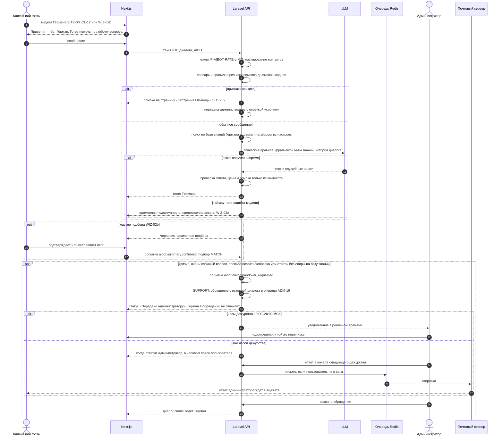
```mermaid
sequenceDiagram
  autonumber
  actor C as Клиент или гость
  participant WEB as Next.js
  participant API as Laravel API
  participant LLM as LLM
  participant Q as Очередь Redis
  actor A as Администратор
  participant MAIL as Почтовый сервер

  C->>WEB: виджет Германа SITE-00, CL-12 или WIZ-02b
  WEB-->>C: Привет, я — бот Герман. Готов помочь по любому вопросу.
  C->>WEB: сообщение
  WEB->>API: текст и ID диалога, AIBOT
  API->>API: лимит P-AIBOT-RATE-LIMIT, маскирование контактов
  API->>API: словарь и правила признаков кризиса до вызова модели
  alt признаки кризиса
    API-->>WEB: ссылка на страницу «Экстренная помощь» SITE-15
    API->>API: передача администратору с отметкой «срочно»
  else обычное сообщение
    API->>API: поиск по базе знаний Германа и факты платформы из настроек
    API->>LLM: этические правила, фрагменты базы знаний, история диалога
    alt ответ получен вовремя
      LLM-->>API: текст и служебные флаги
      API->>API: проверка ответа, цены и ссылки только из контекста
      API-->>WEB: ответ Германа
    else таймаут или ошибка модели
      API-->>WEB: временная недоступность, предложение анкеты WIZ-02a
    end
  end
  opt мастер подбора WIZ-02b
    API-->>WEB: черновик параметров подбора
    C->>WEB: подтверждает или исправляет итог
    WEB->>API: событие aibot.summary.confirmed, подбор MATCH
  end
  opt кризис, очень сложный вопрос, просьба позвать человека или ответы без опоры на базу знаний
    API->>API: событие aibot.dialog.handover_requested
    API->>API: SUPPORT, обращение с историей диалога в очереди ADM-19
    API-->>WEB: статус «Передано администратору», Герман в обращении не отвечает
    alt часы дежурства 10:00–20:00 МСК
      API-->>A: уведомление в реальном времени
      A->>WEB: подключается к той же переписке
    else вне часов дежурства
      API-->>WEB: когда ответит администратор, в часовом поясе пользователя
      A->>API: ответ в начале следующего дежурства
      API->>Q: письмо, если пользователь не в сети
      Q->>MAIL: отправка
      MAIL-->>C: ответ администратора ждёт в виджете
    end
    A->>API: закрыть обращение
    API-->>WEB: диалог снова ведёт Герман
  end
```

| Ситуация | Поведение | Основание |
|---|---|---|
| Обычный или организационный вопрос | Герман отвечает сам, передачи нет | DEC-54, BR-AIBOT-02 |
| В базе знаний нет ответа | Герман сообщает об этом и не придумывает ответ; после `P-AIBOT-FALLBACK-COUNT` таких ответов подряд предлагает передать вопрос администратору | BR-AIBOT-04 |
| Признаки кризиса вне часов дежурства | Ссылка на SITE-15 показывается сразу в любое время; обращение с отметкой «срочно» стоит первым в очереди к началу дежурства | BR-AIBOT-05, DEC-54 |
| Ответ модели не прошёл проверку | Шаблонный ответ с просьбой уточнить вопрос или заполнить анкету | BR-AIBOT-03 |
| Просьба записать, перенести или отменить сессию | Герман не выполняет действие сам и даёт кнопку перехода к нему | BR-AIBOT-08 |
| Неявка психолога или возврат денег | Очень сложный вопрос: передача администратору (SEQ-05, SEQ-06) | DEC-14, DEC-54 |
| Превышен `P-AIBOT-RATE-LIMIT` | Герман предлагает обратиться в техподдержку | BR-AIBOT-12 |
| Передачу запросил гость | Герман просит email для ответа и согласие на обработку ПДн | BR-AIBOT-10 |
| Сведения о состоянии в диалоге | Не передаются в Метрику и в логи; в модель уходит текст с замаскированными контактами | BR-PRIV-03, BR-PRIV-04 |
| Герман выключен в ADM-26 или модель недоступна | Виджет предлагает анкету и техподдержку | DEC-54 |

**Связанные правила:** DEC-13, DEC-14, DEC-54, BR-AIBOT-01…BR-AIBOT-06, BR-AIBOT-08…BR-AIBOT-12, BR-MATCH-01, BR-SUPPORT-01, BR-PRIV-03; параметры `P-AIBOT-RATE-LIMIT`, `P-AIBOT-FALLBACK-COUNT`, `P-AIBOT-DIALOG-TTL`.

---

## SEQ-15. Обращение в техподдержку

**Участники:** клиент или психолог, администраторы, Next.js (CL-12, PRO-17, ADM-19), Laravel API (SUPPORT, FILES, NOTIF), очередь Redis, планировщик, почтовый сервер. **Этап ТЗ:** Э11.
**Предусловия:** пользователь вошёл в кабинет. Отдельной роли оператора нет — обращения обрабатывают администраторы; виджет собственный (DEC-09).

<!-- diagram: seq_15_support_ticket -->
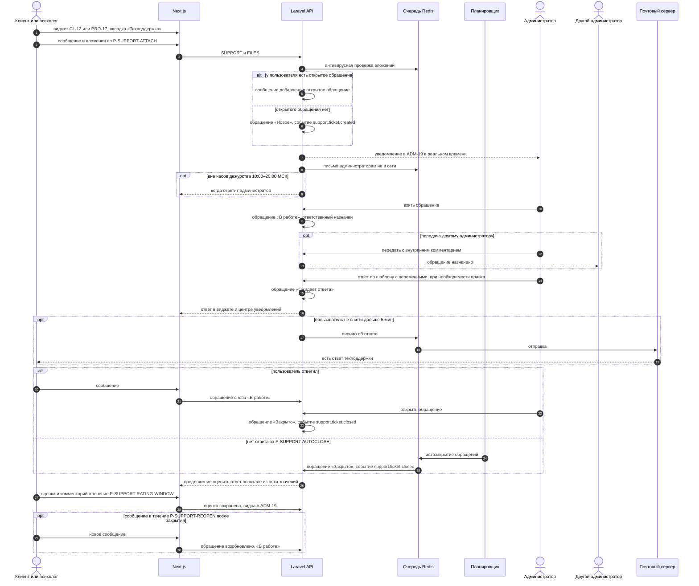
```mermaid
sequenceDiagram
  autonumber
  actor U as Клиент или психолог
  participant WEB as Next.js
  participant API as Laravel API
  participant Q as Очередь Redis
  participant SCH as Планировщик
  actor A as Администратор
  actor A2 as Другой администратор
  participant MAIL as Почтовый сервер

  U->>WEB: виджет CL-12 или PRO-17, вкладка «Техподдержка»
  U->>WEB: сообщение и вложения по P-SUPPORT-ATTACH
  WEB->>API: SUPPORT и FILES
  API->>Q: антивирусная проверка вложений
  alt у пользователя есть открытое обращение
    API->>API: сообщение добавлено в открытое обращение
  else открытого обращения нет
    API->>API: обращение «Новое», событие support.ticket.created
  end
  API-->>A: уведомление в ADM-19 в реальном времени
  API->>Q: письмо администраторам не в сети
  opt вне часов дежурства 10:00–20:00 МСК
    API-->>WEB: когда ответит администратор
  end
  A->>API: взять обращение
  API->>API: обращение «В работе», ответственный назначен
  opt передача другому администратору
    A->>API: передать с внутренним комментарием
    API-->>A2: обращение назначено
  end
  A->>API: ответ по шаблону с переменными, при необходимости правка
  API->>API: обращение «Ожидает ответа»
  API-->>WEB: ответ в виджете и центре уведомлений
  opt пользователь не в сети дольше 5 мин
    API->>Q: письмо об ответе
    Q->>MAIL: отправка
    MAIL-->>U: есть ответ техподдержки
  end
  alt пользователь ответил
    U->>WEB: сообщение
    WEB->>API: обращение снова «В работе»
    A->>API: закрыть обращение
    API->>API: обращение «Закрыто», событие support.ticket.closed
  else нет ответа за P-SUPPORT-AUTOCLOSE
    SCH->>Q: автозакрытие обращений
    Q->>API: обращение «Закрыто», событие support.ticket.closed
  end
  API-->>WEB: предложение оценить ответ по шкале из пяти значений
  U->>WEB: оценка и комментарий в течение P-SUPPORT-RATING-WINDOW
  WEB->>API: оценка сохранена, видна в ADM-19
  opt сообщение в течение P-SUPPORT-REOPEN после закрытия
    U->>WEB: новое сообщение
    WEB->>API: обращение возобновлено, «В работе»
  end
```

| Ситуация | Поведение | Основание |
|---|---|---|
| Вложение не того типа, больше `P-FILE-MAX-SIZE` или не прошло проверку | Вложение отклонено, сообщение отправляется без него | BR-SUPPORT-05 |
| Обращение о списании или возврате | Регистрируется как жалоба и рассматривается по SEQ-06 | BR-SUPPORT-09 |
| Нарушен срок первого ответа `P-SUPPORT-FIRST-RESPONSE` | Обращение выделяется в очереди ADM-19 | BR-SUPPORT-07 |
| Обращение передано от Германа | Приходит с историей диалога; срочные стоят первыми (SEQ-14) | BR-AIBOT-06 |
| Внутренний комментарий | Виден только администраторам и пользователю не отправляется | BR-SUPPORT-04 |
| Сообщение после окна `P-SUPPORT-REOPEN` | Создаётся новое обращение | BR-SUPPORT-02 |
| Срок хранения | Обращения хранятся `P-SUPPORT-RETENTION` после закрытия, затем удаляются или обезличиваются | BR-SUPPORT-10 |

**Связанные правила:** DEC-09, DEC-54, BR-SUPPORT-01…BR-SUPPORT-10; параметры `P-SUPPORT-ATTACH`, `P-SUPPORT-FIRST-RESPONSE`, `P-SUPPORT-AUTOCLOSE`, `P-SUPPORT-REOPEN`, `P-SUPPORT-RATING-WINDOW`.

---

## SEQ-16. Email-рассылка по сегменту

**Участники:** администратор, получатель, Next.js (ADM-11, SITE-18), Laravel API (MAILING, CONSENT), планировщик, очередь Redis, почтовый сервер. **Этап ТЗ:** Э7.
**Предусловия:** собственный почтовый сервер настроен вместе с SPF, DKIM и DMARC (DEC-51); получатели дали согласие на рассылки отдельной галочкой без предотметки (BR-MAIL-01). Сторонние сервисы рассылок не используются.

<!-- diagram: seq_16_mailing_campaign -->
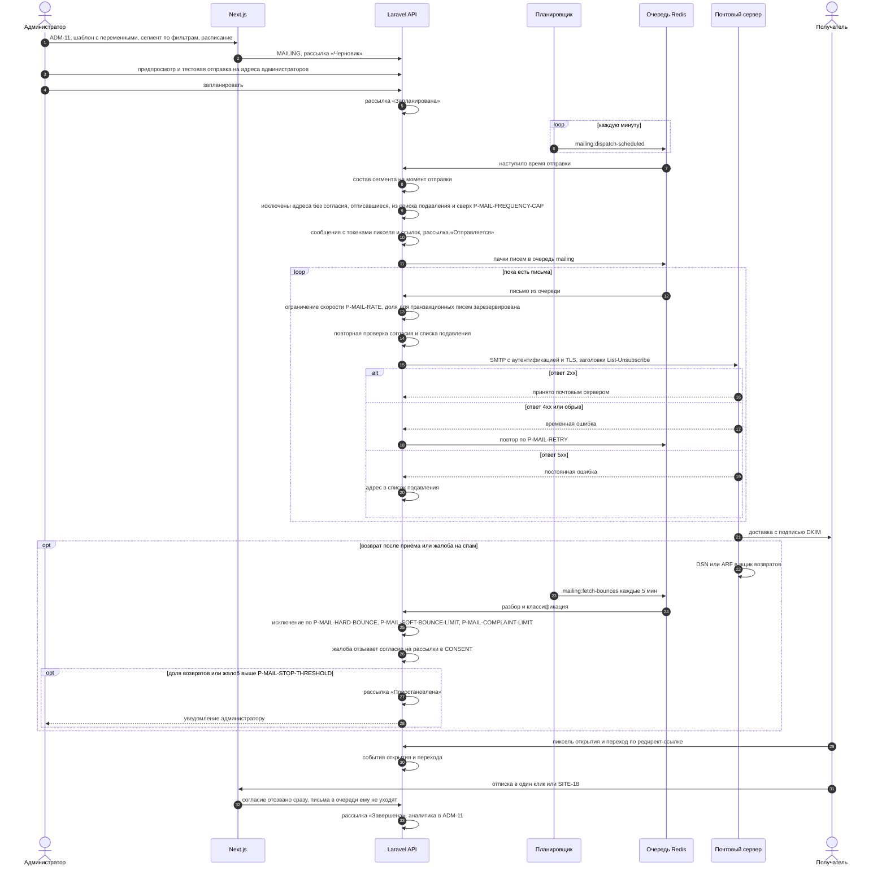
```mermaid
sequenceDiagram
  autonumber
  actor A as Администратор
  participant WEB as Next.js
  participant API as Laravel API
  participant SCH as Планировщик
  participant Q as Очередь Redis
  participant MAIL as Почтовый сервер
  actor R as Получатель

  A->>WEB: ADM-11, шаблон с переменными, сегмент по фильтрам, расписание
  WEB->>API: MAILING, рассылка «Черновик»
  A->>API: предпросмотр и тестовая отправка на адреса администраторов
  A->>API: запланировать
  API->>API: рассылка «Запланирована»
  loop каждую минуту
    SCH->>Q: mailing:dispatch-scheduled
  end
  Q->>API: наступило время отправки
  API->>API: состав сегмента на момент отправки
  API->>API: исключены адреса без согласия, отписавшиеся, из списка подавления и сверх P-MAIL-FREQUENCY-CAP
  API->>API: сообщения с токенами пикселя и ссылок, рассылка «Отправляется»
  API->>Q: пачки писем в очередь mailing
  loop пока есть письма
    Q->>API: письмо из очереди
    API->>API: ограничение скорости P-MAIL-RATE, доля для транзакционных писем зарезервирована
    API->>API: повторная проверка согласия и списка подавления
    API->>MAIL: SMTP с аутентификацией и TLS, заголовки List-Unsubscribe
    alt ответ 2xx
      MAIL-->>API: принято почтовым сервером
    else ответ 4xx или обрыв
      MAIL-->>API: временная ошибка
      API->>Q: повтор по P-MAIL-RETRY
    else ответ 5xx
      MAIL-->>API: постоянная ошибка
      API->>API: адрес в список подавления
    end
  end
  MAIL->>R: доставка с подписью DKIM
  opt возврат после приёма или жалоба на спам
    MAIL->>MAIL: DSN или ARF в ящик возвратов
    SCH->>Q: mailing:fetch-bounces каждые 5 мин
    Q->>API: разбор и классификация
    API->>API: исключение по P-MAIL-HARD-BOUNCE, P-MAIL-SOFT-BOUNCE-LIMIT, P-MAIL-COMPLAINT-LIMIT
    API->>API: жалоба отзывает согласие на рассылки в CONSENT
    opt доля возвратов или жалоб выше P-MAIL-STOP-THRESHOLD
      API->>API: рассылка «Приостановлена»
      API-->>A: уведомление администратору
    end
  end
  R->>API: пиксель открытия и переход по редирект-ссылке
  API->>API: события открытия и перехода
  R->>WEB: отписка в один клик или SITE-18
  WEB->>API: согласие отозвано сразу, письма в очереди ему не уходят
  API->>API: рассылка «Завершена», аналитика в ADM-11
```

| Ситуация | Поведение | Основание |
|---|---|---|
| Не выполнен предпросмотр | Запуск рассылки недоступен | BR-MAIL-10 |
| Почтовый сервер недоступен или не принимает пароль | Очередь копится, повторы, алерт; после восстановления первыми уходят транзакционные письма | BR-MAIL-05 |
| IP-адрес попал в список блокировок или всплеск жалоб | Рассылки приостанавливаются, транзакционные письма продолжают уходить | BR-MAIL-06, BR-MAIL-07 |
| Адресат превысил `P-MAIL-FREQUENCY-CAP` | Письмо переносится или пропускается по настройке рассылки | BR-MAIL-08 |
| Возврат не удалось разобрать | Попадает в неразобранные, алерт при накоплении [Рек.] | BR-MAIL-04 |
| Сегмент построен по запросу | Запрос клиента не подставляется в тему, текст, ссылки и пиксель | BR-MAIL-09, BR-PRIV-08 |
| Отписка или исключение адреса | Транзакционные письма продолжают приходить | BR-MAIL-07, BR-NOTIF-03 |
| Окружения dev и stage | Письма уходят в тестовый SMTP без доставки реальным адресатам; разбор возвратов проверяется на образцах | DEC-51 |
| Триггерная рассылка | Запускается событиями после регистрации и после сессии или командой `mailing:inactivity-triggers` по `P-MAIL-INACTIVITY` | BR-MAIL-08 |

**Связанные правила:** DEC-09, DEC-51, BR-MAIL-01…BR-MAIL-11, BR-PRIV-08, BR-NOTIF-03; параметры `P-MAIL-RATE`, `P-MAIL-RETRY`, `P-MAIL-HARD-BOUNCE`, `P-MAIL-SOFT-BOUNCE-LIMIT`, `P-MAIL-COMPLAINT-LIMIT`, `P-MAIL-STOP-THRESHOLD`, `P-MAIL-FREQUENCY-CAP`.

---

## SEQ-17. Отзыв с согласием на публикацию

**Участники:** клиент, администратор, психолог, Next.js (CL-10, SITE-03, SITE-13, SITE-17, ADM-06), Laravel API (REVIEW, CONSENT, AUDIT, NOTIF), очередь Redis, почтовый сервер. **Этап ТЗ:** Э3, Э4.
**Предусловия:** у клиента есть сессия «Проведена» с психологом; документ «Согласие на публикацию отзыва» опубликован в SITE-17, текст готовит заказчик (DEC-34).

<!-- diagram: seq_17_review_consent -->
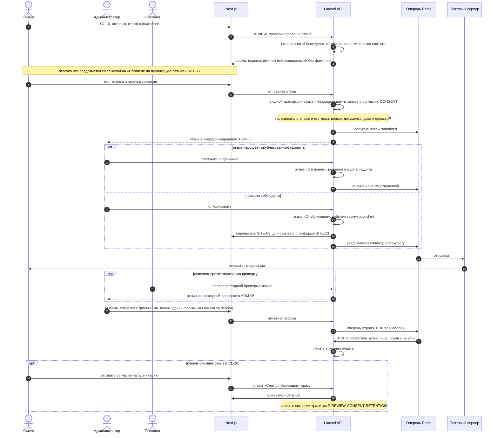
```mermaid
sequenceDiagram
  autonumber
  actor C as Клиент
  actor A as Администратор
  actor P as Психолог
  participant WEB as Next.js
  participant API as Laravel API
  participant Q as Очередь Redis
  participant MAIL as Почтовый сервер

  C->>WEB: CL-10, оставить отзыв о психологе
  WEB->>API: REVIEW, проверка права на отзыв
  API->>API: есть сессия «Проведена» с этим психологом, отзыва ещё нет
  API-->>WEB: форма, подпись именем или псевдонимом без фамилии
  Note over C,WEB: галочка без предотметки со ссылкой на «Согласие на публикацию отзыва» SITE-17
  C->>WEB: текст отзыва и галочка согласия
  WEB->>API: отправить отзыв
  API->>API: в одной транзакции отзыв «На модерации» и запись о согласии, CONSENT
  Note over API: пользователь, отзыв и его текст, версия документа, дата и время, IP
  API->>Q: событие review.submitted
  API-->>A: отзыв в очереди модерации ADM-06
  alt отзыв нарушает опубликованные правила
    A->>API: отклонить с причиной
    API->>API: отзыв «Отклонён», решение в журнал аудита
    API->>Q: письмо клиенту с причиной
  else правила соблюдены
    A->>API: опубликовать
    API->>API: отзыв «Опубликован», событие review.published
    API->>WEB: перевыпуск SITE-03, для отзыва о платформе SITE-13
    API->>Q: уведомления клиенту и психологу
  end
  Q->>MAIL: отправка
  MAIL-->>C: результат модерации
  opt психолог просит повторную проверку
    P->>API: запрос повторной проверки отзыва
    API-->>A: отзыв на повторной проверке в ADM-06
  end
  A->>WEB: ADM-06, согласия с фильтрами, печать одной формы или пакета за период
  WEB->>API: печатная форма
  API->>Q: очередь exports, PDF по шаблону
  Q->>API: PDF в приватном хранилище, ссылка на 24 ч
  API->>API: печать в журнал аудита
  opt клиент снимает отзыв в CL-10
    C->>WEB: отозвать согласие на публикацию
    WEB->>API: отзыв «Снят с публикации» сразу
    API->>WEB: перевыпуск SITE-03
    Note over API: запись о согласии хранится P-REVIEW-CONSENT-RETENTION
  end
```

| Ситуация | Поведение | Основание |
|---|---|---|
| У клиента нет проведённой сессии с психологом | Форма отзыва недоступна | DEC-40, BR-REVIEW-01 |
| Галочка согласия не отмечена | Кнопка отправки неактивна, отзыв не сохраняется | DEC-17, BR-REVIEW-02 |
| Отзыв негативный | Не основание для отклонения: отклонить можно только по опубликованным правилам | DEC-40, BR-REVIEW-06 |
| В тексте персональные данные третьих лиц | Модератор не меняет текст, а скрывает такие данные с пометкой и уведомлением автора | BR-REVIEW-05 |
| Клиент отредактировал отзыв | Новый текст с новой галочкой и новой записью о согласии снова проходит модерацию; до решения виден прежний текст [Рек.] | BR-REVIEW-01, BR-REVIEW-03 |
| Психолог не согласен с отзывом | Может только запросить повторную проверку модератором; удалить, скрыть или прокомментировать отзыв нельзя | DEC-40, BR-REVIEW-07 |
| Рейтинги | Звёзд, баллов и средних оценок нет | DEC-32, BR-REVIEW-10 |
| Клиент удалил аккаунт | Опубликованные отзывы снимаются, запись о согласии хранится по сроку | BR-ACC-15, BR-REVIEW-08 |
| Нарушен срок модерации `P-REVIEW-SLA` | Отзыв выделяется в очереди ADM-06 | BR-REVIEW-05 |

**Связанные правила:** DEC-17, DEC-32, DEC-34, DEC-40, BR-REVIEW-01…BR-REVIEW-11, BR-ACC-14; параметры `P-REVIEW-SLA`, `P-REVIEW-CONSENT-RETENTION`.

---

## SEQ-18. Подарочный сертификат

**Участники:** покупатель, получатель (клиент), Next.js (SITE-20, WIZ-06, CL-07), Laravel API (PROMO, PAY, NOTIF), очередь Redis, платёжный адаптер или эмулятор, почтовый сервер. **Этап ТЗ:** Доп., Э8.
**Предусловия:** покупатель указывает свой email и email получателя и даёт согласие на обработку ПДн; регистрация покупателя не обязательна [Рек.]. Сертификат — предоплата, а не скидка: доля психолога не уменьшается (DEC-43).

<!-- diagram: seq_18_gift_certificate -->
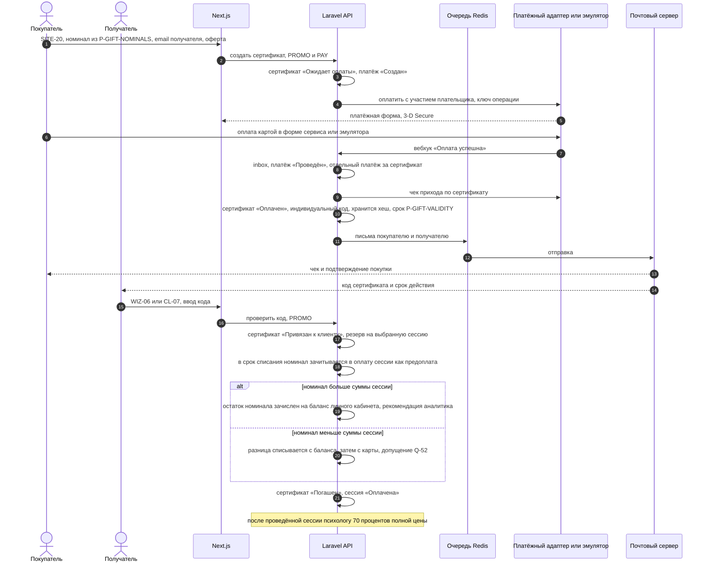
```mermaid
sequenceDiagram
  autonumber
  actor B as Покупатель
  actor C as Получатель
  participant WEB as Next.js
  participant API as Laravel API
  participant Q as Очередь Redis
  participant PAY as Платёжный адаптер или эмулятор
  participant MAIL as Почтовый сервер

  B->>WEB: SITE-20, номинал из P-GIFT-NOMINALS, email получателя, оферта
  WEB->>API: создать сертификат, PROMO и PAY
  API->>API: сертификат «Ожидает оплаты», платёж «Создан»
  API->>PAY: оплатить с участием плательщика, ключ операции
  PAY-->>WEB: платёжная форма, 3-D Secure
  B->>PAY: оплата картой в форме сервиса или эмулятора
  PAY->>API: вебхук «Оплата успешна»
  API->>API: inbox, платёж «Проведён», отдельный платёж за сертификат
  API->>PAY: чек прихода по сертификату
  API->>API: сертификат «Оплачен», индивидуальный код, хранится хеш, срок P-GIFT-VALIDITY
  API->>Q: письма покупателю и получателю
  Q->>MAIL: отправка
  MAIL-->>B: чек и подтверждение покупки
  MAIL-->>C: код сертификата и срок действия
  C->>WEB: WIZ-06 или CL-07, ввод кода
  WEB->>API: проверить код, PROMO
  API->>API: сертификат «Привязан к клиенту», резерв на выбранную сессию
  API->>API: в срок списания номинал зачитывается в оплату сессии как предоплата
  alt номинал больше суммы сессии
    API->>API: остаток номинала зачислен на баланс личного кабинета, рекомендация аналитика
  else номинал меньше суммы сессии
    API->>API: разница списывается с баланса, затем с карты, допущение Q-52
  end
  API->>API: сертификат «Погашен», сессия «Оплачена»
  Note over API: после проведённой сессии психологу 70 процентов полной цены
```

| Ситуация | Поведение | Основание |
|---|---|---|
| Оплата сертификата отклонена или форма закрыта | Сертификат не выпускается, код не создаётся | BR-PROMO-12 |
| Код неверный, истёк или уже погашен | Клиент видит причину, оплата идёт обычным порядком | BR-PROMO-03 |
| Сессия отменена до списания | Резерв снимается, сертификат остаётся привязанным к клиенту | BR-CANC-01 |
| Отмена или неявка психолога после погашения | Полная оплата сессии, включая часть сертификата, зачисляется на баланс [допущение Q-52] | DEC-23 |
| Остаток сертификата на балансе | Расходуется на следующие оплаты; на карту получателя не выводится, потому что платил покупатель [Рек.] [ЮРИСТ] | DEC-43, Q-52 |
| Срок `P-GIFT-VALIDITY` истёк без погашения | Сертификат «Истёк»; судьбу денег покупателя определяют бухгалтер и юрист [ПРОВЕРИТЬ] [ЮРИСТ] | DEC-43 |
| Письмо с кодом не дошло | Повторная отправка кода покупателю или получателю через техподдержку [Рек.] | BR-NOTIF-09 |
| Порядок чеков при продаже и погашении | Подтверждает бухгалтер | DEC-43 |
| Реальный сервис не подключён | Оплата сертификата проходит на тестовом эмуляторе | DEC-38 |

**Связанные правила:** DEC-38, DEC-43, Q-52, BR-PROMO-03, BR-PROMO-12, BR-PAY-07, BR-PAYOUT-01; параметры `P-GIFT-NOMINALS`, `P-GIFT-VALIDITY`.

---

## SEQ-19. Программа «Пригласи друга»

**Участники:** пригласивший клиент, друг, Next.js (CL-13, WIZ-05, WIZ-06, ADM-09), Laravel API (PROMO, AUTH, BOOK, PAY, NOTIF), очередь Redis, почтовый сервер. **Этап ТЗ:** Доп., Э8.
**Предусловия:** программа работает на индивидуальных промокодах (DEC-42), размеры скидок задаются в ADM-09. Первая оплаченная сессия друга считается состоявшейся, когда сессия получила итоговый статус с удержанной оплатой: «Проведена», «Неявка клиента» или «Отменена клиентом» после списания [Рек.].

<!-- diagram: seq_19_referral -->
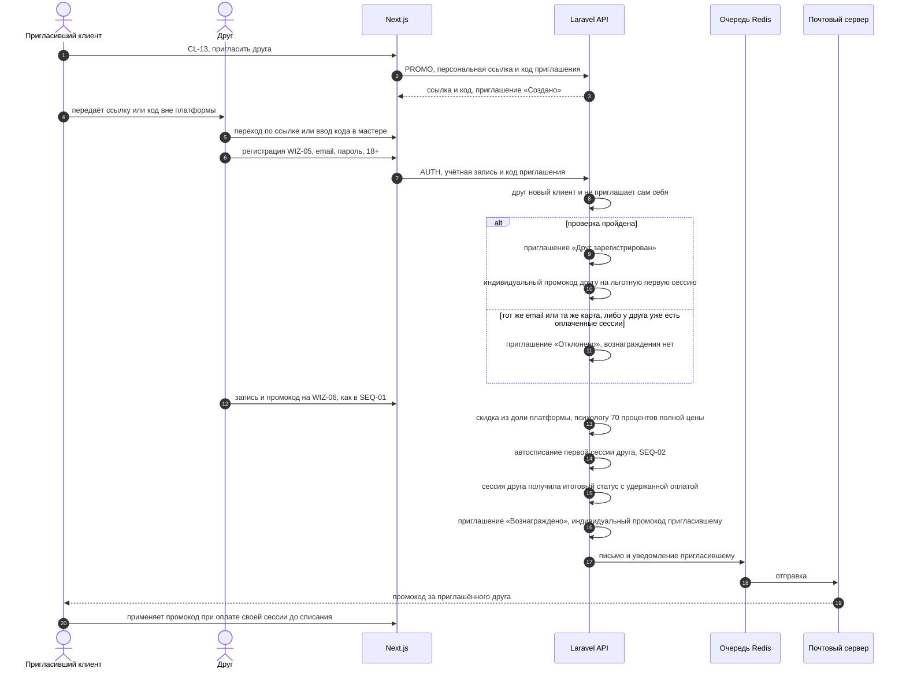
```mermaid
sequenceDiagram
  autonumber
  actor C as Пригласивший клиент
  actor F as Друг
  participant WEB as Next.js
  participant API as Laravel API
  participant Q as Очередь Redis
  participant MAIL as Почтовый сервер

  C->>WEB: CL-13, пригласить друга
  WEB->>API: PROMO, персональная ссылка и код приглашения
  API-->>WEB: ссылка и код, приглашение «Создано»
  C->>F: передаёт ссылку или код вне платформы
  F->>WEB: переход по ссылке или ввод кода в мастере
  F->>WEB: регистрация WIZ-05, email, пароль, 18+
  WEB->>API: AUTH, учётная запись и код приглашения
  API->>API: друг новый клиент и не приглашает сам себя
  alt проверка пройдена
    API->>API: приглашение «Друг зарегистрирован»
    API->>API: индивидуальный промокод другу на льготную первую сессию
  else тот же email или та же карта, либо у друга уже есть оплаченные сессии
    API->>API: приглашение «Отклонено», вознаграждения нет
  end
  F->>WEB: запись и промокод на WIZ-06, как в SEQ-01
  API->>API: скидка из доли платформы, психологу 70 процентов полной цены
  API->>API: автосписание первой сессии друга, SEQ-02
  API->>API: сессия друга получила итоговый статус с удержанной оплатой
  API->>API: приглашение «Вознаграждено», индивидуальный промокод пригласившему
  API->>Q: письмо и уведомление пригласившему
  Q->>MAIL: отправка
  MAIL-->>C: промокод за приглашённого друга
  C->>WEB: применяет промокод при оплате своей сессии до списания
```

| Ситуация | Поведение | Основание |
|---|---|---|
| Приглашение самого себя: тот же email или та же карта | Вознаграждение не начисляется | BR-PROMO-11 |
| Друг уже был клиентом платформы | Льготная первая сессия и вознаграждение не выдаются | BR-PROMO-01, BR-PROMO-11 |
| Первая сессия друга отменена до списания | Применение промокода восстанавливается; условие ждёт следующей сессии | BR-PROMO-09 |
| Оплата первой сессии возвращена: отмена или неявка психолога | Условие не выполнено, пока нет сессии с удержанной оплатой [Рек.] | DEC-42 |
| Первая сессия друга в пределах корпоративного лимита | Не считается оплаченной сессией для программы [Рек.]; промокод к ней не применяется | BR-PROMO-06 |
| Размер скидок | Задаётся в ADM-09; скидки уменьшают только долю платформы | DEC-57 |
| Промокод пригласившего истёк | Не применяется, клиент видит причину | BR-PROMO-03 |

**Связанные правила:** DEC-42, DEC-57, BR-PROMO-01, BR-PROMO-02, BR-PROMO-05, BR-PROMO-06, BR-PROMO-09, BR-PROMO-11.

---

## SEQ-20. Корпоративный сотрудник

**Участники:** администратор (ADM-22), HR-менеджер (HR-02, HR-04, HR-05), сотрудник (CL-16, WIZ-06), Next.js, Laravel API (B2B, AUTH, CONSENT, BOOK, PAY, PAYOUT, NOTIF), очередь Redis, планировщик, платёжный адаптер или эмулятор (касса), почтовый сервер. **Этап ТЗ:** 11.1.
**Предусловия:** договор компании с платформой заключён вне системы; программа создана в ADM-22 (BR-B2B-01). Сотруднику 18 лет или больше (DEC-49).

<!-- diagram: seq_20_b2b_employee -->
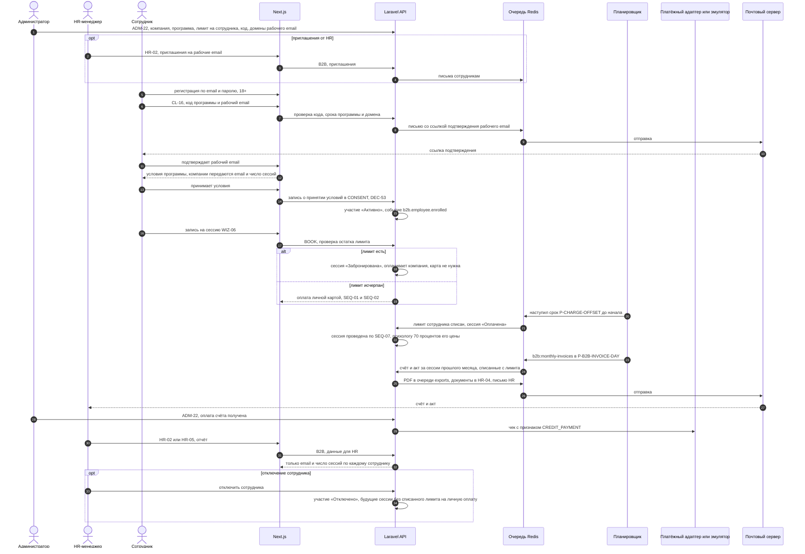
```mermaid
sequenceDiagram
  autonumber
  actor A as Администратор
  actor H as HR-менеджер
  actor E as Сотрудник
  participant WEB as Next.js
  participant API as Laravel API
  participant Q as Очередь Redis
  participant SCH as Планировщик
  participant PAY as Платёжный адаптер или эмулятор
  participant MAIL as Почтовый сервер

  A->>API: ADM-22, компания, программа, лимит на сотрудника, код, домены рабочего email
  opt приглашения от HR
    H->>WEB: HR-02, приглашения на рабочие email
    WEB->>API: B2B, приглашения
    API->>Q: письма сотрудникам
  end
  E->>WEB: регистрация по email и паролю, 18+
  E->>WEB: CL-16, код программы и рабочий email
  WEB->>API: проверка кода, срока программы и домена
  API->>Q: письмо со ссылкой подтверждения рабочего email
  Q->>MAIL: отправка
  MAIL-->>E: ссылка подтверждения
  E->>WEB: подтверждает рабочий email
  WEB-->>E: условия программы, компании передаются email и число сессий
  E->>WEB: принимает условия
  WEB->>API: запись о принятии условий в CONSENT, DEC-53
  API->>API: участие «Активно», событие b2b.employee.enrolled
  E->>WEB: запись на сессию WIZ-06
  WEB->>API: BOOK, проверка остатка лимита
  alt лимит есть
    API->>API: сессия «Забронирована», оплачивает компания, карта не нужна
  else лимит исчерпан
    API-->>WEB: оплата личной картой, SEQ-01 и SEQ-02
  end
  SCH->>Q: наступил срок P-CHARGE-OFFSET до начала
  Q->>API: лимит сотрудника списан, сессия «Оплачена»
  API->>API: сессия проведена по SEQ-07, психологу 70 процентов его цены
  SCH->>Q: b2b:monthly-invoices в P-B2B-INVOICE-DAY
  Q->>API: счёт и акт за сессии прошлого месяца, списанные с лимита
  API->>Q: PDF в очереди exports, документы в HR-04, письмо HR
  Q->>MAIL: отправка
  MAIL-->>H: счёт и акт
  A->>API: ADM-22, оплата счёта получена
  API->>PAY: чек с признаком CREDIT_PAYMENT
  H->>WEB: HR-02 или HR-05, отчёт
  WEB->>API: B2B, данные для HR
  API-->>WEB: только email и число сессий по каждому сотруднику
  opt отключение сотрудника
    H->>API: отключить сотрудника
    API->>API: участие «Отключено», будущие сессии без списанного лимита на личную оплату
  end
```

| Ситуация | Поведение | Основание |
|---|---|---|
| Код неверный, программа не началась или закончилась | Доступ не активируется, сотрудник видит причину | BR-B2B-01, BR-B2B-02 |
| Домен рабочего email не разрешён | Подтверждение недоступно; HR может загрузить список адресов | BR-B2B-02 |
| Сотрудник не принял условия программы | Корпоративный доступ не активируется; учётная запись работает как у обычного клиента | DEC-53, BR-B2B-03 |
| Лимит исчерпан | Сессии сверх лимита — личной картой по общим правилам, чек PREPAYMENT_FULL | DEC-25, BR-B2B-04 |
| Отмена сотрудником до `P-CHARGE-OFFSET` | Лимит сохраняется; после этого срока сессия засчитывается в лимит | BR-B2B-05 |
| Отмена или неявка психолога | Лимит восстанавливается | BR-B2B-05, BR-CANC-11 |
| Отключение сотрудника или окончание программы | Будущие сессии переводятся на личную оплату; без карты отменяются без удержаний не позднее `P-B2B-OFFBOARD-NOTICE` до начала | BR-B2B-09, BR-B2B-10 |
| HR запрашивает запросы, психологов или даты сессий | Не передаются: HR получает только email и число сессий | DEC-25, BR-PRIV-07 |
| Выставленный счёт нужно исправить | Корректировка оформляется отдельным документом | BR-B2B-06 |
| Нужен ли чек при оплате счёта организацией | Подтверждает бухгалтер [ПРОВЕРИТЬ] | BR-B2B-07 |

**Связанные правила:** DEC-22, DEC-25, DEC-53, BR-B2B-01…BR-B2B-11, BR-PRIV-07, BR-PAY-08; параметры `P-CHARGE-OFFSET`, `P-B2B-INVOICE-DAY`, `P-B2B-OFFBOARD-NOTICE`.

---

## SEQ-21. Подключение партнёра white-label

**Участники:** Супер-администратор основного инстанса ТЕТА, команда партнёра, психолог партнёра, CI/CD, серверы инстанса партнёра, Laravel API основного инстанса (INSTANCE), Laravel API, Next.js и планировщик инстанса партнёра (INSTANCE, RBAC, PSY), почтовый сервер партнёра. **Этап ТЗ:** Э4.
**Предусловия:** договор с партнёром заключён вне системы. Каждый партнёр получает отдельный инстанс платформы на отдельном сервере — тот же код со своей базой данных, Redis, файловым хранилищем, TetaMeet и доменом; ПДн между инстансами не передаются (DEC-52).

<!-- diagram: seq_21_white_label_instance -->
```mermaid
sequenceDiagram
  autonumber
  actor SA as Супер-администратор ТЕТА
  participant MAIN as Laravel API основного инстанса
  participant CI as CI и CD
  participant VDS as Серверы инстанса партнёра
  participant PAPI as Laravel API инстанса партнёра
  participant PWEB as Next.js инстанса партнёра
  participant PSCH as Планировщик инстанса партнёра
  participant PMAIL as Почтовый сервер партнёра
  actor PT as Команда партнёра
  actor PP as Психолог партнёра

  SA->>MAIN: ADM-21, запись о партнёре, домен и сервер
  MAIN->>MAIN: инстанс «Подготовка», событие instance.partner.registered
  SA->>VDS: VDS Timeweb по шаблону конфигурации, DEC-36
  CI->>VDS: шаблон инфраструктуры, ОС, Docker, сети, копии, мониторинг, секреты
  MAIN->>MAIN: инстанс «Развёртывание»
  CI->>PAPI: текущий тег версии, миграции на пустой базе, сиды справочников
  CI->>PWEB: та же версия фронтенда
  SA->>VDS: DNS домена партнёра на входной сервер, сертификат HTTPS
  SA->>PAPI: первый Супер-администратор инстанса
  MAIN->>MAIN: инстанс «Настройка»
  PT->>PAPI: ADM-21 инстанса, наименование, логотип, палитра, домен
  PT->>PAPI: ADM-26 инстанса, отправитель писем, платёжный сервис, параметры правил
  PAPI->>PAPI: событие instance.settings.updated, бренд писем и TetaMeet
  PAPI->>PWEB: перевыпуск страниц в бренде партнёра
  PAPI->>PMAIL: тестовое письмо после настройки SPF, DKIM и DMARC домена
  CI->>PAPI: smoke-проверки
  PSCH->>MAIN: первый служебный сигнал, версия и доступность без ПДн
  MAIN->>MAIN: инстанс «Работает» в реестре ADM-21
  PT->>PAPI: ADM-02 и ADM-05, команда партнёра с обычными ролями RBAC
  PP->>PWEB: регистрация и проверка квалификации, SEQ-12
  PT->>PAPI: ADM-03, решение по квалификации психолога партнёра
  Note over PAPI,PWEB: клиенты, сессии, платежи, начисления и выплаты учитываются внутри инстанса партнёра
  loop каждые 5 мин
    PSCH->>MAIN: instance:send-heartbeat
  end
  opt нет сигнала дольше 15 мин
    MAIN->>MAIN: instance:check-partners, инстанс «Недоступен», алерт
  end
  opt обновление платформы
    MAIN->>MAIN: инстанс «Обновление»
    CI->>PAPI: тот же тег после основного prod, резервная копия, миграции, smoke-проверки
    alt ошибка обновления
      CI->>PAPI: откат на предыдущий образ, раскатка остановлена
    else обновление успешно
      PSCH->>MAIN: новая версия в реестре, инстанс «Работает»
    end
  end
```

| Ситуация | Поведение | Основание |
|---|---|---|
| DNS домена партнёра не настроен | Сертификат не выпускается, запуск инстанса откладывается | DEC-52 |
| Smoke-проверки не прошли | Инстанс не переводится в «Работает»; развёртывание повторяется после исправления | DEC-52 |
| Не настроены SPF, DKIM и DMARC домена партнёра | Отправка писем инстанса не включается [Рек.] | DEC-51, DEC-52 |
| Платёжный сервис партнёра не подключён | Инстанс работает на тестовом эмуляторе; запуск prod с эмулятором блокируется [Рек.] | DEC-38 |
| Нет служебного сигнала дольше 15 мин | Инстанс «Недоступен» в ADM-21, алерт; после восстановления сигнала — «Работает» | DEC-52 |
| Ошибка обновления | Откат инстанса на предыдущий образ, раскатка на остальные инстансы останавливается | DEC-52 |
| Прекращение работы с партнёром | Данные инстанса выгружаются или уничтожаются по договору [ЮРИСТ], запись реестра переводится в архив | DEC-52 |
| Требование ежемесячной супервизии в инстансе | Включается или выключается параметром ADM-26 инстанса [Рек.] | DEC-37, DEC-52 |
| Отдельная роль или интерфейс для партнёра | Не предусмотрены: команда партнёра работает в админ-панели своего инстанса обычными ролями RBAC | DEC-52 |

**Связанные правила:** DEC-36, DEC-38, DEC-51, DEC-52, BR-WL-02, BR-WL-03, BR-RBAC-02.

---

## SEQ-22. Удаление аккаунта по запросу

**Участники:** клиент, психолог клиента, Next.js (CL-08), Laravel API (PROFILE, AUTH, BOOK, PAY, PAYOUT, CONSENT, REVIEW, DIARY, CRM, MATCH, AIBOT, SUPPORT, MAILING, AUDIT), очередь Redis, планировщик, платёжный адаптер или эмулятор, почтовый сервер. **Этап ТЗ:** Э3.
**Предусловия:** клиент вошёл в кабинет. Основание — право субъекта ПДн на отзыв согласия и уничтожение данных (152-ФЗ); данные с установленным законом сроком хранения обезличиваются, а не уничтожаются [ЮРИСТ].

<!-- diagram: seq_22_account_deletion -->
```mermaid
sequenceDiagram
  autonumber
  actor C as Клиент
  participant WEB as Next.js
  participant API as Laravel API
  participant Q as Очередь Redis
  participant SCH as Планировщик
  participant PAY as Платёжный адаптер или эмулятор
  participant MAIL as Почтовый сервер
  actor P as Психолог клиента

  C->>WEB: CL-08, удалить аккаунт
  WEB->>API: последствия удаления, PROFILE
  API-->>WEB: будущие сессии, карта, остаток баланса, опубликованные отзывы
  WEB-->>C: предупреждение о последствиях
  C->>WEB: подтверждает удаление паролем
  WEB->>API: удалить аккаунт
  API->>API: AUTH, доступ заблокирован, все сеансы завершены
  API->>API: событие profile.account.deletion_requested
  loop каждая будущая сессия
    alt оплата не списана
      API->>API: сессия «Отменена клиентом», задание на списание «Отменено»
    else оплата списана
      API->>API: сессия «Отменена клиентом» по правилам отмены, полное удержание
    end
  end
  opt на балансе личного кабинета есть остаток
    API->>PAY: возврат остатка на карту по исходным оплатам, допущение Q-52
    PAY-->>API: возврат выполнен
  end
  API->>PAY: удалить токен карты
  API->>API: отзывы сняты с публикации, согласие на рассылки отозвано
  API->>Q: письма клиенту и психологу
  Q->>MAIL: отправка
  MAIL-->>C: подтверждение удаления аккаунта
  MAIL-->>P: отмена записей клиента
  SCH->>Q: platform:retention ежедневно 03:30
  Q->>API: истёк срок P-DELETE-GRACE
  API->>API: профиль, анкеты, дневник и диалоги с Германом уничтожены
  API->>API: заметки психолога о клиенте уничтожены, если нет иного основания хранения
  API->>API: платежи, чеки, возвраты и начисления обезличены и хранятся по закону
  API->>API: обращения обезличены, записи о согласиях сохранены как доказательство
  API->>API: событие profile.account.deleted, запись в журнал аудита
  Note over API: из резервных копий данные исчезают по мере их ротации
```

| Ситуация | Поведение | Основание |
|---|---|---|
| Неверный пароль | Удаление не выполняется | BR-ACC-15 |
| Оплата будущей сессии уже списана | Отмена по правилам отмены клиентом: полное удержание; психологу начисляется 70 % [допущение Q-56] | DEC-23, BR-CANC-03 |
| Возврат остатка баланса на карту не прошёл | Заявка уходит на ручной разбор в ADM-07; обезличивание финансовых записей ждёт завершения возврата [Рек.] | Q-52 |
| Открыта жалоба на списание | Рассматривается до конца срока; решение отправляется на email до его уничтожения [Рек.] | BR-CANC-05 |
| Клиент — корпоративный сотрудник | Участие в программе прекращается, HR теряет доступ к его данным | BR-B2B-09 |
| Аккаунт удаляет психолог | Запрос через PRO-17; возможно, только если нет предстоящих сессий, открытых жалоб по его сессиям и проводимых им супервизий; остаток баланса выплачивается по общим правилам | BR-ACC-16 |
| Срок завершения | Уничтожение или обезличивание — в пределах `P-DELETE-GRACE` (30 дней), если нет иного основания хранения | BR-ACC-15 |
| Заметки психолога | Уничтожаются системой; в журнал аудита пишется только факт удаления, без содержания | BR-RBAC-07 |

**Связанные правила:** DEC-23, DEC-24, Q-52, Q-56, BR-ACC-15, BR-ACC-16, BR-PAY-09, BR-REVIEW-08, BR-RBAC-07; параметры `P-DELETE-GRACE`, `P-NOTES-RETENTION`.

---

# B. Машины состояний

Для каждой сущности — диаграмма и таблица переходов. Состояния названы так, как их видят пользователи в интерфейсе; технические коды статусов задаёт [модель данных](data_model.md). Недопустимый переход отклоняет доменная модель модуля-владельца; каждый переход пишет историю сущности и доменное событие (раздел 0). В колонке «Кто инициирует» «Система» — команда планировщика, обработчик очереди или вебхук.

## ST-01. Сессия

**Модуль-владелец:** BOOK. **Разделы:** CL-03, PRO-04, ADM-04. Перенос — событие в истории сессии, а не статус (BR-BOOK-07).

<!-- diagram: st_session -->
```mermaid
stateDiagram-v2
  state "Забронирована" as Booked
  state "Оплачена" as Paid
  state "Идёт" as InProgress
  state "Проведена" as Held
  state "Неявка клиента" as ClientNoShow
  state "Неявка психолога" as PsyNoShow
  state "Техническая проблема" as TechIssue
  state "Отменена клиентом" as CancelledByClient
  state "Отменена психологом" as CancelledByPsy
  state "Отменена системой" as CancelledBySystem

  [*] --> Booked: запись раньше P-CHARGE-OFFSET до начала
  [*] --> Paid: запись с оплатой сразу или бесплатный перенос
  Booked --> Booked: перенос до списания
  Booked --> Paid: автосписание или списание корпоративного лимита
  Booked --> CancelledByClient: отмена до списания или смена психолога
  Booked --> CancelledByPsy: отмена психологом
  Booked --> CancelledBySystem: крайний срок оплаты, блокировка, отключение от программы
  Paid --> Paid: перенос не раньше чем через 12 ч
  Paid --> CancelledByClient: отмена после списания или смена психолога
  Paid --> CancelledByPsy: отмена психологом
  Paid --> CancelledBySystem: блокировка или уход участника
  Paid --> InProgress: наступило время начала
  InProgress --> Held: отметка психолога или автоматически по журналу
  InProgress --> ClientNoShow: клиент не вошёл за P-NOSHOW-WAIT
  InProgress --> PsyNoShow: психолог не вошёл за P-NOSHOW-WAIT
  InProgress --> TechIssue: обрыв, длительность меньше P-AUTO-COMPLETE-MIN
  Held --> [*]
  ClientNoShow --> [*]
  PsyNoShow --> [*]
  TechIssue --> [*]
  CancelledByClient --> [*]
  CancelledByPsy --> [*]
  CancelledBySystem --> [*]
```

| Из состояния | Событие | В состояние | Условия и последствия | Кто инициирует |
|---|---|---|---|---|
| — | Запись раньше `P-CHARGE-OFFSET` до начала (SEQ-01) | Забронирована | Цена, скидка и признак оплаты компанией зафиксированы (BR-BOOK-03); создано задание на списание или сессия отнесена к корпоративному лимиту | Клиент |
| — | Запись позже `P-CHARGE-OFFSET` до начала | Оплачена | Оплата сразу: сначала баланс, затем карта [допущение Q-52]; при отказе запись не создаётся (BR-BOOK-04) | Клиент |
| — | Бесплатный перенос после отмены или неявки психолога либо технической проблемы | Оплачена | Создаётся новая сессия, оплата и чек переходят с исходной (BR-CANC-06, BR-BOOK-15) | Клиент |
| Забронирована | Перенос до списания | Забронирована | Свободный слот того же психолога; срок задания на списание пересчитан (BR-CANC-02) | Клиент |
| Забронирована | Автосписание успешно, скидка 100 % или списан корпоративный лимит | Оплачена | Чек PREPAYMENT_FULL и письмо; при корпоративной сессии чека нет (BR-PAY-04, BR-PROMO-08, BR-B2B-05) | Система |
| Забронирована | Отмена клиентом до списания, в том числе при смене психолога | Отменена клиентом | Бесплатно; задание отменено, промокод восстановлен, корпоративный лимит сохранён (BR-CANC-01, DEC-48) | Клиент |
| Забронирована, Оплачена | Отмена психологом | Отменена психологом | При списанной оплате клиент выбирает возврат на баланс [допущение Q-52] или бесплатный перенос; инцидент качества при отмене меньше чем за `P-CHARGE-OFFSET` (BR-CANC-06, BR-CANC-08) | Психолог, администратор |
| Забронирована | `P-CHARGE-DEADLINE` без оплаты; карта удалена и не заменена; отключение от программы без карты | Отменена системой | Без удержаний, слот освобождён, промокод восстановлен (BR-PAY-05, BR-PAY-09, BR-B2B-09) | Система |
| Забронирована, Оплачена | Блокировка клиента или психолога, уход психолога с платформы | Отменена системой | Полный возврат на баланс, если оплата списана (BR-CANC-09, BR-ACC-17) | Администратор, система |
| Оплачена | Перенос после списания | Оплачена | Новое начало не раньше чем через 12 ч от момента переноса; оплата переходит на новое время, новое задание на списание не создаётся (DEC-56) | Клиент |
| Оплачена | Отмена клиентом после списания | Отменена клиентом | Полное удержание (DEC-23); начисление психологу 70 % [допущение Q-56]; промокод не восстанавливается (BR-PROMO-09) | Клиент |
| Оплачена | Смена психолога | Отменена клиентом | Вся оплата зачисляется на баланс личного кабинета, начисления нет (DEC-48) | Клиент |
| Оплачена | Наступило время начала | Идёт | Вход открыт с `P-ROOM-OPEN` до начала (BR-BOOK-10) | Система |
| Идёт | Психолог отметил «Проведена» при длительности больше нуля или система через `P-OUTCOME-DEADLINE` при длительности не меньше `P-AUTO-COMPLETE-MIN` | Проведена | Начисление 70 % полной цены (DEC-57); доступны отзыв и обратная связь (BR-BOOK-13) | Психолог, система |
| Идёт | Клиент не вошёл за `P-NOSHOW-WAIT`, журнал подтверждает | Неявка клиента | Оплата не возвращается; начисление 70 % [допущение Q-56] (BR-BOOK-14) | Психолог |
| Идёт | Психолог не вошёл за `P-NOSHOW-WAIT` | Неявка психолога | Клиент выбирает возврат на баланс или перенос; начисления нет; администратор уведомлён (BR-CANC-07) | Система, клиент |
| Идёт | Обрыв подтверждён журналом или администратором, длительность меньше `P-AUTO-COMPLETE-MIN` | Техническая проблема | Клиент выбирает перенос или возврат на баланс; начисления нет (BR-BOOK-15) | Психолог, администратор |
| Идёт | Итоговый статус не определён за `P-OUTCOME-DEADLINE` | Проведена, Неявка клиента, Неявка психолога или Техническая проблема | Решение по журналу сессий в ADM-04 (BR-BOOK-13) | Администратор |

Выбор клиента после отмены или неявки психолога и после технической проблемы хранится в сессии: «ожидается», «возврат», «перенос». Перенос создаёт новую сессию в статусе «Оплачена», исходная остаётся в итоговом статусе. Корпоративная сессия вместо денежного возврата восстанавливает лимит (BR-CANC-11).

---

## ST-02. Задание на списание

**Модуль-владелец:** PAY. **Разделы:** CL-07, ADM-07. Задание — источник истины для автосписания; задача в очереди Redis только запускает его обработку (SEQ-02).

<!-- diagram: st_charge_task -->
```mermaid
stateDiagram-v2
  state "Запланировано" as Scheduled
  state "В процессе" as InProgress
  state "Ожидает повтора или оплаты" as RetryWait
  state "Выполнено" as Succeeded
  state "Не выполнено окончательно" as FailedFinal
  state "Отменено" as Cancelled

  [*] --> Scheduled: сессия забронирована, сумма больше нуля
  Scheduled --> Scheduled: перенос до списания, срок пересчитан
  Scheduled --> InProgress: наступил срок P-CHARGE-OFFSET
  Scheduled --> Cancelled: сессия отменена до срока
  InProgress --> Succeeded: баланс покрыл сумму или оплата успешна
  InProgress --> RetryWait: отказ банка или статус неизвестен
  InProgress --> InProgress: обработка дольше 10 мин, запрос статуса
  RetryWait --> InProgress: следующая попытка по P-CHARGE-RETRY
  RetryWait --> Succeeded: клиент оплатил другой картой
  RetryWait --> Cancelled: сессия отменена до оплаты
  RetryWait --> FailedFinal: наступил P-CHARGE-DEADLINE
  InProgress --> FailedFinal: наступил P-CHARGE-DEADLINE
  Succeeded --> [*]
  FailedFinal --> [*]
  Cancelled --> [*]
```

| Из состояния | Событие | В состояние | Условия и последствия | Кто инициирует |
|---|---|---|---|---|
| — | Событие `book.session.booked` | Запланировано | Срок — начало минус `P-CHARGE-OFFSET`, крайний срок — начало минус `P-CHARGE-DEADLINE`; сумма — зафиксированная цена за вычетом скидки (BR-PAY-04). Не создаётся для корпоративной сессии в лимите и для записи позже `P-CHARGE-OFFSET`, оплаченной сразу | Система |
| Запланировано | Перенос сессии до списания | Запланировано | Срок и крайний срок пересчитаны в той же транзакции (BR-CANC-02) | Клиент |
| Запланировано | Команда `pay:dispatch-due-charges` нашла задание с наступившим сроком | В процессе | Блокировка задания от параллельной обработки; при первой попытке — расход баланса клиента [допущение Q-52] | Планировщик |
| Запланировано, Ожидает повтора или оплаты | Отмена сессии клиентом, психологом или системой до успешной оплаты | Отменено | Расход баланса сторнируется, промокод восстановлен (BR-CANC-01, BR-PROMO-09) | Клиент, психолог, система |
| В процессе | Баланс покрыл всю сумму или пришёл вебхук «Оплата успешна» | Выполнено | Платёж «Проведён», сессия «Оплачена», чек PREPAYMENT_FULL; второе списание невозможно (BR-PAY-06) | Система |
| В процессе | Отказ с категорией «повторять», «не повторять», «нужна другая карта» или статус неизвестен | Ожидает повтора или оплаты | Попытка записана с категорией. При «повторять» и неизвестном статусе запланирована следующая попытка, при остальных отказах ждём оплаты клиентом; письмо со ссылкой на CL-07 (BR-PAY-05) | Система |
| В процессе | Обработка идёт дольше 10 мин | В процессе | `pay:recover-stuck-charges` запрашивает статус операции у сервиса | Планировщик |
| Ожидает повтора или оплаты | Наступило время следующей попытки по `P-CHARGE-RETRY` | В процессе | Перед попыткой — запрос статуса по ключу операции | Планировщик |
| Ожидает повтора или оплаты | Клиент оплатил другой картой в CL-07 | Выполнено | Оплата с участием клиента и 3-D Secure | Клиент |
| В процессе, Ожидает повтора или оплаты | Наступил `P-CHARGE-DEADLINE` без оплаты | Не выполнено окончательно | Сторно расхода баланса, событие `pay.charge.failed_final`, сессия «Отменена системой» без удержаний (BR-PAY-05) | Планировщик |

---

## ST-03. Платёж

**Модуль-владелец:** PAY. **Разделы:** CL-07, ADM-07. Платёж — операция через платёжный адаптер или эмулятор: автосписание по токену, оплата с участием плательщика (запись позже `P-CHARGE-OFFSET`, оплата после отказа, сертификат, мероприятие) и списание с карты психолога за супервизию.

<!-- diagram: st_payment -->
```mermaid
stateDiagram-v2
  state "Создан" as Created
  state "Требуется 3-D Secure" as ThreeDS
  state "Статус неизвестен" as Unknown
  state "Проведён" as Succeeded
  state "Отклонён" as Declined
  state "Возвращён частично" as PartRefunded
  state "Возвращён" as Refunded

  [*] --> Created: операция с ключом идемпотентности
  Created --> ThreeDS: оплата с участием плательщика
  ThreeDS --> Succeeded: подтверждение пройдено
  ThreeDS --> Declined: отказ или форма закрыта
  Created --> Succeeded: вебхук об успешной оплате
  Created --> Declined: отказ с категорией
  Created --> Unknown: таймаут или ошибка сервиса
  Unknown --> Succeeded: запрос статуса, операция успешна
  Unknown --> Declined: запрос статуса, отказ или операции нет
  Succeeded --> PartRefunded: частичный возврат на карту
  Succeeded --> Refunded: полный возврат на карту
  PartRefunded --> Refunded: возврат остатка
  Succeeded --> [*]
  PartRefunded --> [*]
  Declined --> [*]
  Refunded --> [*]
```

| Из состояния | Событие | В состояние | Условия и последствия | Кто инициирует |
|---|---|---|---|---|
| — | Попытка автосписания, оплата с участием плательщика или списание за супервизию | Создан | Ключ идемпотентности — ID задания и номер попытки или ID операции платформы; в журнале операций — тип услуги | Система, клиент, психолог |
| Создан | Сервис требует подтверждения плательщика | Требуется 3-D Secure | Плательщик перенаправляется в форму сервиса или эмулятора | Сервис |
| Создан, Требуется 3-D Secure | Вебхук «Оплата успешна» | Проведён | Подпись проверена, событие в inbox; чек прихода; сессия «Оплачена», сертификат «Оплачен» или заявка на супервизию «Назначена» (BR-PAY-04, BR-PAY-07) | Сервис |
| Создан, Требуется 3-D Secure | Вебхук «Оплата отклонена» или форма закрыта | Отклонён | Категория отказа определяет повторы (ST-02); письмо плательщику (BR-PAY-05) | Сервис, плательщик |
| Создан | Таймаут, ответ 5xx или потерянный вебхук | Статус неизвестен | Перед любым повтором — запрос статуса по ключу операции | Система |
| Статус неизвестен | Ответ на запрос статуса | Проведён или Отклонён | Как соответствующие переходы; вторая операция не создаётся (BR-PAY-06) | Система |
| Проведён | Вывод остатка баланса клиента на карту или ручной возврат администратора на часть суммы | Возвращён частично | Операция «Вернуть» с ключом ID возврата, чек возврата прихода; сумма возвратов не больше суммы операции (BR-PAY-11) [допущение Q-52] | Клиент, администратор |
| Проведён, Возвращён частично | Возврат всей оставшейся суммы | Возвращён | То же; остаток баланса клиента уменьшается после подтверждения сервиса (ST-04) | Клиент, администратор |

Возвраты при отмене или неявке психолога, при смене психолога и по одобренной жалобе статус платежа не меняют: сумма зачисляется на баланс личного кабинета (ST-04) [допущение Q-52], на карту деньги уходят только при выводе остатка. Возврат, который сервис не выполнил, получает отметку «требует разбора» в ADM-07, а платёж остаётся в прежнем статусе. До подключения реального сервиса все переходы проходят на тестовом эмуляторе (DEC-38).

---

## ST-04. Движение баланса клиента

**Модуль-владелец:** PAY (журнал баланса личного кабинета). **Разделы:** CL-07, ADM-07. Машина описывает одну операцию по балансу. Зачисление при смене психолога — решение DEC-48; остальные основания, порядок расходования и вывод на карту — [допущение Q-52] [ЮРИСТ].

<!-- diagram: st_client_balance -->
```mermaid
stateDiagram-v2
  state "Зачислено" as Credited
  state "Расход зарезервирован" as SpendReserved
  state "Списано с баланса" as Spent
  state "Расход сторнирован" as SpendReversed
  state "Вывод зарезервирован" as WithdrawReserved
  state "Вывод в обработке" as WithdrawProcessing
  state "Выведено на карту" as Withdrawn
  state "Вывод требует разбора" as WithdrawReview
  state "Вывод отменён" as WithdrawCancelled

  [*] --> Credited: возврат оплаты или остаток сертификата
  [*] --> SpendReserved: оплата при положительном балансе
  SpendReserved --> Spent: баланс покрыл сумму или доплата картой прошла
  SpendReserved --> SpendReversed: доплата не прошла к крайнему сроку или сессия отменена
  [*] --> WithdrawReserved: заявка клиента на вывод остатка
  WithdrawReserved --> WithdrawProcessing: возвраты по исходным оплатам отправлены
  WithdrawProcessing --> Withdrawn: все возвраты выполнены
  WithdrawProcessing --> WithdrawReview: возврат не выполнен или невозможен
  WithdrawReview --> Withdrawn: администратор провёл возврат
  WithdrawReview --> WithdrawCancelled: заявка отклонена, резерв снят
  Credited --> [*]
  Spent --> [*]
  SpendReversed --> [*]
  Withdrawn --> [*]
  WithdrawCancelled --> [*]
```

| Из состояния | Событие | В состояние | Условия и последствия | Кто инициирует |
|---|---|---|---|---|
| — | Отмена клиентом оплаченной сессии при смене психолога | Зачислено | Проводка с основанием и ссылкой на исходную оплату, событие `pay.balance.credited` (DEC-48) | Клиент |
| — | Отмена или неявка психолога, техническая проблема с выбором возврата, одобренная жалоба, блокировка участника | Зачислено | Проводка в одной транзакции с изменением статуса сессии или жалобы [допущение Q-52] (DEC-23) | Система, администратор |
| — | Погашение сертификата с номиналом больше суммы сессии | Зачислено | Остаток номинала с признаком «средства сертификата» [Рек.]; на карту не выводится (SEQ-18) | Система |
| — | Первая попытка автосписания или оплата с участием клиента при положительном балансе | Расход зарезервирован | Резерв в той же транзакции, что и перевод задания «В процессе»; остаток не может стать отрицательным | Система |
| Расход зарезервирован | Баланс покрыл всю сумму или доплата картой прошла | Списано с баланса | Сессия «Оплачена»; порядок чеков подтверждает бухгалтер [ПРОВЕРИТЬ] | Система |
| Расход зарезервирован | Доплата окончательно не прошла к `P-CHARGE-DEADLINE` или сессия отменена до оплаты | Расход сторнирован | Обратная проводка, остаток восстановлен | Система |
| — | Заявка клиента в CL-07 на вывод остатка | Вывод зарезервирован | Резерв суммы, событие `pay.balance.withdrawal_requested`; средства сертификата в вывод не входят [Рек.] [ЮРИСТ] | Клиент |
| Вывод зарезервирован | Задача очереди `payments` отправила возвраты по исходным оплатам в пределах их сумм | Вывод в обработке | Операции «Вернуть» с ключом ID заявки (ST-03) | Система |
| Вывод в обработке | Сервис подтвердил все возвраты | Выведено на карту | Остаток уменьшен, чеки возврата прихода, письмо клиенту | Сервис |
| Вывод в обработке | Возврат не выполнен или истёк срок возврата по исходной операции | Вывод требует разбора | Остаток не уменьшается, пока деньги не возвращены; заявка в ADM-07 | Сервис, система |
| Вывод требует разбора | Администратор провёл возврат вручную с причиной | Выведено на карту | Запись в журнал аудита | Администратор |
| Вывод требует разбора | Заявка отклонена с причиной | Вывод отменён | Резерв снят, клиент получает письмо с причиной | Администратор |

Остаток — сумма проводок; материализованное значение обновляется в той же транзакции и ежедневно сверяется с проводками [Рек.]. Способ вывода — возврат по исходным оплатам или выплата на карту — зависит от платёжного сервиса (Q-43).

---

## ST-05. Жалоба на списание

**Модуль-владелец:** PAY. **Разделы:** CL-07, ADM-07, ADM-19. Сценарий — SEQ-06.

<!-- diagram: st_charge_complaint -->
```mermaid
stateDiagram-v2
  state "Подана" as Submitted
  state "На рассмотрении" as InReview
  state "Ожидает уточнений клиента" as WaitingClient
  state "Отклонена" as Rejected
  state "Удовлетворена" as Approved
  state "Возврат зачислен" as Refunded
  state "Отозвана клиентом" as Withdrawn

  [*] --> Submitted: жалоба из CL-07 или обращение о списании
  Submitted --> InReview: администратор взял в работу
  InReview --> WaitingClient: запрошены уточнения
  WaitingClient --> InReview: клиент ответил или администратор продолжил
  InReview --> Rejected: отказ с комментарием
  InReview --> Approved: полный или частичный возврат
  Approved --> Refunded: сумма на балансе или лимит восстановлен
  Submitted --> Withdrawn: клиент отозвал жалобу
  InReview --> Withdrawn: клиент отозвал жалобу
  Rejected --> [*]
  Refunded --> [*]
  Withdrawn --> [*]
```

| Из состояния | Событие | В состояние | Условия и последствия | Кто инициирует |
|---|---|---|---|---|
| — | Клиент подал жалобу в CL-07 с причиной или администратор зарегистрировал обращение о списании как жалобу | Подана | Только по списанной оплате; срок решения `P-COMPLAINT-REVIEW` — 14 рабочих дней по производственному календарю; клиент видит статус и срок (DEC-23, BR-CANC-05, BR-SUPPORT-09) | Клиент, администратор |
| Подана | Администратор взял жалобу в работу | На рассмотрении | Журнал сессий, платёж и история сессии доступны в ADM-04 и ADM-07 | Администратор |
| На рассмотрении | Нужны сведения от клиента | Ожидает уточнений клиента | Вопрос уходит через обращение ADM-19; срок рассмотрения не приостанавливается [Рек.] | Администратор |
| Ожидает уточнений клиента | Клиент ответил или администратор продолжил без ответа | На рассмотрении | — | Клиент, администратор |
| На рассмотрении | Решение об отказе | Отклонена | Комментарий обязателен; письмо с решением (BR-CANC-05) | Администратор |
| На рассмотрении | Решение о полном или частичном возврате | Удовлетворена | Комментарий и сумма обязательны; запись в журнал аудита | Администратор |
| Удовлетворена | Проводка зачисления выполнена | Возврат зачислен | Сумма на баланс личного кабинета [допущение Q-52]; сторно начисления психологу в той же доле [допущение Q-56]; по корпоративной сессии — восстановление лимита (BR-CANC-11) | Система |
| Подана, На рассмотрении | Клиент отозвал жалобу [Рек.] | Отозвана клиентом | Письмо-подтверждение; повторная подача по тому же платежу доступна до решения по срокам [Рек.] | Клиент |

Каждый день планировщик выделяет жалобы, у которых до срока осталось меньше 3 рабочих дней, и просроченные (BR-CANC-05); просрочка — алерт Супер-администратору [Рек.].

---

## ST-06. Начисление психологу

**Модуль-владелец:** PAYOUT. **Разделы:** PRO-08, PRO-09, ADM-07, ADM-08. Начисление — проводка на балансе психолога или супервизора; баланс показывается за вычетом комиссии (DEC-20).

<!-- diagram: st_accrual -->
```mermaid
stateDiagram-v2
  state "Начислено" as Accrued
  state "В реестре выплат" as InRegistry
  state "Выплачено" as Paid
  state "Сторнировано" as Reversed
  state "Скорректировано после выплаты" as Corrected

  [*] --> Accrued: проведённая сессия или супервизия, неявка клиента, поздняя отмена
  Accrued --> Accrued: частичное сторно по жалобе
  Accrued --> Reversed: полное сторно по жалобе или исправлению статуса
  Accrued --> InRegistry: еженедельный реестр, требование супервизии выполнено
  InRegistry --> Accrued: выплата отклонена или строка исключена
  InRegistry --> Paid: выплата выполнена
  Paid --> Corrected: возврат клиенту после выплаты
  Reversed --> [*]
  Paid --> [*]
  Corrected --> [*]
```

| Из состояния | Событие | В состояние | Условия и последствия | Кто инициирует |
|---|---|---|---|---|
| — | Сессия «Проведена» | Начислено | Полная зафиксированная цена × (1 − `P-COMMISSION`) = 70 %; скидка промокода и оплата сертификатом начисление не уменьшают (DEC-43, DEC-57, BR-PAYOUT-01) | Система |
| — | Сессия «Неявка клиента» или «Отменена клиентом» после списания | Начислено | 70 % удержанной суммы [допущение Q-56] (BR-PAYOUT-02) | Система |
| — | Супервизия «Проведена» в режиме «оплата» | Начислено | На баланс супервизора — стоимость × (1 − `P-SUPERV-COMMISSION`) (DEC-37, BR-PAYOUT-08) | Система |
| — | Корпоративная сессия «Проведена» | Начислено | От цены психолога; цена для компании на начисление не влияет (BR-B2B-11) | Система |
| Начислено | Одобрен частичный возврат по жалобе | Начислено | Сумма уменьшена на ту же долю проводкой сторно с причиной [допущение Q-56] | Система |
| Начислено | Одобрен полный возврат по жалобе или администратор исправил итоговый статус сессии | Сторнировано | Проводка сторно; психолог видит причину в PRO-08 (BR-PAYOUT-04) | Администратор, система |
| Начислено | Еженедельный реестр: требование супервизии текущего месяца выполнено, карта привязана, сумма не меньше `P-PAYOUT-MIN`, выплаты не приостановлены | В реестре выплат | Строка реестра (ST-07); если условие не выполнено, начисление остаётся на балансе (DEC-37, BR-PAYOUT-05) | Планировщик |
| В реестре выплат | Выплата отклонена или строка исключена администратором | Начислено | Сумма возвращается на баланс и попадает в следующий реестр (BR-PAYOUT-14) | Сервис, администратор |
| В реестре выплат | Выплата выполнена | Выплачено | Проводка выплаты, баланс уменьшен | Сервис |
| Выплачено | Возврат клиенту по жалобе или исправление статуса после выплаты | Скорректировано после выплаты | Отрицательная корректировка на ту же долю удерживается из следующих начислений; психолог видит причину (BR-PAYOUT-12) | Система, администратор |

---

## ST-07. Выплата

**Модуль-владелец:** PAYOUT. **Разделы:** PRO-09, ADM-08. Машина описывает еженедельную выплату одному психологу или супервизору (SEQ-08).

<!-- diagram: st_payout -->
```mermaid
stateDiagram-v2
  state "Проверка условий" as Checking
  state "Заблокирована супервизией" as BlockedSupervision
  state "Отложена" as Deferred
  state "В реестре" as InRegistry
  state "Исключена администратором" as Excluded
  state "Отправлена" as Sent
  state "Статус неизвестен" as Unknown
  state "Выполнена" as Paid
  state "Отклонена" as Rejected

  [*] --> Checking: еженедельный запуск в понедельник по МСК, положительный баланс
  Checking --> BlockedSupervision: требование супервизии текущего месяца не выполнено
  Checking --> Deferred: сумма меньше P-PAYOUT-MIN, нет карты или выплаты приостановлены
  Checking --> InRegistry: все условия выполнены
  InRegistry --> Excluded: исключена при ручном утверждении
  InRegistry --> Sent: реестр утверждён, остатка счёта выплат достаточно
  Sent --> Paid: вебхук о выполнении
  Sent --> Rejected: вебхук об отклонении
  Sent --> Unknown: вебхук не пришёл
  Unknown --> Paid: запрос статуса, выплата выполнена
  Unknown --> Rejected: запрос статуса, выплата отклонена
  BlockedSupervision --> [*]
  Deferred --> [*]
  Excluded --> [*]
  Paid --> [*]
  Rejected --> [*]
```

| Из состояния | Событие | В состояние | Условия и последствия | Кто инициирует |
|---|---|---|---|---|
| — | Команда `payout:build-weekly-registry` по `P-PAYOUT-PERIOD` | Проверка условий | Для каждого психолога и супервизора с положительным доступным балансом (BR-PAYOUT-05) | Планировщик |
| Проверка условий | Требование супервизии текущего месяца не выполнено | Заблокирована супервизией | Событие `payout.blocked_by_supervision`; начисления копятся, статус в PRO-09 и ADM-08 (DEC-37, BR-PAYOUT-06). В первый неполный месяц после подтверждения квалификации требование не действует; супервизор без клиентов не блокируется [допущение Q-53] | Система |
| Проверка условий | Сумма меньше `P-PAYOUT-MIN`, нет карты для выплат или выплаты приостановлены | Отложена | Сумма переходит в следующий период; без карты — письмо; причина приостановки видна психологу (BR-PAYOUT-05, BR-PAYOUT-13) | Система |
| Проверка условий | Все условия выполнены | В реестре | Строка реестра на доступный баланс, событие `payout.registry.built` | Система |
| В реестре | Администратор исключил строку при ручном утверждении | Исключена администратором | Причина обязательна, запись в журнал аудита; сумма остаётся на балансе (BR-PAYOUT-13, BR-PAYOUT-15) | Администратор |
| В реестре | Реестр утверждён автоматически или администратором по правилам ADM-08, остатка счёта выплат достаточно | Отправлена | Выплата на карту самозанятого через адаптер или эмулятор, ключ — ID строки реестра (DEC-38) | Система, администратор |
| Отправлена | Вебхук «выполнена» | Выполнена | Проводка выплаты, событие `payout.paid`, письмо психологу | Сервис |
| Отправлена | Вебхук «отклонена» | Отклонена | Сумма возвращается на баланс и попадает в следующий реестр; письмо со ссылкой на смену карты (BR-PAYOUT-14) | Сервис |
| Отправлена | Вебхук не пришёл в ожидаемый срок | Статус неизвестен | Запрос статуса выплаты с тем же ключом; при расхождении — ручной разбор в ADM-08 | Система |
| Статус неизвестен | Ответ на запрос статуса | Выполнена или Отклонена | Как соответствующие переходы; дубль выплаты не создаётся | Система |

Налоговый статус и годовой доход психолога не проверяются, чек в «Мой налог» психолог формирует сам (DEC-20, BR-PAYOUT-10, BR-PAYOUT-11). Если остатка счёта выплат не хватает, реестр ждёт пополнения, в ADM-08 срабатывает алерт.

---

## ST-08. Проверка квалификации психолога

**Модуль-владелец:** PSY. **Разделы:** PRO-01, ADM-03. Сценарий — SEQ-12. «Кандидат» — не роль, а статус проверки квалификации (DEC-30).

<!-- diagram: st_qualification -->
```mermaid
stateDiagram-v2
  state "Черновик" as Draft
  state "На модерации" as InReview
  state "Подтверждён" as Approved
  state "Отклонён" as Rejected

  [*] --> Draft: регистрация психолога
  Draft --> InReview: заявка отправлена
  InReview --> Approved: документы подтверждают квалификацию
  InReview --> Rejected: отклонение с комментарием
  Rejected --> InReview: исправление и повторная подача
  Approved --> Approved: новый документ проверен отдельно
  Approved --> Rejected: документ признан недействительным
```

| Из состояния | Событие | В состояние | Условия и последствия | Кто инициирует |
|---|---|---|---|---|
| — | Психолог зарегистрировался по email и паролю | Черновик | Заполняет профиль и загружает документы; разделы работы с клиентами недоступны | Психолог |
| Черновик | Отправка на модерацию | На модерации | Обязательные поля заполнены, загружен хотя бы один документ о психологическом образовании, файлы прошли проверку (BR-PSY-02); событие `psy.qualification.submitted`; до решения документы не меняются [Рек.] | Психолог |
| На модерации | Администратор подтвердил квалификацию | Подтверждён | Фиксируются администратор, дата и комментарий (BR-PSY-01); событие `psy.qualification.approved`; требование супервизии — с первого полного календарного месяца (DEC-37); профиль публикуется при выполнении BR-PSY-04 | Администратор |
| На модерации | Администратор отклонил заявку | Отклонён | Комментарий обязателен (BR-PSY-01); письмо психологу; история решений сохраняется (BR-PSY-03) | Администратор |
| Отклонён | Психолог исправил данные или документы и подал заявку повторно | На модерации | Число повторных подач не ограничено (BR-PSY-03) | Психолог |
| Подтверждён | Загружен новый диплом или изменены публичные поля профиля | Подтверждён | Проверка отдельно за `P-CONTENT-MODERATION-SLA`; статус не снимается, на сайте до решения — прежняя версия (BR-PSY-05) | Психолог, администратор |
| Подтверждён | Повторная проверка выявила недействительный документ [Рек.] | Отклонён | Профиль снимается с публикации; предстоящие сессии отменяются по инициативе платформы с полным возвратом (BR-CANC-09); запись в журнал аудита | Администратор |

Видеовизитка модерируется отдельно и на статус квалификации не влияет (DEC-44).

---

## ST-09. Активность психолога по супервизии

**Модуль-владелец:** PSY (статус активности), SUPERV (статус требования месяца). **Разделы:** PRO-09, PRO-12, ADM-08, ADM-15. Месяц — календарный по московскому времени (DEC-37). Сценарии — SEQ-09 и SEQ-10.

<!-- diagram: st_supervision_activity -->
```mermaid
stateDiagram-v2
  state "Активен, льготный период" as Grace
  state "Активен, требование не выполнено" as ActiveNotMet
  state "Активен, требование выполнено" as ActiveMet
  state "Неактивен, нет супервизии" as Inactive

  [*] --> Grace: квалификация подтверждена
  Grace --> ActiveNotMet: начался первый полный календарный месяц
  ActiveNotMet --> ActiveMet: супервизия проведена и оплачена
  ActiveMet --> ActiveNotMet: начался новый календарный месяц
  ActiveNotMet --> Inactive: 1-го числа требование прошлого месяца не выполнено
  Inactive --> Inactive: новый месяц без засчитанной супервизии
  Inactive --> ActiveMet: супервизия текущего месяца проведена и оплачена
```

| Из состояния | Событие | В состояние | Условия и последствия | Кто инициирует |
|---|---|---|---|---|
| — | Квалификация «Подтверждён» (ST-08) | Активен, льготный период | Требование не действует до конца месяца подтверждения (`P-SUPERV-GRACE`); профиль и выплаты доступны по общим правилам (DEC-37) | Администратор |
| Активен, льготный период | Начался первый полный календарный месяц | Активен, требование не выполнено | Статус требования виден в PRO-09, PRO-12 и ADM-15; напоминания по `P-SUPERV-REMINDERS` (BR-SUPERV-12) | Планировщик |
| Активен, требование не выполнено | Супервизия текущего месяца «Проведена» и оплачена или засчитана администратором с причиной | Активен, требование выполнено | Событие `superv.month_requirement.met`; еженедельная выплата разрешена (DEC-37, BR-SUPERV-14, BR-SUPERV-15); в режиме «учёт» — по статусу «Проведена» [П] | Супервизор, система, администратор |
| Активен, требование выполнено | Начался новый календарный месяц | Активен, требование не выполнено | Выплаты снова ждут супервизии нового месяца (DEC-37) | Планировщик |
| Активен, требование не выполнено | 1-го числа в 00:30 МСК требование прошедшего месяца не выполнено | Неактивен, нет супервизии | Событие `psy.activity.changed`: профиль скрыт из каталога, подбора и поиска, новые записи закрыты для всех клиентов, назначенные сессии проводятся и оплачиваются; письмо психологу, отчёт в ADM-15 (DEC-37, BR-SUPERV-13) | Планировщик |
| Неактивен, нет супервизии | Начался новый месяц, супервизия не засчитана | Неактивен, нет супервизии | Профиль остаётся неактивным, выплаты заблокированы | Планировщик |
| Неактивен, нет супервизии | Супервизия текущего месяца «Проведена» и оплачена или засчитана администратором | Активен, требование выполнено | Профиль сразу возвращается в каталог и подбор, слоты открыты, SITE-03 перевыпущена, выплаты разблокированы (DEC-37, BR-SUPERV-14) | Супервизор, система, администратор |

Статусы «Пауза» и «Заблокирован» (BR-PSY-06) от супервизии не зависят и на схеме не показаны. Действует ли требование на самих супервизоров — открытый вопрос Q-53; до ответа [допущение Q-53]: на супервизоров, которые ведут клиентов, — да, на остальных — нет.

---

## ST-10. Заявка и встреча супервизии

**Модуль-владелец:** SUPERV. **Разделы:** PRO-12, PRO-13, ADM-15. Для групповой супервизии машина ведётся по заявке каждого участника, встреча общая. Сценарий — SEQ-10.

<!-- diagram: st_supervision_request -->
```mermaid
stateDiagram-v2
  state "Подана" as Requested
  state "Отклонена" as Rejected
  state "Назначена" as Scheduled
  state "Идёт" as InProgress
  state "Проведена" as Held
  state "Не посещена" as NotAttended
  state "Протокол заполнен" as ProtocolDone
  state "Отменена психологом" as CancelledByPsy
  state "Отменена супервизором" as CancelledBySup

  [*] --> Requested: психолог подал заявку в PRO-12
  Requested --> Rejected: отказ, срок подтверждения истёк или оплата не прошла
  Requested --> Scheduled: подтверждена и оплачена или подтверждена в режиме учёта
  Requested --> CancelledByPsy: психолог отозвал заявку
  Scheduled --> CancelledByPsy: отмена психологом
  Scheduled --> CancelledBySup: отмена супервизором
  Scheduled --> InProgress: наступило время встречи
  InProgress --> Held: супервизор отметил проведение, присутствие достаточное
  InProgress --> NotAttended: присутствие меньше P-PARTICIPATION-MIN-SHARE
  InProgress --> CancelledBySup: неявка супервизора
  Held --> ProtocolDone: протокол заполнен
  Rejected --> [*]
  CancelledByPsy --> [*]
  CancelledBySup --> [*]
  NotAttended --> [*]
  ProtocolDone --> [*]
```

| Из состояния | Событие | В состояние | Условия и последствия | Кто инициирует |
|---|---|---|---|---|
| — | Психолог выбрал супервизора, формат и слот или место в группе | Подана | Вопрос без данных, позволяющих установить личность клиента (BR-SUPERV-04, BR-RBAC-09); слот удерживается до решения | Психолог |
| Подана | Супервизор отклонил заявку или не ответил за `P-SUPERV-CONFIRM-TTL`; в режиме «оплата» списание не прошло или карты нет | Отклонена | Слот освобождён, оплата не списана, уведомление психологу (BR-SUPERV-05, BR-PAYOUT-07) | Супервизор, система |
| Подана | Супервизор подтвердил заявку; в режиме «оплата» вся стоимость списана с баланса или, при нехватке баланса, с карты | Назначена | Событие `superv.meeting.scheduled`, комната TetaMeet, письма (DEC-37, BR-PAYOUT-07) | Супервизор, система |
| Подана | Психолог отозвал заявку до решения | Отменена психологом | Слот освобождён, оплаты не было | Психолог |
| Назначена | Психолог отменил встречу | Отменена психологом | Не позднее `P-SUPERV-FREE-CANCEL` до начала — возврат туда, откуда списано; позже — без возврата (BR-SUPERV-06) | Психолог |
| Назначена | Супервизор отменил встречу | Отменена супервизором | Психологу возвращается вся оплата и предлагается перенос; начисления супервизору нет (BR-SUPERV-06) | Супервизор |
| Назначена | Наступило время встречи | Идёт | Вход по токенам: супервизор — ведущий, психолог — участник | Система |
| Идёт | Супервизор отметил «Проведена», присутствие психолога не меньше `P-PARTICIPATION-MIN-SHARE` | Проведена | Событие `superv.meeting.completed`; часы супервизии; требование месяца выполнено; супервизору 70 % стоимости (DEC-37, BR-SUPERV-08, BR-SUPERV-10) | Супервизор |
| Идёт | Присутствие психолога меньше `P-PARTICIPATION-MIN-SHARE` | Не посещена | Супервизия не засчитывается; оплата не возвращается по аналогии с поздней отменой [П] | Супервизор, система |
| Идёт | Супервизор не вошёл в комнату | Отменена супервизором | Как отмена супервизором (BR-SUPERV-06) | Система |
| Проведена | Супервизор заполнил протокол | Протокол заполнен | Срок `P-SUPERV-PROTOCOL-DEADLINE`, при просрочке — напоминание [Рек.]; протокол видят психолог и супервизор (BR-SUPERV-09) | Супервизор |

---

## ST-11. Участие в группе интервизии

**Модуль-владелец:** INTERV. **Разделы:** PRO-14, ADM-16. Машина описывает участие одного психолога во встрече группы, включая лист ожидания. Сценарий — SEQ-11.

<!-- diagram: st_intervision_participation -->
```mermaid
stateDiagram-v2
  state "В листе ожидания" as Waitlisted
  state "Место предложено" as Offered
  state "Записан" as Registered
  state "Выбыл из листа ожидания" as LeftWaitlist
  state "Запись отменена" as Cancelled
  state "Участвовал" as Attended
  state "Не участвовал" as NotAttended
  state "Встреча отменена" as MeetingCancelled

  [*] --> Registered: есть свободное место
  [*] --> Waitlisted: мест нет, лист ожидания не заполнен
  Waitlisted --> Offered: освободилось место, первый в очереди
  Offered --> Registered: психолог подтвердил
  Offered --> LeftWaitlist: срок предложения истёк или отказ
  Waitlisted --> LeftWaitlist: закрытие записи или выход из листа
  Registered --> Cancelled: отмена до P-INTERV-SIGNUP-CLOSE
  Registered --> Attended: присутствие не меньше P-PARTICIPATION-MIN-SHARE
  Registered --> NotAttended: присутствие меньше P-PARTICIPATION-MIN-SHARE
  Registered --> MeetingCancelled: встреча отменена
  Waitlisted --> MeetingCancelled: встреча отменена
  Offered --> MeetingCancelled: встреча отменена
  LeftWaitlist --> [*]
  Cancelled --> [*]
  Attended --> [*]
  NotAttended --> [*]
  MeetingCancelled --> [*]
```

| Из состояния | Событие | В состояние | Условия и последствия | Кто инициирует |
|---|---|---|---|---|
| — | Запись на встречу до `P-INTERV-SIGNUP-CLOSE`, место есть | Записан | Запись на одну встречу или на все будущие встречи группы для её состава (BR-INTERV-05); уведомление | Психолог |
| — | Мест нет, в листе ожидания меньше `P-INTERV-WAITLIST-LIMIT` | В листе ожидания | Позиция в очереди видна психологу; при заполненном листе запись недоступна (BR-INTERV-06) | Психолог |
| В листе ожидания | Освободилось место, психолог первый в очереди | Место предложено | Письмо с предложением; место удерживается `P-INTERV-WAITLIST-OFFER`, но не дольше закрытия записи (BR-INTERV-06) | Система |
| Место предложено | Психолог подтвердил | Записан | Уведомление ведущему [Рек.] | Психолог |
| Место предложено | Срок предложения истёк или психолог отказался | Выбыл из листа ожидания | Место предлагается следующему в очереди | Система, психолог |
| В листе ожидания | Запись закрылась или психолог сам вышел из листа | Выбыл из листа ожидания | Уведомление при закрытии записи | Планировщик, психолог |
| Записан | Отмена до `P-INTERV-SIGNUP-CLOSE` | Запись отменена | Место освобождается и предлагается листу ожидания (BR-INTERV-05) | Психолог |
| Записан | Встреча завершена, присутствие по журналу сессий не меньше `P-PARTICIPATION-MIN-SHARE` | Участвовал | Событие `interv.participation.recorded`; учёт в профиле PRO-14 отдельно от часов супервизии; в требование месяца не засчитывается (DEC-37, BR-INTERV-09) | Система |
| Записан | Присутствие меньше `P-PARTICIPATION-MIN-SHARE` или психолог не вошёл | Не участвовал | Участие не засчитывается | Система |
| Записан, В листе ожидания, Место предложено | Ведущий или администратор отменил встречу | Встреча отменена | Уведомление всем записанным и листу ожидания (BR-INTERV-07) | Ведущий, администратор |

Протокол и материалы встречи доступны участникам группы, ведущему и администраторам с правом модерации (BR-INTERV-08).

---

## ST-12. Статья

**Модуль-владелец:** CONTENT. **Разделы:** PRO-15, ADM-17, SITE-07, SITE-08. Сценарий — SEQ-13.

<!-- diagram: st_article -->
```mermaid
stateDiagram-v2
  state "Черновик" as Draft
  state "На модерации" as InReview
  state "Возвращена на доработку" as Returned
  state "Одобрена" as Approved
  state "Запланирована" as Scheduled
  state "Опубликована" as Published
  state "Снята с публикации" as Unpublished

  [*] --> Draft: автор начал статью, автосохранение
  Draft --> InReview: отправлена на модерацию
  InReview --> Returned: модератор вернул с комментариями
  Returned --> InReview: автор исправил и отправил снова
  InReview --> Approved: модератор утвердил
  Approved --> Scheduled: задано время публикации
  Scheduled --> Approved: отложенная публикация отменена
  Scheduled --> Published: наступило время публикации
  Approved --> Published: опубликована сразу
  Draft --> Published: статья администратора с правом публикации
  Published --> Published: правка утверждена, guid в ленте прежний
  Published --> Unpublished: снята автором или администратором
  Unpublished --> InReview: автор отправил на повторную публикацию
```

| Из состояния | Событие | В состояние | Условия и последствия | Кто инициирует |
|---|---|---|---|---|
| — | Автор открыл редактор в PRO-15 | Черновик | Автосохранение версий; автор — психолог со статусом «Подтверждён» или администратор (BR-CONTENT-01, BR-CONTENT-02) | Психолог, администратор |
| Черновик | Отправка на модерацию | На модерации | SEO-поля заполнены, адрес уникален (BR-CONTENT-09); событие `content.article.submitted`; срок `P-CONTENT-MODERATION-SLA` | Психолог |
| На модерации | Модератор вернул статью с комментариями к фрагментам | Возвращена на доработку | Письмо автору; правки модератора — с уведомлением автора (BR-CONTENT-03) | Администратор |
| Возвращена на доработку | Автор исправил и отправил снова | На модерации | Новая версия, комментарии сохранены | Психолог |
| На модерации | Модератор утвердил | Одобрена | Проверены правила публикации (BR-CONTENT-07) | Администратор |
| Одобрена | Задано время публикации | Запланирована | Публикацию можно отменить или перенести (BR-CONTENT-04) | Администратор |
| Запланирована | Отложенная публикация отменена | Одобрена | — | Администратор |
| Одобрена, Запланирована | Публикация сейчас или наступило заданное время, команда `content:publish-scheduled` | Опубликована | Событие `content.article.published`; перевыпуск SITE-08, SITE-07 и карточки автора; индекс поиска и sitemap; элемент RSS-ленты для Дзена сразу, без задержки (DEC-46) | Администратор, планировщик |
| Черновик | Администратор с правом публикации публикует свою статью | Опубликована | Без премодерации [Рек.] (BR-CONTENT-02) | Администратор |
| Опубликована | Правка статьи утверждена модератором | Опубликована | До утверждения на сайте прежняя версия [Рек.]; элемент ленты обновляется с прежним guid (BR-CONTENT-06) | Психолог, администратор |
| Опубликована | Автор или администратор снял статью | Снята с публикации | Причина обязательна при снятии администратором; статья убрана из ленты, поиска, sitemap и RSS, адрес ведёт на рубрику; событие `content.article.unpublished` (BR-CONTENT-05) | Психолог, администратор |
| Снята с публикации | Автор отправил статью на повторную публикацию | На модерации | Повторная модерация [Рек.] | Психолог |

Если автор стал неактивным или покинул платформу, статья остаётся опубликованной без кнопки записи (BR-CONTENT-08).

---

## ST-13. Отзыв

**Модуль-владелец:** REVIEW, запись о согласии — CONSENT. **Разделы:** CL-10, SITE-03, SITE-13, ADM-06. Сценарий — SEQ-17.

<!-- diagram: st_review -->
```mermaid
stateDiagram-v2
  state "На модерации" as InReview
  state "Опубликован" as Published
  state "Отклонён" as Rejected
  state "На повторной проверке" as Recheck
  state "Снят с публикации" as Removed

  [*] --> InReview: отзыв отправлен с галочкой согласия
  InReview --> Published: соответствует опубликованным правилам
  InReview --> Rejected: нарушает правила, причина автору
  Rejected --> InReview: клиент исправил отзыв
  Published --> InReview: клиент отредактировал отзыв
  Published --> Recheck: психолог запросил повторную проверку
  Recheck --> Published: нарушений нет
  Recheck --> Removed: нарушение правил подтверждено
  Published --> Removed: клиент отозвал согласие или удалил аккаунт
  Removed --> [*]
```

| Из состояния | Событие | В состояние | Условия и последствия | Кто инициирует |
|---|---|---|---|---|
| — | Клиент отправил отзыв с отмеченной галочкой согласия | На модерации | Только при сессии «Проведена» с этим психологом, один отзыв на пару; в той же транзакции — запись о согласии: пользователь, отзыв и его текст, версия документа, дата и время, IP (DEC-17, DEC-40, BR-REVIEW-01…BR-REVIEW-03) | Клиент |
| На модерации | Модератор проверил за `P-REVIEW-SLA`, нарушений нет | Опубликован | Отзыв на SITE-03 или SITE-13; подпись — имя или псевдоним без фамилии; персональные данные третьих лиц скрыты с пометкой (BR-REVIEW-04, BR-REVIEW-05) | Администратор |
| На модерации | Отзыв нарушает опубликованные правила | Отклонён | Причина автору; негатив и критика — не основание (DEC-40, BR-REVIEW-06); решение в журнал аудита | Администратор |
| Отклонён | Клиент исправил отзыв | На модерации | Новая галочка и новая запись о согласии [Рек.] | Клиент |
| Опубликован | Клиент отредактировал отзыв | На модерации | Новая галочка и запись о согласии; до решения на сайте прежний текст [Рек.] (BR-REVIEW-01) | Клиент |
| Опубликован | Психолог запросил повторную проверку | На повторной проверке | Отзыв остаётся опубликованным до решения [Рек.]; удалить, скрыть или прокомментировать отзыв психолог не может (DEC-40, BR-REVIEW-07) | Психолог |
| На повторной проверке | Нарушений нет | Опубликован | Психолог получает решение | Администратор |
| На повторной проверке | Нарушение правил подтверждено | Снят с публикации | Причина автору и психологу; запись в журнал аудита | Администратор |
| Опубликован | Клиент отозвал согласие в CL-10 или удалил аккаунт | Снят с публикации | Отзыв снят сразу; запись о согласии хранится `P-REVIEW-CONSENT-RETENTION` для печати (BR-REVIEW-08, BR-ACC-15) | Клиент |

Согласия на публикацию администратор просматривает с фильтрами и печатает в ADM-06 (DEC-17, BR-REVIEW-09). Рейтингов, звёзд и баллов нет (DEC-32).

---

## ST-14. Обращение в техподдержку

**Модуль-владелец:** SUPPORT. **Разделы:** CL-12, PRO-17, ADM-19. Статусы — по этапу 11 ТЗ v2 (BR-SUPPORT-02). Сценарий — SEQ-15.

<!-- diagram: st_support_ticket -->
```mermaid
stateDiagram-v2
  state "Новое" as New
  state "В работе" as InProgress
  state "Ожидает ответа" as WaitingUser
  state "Закрыто" as Closed

  [*] --> New: сообщение в виджете или передача от Германа
  New --> InProgress: администратор взял или назначен
  InProgress --> InProgress: передача другому администратору
  InProgress --> WaitingUser: ответ администратора
  WaitingUser --> InProgress: пользователь ответил
  WaitingUser --> Closed: нет ответа за P-SUPPORT-AUTOCLOSE
  InProgress --> Closed: администратор закрыл обращение
  Closed --> InProgress: сообщение в течение P-SUPPORT-REOPEN
  Closed --> [*]
```

| Из состояния | Событие | В состояние | Условия и последствия | Кто инициирует |
|---|---|---|---|---|
| — | Сообщение из CL-12 или PRO-17 без открытого обращения; передача диалога от Германа | Новое | Событие `support.ticket.created`, уведомление администраторам; от Германа — с историей диалога, срочные первыми (BR-SUPPORT-01, BR-AIBOT-06) | Клиент, психолог, система |
| Новое | Администратор взял обращение или его назначили | В работе | Один ответственный (BR-SUPPORT-03); срок первого ответа `P-SUPPORT-FIRST-RESPONSE` в часы дежурства (DEC-54) | Администратор |
| В работе | Передача другому администратору | В работе | Сохраняются история и отметка, кто и кому передал; внутренний комментарий виден только администраторам (BR-SUPPORT-03, BR-SUPPORT-04) | Администратор |
| В работе | Администратор ответил | Ожидает ответа | Уведомление в виджете и центре уведомлений; письмо, если пользователь не в сети (BR-SUPPORT-06) | Администратор |
| Ожидает ответа | Пользователь ответил | В работе | — | Клиент, психолог |
| Ожидает ответа | Нет ответа за `P-SUPPORT-AUTOCLOSE` | Закрыто | Предложение оценить ответ (BR-SUPPORT-02, BR-SUPPORT-08) | Планировщик |
| В работе | Администратор закрыл обращение | Закрыто | Событие `support.ticket.closed`; оценка по шкале из пяти значений в течение `P-SUPPORT-RATING-WINDOW`; диалог в виджете снова ведёт Герман (BR-SUPPORT-08) | Администратор |
| Закрыто | Пользователь написал в течение `P-SUPPORT-REOPEN` | В работе | Обращение возобновлено; позже — новое обращение (BR-SUPPORT-02) | Клиент, психолог |

Обращение о списании или возврате регистрируется как жалоба (ST-05, BR-SUPPORT-09). Обращения хранятся `P-SUPPORT-RETENTION` после закрытия (BR-SUPPORT-10).

---

## ST-15. Диалог с Германом и передача

**Модуль-владелец:** AIBOT, обращение после передачи — SUPPORT. **Разделы:** SITE-00, WIZ-02b, CL-12, PRO-17, ADM-14, ADM-19. Сценарий — SEQ-14.

<!-- diagram: st_aibot_dialog -->
```mermaid
stateDiagram-v2
  state "С Германом" as BotActive
  state "Передан, ждёт администратора" as HandoverQueued
  state "Передан, ждёт начала дежурства" as WaitingDuty
  state "С администратором" as AdminActive
  state "Текст удалён по сроку" as Expired

  [*] --> BotActive: приветствие Германа
  BotActive --> BotActive: ответ по базе знаний или итог для подбора
  BotActive --> HandoverQueued: передача в часы дежурства
  BotActive --> WaitingDuty: передача вне часов дежурства
  WaitingDuty --> HandoverQueued: началось дежурство
  HandoverQueued --> AdminActive: администратор подключился
  AdminActive --> BotActive: обращение закрыто
  BotActive --> Expired: истёк P-AIBOT-DIALOG-TTL
  Expired --> [*]
```

| Из состояния | Событие | В состояние | Условия и последствия | Кто инициирует |
|---|---|---|---|---|
| — | Пользователь открыл виджет в SITE-00, WIZ-02b, CL-12 или PRO-17 | С Германом | Приветствие «Привет, я — бот Герман. Готов помочь по любому вопросу.»; гость общается без регистрации, после входа диалог привязывается к учётной записи (DEC-14, BR-AIBOT-01, BR-AIBOT-10) | Клиент, психолог, гость |
| С Германом | Сообщение пользователя | С Германом | Ответ по базе знаний и фактам платформы с этическими ограничениями; в мастере — черновик параметров подбора, который подтверждает клиент (BR-AIBOT-02, BR-AIBOT-03, BR-MATCH-01); лимит `P-AIBOT-RATE-LIMIT` | Пользователь, система |
| С Германом | В часы дежурства 10:00–20:00 МСК: признаки кризиса, очень сложный вопрос (неявка психолога, возврат денег), просьба позвать человека или `P-AIBOT-FALLBACK-COUNT` ответов подряд без опоры на базу знаний | Передан, ждёт администратора | Событие `aibot.dialog.handover_requested`; обращение с историей в ADM-19; при кризисе — ссылка на SITE-15 и отметка «срочно»; гость оставляет email и согласие на обработку ПДн; Герман в обращении не отвечает (DEC-54, BR-AIBOT-04…BR-AIBOT-06) | Пользователь, система |
| С Германом | Те же основания вне часов дежурства | Передан, ждёт начала дежурства | Герман сообщает, когда ответит администратор, в часовом поясе пользователя; ссылка на SITE-15 при признаках кризиса — сразу (DEC-54) | Пользователь, система |
| Передан, ждёт начала дежурства | Началось дежурство | Передан, ждёт администратора | Срочные обращения первыми в очереди | Система |
| Передан, ждёт администратора | Администратор подключился к переписке | С администратором | Ответ в том же виджете, письмо — если пользователь не в сети (ST-14) | Администратор |
| С администратором | Обращение закрыто | С Германом | Событие `support.ticket.closed`, диалог снова ведёт Герман | Администратор, система |
| С Германом | Истёк `P-AIBOT-DIALOG-TTL` без передачи | Текст удалён по сроку | Полный текст удаляется; подтверждённый итог хранится как анкета, переданный диалог — как обращение (BR-AIBOT-11) | Планировщик |

---

## ST-16. Рассылка

**Модуль-владелец:** MAILING. **Разделы:** ADM-11, SITE-18. Сценарий — SEQ-16. Статусы отдельных писем (передано почтовому серверу, возврат, жалоба, открытие, переход) ведутся в журнале отправок и на схеме не показаны.

<!-- diagram: st_mailing_campaign -->
```mermaid
stateDiagram-v2
  state "Черновик" as Draft
  state "Запланирована" as Scheduled
  state "Активна" as ActiveTrigger
  state "Отправляется" as Sending
  state "Приостановлена" as Paused
  state "Завершена" as Completed
  state "Отменена" as Cancelled

  [*] --> Draft: шаблон, сегмент и настройки в ADM-11
  Draft --> Scheduled: предпросмотр выполнен, разовая или отложенная
  Draft --> ActiveTrigger: предпросмотр выполнен, триггерная
  Scheduled --> Draft: расписание снято
  Scheduled --> Sending: наступило время отправки
  Sending --> Paused: превышен порог возвратов или жалоб, решение администратора
  Paused --> Sending: возобновлена разовая рассылка
  Paused --> ActiveTrigger: возобновлена триггерная рассылка
  Paused --> Cancelled: администратор отменил
  Sending --> Completed: все письма обработаны
  ActiveTrigger --> Paused: выключена или превышен порог
  ActiveTrigger --> Completed: сценарий завершён
  Scheduled --> Cancelled: администратор отменил
  Completed --> [*]
  Cancelled --> [*]
```

| Из состояния | Событие | В состояние | Условия и последствия | Кто инициирует |
|---|---|---|---|---|
| — | Администратор создал рассылку в ADM-11 | Черновик | Шаблон с переменными; сегмент по фильтрам — активность, число сессий, запрос, дата регистрации, статус оплаты; тип — разовая, отложенная или триггерная (BR-MAIL-09) | Администратор |
| Черновик | Предпросмотр и тестовая отправка выполнены, задано время | Запланирована | Без предпросмотра запуск недоступен (BR-MAIL-10) | Администратор |
| Черновик | Предпросмотр выполнен, триггерный сценарий включён | Активна | Письма уходят по событиям после регистрации, после сессии и при неактивности `P-MAIL-INACTIVITY` (BR-MAIL-08) | Администратор |
| Запланирована | Расписание снято | Черновик | — | Администратор |
| Запланирована | Наступило время, команда `mailing:dispatch-scheduled` | Отправляется | Состав сегмента на момент отправки; исключены адреса без согласия, отписавшиеся, из списка подавления и сверх `P-MAIL-FREQUENCY-CAP` (BR-MAIL-01, BR-MAIL-04, BR-MAIL-08) | Планировщик |
| Отправляется, Активна | Доля возвратов или жалоб выше `P-MAIL-STOP-THRESHOLD` или решение администратора | Приостановлена | Уведомление администратору (BR-MAIL-06); транзакционные письма не затрагиваются (BR-MAIL-07) | Система, администратор |
| Приостановлена | Администратор возобновил | Отправляется или Активна | Письма из очереди продолжают уходить с ограничением `P-MAIL-RATE` | Администратор |
| Отправляется | Все письма переданы почтовому серверу или получили окончательный статус | Завершена | Аналитика в ADM-11: отправлено, доставлено, открытия, клики, отписки, жалобы | Система |
| Активна | Администратор завершил сценарий | Завершена | — | Администратор |
| Запланирована, Приостановлена | Администратор отменил рассылку | Отменена | Неотправленные письма удаляются из очереди | Администратор |

---

## ST-17. Промокод

**Модуль-владелец:** PROMO. **Разделы:** ADM-09, WIZ-06, CL-03, CL-07, CL-13. Индивидуальные коды программы «Пригласи друга» проходят ту же машину (SEQ-19).

<!-- diagram: st_promo_code -->
```mermaid
stateDiagram-v2
  state "Черновик" as Draft
  state "Запланирован" as Scheduled
  state "Активен" as Active
  state "Лимит исчерпан" as Exhausted
  state "Истёк" as Expired
  state "Деактивирован" as Deactivated

  [*] --> Draft: создан в ADM-09
  [*] --> Active: индивидуальный код выдан системой
  Draft --> Scheduled: условия опубликованы, период ещё не начался
  Draft --> Active: условия опубликованы, период начался
  Scheduled --> Active: наступило начало периода
  Active --> Active: применение к сессии или его восстановление
  Active --> Exhausted: достигнут общий лимит применений
  Exhausted --> Active: применение восстановлено при отмене
  Active --> Expired: закончился период действия
  Exhausted --> Expired: закончился период действия
  Scheduled --> Deactivated: администратор деактивировал
  Active --> Deactivated: администратор деактивировал
  Expired --> [*]
  Deactivated --> [*]
```

| Из состояния | Событие | В состояние | Условия и последствия | Кто инициирует |
|---|---|---|---|---|
| — | Администратор создал код или пакет индивидуальных кодов в ADM-09 | Черновик | Тип — процентная, фиксированная скидка или льготная первая сессия; массовый или индивидуальный; период, общий лимит, лимит на пользователя, минимальная сумма; ограничения по форматам, психологам, ценовым категориям и сегментам (BR-PROMO-01…BR-PROMO-04) | Администратор |
| — | Система выдала индивидуальный код другу или пригласившему в программе «Пригласи друга» | Активен | Размер скидки — из настроек ADM-09 (DEC-42, BR-PROMO-11) | Система |
| Черновик | Условия акции опубликованы на сайте, период ещё не начался | Запланирован | Условия публикуются до старта акции (BR-PROMO-13) | Администратор |
| Черновик | Условия опубликованы, период начался | Активен | — | Администратор |
| Запланирован | Наступило начало периода | Активен | — | Система |
| Активен | Клиент применил код на WIZ-06, в CL-03 или CL-07 до списания | Активен | Скидка фиксируется в записи и не превышает цену; один промокод на сессию; к корпоративной сессии не применяется; скидка уменьшает только долю платформы (DEC-57, BR-PROMO-05…BR-PROMO-07) | Клиент |
| Активен | Бесплатная отмена, отмена психологом или системой; смена психолога [Рек.] | Активен | Применение восстановлено и не учитывается в лимитах; при отмене клиентом после списания не восстанавливается (BR-PROMO-09) | Система |
| Активен | Достигнут общий лимит применений | Лимит исчерпан | Новые применения отклоняются с понятной причиной (BR-PROMO-03) | Система |
| Лимит исчерпан | Применение восстановлено при отмене | Активен | — | Система |
| Активен, Лимит исчерпан | Закончился период действия | Истёк | Уже созданные записи сохраняют зафиксированную скидку (BR-BOOK-03) | Система |
| Запланирован, Активен | Администратор деактивировал код | Деактивирован | Причина в журнале аудита; условия уже выданных индивидуальных кодов не ухудшаются (BR-PROMO-13) | Администратор |

Статистика применений, сумма скидок и конверсия — в ADM-09 (BR-PROMO-10).

---

## ST-18. Подарочный сертификат

**Модуль-владелец:** PROMO, платёж за сертификат — PAY. **Разделы:** SITE-20, WIZ-06, CL-07. Сертификат — предоплата, а не скидка (DEC-43). Сценарий — SEQ-18.

<!-- diagram: st_gift_certificate -->
```mermaid
stateDiagram-v2
  state "Ожидает оплаты" as AwaitingPayment
  state "Не оплачен" as Unpaid
  state "Оплачен" as Paid
  state "Привязан к клиенту" as Linked
  state "Зарезервирован на сессию" as Reserved
  state "Погашен" as Redeemed
  state "Истёк" as Expired

  [*] --> AwaitingPayment: покупатель оформил сертификат на SITE-20
  AwaitingPayment --> Paid: оплата успешна, чек, код отправлен
  AwaitingPayment --> Unpaid: оплата отклонена или форма закрыта
  Paid --> Linked: получатель ввёл код
  Linked --> Reserved: код выбран для оплаты сессии
  Reserved --> Linked: сессия отменена до списания
  Reserved --> Redeemed: номинал зачтён при списании
  Paid --> Expired: истёк P-GIFT-VALIDITY
  Linked --> Expired: истёк P-GIFT-VALIDITY
  Unpaid --> [*]
  Redeemed --> [*]
  Expired --> [*]
```

| Из состояния | Событие | В состояние | Условия и последствия | Кто инициирует |
|---|---|---|---|---|
| — | Покупатель выбрал номинал из `P-GIFT-NOMINALS`, указал email получателя и принял оферту | Ожидает оплаты | Платёж с участием плательщика «Создан» (ST-03) | Покупатель |
| Ожидает оплаты | Вебхук «Оплата успешна» | Оплачен | Отдельный платёж с чеком (DEC-43); индивидуальный код, хранится только хеш; срок `P-GIFT-VALIDITY` от даты покупки; письма покупателю и получателю (BR-PROMO-12) | Сервис |
| Ожидает оплаты | Оплата отклонена или форма закрыта | Не оплачен | Код не создаётся | Сервис, покупатель |
| Оплачен | Получатель ввёл код в WIZ-06 или CL-07 | Привязан к клиенту | Код больше не может использовать другой клиент [Рек.] | Клиент |
| Привязан к клиенту | Код выбран для оплаты сессии | Зарезервирован на сессию | Срок действия проверяется при резерве и соблюдается при списании [Рек.] | Клиент |
| Зарезервирован на сессию | Сессия отменена до списания | Привязан к клиенту | Резерв снят | Клиент, психолог, система |
| Зарезервирован на сессию | Наступил срок автосписания | Погашен | Номинал зачтён как предоплата, доля психолога не уменьшается (DEC-43); остаток номинала — на баланс личного кабинета [Рек.]; недостающая сумма — с баланса, затем с карты [допущение Q-52] | Система |
| Оплачен, Привязан к клиенту | Истёк `P-GIFT-VALIDITY` | Истёк | Судьбу неиспользованных денег определяют бухгалтер и юрист [ПРОВЕРИТЬ] [ЮРИСТ] | Планировщик |

Порядок чеков при продаже и погашении подтверждает бухгалтер (DEC-43). Отказ покупателя от неиспользованного сертификата — через техподдержку с возвратом на карту покупателя [Рек.] [ЮРИСТ].

---

## ST-19. Участие в корпоративной программе

**Модуль-владелец:** B2B. **Разделы:** CL-16, HR-02, HR-05, ADM-22. Направление п. 11.1 ТЗ v2, учтено в объёме работ (DEC-39). Сценарий — SEQ-20.

<!-- diagram: st_b2b_enrollment -->
```mermaid
stateDiagram-v2
  state "Приглашён" as Invited
  state "Ожидает подтверждения email" as EmailPending
  state "Ожидает принятия условий" as TermsPending
  state "Активно" as Active
  state "Лимит исчерпан" as LimitExhausted
  state "Отключено" as Disconnected
  state "Программа завершена" as ProgramEnded

  [*] --> Invited: HR отправил приглашение
  [*] --> EmailPending: сотрудник ввёл код и рабочий email
  Invited --> EmailPending: сотрудник ввёл код и рабочий email
  EmailPending --> EmailPending: ссылка истекла, отправлена новая
  EmailPending --> TermsPending: рабочий email подтверждён
  TermsPending --> Active: условия программы приняты
  Active --> LimitExhausted: использован лимит сессий
  LimitExhausted --> Active: новый период лимита или лимит восстановлен
  Active --> Disconnected: HR или администратор отключил
  LimitExhausted --> Disconnected: HR или администратор отключил
  Active --> ProgramEnded: закончился срок программы
  LimitExhausted --> ProgramEnded: закончился срок программы
  Disconnected --> [*]
  ProgramEnded --> [*]
```

| Из состояния | Событие | В состояние | Условия и последствия | Кто инициирует |
|---|---|---|---|---|
| — | HR отправил приглашение на рабочий email в HR-02 | Приглашён | Приглашение необязательно: сотрудник может прийти по коду сам (BR-B2B-02) | HR-менеджер |
| —, Приглашён | Сотрудник, зарегистрированный по email и паролю, ввёл в CL-16 код программы и рабочий email | Ожидает подтверждения email | Код действует, программа идёт, домен разрешён или адрес есть в списке HR; письмо со ссылкой на `P-EMAIL-LINK-TTL` (BR-B2B-01, BR-B2B-02) | Сотрудник |
| Ожидает подтверждения email | Ссылка истекла | Ожидает подтверждения email | Сотрудник запрашивает новое письмо | Сотрудник |
| Ожидает подтверждения email | Сотрудник подтвердил рабочий email | Ожидает принятия условий | Показываются условия программы, где прямо сказано, что компании передаются его email и число сессий | Сотрудник |
| Ожидает принятия условий | Сотрудник принял условия | Активно | Запись о принятии условий в CONSENT, событие `b2b.employee.enrolled`; без принятия доступ не активируется (DEC-53, BR-B2B-03) | Сотрудник |
| Активно | Использован лимит сессий на период | Лимит исчерпан | Событие `b2b.limit.exhausted`; сессии сверх лимита — личной картой (DEC-25, BR-B2B-04) | Система |
| Лимит исчерпан | Начался новый период лимита или лимит восстановлен после отмены или неявки психолога | Активно | Остаток лимита виден в CL-16 (BR-B2B-05) | Система |
| Активно, Лимит исчерпан | HR или администратор отключил сотрудника | Отключено | Будущие сессии без списанного лимита переводятся на личную оплату; без карты отменяются без удержаний не позднее `P-B2B-OFFBOARD-NOTICE` до начала; HR теряет доступ к данным сотрудника (BR-B2B-09) | HR-менеджер, администратор |
| Активно, Лимит исчерпан | Закончился срок программы | Программа завершена | Обрабатывается как отключение всех сотрудников программы (BR-B2B-10) | Система |

HR получает по сотрудникам программы только email и число сессий (DEC-25, BR-PRIV-07). Учётная запись после отключения остаётся у сотрудника как у обычного клиента.

---

## ST-20. Партнёрский инстанс

**Модуль-владелец:** INSTANCE; запись реестра партнёрских инстансов ведётся в основном инстансе ТЕТА (ADM-21). Сценарий — SEQ-21.

<!-- diagram: st_partner_instance -->
```mermaid
stateDiagram-v2
  state "Подготовка" as Registered
  state "Развёртывание" as Deploying
  state "Настройка" as Configuring
  state "Работает" as Operational
  state "Недоступен" as Unavailable
  state "Обновление" as Updating
  state "Прекращение работы" as Offboarding
  state "В архиве" as Archived

  [*] --> Registered: запись о партнёре в ADM-21
  Registered --> Deploying: серверы выделены, шаблон инфраструктуры запущен
  Deploying --> Registered: ошибка развёртывания, повтор после исправления
  Deploying --> Configuring: версия развёрнута, первый Супер-администратор создан
  Configuring --> Operational: бренд и домен настроены, проверки пройдены, первый служебный сигнал
  Operational --> Unavailable: нет служебного сигнала дольше 15 мин
  Unavailable --> Operational: сигнал восстановлен
  Operational --> Updating: раскатка новой версии
  Updating --> Operational: обновление успешно или откат на прежний образ
  Operational --> Offboarding: договор с партнёром прекращён
  Unavailable --> Offboarding: договор с партнёром прекращён
  Offboarding --> Archived: данные выгружены или уничтожены
  Archived --> [*]
```

| Из состояния | Событие | В состояние | Условия и последствия | Кто инициирует |
|---|---|---|---|---|
| — | Супер-администратор основного инстанса внёс партнёра в реестр ADM-21 | Подготовка | Партнёр, домен, сервер, дата подключения; событие `instance.partner.registered` (DEC-52) | Супер-администратор |
| Подготовка | Выделены VDS Timeweb, запущен шаблон инфраструктуры | Развёртывание | ОС, Docker, сети, резервное копирование, мониторинг и секреты инстанса (DEC-36) | Супер-администратор, CI/CD |
| Развёртывание | Ошибка развёртывания | Подготовка | Причина фиксируется, повтор после исправления | CI/CD |
| Развёртывание | Текущая версия развёрнута: миграции на пустой базе, сиды справочников, первый Супер-администратор инстанса | Настройка | Своя база данных, Redis, файловое хранилище и TetaMeet; ПДн из основного инстанса не переносятся (DEC-52) | CI/CD, Супер-администратор |
| Настройка | Бренд, домен, сертификат, отправитель писем и параметры настроены; smoke-проверки пройдены; пришёл первый служебный сигнал | Работает | Событие `instance.settings.updated`; письма — после SPF, DKIM и DMARC домена партнёра [Рек.]; до подключения платёжного сервиса — тестовый эмулятор (DEC-38, DEC-51) | Команда партнёра, система |
| Работает | Нет служебного сигнала дольше 15 мин, команда `instance:check-partners` | Недоступен | Алерт; в сигнале только версия и доступность, без ПДн | Планировщик |
| Недоступен | Сигнал восстановлен | Работает | — | Система |
| Работает | Раскатка версии после обновления основного prod | Обновление | Резервная копия, миграции, smoke-проверки; все инстансы работают на одной версии | CI/CD |
| Обновление | Обновление успешно или выполнен откат на предыдущий образ | Работает | При откате раскатка на остальные инстансы останавливается; версия видна в ADM-21 | CI/CD |
| Работает, Недоступен | Договор с партнёром прекращён | Прекращение работы | Выгрузка или уничтожение данных — по договору и правовому контуру [ЮРИСТ] | Супер-администратор |
| Прекращение работы | Данные выгружены или уничтожены | В архиве | Запись реестра сохраняется в архиве | Супер-администратор |

Инстанс партнёра работает на том же коде платформы; команда партнёра использует обычные роли RBAC в админ-панели своего инстанса, отдельной роли для партнёра нет (DEC-52).

---

# C. Сводка

## Последовательности

| ID | Сценарий | Исходник диаграммы | Этап ТЗ |
|---|---|---|---|
| SEQ-01 | Подбор, регистрация и привязка карты | [seq_01_booking_card](diagrams/seq_01_booking_card.mmd) | Э3 |
| SEQ-02 | Автосписание за 12 часов | [seq_02_charge_retries](diagrams/seq_02_charge_retries.mmd) | Э3 |
| SEQ-03 | Перенос и отмена клиентом | [seq_03_client_reschedule_cancel](diagrams/seq_03_client_reschedule_cancel.mmd) | Э3 |
| SEQ-04 | Смена психолога | [seq_04_change_psychologist](diagrams/seq_04_change_psychologist.mmd) | Э3 |
| SEQ-05 | Отмена или неявка психолога | [seq_05_psychologist_cancel_noshow](diagrams/seq_05_psychologist_cancel_noshow.mmd) | Э2, Э3 |
| SEQ-06 | Жалоба на списание | [seq_06_charge_complaint](diagrams/seq_06_charge_complaint.mmd) | Э3, Э4 |
| SEQ-07 | Видеосессия в TetaMeet | [seq_07_video_session](diagrams/seq_07_video_session.mmd) | Э3 |
| SEQ-08 | Еженедельная выплата | [seq_08_weekly_payout](diagrams/seq_08_weekly_payout.mmd) | Э2, Э4, Э5 |
| SEQ-09 | Ежемесячный контроль супервизии | [seq_09_supervision_monthly_control](diagrams/seq_09_supervision_monthly_control.mmd) | Э5 |
| SEQ-10 | Заявка и оплата супервизии | [seq_10_supervision_request](diagrams/seq_10_supervision_request.mmd) | Э5 |
| SEQ-11 | Запись в группу интервизии | [seq_11_intervision_signup](diagrams/seq_11_intervision_signup.mmd) | Э6 |
| SEQ-12 | Проверка квалификации психолога | [seq_12_qualification_check](diagrams/seq_12_qualification_check.mmd) | Э2, Э4 |
| SEQ-13 | Статья и автопостинг в Дзен | [seq_13_article_dzen](diagrams/seq_13_article_dzen.mmd) | Э9 |
| SEQ-14 | Диалог с ботом Германом | [seq_14_aibot_dialog](diagrams/seq_14_aibot_dialog.mmd) | Э3 |
| SEQ-15 | Обращение в техподдержку | [seq_15_support_ticket](diagrams/seq_15_support_ticket.mmd) | Э11 |
| SEQ-16 | Email-рассылка по сегменту | [seq_16_mailing_campaign](diagrams/seq_16_mailing_campaign.mmd) | Э7 |
| SEQ-17 | Отзыв с согласием на публикацию | [seq_17_review_consent](diagrams/seq_17_review_consent.mmd) | Э3, Э4 |
| SEQ-18 | Подарочный сертификат | [seq_18_gift_certificate](diagrams/seq_18_gift_certificate.mmd) | Доп., Э8 |
| SEQ-19 | Программа «Пригласи друга» | [seq_19_referral](diagrams/seq_19_referral.mmd) | Доп., Э8 |
| SEQ-20 | Корпоративный сотрудник | [seq_20_b2b_employee](diagrams/seq_20_b2b_employee.mmd) | 11.1 |
| SEQ-21 | Подключение партнёра white-label | [seq_21_white_label_instance](diagrams/seq_21_white_label_instance.mmd) | Э4 |
| SEQ-22 | Удаление аккаунта по запросу | [seq_22_account_deletion](diagrams/seq_22_account_deletion.mmd) | Э3 |

## Машины состояний

| ID | Сущность | Исходник диаграммы | Модуль |
|---|---|---|---|
| ST-01 | Сессия | [st_session](diagrams/st_session.mmd) | BOOK |
| ST-02 | Задание на списание | [st_charge_task](diagrams/st_charge_task.mmd) | PAY |
| ST-03 | Платёж | [st_payment](diagrams/st_payment.mmd) | PAY |
| ST-04 | Движение баланса клиента | [st_client_balance](diagrams/st_client_balance.mmd) | PAY |
| ST-05 | Жалоба на списание | [st_charge_complaint](diagrams/st_charge_complaint.mmd) | PAY |
| ST-06 | Начисление психологу | [st_accrual](diagrams/st_accrual.mmd) | PAYOUT |
| ST-07 | Выплата | [st_payout](diagrams/st_payout.mmd) | PAYOUT |
| ST-08 | Проверка квалификации психолога | [st_qualification](diagrams/st_qualification.mmd) | PSY |
| ST-09 | Активность психолога по супервизии | [st_supervision_activity](diagrams/st_supervision_activity.mmd) | PSY, SUPERV |
| ST-10 | Заявка и встреча супервизии | [st_supervision_request](diagrams/st_supervision_request.mmd) | SUPERV |
| ST-11 | Участие в группе интервизии | [st_intervision_participation](diagrams/st_intervision_participation.mmd) | INTERV |
| ST-12 | Статья | [st_article](diagrams/st_article.mmd) | CONTENT |
| ST-13 | Отзыв | [st_review](diagrams/st_review.mmd) | REVIEW, CONSENT |
| ST-14 | Обращение в техподдержку | [st_support_ticket](diagrams/st_support_ticket.mmd) | SUPPORT |
| ST-15 | Диалог с Германом и передача | [st_aibot_dialog](diagrams/st_aibot_dialog.mmd) | AIBOT, SUPPORT |
| ST-16 | Рассылка | [st_mailing_campaign](diagrams/st_mailing_campaign.mmd) | MAILING |
| ST-17 | Промокод | [st_promo_code](diagrams/st_promo_code.mmd) | PROMO |
| ST-18 | Подарочный сертификат | [st_gift_certificate](diagrams/st_gift_certificate.mmd) | PROMO, PAY |
| ST-19 | Участие в корпоративной программе | [st_b2b_enrollment](diagrams/st_b2b_enrollment.mmd) | B2B |
| ST-20 | Партнёрский инстанс | [st_partner_instance](diagrams/st_partner_instance.mmd) | INSTANCE |

Итого в документе 42 диаграммы: 22 последовательности и 20 машин состояний. Исходники `.mmd` совпадают с блоками документа; SVG пересобираются по [инструкции](diagrams/README.md). Исходники версии 1.0, не соответствующие решениям v2, удалены.

## Допущения по открытым вопросам

| Тема | Вопрос | Допущение до ответа | Где применено |
|---|---|---|---|
| Платёжный сервис | Q-43 | Сервис не выбран: деньги идут через абстракцию платёжного сервиса с тестовым эмулятором, контракт одинаков для эмулятора и адаптера (DEC-38) | SEQ-01, SEQ-02, SEQ-08, SEQ-10, SEQ-18, SEQ-20; ST-03, ST-04, ST-07 |
| Баланс личного кабинета клиента | Q-52 | Все возвраты — на баланс; при оплате сначала баланс, затем карта; остаток выводится на карту по заявке клиента [ЮРИСТ] | SEQ-01…SEQ-07, SEQ-18, SEQ-22; ST-01…ST-05, ST-18 |
| Супервизия для супервизоров | Q-53 | Требование действует на супервизоров, которые ведут клиентов; выплаты супервизора без клиентов не блокируются | SEQ-08, SEQ-09; ST-07, ST-09 |
| Второй участник парной сессии | Q-54 | Приглашение по email, регистрация с согласием на обработку ПДн и подтверждением 18+, вход со своей учётной записью; в его кабинете видна только эта сессия | SEQ-01, SEQ-07 |
| Оплата психологу при неявке клиента и отмене после списания | Q-56 | Начисляется 70 %, как за проведённую сессию; при возврате по жалобе начисление сторнируется | SEQ-03, SEQ-06, SEQ-07, SEQ-22; ST-01, ST-05, ST-06 |

## Согласованность с бизнес-правилами

Последовательности и машины состояний сверены с [бизнес-правилами](../04_project_docs/03_business_rules.md) версии 2.1: перенос после списания (DEC-56), автопостинг в Дзен (DEC-46), дежурство администратора `P-ADMIN-DUTY-HOURS` (DEC-54), white-label (DEC-52), отзывы (DEC-40), баланс клиента (DEC-48), ежемесячная супервизия (DEC-37), промокоды и сертификаты (DEC-42, DEC-43, DEC-57), почта (DEC-51), возраст (DEC-49), корпоративный доступ (DEC-53) и подключение платёжного сервиса (DEC-38). Номинал сертификата зачисляется на баланс клиента целиком. Оставшиеся допущения — только по открытым вопросам (таблица выше).

