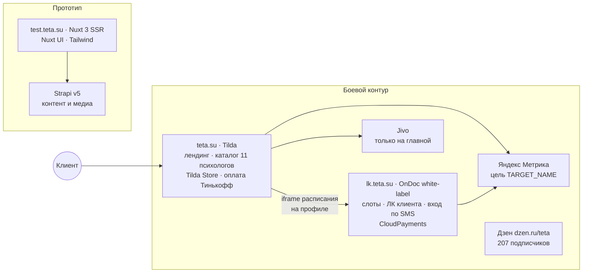
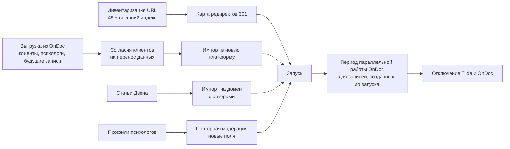

# Аудит текущих сайтов ТЕТА: teta.su и test.teta.su

> Версия 1.0 · 11.09.2026 · Статус: черновик на утверждение
> Источник фактов: [research_teta_sites.md](../99_sources/research_teta_sites.md) (проверка 11.09.2026; сайты открывались через headless-браузер, формы не отправлялись, оплата и вход не выполнялись). Скриншоты: [teta_sites_screens/](../99_sources/teta_sites_screens/).
> Метки: **[Ф]** — факт; **[П]** — интерпретация.

---

## 0. Резюме

1. **Сейчас продукт ТЕТА — это две склеенные системы** [Ф]: лендинг и каталог на **Tilda** (корзина Tilda Store, оплата через Тинькофф) и личный кабинет с расписанием на white-label сервисе телемедицины **OnDoc** (lk.teta.su, оплата CloudPayments). Путь «оплатить в Tilda → выбрать время в OnDoc» разорван [П].
2. **Психологов в каталоге 11**, цены 3 000–6 000 ₽ (медиана 4 000 ₽); в sitemap 43 профиля, 32 из них архивные, но индексируются. 11.09.2026 свободные слоты были только у трёх психологов [Ф]. → Пул психологов к запуску — критический риск (RISK-05).
3. **Подбора нет** — ни анкеты, ни бота «Герман»; только фильтры каталога (21 запрос, цена, пол, возраст клиента) [Ф].
4. **Правила терапии жёстче рынка:** 100 % предоплата за 24 ч, при отмене позже «предоплата сгорает», напоминаний нет, сессии только с компьютера или планшета, общения между встречами нет, 18+ [Ф].
5. **Юридические ошибки:** в оферте указан ИНН АО «Тинькофф Банк», в политике и оферте разные ОГРНИП; нет чекбоксов согласия и cookie-баннера; «info@teta.su» открывает адрес на mail.ru; нет телефона [Ф] → Q-38.
6. **SEO слабое:** нет H1 на каталоге и профилях, шаблонная мета, нет микроразметки, цена «от 2200 ₽» в description, документы в попапах без URL, нет посадочных и блога на домене; статьи — в Дзене (207 подписчиков) без ссылок на сайт [Ф].
7. **test.teta.su — прототип новой витрины** на Nuxt 3 (SSR) + Nuxt UI/Tailwind + Strapi v5 [Ф/П]: главная, B2B с калькулятором и пакетами, сертификаты 5/10/15 тыс. ₽, «Для психологов», оболочка блога, FAQ из 17 вопросов. Транзакционного ядра (каталог, ЛК, оплата, видео) нет; только HTTP, заглушки, ошибки 404/500 [Ф] → Q-37, Q-39.
8. **Сильные активы, которые стоит сохранить:** логотип и фирменный фиолетовый, реальные профили психологов, 16 отзывов, список 17 кризисных служб, тексты «с чем поможет психолог», критерии отбора, наработки прототипа (B2B-калькулятор, сертификаты, FAQ), счётчик Метрики и Jivo.

---

## 1. Ландшафт систем «как есть»

| Система | Роль | Что хранит | Судьба при переходе на новую платформу |
|---|---|---|---|
| Tilda (teta.su) | Витрина, каталог, оплата | Страницы, профили, заказы Store | Заменяется; нужны редиректы 301 со всех URL (Q-36) |
| OnDoc (lk.teta.su) | Расписание, ЛК, оплата | Клиенты, психологи, записи, платежи | Заменяется; миграция клиентов и будущих записей с согласиями (Q-36) |
| Jivo | Чат поддержки | Диалоги | Сохраняется (аккаунт есть, бриф 7.3) |
| Яндекс Метрика | Аналитика | История визитов | Сохраняется счётчик; настраиваются цели и e-commerce |
| Дзен | Контент | 14+ статей | Канал сохраняется; статьи переносятся на домен, Дзен — через RSS (BR-CONTENT-06) |
| test.teta.su (Nuxt + Strapi) | Прототип витрины | Контент главной, B2B, сертификаты, FAQ | Наработки переиспользуются по решению Q-37 |

---

## 2. teta.su (боевой сайт)

### 2.1. Страницы
- **По sitemap 45 URL** [Ф]: главная, каталог `/psychologists`, 43 профиля в корне домена (`/{имя-фамилия}`), служебная 404.
- **Разделы в попапах без собственных URL** [Ф]: «Психологам», «Бизнесу», «Сертификат», «Правила терапии», оферта, соглашение, политика ПДн, «Оплата» (QR), «Кризисная помощь».
- **Внешние:** lk.teta.su, dzen.ru/teta, Instagram.

### 2.2. Главная — блоки [Ф]
1. Шапка: «Психологам», «Бизнесу», «Подарочный сертификат» (попапы), «Наш Дзен», «Личный кабинет» — пункта «Психологи» или «Подобрать» нет.
2. Hero: онлайн-консультации с психологом; «печатающаяся» строка запросов (сложные отношения, саморазвитие и карьера, неуверенность, тревожность, выгорание); подзаголовок «сервис создан психологами»; CTA → каталог.
3. Отбор психологов: профильное образование, супервизии и личная терапия, наставники, этика.
4. «С чем поможет психолог»: развитие, трудности в отношениях, сложные ситуации, эмоции (блок продублирован вёрсткой).
5. 16 анонимных отзывов (упоминают психологов, которых уже нет).
6. «76 % клиентов становится лучше после первой консультации» — без источника.
7. Футер: почта, Instagram, попапы документов и кризисной помощи, «Made on Tilda».

### 2.3. Психологи и цены [Ф]

| Цена, ₽ | Психологи в каталоге |
|---|---|
| 3 000 | 2 |
| 3 500 | 1 |
| 4 000 | 4 |
| 4 500 | 1 |
| 5 000 | 1 |
| 5 200 | 1 |
| 6 000 | 1 |

- **Карточка каталога:** фото, имя, 1–2 предложения о подходе, цена, иногда «Индивидуальная / Парная», «Записаться».
- **Фильтры:** 21 запрос, цена 3 000–6 000, пол психолога, возраст клиента (18–29 / 30–45 / 45+), поиск. Служебные строки Tilda не переведены (Filters, Load more, Out of stock).
- **Профиль:** цена, «Оплатить», образование, опыт одной из трёх градаций (< 1 года / 1–3 года / > 3 лет), возраст клиентов, запросы, iframe расписания OnDoc (`consultationType=visit`, хотя запись видео).
- **Нет:** длительности сессии, метода отдельным полем, видео, отзывов о психологе, документов.
- **Ядро команды** — аналитическая (юнгианская) школа (5 из 11) [П].

### 2.4. Путь записи [Ф]
1. Каталог → профиль → «Оплатить».
2. Корзина Tilda: имя, возраст, «Откуда вы?», email, телефон, промокод — **без чекбокса согласия на ПДн**.
3. Оплата через Тинькофф.
4. Выбор слота в виджете OnDoc на странице профиля.
5. SMS-подтверждение.

Альтернативный путь — lk.teta.su: список ближайших слотов → вход по телефону и SMS-коду → запись (дальше не проверялось).

### 2.5. Правила терапии [Ф]
- 100 % предоплата не позднее чем за 24 ч.
- Отмена или перенос позже 24 ч — «предоплата сгорает»; опоздание сокращает сессию.
- Напоминаний нет.
- Подключение только с компьютера или планшета.
- Общение с психологом между встречами не предусмотрено.
- Только 18+.

> **Сравнение с новой платформой:** принцип «без общения между встречами» сохраняется (ТЗ); подключение с компьютера сохраняется в MVP (Q-01); правило «предоплата сгорает» заменяется прозрачной и юридически выверенной политикой (Q-33); добавляются напоминания (07_notifications.md) и списание за 12 ч по привязанной карте (ТЗ).

### 2.6. Бренд [Ф]
- Основной цвет на сайтах — **#6A5DAB** (в фирстиле PDF — #6D5CB0; разница минимальна, но нужен один токен в дизайн-системе); дополнительно встречаются #A863E9, #04BAC6, #FFD3D3 — палитра несистемная.
- Шрифты — Roboto и TildaSans (в фирстиле — Staatliches и Alata, в прототипе — Raleway).
- Название пишется то «ТЕТА», то «TETA».
- Фото: стоковое hero, портреты психологов разного качества; фавикон — картинка из WhatsApp.

### 2.7. Технологии и аналитика [Ф]
- Tilda: Zero Block, Store, корзина, jQuery 1.10.2.
- Яндекс Метрика (цель названа `TARGET_NAME` — конверсии не размечены) · Jivo только на главной · Google Fonts.
- Не найдено: CloudKassir и DashaMail на сайте (CloudPayments — только в ЛК OnDoc), GA/GTM, пиксели, мессенджеры.

### 2.8. Юридическое [Ф]
- Исполнитель — ИП; в политике и оферте **разные ОГРНИП**; **ИНН в оферте совпадает с ИНН АО «Тинькофф Банк»** [П: ошибка].
- Документы в попапах, без дат редакций и отдельных URL.
- Нет чекбоксов согласия и cookie-баннера; политика допускает трансграничную передачу и рассылки.
- Есть 18+ и список кризисных служб; нет явной фразы «не медицинская и не экстренная помощь, при угрозе жизни — 112».
- [П, юрист] Сбор тем вроде «депрессия» при заявлении «спецкатегории не обрабатываются»; пункты оферты «предоплата сгорает» и «споры по месту исполнителя» — риск по ЗоЗПП.

### 2.9. SEO [Ф]

| Страница | Title | Description | H1 |
|---|---|---|---|
| / | «Портал психологической помощи "ТЕТА"» | «от 2200 р.…» (устарело), keywords | Есть |
| /psychologists | «Психологи» | «Каталог психологов» | Нет |
| Профили | «Имя Фамилия» | «Психолог Имя Фамилия» | Нет |

Нет schema.org, `lang`, alt у изображений; 32 архивных профиля в индексе; тексты попапов дублируются в DOM каждой страницы; посадочных под запросы и блога на домене нет.

---

## 3. lk.teta.su (OnDoc)

| Аспект | Наблюдение [Ф] |
|---|---|
| Платформа | White-label OnDoc (сервис для клиник): CNAME на ondoc.me, SPA + PWA, Метрика, CloudPayments Checkout |
| Без входа | Список психологов со слотами, профили, справка «как проходит консультация», FAQ о возвратах |
| Вход | Только телефон и SMS-код |
| Лексика | Медицинская: «врач», «пациенты», «клиника», «рецепт», «медицинские документы» |
| Возраст | 16+ (в правилах ТЕТА — 18+) |
| Функции из справки | Документы в чат, рекомендации специалиста в чате, отзыв и рейтинг — **противоречат** принципам ТЕТА (без переписки, без рейтингов) |

**[П] Вывод:** медицинская терминология и чат с психологом в текущем ЛК не соответствуют ни ТЗ, ни юридической позиции немедицинских услуг (Q-26) — ещё один аргумент за замену OnDoc.

---

## 4. test.teta.su (прототип)

### 4.1. Страницы [Ф]

| URL | Статус | Содержание |
|---|---|---|
| `/` | 200 | Главная из CMS: hero, «с чем поможет», удобство («1 из 20», честность, доступная цена), специалисты (пусто), 3 шага, этика, отзывы, FAQ 17 вопросов, материалы (пусто, API 500), подписка «−30 % на первую сессию» |
| `/b2b` | 200 | Цифры без источников, калькулятор, пакеты, форма заявки |
| `/certificate` | 200 | Сертификаты 5 / 10 / 15 тыс. ₽, механика через промокод |
| `/forpsy` | 200 | Преимущества (база знаний, супервизии, аналитика по клиентам, ЛК с расписанием, интервизии), требования, анкета |
| `/blog` | 200 | Оболочка: поиск, категории, пусто |
| `/documents` | 200 | Только оферта (с той же ошибкой ИНН) |
| `/about`, `/articles`, `/faq`, `/helps`, `/psychologists` | 404 | Ссылки есть в футере |

### 4.2. Продуктовые решения, зафиксированные в контенте прототипа [Ф как контент; П как намерение]

| Решение в прототипе | Соответствие ТЗ и документации | Рекомендация |
|---|---|---|
| Анкета → подбор алгоритмом или вручную → сессия | Соответствует ТЗ п. 4 | Принято (WIZ) |
| Напоминания за 23 ч и за 2 ч | В документации 24 ч и 1 ч (параметр) | Значения — параметр ADM-11; выбрать на пилоте |
| Оплата списывается за 24 ч | ТЗ: за 12 ч | Следовать ТЗ (BR-PAY-04); холд за 24 ч — опция BR-PAY-10 |
| Возврат на баланс ЛК с выводом на карту | Не описано в ТЗ | Не рекомендуется в MVP: возврат на карту проще для 54-ФЗ и 376-ФЗ (Q-39) |
| −30 % на первую сессию за подписку на рассылку | Промокоды есть в брифе | Возможно как промокод; условие «за подписку» — осторожно: согласие на рекламу должно быть добровольным (ЗоЗПП ст. 16) |
| Сертификаты 5 / 10 / 15 тыс. ₽ | Бриф не упоминает | R2 (Q-16) |
| B2B: уровни «начинающий / практикующий / опытный», пакеты «Базовый / Стандарт / Премиум», опции «аналитика, вебинары, координатор» | Бриф 3.2, ТЗ п. 10 | Уровни — ответ на Q-04; пакеты — в B2B R2 |
| Для психологов: база знаний, супервизии, аналитика, расписание, интервизии | ТЗ п. 5 | Соответствует (PRO) |
| Этика: уважение, конфиденциальность, доказательные методы, завершение терапии | ДНК | Соответствует |

### 4.3. Технологии и дефекты [Ф]
- **Стек:** Nuxt 3 (SSR, Vite), Nuxt UI + Tailwind, @nuxt/image (WebP), Strapi v5 (признаки), медиа в S3-совместимом хранилище; хостинг — АО «ИОТ».
- **Дефекты:** только HTTP; IP бэкенда в публичном конфиге; сайт открыт для индексации (риск дубля); 404 в футере; API статей — 500; кнопки CTA без действий; «рыба» в отзывах и формах («Какой то отзыв», «Гештальд»); невалидные типы полей; цифры без источников (10K+ клиентов, 70+ психологов) — риск по закону о рекламе; дефолтный зелёный primary Nuxt UI; нет аналитики, мета-описаний, политики ПДн.

---

## 5. Сравнение «как есть» и «будет»

| Область | teta.su + OnDoc | test.teta.su | Новая платформа |
|---|---|---|---|
| Архитектура | Tilda + OnDoc + Jivo | Nuxt + Strapi, без ядра | Единое ядро и API ([product_architecture.md](../06_architecture/product_architecture.md)) |
| Подбор | Фильтры каталога | Описан | Анкета + Герман + причины рекомендации (WIZ) |
| Запись и оплата | Предоплата в Tilda, слот в OnDoc | Нет | Слот → согласия → привязка карты → списание за 12 ч (WIZ-06, BR-PAY) |
| Напоминания | Нет | Описаны | Email 24 ч / 1 ч (07_notifications.md) |
| Кабинет клиента | OnDoc, медицинская лексика, чат | Нет | CL: сессии, дневник, рекомендации, платежи |
| Кабинет психолога | Клиник-панель OnDoc | Описан | PRO: расписание, клиенты, заметки, итоги, выплаты, статьи, база знаний |
| Админка | Tilda + OnDoc раздельно | Strapi (контент) | ADM: единая |
| B2B | Попап и email | Калькулятор и форма | ADM-08 (MVP), HR-кабинет (R2) |
| Сертификаты | «На любую сумму» по email | 5/10/15 тыс. ₽ | R2 |
| Контент | Дзен | Пустой блог | Статьи психологов на домене + RSS в Дзен |
| SEO | Слабое | SSR без мета | 13 кластеров, микроразметка, редиректы |
| Право | Ошибки реквизитов, нет согласий | Только оферта | Пакет документов и согласий (06_legal_compliance.md) |
| Кризисная помощь | Попап, 17 служб | 404 | SITE-15 + кризисный протокол |

---

## 6. Что сохранить и перенести

| Актив | Источник | Как использовать | Условие |
|---|---|---|---|
| Логотип SVG «Θ │ TETA» | teta.su | Дизайн-система | — |
| Фирменный фиолетовый | #6A5DAB (сайт) / #6D5CB0 (PDF) | Один токен primary | Решение дизайнера |
| Профили 11 активных психологов | teta.su, OnDoc | Импорт в PSY с повторной модерацией и заполнением новых полей | Согласие психологов, актуализация |
| 16 отзывов | teta.su | SITE-13 | Только с подтверждением авторства и согласием; иначе не переносить |
| Список 17 кризисных служб | Попап teta.su | SITE-15 | Проверить актуальность номеров |
| Критерии отбора психологов | teta.su, test.teta.su | SITE-11, SITE-12, ADM-03a | Сверить с ДНК «1 из 20» |
| Статьи Дзена | dzen.ru/teta | Импорт на домен (ADM-10) | Авторство, права |
| FAQ 17 вопросов, B2B-калькулятор, тексты сертификатов | test.teta.su | SITE-14, SITE-10, SITE-20 | Сверка с бизнес-правилами (Q-39) |
| Счётчик Метрики, виджет Jivo | teta.su | Интеграции | — |
| Клиенты и будущие записи | OnDoc | Миграция | Согласия клиентов, выгрузка из OnDoc (Q-36) |

## 7. Что исправить при переходе

| № | Проблема | Действие | Связи |
|---|---|---|---|
| 1 | Ошибки реквизитов исполнителя | Сверить с ЕГРИП/ЕГРЮЛ до подготовки документов | Q-38 |
| 2 | Нет согласий и cookie-баннера | Пакет согласий и баннер | BR-ACC-09, X-02 |
| 3 | Архивные профили в индексе | 301-редирект на похожих психологов или страницу «специалист не принимает» | Q-36, RISK-12 |
| 4 | Цифры без источников («76 %», «10K+», «70+») | Использовать только подтверждаемые цифры | 38-ФЗ |
| 5 | Медицинская лексика в ЛК | Словарь запрещённых слов в интерфейсе | 11_glossary.md, Q-26 |
| 6 | Разное написание названия | Единое «ТЕТА» в интерфейсе, «TETA» — только в логотипе | Дизайн-система |
| 7 | Цели Метрики не размечены | План событий и целей | 08_analytics_metrics.md |
| 8 | Прототип открыт для индексации и без HTTPS | Закрыть от индексации, HTTPS | До запуска |

## 8. План миграции (черновик)

Детали сроков — в [09_roadmap_releases.md](../04_project_docs/09_roadmap_releases.md).
