# Продуктовый анализ платформы «Ясно» (yasno.live)

> Версия 1.0 · 11.09.2026 · Статус: черновик на утверждение
> **Цель:** понять, как устроен продукт главного конкурента — функции, путь клиента, монетизация, сторона психологов, B2B, контент, доверие — и что из этого следует для новой платформы ТЕТА.
>
> **Источники и метки достоверности**
> - **[Скрин sNN]** — скриншоты заказчика, 11.09.2026 ([покадровый разбор](yasno_screens_teardown.md));
> - **[Сайт]** — публичные страницы и документы yasno.live и поддоменов, ≈ 75 страниц ([research_yasno_public_site.md](../99_sources/research_yasno_public_site.md));
> - **[Внешн.]** — сторы, отзывы, пресса, партнёрские программы ([research_yasno_external.md](../99_sources/research_yasno_external.md));
> - **[П]** — интерпретация аналитика.
>
> URL источников приведены в исследовательских отчётах; здесь — только выводы.

---

## Содержание

0. [Резюме](#0-резюме)
1. [Компания и рынок](#1-компания-и-рынок)
2. [Бизнес-модель и экономика](#2-бизнес-модель-и-экономика)
3. [Позиционирование](#3-позиционирование)
4. [Информационная архитектура](#4-информационная-архитектура)
5. [Путь клиента (CJM)](#5-путь-клиента-cjm)
6. [Подбор психолога](#6-подбор-психолога)
7. [Каталог и карточка психолога](#7-каталог-и-карточка-психолога)
8. [Запись, оплата, отмена](#8-запись-оплата-отмена)
9. [Личный кабинет клиента](#9-личный-кабинет-клиента)
10. [Видеосвязь](#10-видеосвязь)
11. [Удержание и рост](#11-удержание-и-рост)
12. [Контент и SEO](#12-контент-и-seo)
13. [Мобильные приложения](#13-мобильные-приложения)
14. [B2B](#14-b2b-ясно-для-бизнеса)
15. [Сторона психолога](#15-сторона-психолога)
16. [Поддержка, кризис, этика](#16-поддержка-кризис-этика)
17. [Доверие, право, данные](#17-доверие-право-данные)
18. [UX и визуальный язык](#18-ux-и-визуальный-язык)
19. [Голос клиентов](#19-голос-клиентов)
20. [Другие игроки рынка](#20-другие-игроки-рынка)
21. [SWOT](#21-swot-ясно)
22. [Реестр функций и решения для ТЕТА](#22-реестр-функций-и-решения-для-тета)
23. [Стратегия дифференциации ТЕТА](#23-стратегия-дифференциации-тета)

---

## 0. Резюме

1. **«Ясно» — лидер рынка онлайн-психологии в РФ** (≈ 35 % рынка по собственной оценке): выручка ≈ 1,1 млрд ₽ в 2024 и 2025 гг., 4 100–4 800 психологов, 330–430 тыс. клиентов. Но в 2025 г. выручка −2,1 %, прибыль −89 %; с 14.11.2025 компания принадлежит новому владельцу. Рынок перешёл от роста к стагнации. [Внешн.]
2. **Продукт — «маркетплейс видеосессий с сильным подбором»**: анкета → алгоритм → карточка с видеовизиткой → слот → привязка карты → видеосессия. Самый проработанный элемент — подбор (публичный алгоритм, фильтры по времени, AI-поиск, живой ассистент). [Сайт, Скрин]
3. **Сопровождения между сессиями нет**: ни дневника, ни трекера, ни заданий, ни AI-компаньона. Есть только текстовый чат с психологом для организационных вопросов. Клиенты в отзывах сами просят «статистику про себя». [Сайт, Внешн.] → **Уникальные функции ТЕТА из ТЗ (дневник эмоций, рекомендации) закрывают реальный пробел лидера.**
4. **Монетизация — уровневая цена** 3 150 / 4 490 / 5 490 ₽ и премиум «Select» 13 490 ₽; психолог на старте получает ≈ 2 000 ₽ за сессию; комиссия по оценкам 30–55 % в зависимости от грейда. Выдача «Рекомендованные» поднимает дорогие грейды. [Сайт, Внешн., П]
5. **Главные боли клиентов:** разброс качества психологов, жёсткое правило 12 часов с автосписанием, цена при неочевидном результате, поддержка. Кнопка отмены в приложении появилась только в марте 2026. [Внешн.]
6. **Привлечение дорогое:** блогеры с промокодом −20 % на 3 сессии и CPA-партнёрка до 31 % от первого заказа. Контентная машина — медиа slozhno.live (≈ 100 тестов), Telegram 111 тыс., 74 SEO-посадочные. [Сайт, Внешн.]
7. **Сторона психологов — сильная сторона Ясно:** отбор 9 %, 500+ часов метода, 3+ года практики, 10 бесплатных супервизионных групп в неделю, кураторы, академия. Критика — высокая комиссия и единый прайс. [Сайт, Внешн.]
8. **B2B — зрелый контур:** 300+ компаний, софинансирование, лимиты, постоплата, HR-кабинет, стоп-лист уволенных, корпоративные вебинары, ДМС-коды. **Слабое место — приватность:** по согласию на ПДн работодателю передаются email сотрудника и число его сессий. [Сайт]
9. **Правовая модель:** Ясно — аккредитованная IT-компания и лицензиар ПО, психологам — платёжный агент; утверждает, что сведения о здоровье не обрабатывает; публикует алгоритм рекомендаций. [Сайт]
10. **Вывод для ТЕТА:** соревноваться с Ясно масштабом бессмысленно. Выигрышная позиция — **«куратор, а не маркетплейс»**: меньше, но отобраннее; сопровождение между сессиями без нарушения границ; честные условия оплаты и отмены; конфиденциальность, в том числе для корпоративных сотрудников; органическое привлечение через статьи психологов.

---

## 1. Компания и рынок

| Параметр | Значение | Источник |
|---|---|---|
| Юрлицо | ООО «Ясно.лайв», ИНН 9703044223; аккредитованная IT-компания; 3 записи в реестре российского ПО | [Сайт], [Скрин s15] |
| Запуск | Октябрь 2017; основатели Данила Антоновский и Андрей Зайцев-Зотов (сооснователь Bookmate) | [Внешн.] |
| Собственник | С 14.11.2025 — АО «Новый интеллект» (фонд «Стелла»); прежние совладельцы вышли | [Внешн.] |
| Выручка | 2024 — 1,13 млрд ₽ (прибыль 142 млн ₽); 2025 — ≈ 1,1 млрд ₽ (прибыль 16,5 млн ₽, −89 %) | [Внешн.] |
| Масштаб | 4 100–4 800 психологов; 330–430 тыс. клиентов; 3,7–4,9 млн сессий (цифры на разных ресурсах расходятся) | [Сайт], [Внешн.] |
| Команда | 100–499 сотрудников; 110+ по данным вакансий | [Внешн.], [Сайт] |
| Доля рынка | ≈ 35 % онлайн-психотерапии (заявление сервиса) | [Внешн.] |
| География | РФ + клиенты за рубежом (иностранные карты); партнёр в Беларуси | [Сайт], [Скрин s15] |

**Рынок (2025–2026):** коммерческий рынок ментального здоровья 20,5 млрд ₽ (2024); онлайн-сегмент насытился, спрос снижается, средний чек растёт. Выручка конкурентов в 2025 г.: Zigmund 391 млн ₽ (−4,8 %), Alter 385 млн ₽ (−11,5 %), «Мета» 52 млн ₽ (−35 %). Растут корпоративные программы, групповые форматы, AI-поддержка. [Внешн.]

**[П] Что это значит:** рынок перешёл в фазу борьбы за удержание и качество, а не за охват. Новому игроку выгоднее конкурировать удержанием, доверием и органикой, чем закупкой трафика.

---

## 2. Бизнес-модель и экономика

### 2.1. Как устроены деньги
- **Юридически:** Ясно — лицензиар ПО (пользователю — бесплатная лицензия) и **платёжный агент психолога**; клиент оплачивает сессию психологу через Ясно. [Сайт: оферта, /fees]
- **Вознаграждение Ясно** = цена сессии − фиксированная сумма перевода психологу, видимая в его кабинете. [Сайт]
- **Выплаты психологам:** еженедельно, через сервис для работы с самозанятыми (Консоль.PRO, данные 2022 г.). [Внешн.]

### 2.2. Цены

| Продукт | Цена | Условие / что обещано | Источник |
|---|---|---|---|
| Индивидуальная сессия, 50 мин — грейд 1 | 3 150 ₽ | Опыт от 3 лет, собеседование, подтверждённое образование, рекомендация | [Сайт], [Скрин s12] |
| Грейд 2 | 4 490 ₽ | Опыт от 4 лет, 200+ сессий в Ясно | [Сайт], [Скрин s06] |
| Грейд 3 | 5 490 ₽ | Опыт от 6 лет, высокий уровень положительной динамики | [Сайт] |
| «Select» — ведущие психологи | 13 490 ₽ | Опыт от 10 лет, члены ассоциаций, преподаватели, супервизоры; запись через ассистента | [Сайт] |
| Легаси-цены | 4 150 / 5 150 ₽ | На странице описания ПО | [Сайт] |
| Парная сессия, 90 мин | от 4 850 ₽ | — | [Сайт], [Скрин s37] |
| Подарочные сертификаты | 1 / 3 / 5 / 10 сессий = N × цена грейда | Без скидки за объём; «5 сессий — выбор 53 % клиентов» | [Сайт] |
| Абонемент | Предоплаченный баланс сессий | Срок 1 год, возврат остатка | [Сайт] |
| Супервизии для психологов | 5 950–7 950 ₽ | 50 мин | [Сайт] |
| Курсы для клиентов | 1 250–3 950 ₽ | Telegram-курсы, записи вебинаров | [Сайт] |
| Академия для психологов | КПТ — 30 000 ₽ | С удостоверением о повышении квалификации | [Сайт] |

### 2.3. Экономика психолога и комиссия
- Психолог на старте получает **≈ 2 000 ₽ за сессию**; по rb.ru — 1 880–3 500 ₽ в зависимости от опыта. [Сайт], [Внешн.]
- Оценки комиссии: 30–40 % (внешние обзоры); при выплате ≈ 2 000 ₽ и цене 4 490 ₽ — до 55 % [П].
- Для сравнения: Alter 13–15 %, «Приём» 25 %, Zigmund прогрессивно 50–60 % → 30 % → 15 %, b17 0 %. [Внешн.]
- **[П]** Каталог в режиме «Рекомендованные» показывает в основном грейды 5 490 и 4 490 ₽ (15 и 8 из 24 карточек первой страницы; 3 150 ₽ — одна). Обещание «от 3 150 ₽» на практике встречается редко.

### 2.4. Источники выручки

| Поток | Роль | Оценка |
|---|---|---|
| Комиссия с B2C-сессий | Основной | Ядро выручки |
| B2B-программы | Второй контур | 300+ компаний |
| Сертификаты и абонементы | Предоплата, подарочный спрос | С 12.2025 в приложении |
| Курсы и группы для клиентов | Дополнительный, воронка к сессиям | Небольшой [П] |
| Академия, супервизии, конференции для психологов | Монетизация предложения и удержание психологов | Небольшой [П] |

### 2.5. Привлечение
- **Блогеры** — основной канал: бриф для блогеров, промокод −20 % на первые 3 сессии, запрет на медицинскую лексику. [Сайт], [Внешн.]
- **CPA-партнёрка** (Pampadu) — от 31 % с оплаченного заказа нового клиента. [Внешн.]
- **Контент:** медиа slozhno.live, блог, ≈ 100 тестов, Telegram «Ок, ясно» 111 тыс., Дзен, VK, YouTube. [Сайт], [Внешн.]
- **Performance:** реклама в Яндекс с промокодом TRY (s12), AppsFlyer для атрибуции приложений. [Скрин s12], [Внешн.]
- **Спецпроекты и PR-исследования:** кампании в AdIndex, опросы о замене терапии нейросетями. [Внешн.]

**[П] Вывод:** юнит-экономика Ясно давит на маржу: дорогое привлечение (до 31 % первого чека партнёру + скидка 20 % на 3 сессии) при стагнирующем спросе. Отсюда падение прибыли и фокус релизов 2025–2026 на монетизации (промокоды, сертификаты, изменения в оплате).

---

## 3. Позиционирование

| Элемент | Как у Ясно | Источник |
|---|---|---|
| Главное обещание | «Консультации с психологом онлайн: повысить качество жизни / справиться со стрессом / наладить отношения…» | [Сайт] |
| УТП | Строгий отбор (9 %) · «сервис, созданный психологами» · поддержка с психологическим образованием 24/7 · от 3 150 ₽ · ручной и автоматический подбор · оплата из любой страны · защищённый видеочат | [Сайт] |
| Социальные доказательства | 430 000+ клиентов · 4 800 специалистов · 9 лет средний опыт · «81 % чувствуют результат после 5-й сессии» · истории знаменитостей · логотипы СМИ | [Сайт] |
| Тон | Тёплый, разговорный, с иронией и игрой слов («Ок, ясно», «Теперь Ясно», «Ясно, смотреть!»); без медицинской лексики | [Скрин s06–s16], [Сайт] |
| Визуал | Светлый минимализм, голубой акцент, линейные иллюстрации | [Скрин] |
| Самоописание в письмах | «Сервис видеоконсультаций с психологом» | [Скрин s12] |

**Сравнение с ДНК ТЕТА:** ТЕТА прямо противопоставляет себя «массовому набору (3000+ психологов, жалобы на качество)» и «коммерческому подходу». Ясно, в свою очередь, делает ставку на цифры масштаба. Позиции не пересекаются — это хорошо для ТЕТА. Тональность ТЕТА по ДНК — «профессиональная, но тёплая, без пафоса, с доказательной базой»: без иронии Ясно, спокойнее и бережнее.

---

## 4. Информационная архитектура

### 4.1. Масштаб
По sitemap — **5 008 URL**: 4 741 карточка психолога, 74 SEO-посадочные каталога, 136 статей старого блога, 41 страница супервизоров, ≈ 16 служебных. Страниц городов и английской версии нет. [Сайт]

### 4.2. Структура

```mermaid
flowchart TB
  Y["yasno.live"]
  Y --> T["Терапия (мега-меню)"]
  T --> T1["Подбор: сам за 3 шага / ассистент"]
  T --> T2["Каталог /therapists + 74 посадочные /collections"]
  T --> T3["AI-поиск /ai-search"]
  T --> T4["Форматы: для себя · для двоих · для ребёнка · группы"]
  T --> T5["Сертификаты /gifts · отзывы /reviews"]
  Y --> J["Журнал"]
  J --> J1["Блог /blog (легаси)"]
  J --> J2["Тесты /tests"]
  J --> J3["Курсы courses.yasno.live"]
  J --> J4["Медиа slozhno.live"]
  Y --> P["Для психологов"]
  P --> P1["Вакансия work.yasno.live/psychologist"]
  P --> P2["Анкета /candidates"]
  P --> P3["Супервизоры /supervisors"]
  P --> P4["Академия academy.yasno.live"]
  Y --> B["Для бизнеса business.yasno.live"]
  B --> B1["Онбординг сотрудников onboarding.yasno.live"]
  B --> B2["Обучение yasno.education"]
  Y --> S["Сервисные"]
  S --> S1["FAQ · контакты · этический кодекс"]
  S --> S2["Бесплатная помощь /free-psychological-help"]
  S --> S3["Проверка оборудования /check"]
  S --> S4["Документы: оферта, ПДн, согласие, абонемент, сертификаты, алгоритм подбора, правила акций"]
  Y --> SEL["Select — ведущие психологи select.yasno.live"]
  Y --> PAR["Для родителей parents.yasno.live"]
```

### 4.3. Навигация
- **Шапка:** «Терапия», «Журнал Ясно», «Для психологов», «Для бизнеса», «Вход», CTA «Выбрать психолога». [Скрин s15], [Сайт]
- **Футер:** приложение (QR, сторы) · «О, ясно» · «Полезное» · «Ещё» (документы) · соцсети · реквизиты · cookie-баннер с упоминанием рекомендательных технологий. [Скрин s15]
- **Мастер записи** изолирован от навигации сайта (только логотип и меню). [Скрин s01]

**[П] Наблюдения:** контент разнесён на много доменов (блог, медиа, курсы, академия, B2B на Tilda) — это размывает SEO-вес и визуальную целостность. У ТЕТА с одним доменом и хабами по темам есть шанс собрать более связную структуру.

---

## 5. Путь клиента (CJM)

| Этап | Точки контакта | Что делает Ясно | Трения и боли (факты) | Возможность для ТЕТА |
|---|---|---|---|---|
| 1. Осознание проблемы | Блогеры, статьи, тесты, Telegram, реклама | Контент без медицинских слов; тесты с воронкой в промокод | Недоверие к рекламе у блогеров («слишком много рекламы») [Внешн.] | Экспертные статьи психологов ТЕТА с автором; посадочные по 13 темам; спокойный тон |
| 2. Выбор сервиса | Главная, отзывы, сторы | Цифры масштаба, знаменитости, «9 % отбор» | Рейтинги в сторах 4,8–4,9, но на irecommend 2,9 [Внешн.] | Раскрытый процесс отбора «1 из 20», этический кодекс, честные условия заранее |
| 3. Регистрация | Мастер «Профиль → Запрос → Психолог» | Email, псевдоним, возраст (веб) / телефон и SMS (по документам) | Предотмеченное согласие на рассылки [Скрин s01] | Раздельные согласия без предотметки; подпись согласия на данные о здоровье |
| 4. Подбор | Анкета, алгоритм, фильтры времени, AI-поиск, ассистент | Один рекомендованный психолог на экране, индекс соответствия, видеовизитка | «Алгоритм предлагал не тот метод» (2023) [Внешн.] | Текстовые причины рекомендации; AI-помощник Герман для формулировки запроса |
| 5. Выбор психолога | Карточка | Цена с объяснением грейда, методы с пояснениями, образование, расписание | Нет отзывов в карточке; сомнения в заявленном опыте [Сайт], [Внешн.] | Модерируемые отзывы на странице психолога; отметка «документы проверены» |
| 6. Запись и оплата | /signup/card → ЮKassa | Привязка карты платежом 2 ₽, согласие на автосписания, промокод | Правило списания спрятано в FAQ | Точное время списания и правила отмены на экране записи |
| 7. Ожидание сессии | Кабинет, письма | Экран ближайшей сессии, «Подключиться» за 5 мин, «Добавить в календарь», напоминания 24 ч и 1 ч | Автосписание без уведомления, отмена записей без уведомления [Внешн.] | Уведомление о списании, статус оплаты в кабинете |
| 8. Сессия | Видеокомната P2P | Камера обязательна; сессии не записываются; проверка оборудования | Технические сбои, опоздания психологов без компенсации [Внешн.] | Бесплатный перенос или возврат при технической проблеме; журнал подключений |
| 9. После сессии | Кабинет | Приватная оценка; «Сессия завершилась → Запланировать» | Ничего для работы между сессиями | Рекомендации и задания психолога; дневник эмоций |
| 10. Повторные сессии | Кабинет, чат с психологом | Перенос в 1 экран; чат при отсутствии слотов | Жёсткое правило 12 ч, «деньги сгорели в форс-мажор» [Внешн.] | Мягкая политика (Q-33); структурированный запрос времени |
| 11. Смена психолога / уход | Настройки, поддержка | Замена без ограничений; удержание при отмене | «Этическая комиссия не помогла» [Внешн.] | Бережная смена с сохранением дневника по согласию; прозрачный разбор жалоб |

---

## 6. Подбор психолога

### 6.1. Входы в подбор

| Вход | Как работает | Источник |
|---|---|---|
| «Самостоятельно, за 3 шага» | Мастер «Профиль → Запрос → Психолог» | [Скрин s01], [Сайт] |
| «С помощью ассистента с психологическим образованием» | Переход в чат поддержки, Telegram или WhatsApp; живой подбор | [Сайт] |
| Каталог | 55 страниц, фильтры, сортировка «Рекомендованные» | [Сайт] |
| AI-поиск | Запрос на естественном языке («КПТ, тревожность, утром») → число совпадений | [Сайт] |
| Select | Ассистент подбирает ведущих психологов | [Сайт] |

### 6.2. Что спрашивают
- **Шаг «Профиль» (веб):** email, имя или псевдоним, возраст. [Скрин s01]
- **Шаг «Запрос»:** темы из справочника с иллюстрациями («Моё состояние», «Отношения»…), затем удобное время. На скриншотах шаг не зафиксирован; в приложении — выбор нескольких карточек тем. [Внешн.: скриншоты сторов]
- **Что собирается по согласию на ПДн:** имя/псевдоним, возраст, телефон, email, интересующие темы, часовой пояс, страна; для «наиболее точного подбора» — город, **взгляды и ценности**, интересы, семейный статус. [Сайт]
- **Что видит психолог из анкеты:** возраст, количество сессий, часовой пояс, опыт терапии. [Сайт: fees.pdf]

### 6.3. Таксономия запросов
- **Взрослые:** «Моё состояние» (стресс, упадок сил, самооценка, тревога, перепады настроения, раздражительность, одиночество, СДВГ и др.) · «Отношения» (с партнёром, окружающими, родителями, детьми, сексуальные, ориентация) · «Работа и учёба» (мотивация, выгорание, «не знаю, чем хочу заниматься», прокрастинация, смена работы) · «События» (переезд и эмиграция, беременность, разрыв, финансовые изменения, утрата, болезнь, насилие). [Сайт]
- **Дети** (6 групп, вплоть до самоповреждения) и **пары** (созависимость, развод, измена и др.). [Сайт]

**Сравнение с ТЕТА:** 13 болей из брифа ТЕТА покрываются таксономией Ясно; у ТЕТА нет детского и парного направлений в брифе (парное — открытый вопрос Q-04). Двухуровневый справочник «группа → тема» Ясно — удачный паттерн для ТЕТА.

### 6.4. Алгоритм (публичный документ)
Ясно опубликовал PDF «Алгоритм подбора и ранжирования психологов» (требование закона о рекомендательных технологиях) [Сайт]:
1. **Контекст:** запрос и предпочтения клиента; слоты, специализация, подходы, опыт психолога.
2. **Базовая фильтрация:** специализация, слоты, пол, возраст, метод, время, стоимость, тип сессии.
3. **Оценка профиля:** глубина специализации, опыт с похожими запросами; **ниже медианы — отсекаются**.
4. **Качество практики:** «устойчивость терапевтического процесса» (удержание клиентов); новички получают стартовую оценку по собеседованию.
5. **Итоговый скоринг:** соответствие запросу · профиль · качество практики · доступность.
6. **Выдача** по убыванию.

В интерфейсе это «Показатель соответствия 9.9 из 10» с раскрытием четырёх факторов [Скрин s07]; в приложении — «5 из 5 тем» [Внешн.]. В B2B заявлена «точность подбора 95 % с первой сессии» [Сайт].

### 6.5. Фильтры каталога
Для кого (себя / пары / ребёнка) · симптомы и темы · **цена-грейд с пояснением** · возраст психолога · подход (13 методов) · опыт (5/7/10+ лет) · пол · **время: любое / ближайшее / конкретное (дни × часы)** · часовой пояс · «есть видеопрофиль» · «работает с подростками 16+» · «без доступного времени». Сортировка: «Рекомендованные». Фильтра по языку нет. [Сайт], [Скрин s18–s23]

### 6.6. Выводы по подбору

| Сильное у Ясно | Слабое у Ясно | Решение ТЕТА |
|---|---|---|
| Время — полноценный критерий подбора | Индекс соответствия выглядит как рейтинг | Время в анкете и фильтрах (WIZ-02a, SITE-02) |
| Публичный алгоритм — доверие и соответствие закону | Анкета видна только после регистрации по SMS (в приложении) | Причины рекомендации текстом (WIZ-03), публичные правила (SITE-17) |
| Отсечение слабых профилей, учёт удержания | Сортировка поднимает дорогие грейды | Качество практики как фактор (BR-MATCH-03) без скрытого приоритета цены |
| Живой ассистент как альтернатива | — | «Подберём вручную» (WIZ-03, ADM-12) и Герман (WIZ-02b) |
| AI-поиск на естественном языке | — | Герман решает ту же задачу через диалог |

---

## 7. Каталог и карточка психолога

### 7.1. Поля карточки

| Поле | Ясно | Источник | ТЕТА |
|---|---|---|---|
| Фото / **видеопрофиль** (ответы на стандартные вопросы) | ✔ | [Скрин s16], [Сайт] | ✔ SITE-03 |
| Имя, опыт в годах | ✔ | [Скрин s11] | ✔ |
| Цена и тип сессии, пояснение цены | ✔ | [Скрин s06] | ✔ (Q-04) |
| Ближайшая запись | ✔ | [Скрин s11] | ✔ |
| «О специалисте» | ✔ | [Скрин s11] | ✔ |
| Метод с пояснением | ✔ | [Скрин s08] | ✔ |
| Темы с иконками | ✔ | [Скрин s03] | ✔ |
| Образование (год, учреждение, программа) | ✔ | [Скрин s04] | ✔ + отметка «проверено» |
| Бейдж «Диплом проверен» | ✔ (в каталоге) | [Сайт] | ✔ |
| Расписание с часовым поясом | ✔ | [Скрин s09] | ✔ |
| **Отзывы о психологе** | ✘ (только общие отзывы о сервисе) | [Сайт] | ✔ после модерации (Бриф 8.4) |
| Статьи психолога | ✘ | [Сайт] | ✔ (ТЗ 6.4) |
| Супервизии и ассоциации | Только в тексте; в Select — «Регалии» | [Сайт] | ✔ отдельный блок |
| «С кем не работаю» | ✘ | — | ✔ [Рек.] |
| «Временно не принимает» + запрос времени через поддержку | ✔ | [Сайт] | ✔ структурированный запрос (BR-SCHED-06) |

### 7.2. SEO карточки
Title «{Имя} — {Метод 1} — {Метод 2} — Психолог – Ясно», JSON-LD **Product + Offer** (цена, наличие). Нет Person, Review, BreadcrumbList. [Сайт]

---

## 8. Запись, оплата, отмена

### 8.1. Поток записи (веб, по скриншотам)
Выбор слота → «Выбрать 16 сентября 21:00» → экран записи (способ оплаты «Карта РФ/МИР» или «Иностранная карта», сессия 50 мин, промокод, итог, FAQ) → «Добавить карту и записаться» → ЮKassa: проверочный платёж **2 ₽** с согласием на автосписания → «Успешно» → кабинет. [Скрин s17, s24–s28]

*[П] В коде сайта найдены маркеры Т-Банка как эквайера; на скриншотах привязка идёт через ЮKassa — возможно, разные провайдеры для разных сценариев.*

### 8.2. Правила оплаты

| Правило | Ясно | Источник |
|---|---|---|
| Способ | Только безналичная оплата картой (Visa, MasterCard, МИР); обязательна привязка карты и автоплатёж | [Сайт: оферта 6.7] |
| Момент списания | FAQ: холдирование за 24 ч, списание за 12 ч; оферта: списание за 24 ч или за 12 ч или при записи — **формулировки расходятся** | [Сайт], [Скрин s35] |
| Не удалось списать за 12 ч | Сессия автоматически отменяется | [Сайт] |
| Иностранные карты | Через партнёров, пересчёт в EUR/USD по курсу; внутренний баланс (с 07.2025); ПДн передаются на Кипр | [Сайт], [Внешн.] |
| Промо | Только для карт российских банков | [Сайт] |
| Цена включает | «НДС и прочие комиссии» | [Скрин s37] |

### 8.3. Отмена, перенос, опоздания

| Ситуация | Правило Ясно | Источник |
|---|---|---|
| Клиент отменяет или переносит < 12 ч, не приходит | Деньги не возвращаются: «фиксированная абонентская плата психолога»; FAQ: «Это не мы придумали, это Фрейд» | [Сайт] |
| Перенос > 12 ч | Кнопкой в кабинете при наличии слотов; иначе — чат с психологом | [Сайт], [Скрин s40] |
| Психолог отменил < 12 ч или сорвал сессию | На выбор клиента: возврат (оформление за 24 ч) или зачёт в следующую сессию | [Сайт] |
| Опоздание клиента | Время не продлевается | [Сайт] |
| Опоздание психолога | Сессия продлевается на время опоздания | [Сайт] |
| Клиент не включает камеру | Психолог может остановить сессию без возврата | [Сайт] |
| Замена психолога | Без ограничений по количеству, при отсутствии записи | [Сайт] |
| Бесплатная первая сессия, гарантия результата | Нет | [Сайт] |
| Кнопка отмены в приложении | Только с марта 2026 | [Внешн.] |

**[П] Выводы:** правило «12 часов без возврата» — одновременно ключевая защита выручки психолога и главный источник негатива; юридически оно в зоне риска по ст. 32 ЗоЗПП ([research_legal_integrations.md](../99_sources/research_legal_integrations.md), A5.3). Для ТЕТА — мягкая и прозрачная политика как элемент позиционирования (Q-33).

---

## 9. Личный кабинет клиента

| Раздел / функция | Как устроено у Ясно | Источник | ТЕТА |
|---|---|---|---|
| Главная | Экран одной ближайшей сессии: психолог, крупная дата, «Перенести или отменить», «Чат с терапевтом», «Подключиться» | [Скрин s29] | CL-02 + дневник и рекомендации |
| Карусель | Тесты · «Скидка 100 %: приглашайте друзей» · приложение (QR) | [Скрин s29–s32] | Бережнее: статьи, вебинары |
| Меню | Пригласить друга · Платежи · Настройки · Подарочные сертификаты · Оставить отзыв · Поддержка · Выйти | [Скрин s33] | CL-навигация |
| Перенос | Слоты психолога; «Нет времени? Написать психологу или отменить» | [Скрин s40] | CL-03a + структурированный запрос |
| Отмена | Удерживающий текст + «Написать в чат» как основная кнопка | [Скрин s43] | CL-03b без чата |
| Чат с терапевтом | Асинхронная переписка | [Скрин s41] | **Не делаем** (ТЗ) |
| Оценка работы с психологом | 6 эмодзи, «недоступно психологу», связь оценивается отдельно | [Скрин s34] | CL-11 |
| После сессии | «Сессия завершилась → Запланировать» | [Скрин s44] | CL-02 S5 + рекомендации |
| Платежи | Карта (изменить/удалить) · история со статусом и запланированной датой · промокод · прайс психолога | [Скрин s35–s38] | CL-07 + чеки |
| Пригласить друга | Персональный код YASNO-…, бесплатная сессия пригласившему, −15 % на 3 сессии другу | [Скрин s39] | CL-13 (R2) |
| Настройки | Переподбор специалиста, часовой пояс, удаление профиля | [Сайт: fees.pdf] | CL-08 |
| «Добавить в календарь» | Ссылка в футере кабинета | [Скрин s29] | CL-02 |
| Дневник, трекер, задания, заметки клиента | **Нет** | [Сайт], [Внешн.] | **CL-01, CL-05, CL-06 — отличие ТЕТА** |

---

## 10. Видеосвязь

| Параметр | Ясно | Источник |
|---|---|---|
| Технология | Собственная, P2P между браузерами/устройствами (по описанию — WebRTC) | [Сайт], [Внешн.] |
| Запись | Не записывается, «нет технической возможности увидеть или услышать»; клиенту запрещено записывать | [Сайт] |
| Проверка оборудования | Отдельная страница /check (камера, микрофон, звук, скорость) + доступ в комнату за 5 минут | [Сайт], [Скрин s42] |
| Требования | Chrome 79+, Firefox 74+, Safari 12+, Edge 84+, Яндекс Браузер 19+; от 6 Мбит/с | [Сайт] |
| Камера | Обязательна; аудио-формата и текстовой терапии нет | [Сайт] |
| Мобильные | Полноценно — через приложения iOS/Android | [Внешн.] |
| Жалобы | Проблемы подключения, приложение не открывается | [Внешн.] |

**Для ТЕТА:** P2P без записи — правильный ориентир доверия. В MVP видео только с компьютера (Бриф 4.4) — это слабее Ясно для мобильной аудитории; компенсировать качеством связи на десктопе, TURN и понятной заглушкой на телефоне (Q-01).

---

## 11. Удержание и рост

### 11.1. Механики удержания клиентов

| Механика | Ясно | Оценка для ТЕТА |
|---|---|---|
| Повторная запись в 2 клика после сессии | ✔ [Скрин s44–s45] | Взять + «то же время через неделю» |
| Напоминания 24 ч и 1 ч | ✔ [Сайт: отзыв] | Взять |
| Удержание при отмене (предложить перенос) | ✔ [Скрин s43] | Взять бережно |
| Приватная оценка → качество подбора | ✔ [Скрин s34] | Взять |
| Смена психолога без ограничений | ✔ [Сайт] | Взять |
| Сопровождение между сессиями | ✘ | **Дифференциатор ТЕТА** |
| Stories в приложении | ✔ с 08.2025 [Внешн.] | Не приоритет |
| Абонемент / пакеты | ✔ [Сайт] | R2 — рассмотреть после валидации цен |

### 11.2. Механики роста

| Механика | Детали | Решение для ТЕТА |
|---|---|---|
| Промокоды блогеров и партнёров | −20 % на первые 3 сессии; коды латиницей; маркировка erid | MVP: модуль промокодов; кампании — с ОРД |
| CPA-партнёрка | до 31 % первого заказа | Не приоритет: дорого |
| Реферальная программа | Бесплатная сессия пригласившему, −15 % на 3 сессии другу | R2, бережная подача |
| Подарочные сертификаты | 1/3/5/10 сессий, продажи через ретейлеров подарочных карт | R2 (в прототипе test.teta.su уже есть 5/10/15 тыс. ₽) |
| Контент-воронка | Медиа, тесты, Telegram 111 тыс., курсы → промокод | Статьи психологов + Дзен + посадочные (MVP), тесты (R2) |
| Сегментные лендинги | Родители, пары, бизнес, Select | Посадочные по 13 темам (MVP) |
| B2B | 300+ компаний | Базово MVP, кабинет HR — R2 |

---

## 12. Контент и SEO

| Актив | Ясно | Источник |
|---|---|---|
| Посадочные под запросы | 74 (проблемы, методы, аудитории, цена, специалисты); есть дубли по интенту; городских нет | [Сайт] |
| Карточки психологов | 4 741 URL, Product + Offer | [Сайт] |
| Блог на домене | 136 статей (легаси) с автором-психологом и просмотрами до 336 тыс. | [Сайт] |
| Медиа slozhno.live | Рубрики, авторы-психологи, нативные CTA с erid, рассылка «3 практики» | [Сайт] |
| Тесты | 23+ на yasno.live, ≈ 100 на slozhno.live; клинические шкалы и поп-психология; дисклеймер «не диагноз» | [Сайт] |
| Бесплатная помощь | Каталог кризисных линий по регионам и ситуациям + CTA на платную терапию | [Сайт] |
| Микроразметка | Organization, Product/Offer, Article; **нет** FAQPage, BreadcrumbList, Person, Review | [Сайт] |
| Мета-шаблоны | Цена в title посадочных («от 3150₽ за консультацию»); устаревшие цены в description | [Сайт] |

**Что взять ТЕТА:** хабы по темам с психологами и статьями; автор-психолог на статье; страница бесплатной помощи; тесты как воронка (R2).
**Где обойти:** FAQPage и BreadcrumbList на всех шаблонах; Person на карточке; единый домен вместо разнесения; без дублей посадочных; статьи психологов ТЕТА — ещё и инструмент продвижения психологов (ТЗ 6.4).

---

## 13. Мобильные приложения

| Стор | Рейтинг | Объём | Источник |
|---|---|---|---|
| App Store RU | 4,8 | 7 922 оценки | [Внешн.] |
| Google Play | 4,6–4,9 | 2,4 тыс. отзывов, 100 тыс.+ установок | [Сайт], [Внешн.] |
| RuStore | 4,9 | 256–267 оценок, 20 тыс.+ установок | [Внешн.] |

- **Функции:** регистрация, подбор по анкете, видеоконсультации, оплата, текстовый чат с психологом, push, чат поддержки, профиль, смена психолога через форму, часовой пояс, удаление профиля. Стек — Flutter. [Сайт]
- **Ключевые релизы 2025–2026:** оплата иностранными картами через внутренний баланс (07.2025) · рефералка и stories (08.2025) · промокоды (11.2025) · сертификаты (12.2025) · новая навигация (01.2026) · **отмена сессии из приложения** (03.2026) · фильтр «опыт 10+ лет» (04.2026) · вход через сторонние сервисы (07.2026) · **переработаны онбординг и подбор** (08.2026) · «изменения в системе оплаты» (08.2026). [Внешн.]
- **[П] Вывод:** дорожная карта сфокусирована на конверсии и монетизации, а не на терапевтической ценности между сессиями.
- **Данные:** в Google Play Data Safety — сбор списка установленных приложений, передача истории покупок для рекламы; в App Store — отслеживание. Для сервиса ментального здоровья это репутационно уязвимо. [Внешн.]

**Для ТЕТА:** нативные приложения — не MVP (ТЗ: PWA). Но оценка «приложение лёгкое и быстрое» — один из главных позитивов Ясно; PWA кабинета должен быть таким же быстрым.

---

## 14. B2B «Ясно для бизнеса»

| Элемент | Как устроено | Источник |
|---|---|---|
| Оффер | «Психологическая поддержка для эффективности вашей команды» | [Сайт] |
| Клиенты | 300+ компаний; HeadHunter, МТС, Яндекс, Avito, Skyeng и др. | [Сайт], [Внешн.] |
| Модели оплаты | Полная оплата или софинансирование; лимиты (1 в неделю, 3 в месяц); оплата только проведённых сессий (постоплата); ЭДО | [Сайт] |
| Подключение сотрудника | Промокод компании, привязанный к корпоративному домену; онбординг-страница | [Сайт] |
| HR-кабинет | Агрегированная статистика, ежедневные отчёты о вовлечённости, **стоп-лист уволенных**, аккаунт-менеджер | [Сайт] |
| Дополнительно | Чек-апы состояния, групповые вебинары и воркшопы (пакеты 4 и 8), англоязычные специалисты, материалы для анонса, калькулятор бюджета | [Сайт] |
| ДМС | Промокоды MEDSI в оферте | [Сайт] |
| **Приватность** | На лендинге — «агрегированная статистика»; в согласии на ПДн — **работодателю передаются email сотрудника и число проведённых сессий** по коду CORP | [Сайт] |

**Для ТЕТА:** модель «сотрудник регистрируется сам, компания платит ежемесячно» (Бриф 3.2) совпадает с рыночной практикой. Отличие ТЕТА — **строгая анонимность**: HR не видит ни факта подключения, ни числа сессий конкретного сотрудника (BR-B2B-05, HR-02). Это сильный аргумент в продаже компаниям, для которых важно доверие сотрудников.

---

## 15. Сторона психолога

### 15.1. Отбор и требования

| Требование | Ясно | ТЕТА (ДНК, сайт) |
|---|---|---|
| Образование | Высшее психологическое или медицинское (психиатрия) | Высшее психологическое или переподготовка (teta.su) |
| Обучение методу | От 500 часов в одном методе | Сертификация в методе (test.teta.su) |
| Практика | От 3 лет платной практики | От года (teta.su) |
| Супервизия, личная терапия | Обязательны | Обязательны (ДНК, teta.su) |
| Гражданство и статус | РФ, самозанятый или ИП | Самозанятый (ТЗ) |
| Этапы | Анкета → рассмотрение 3–4 недели → собеседование с куратором → договор | Заявка → собеседование (teta.su) |
| Доля прошедших | 9 % | 1 из 20 = 5 % (ДНК) |

### 15.2. Условия и сообщество
- **Доход:** ≈ 2 000 ₽ за сессию на старте; цену психолог выбирает из сетки сервиса; в среднем 10 клиентов на специалиста. [Сайт]
- **Грейды привязаны к показателям на платформе:** 200+ сессий, «положительная динамика». [Сайт]
- **Сообщество:** 10 бесплатных супервизионных групп в неделю, семинары приглашённых экспертов, 18 кураторов, книжные клубы, конференция, академия. [Сайт], [Внешн.]
- **Кабинет психолога:** «Мои сессии» (видео, анкета клиента, **заметки, недоступные даже администратору**), расписание, выплаты, статистика, клиенты, профиль, новости сообщества, помощь, чат с клиентом, озвучивание интерфейса для слабовидящих. [Сайт]
- **Этический кодекс:** компетентность, недискриминация, конфиденциальность, запрет двойных отношений, информированное согласие, предупреждение об изменении сеттинга за месяц, этический комитет. [Сайт]
- **Критика:** высокая комиссия и единый прайс отталкивают опытных; отдельные жалобы на поверхностное собеседование. [Внешн.]

**Для ТЕТА:** Ясно удерживает психологов сообществом и развитием, а не деньгами. ТЕТА может конкурировать за сильных психологов: (1) более справедливая доля и прозрачные уровни; (2) база знаний и материалы для рекомендаций (PRO-11); (3) продвижение через статьи и Дзен (PRO-10); (4) интервизия (R2); (5) карточка клиента с дневником — инструмент, которого у психологов Ясно нет.

---

## 16. Поддержка, кризис, этика

| Параметр | Ясно | Источник |
|---|---|---|
| Режим | 24/7 | [Сайт] |
| Каналы | Чат на сайте, email, Telegram-бот, WhatsApp; почты по направлениям | [Сайт] |
| Квалификация | «Только люди с психологическим образованием» | [Сайт] |
| Жалобы на психолога | Поддержка и этическая комиссия | [Сайт] |
| Кризисная помощь | Только контентная страница с телефонами доверия по регионам и ситуациям; **встроенной кризисной маршрутизации в продукте не обнаружено** | [Сайт] |
| Дисклеймеры | «Ни Ясно, ни психолог не оказывают медицинские услуги… не лечат депрессии, суицидальные мысли»; тесты «не диагноз» | [Сайт] |
| Возраст | Самостоятельно — с 16 лет; по оферте — 18+ или согласие законных представителей | [Сайт] |

**Для ТЕТА:** кризисный протокол в продукте (скрининг в анкете, детектор у Германа, кнопка у психолога, очередь инцидентов — BR-CRISIS) — ответственнее, чем у лидера, и соответствует архетипу «Опекун» из ДНК.

---

## 17. Доверие, право, данные

| Аспект | Ясно | [П] Оценка |
|---|---|---|
| Статус | IT-компания, лицензиар ПО, платёжный агент психологов | Снижает регуляторные риски медицинской деятельности |
| Сведения о здоровье | Политика: «не обрабатываются»; при этом собираются темы запросов, взгляды и ценности | Спорная позиция (research A1.1) |
| Локализация | Базы в РФ; трансграничная передача на Кипр для иностранных карт | — |
| Рекомендательные технологии | Опубликован алгоритм, упоминание в cookie-баннере | Хорошая практика |
| Согласие на рассылки | Предотмечено вместе с уведомлениями о сессиях | Анти-паттерн (38-ФЗ ст. 18) [Скрин s01] |
| Трекинг в приложении | Сбор списка установленных приложений, передача покупок для рекламы | Репутационный риск |
| B2B | Работодатель получает email и число сессий сотрудника | Расходится с обещанием «агрегированной статистики» |
| Конфиденциальность сессий | P2P, без записи, заметки психолога недоступны администраторам | Хорошая практика |
| Непоследовательность цифр | 330–430 тыс. клиентов, 4 100–4 800 психологов на разных ресурсах | Подрывает доверие к маркетинговым заявлениям |

---

## 18. UX и визуальный язык

**Сильные решения**
1. **Мастер записи без навигации сайта** с прогресс-баром и неблокирующим подтверждением email. [Скрин s01, s11]
2. **Модалки-объяснения** на каждое непонятное место: цена, соответствие, метод, видеопрофиль. Снимают тревогу «за что я плачу». [Скрин s06–s08, s16]
3. **Один психолог на экран** — снижает перегрузку выбором. [Скрин s11]
4. **Время как фильтр подбора**, выбор часового пояса с поиском по городам. [Скрин s18–s23]
5. **Кабинет-«экран следующей сессии»** — минимум когнитивной нагрузки. [Скрин s29]
6. **FAQ в месте принятия решения** (под формой записи, на рефералке). [Скрин s24, s39]

**Слабые решения**
1. Правила списания и отмены спрятаны в FAQ.
2. Предотмеченное согласие на рекламу.
3. Числовой индекс «9.9 из 10» без шкалы сравнения — выглядит как рейтинг.
4. SPA-артефакт: в разделе «Платежи» адрес `/signup/questions`. [Скрин s35]
5. Карусель с «Скидка 100 %» в кабинете — навязчиво для чувствительного контекста.
6. Ирония в микрокопирайте («Ок, ясно») уместна не для всех состояний клиента.

**Для ТЕТА:** взять структуру и паттерны объяснений; тон — спокойнее, без каламбуров; условия — на поверхности; допродажи — бережные.

---

## 19. Голос клиентов

### 19.1. Плюсы (по частоте)
1. Удобство онлайн-формата и времени.
2. Быстрый подбор и большой выбор; «нашла своего психолога и работаю годами».
3. Ощутимый результат: тревожность, бессонница, выгорание, отношения.
4. Лёгкое быстрое приложение.
5. Парные сессии помогли в браке.
6. Возможность сменить специалиста.

### 19.2. Минусы (по частоте)
1. **Разброс качества психологов:** молчит, только слушает, шаблонная работа, обсуждал свои проблемы, сомнения в опыте.
2. **Цена при неочевидном результате.**
3. **Правило 12 часов и автосписание:** деньги сгорели в экстренной ситуации; автосписание без уведомления; отмена записей без уведомления.
4. **Поддержка и компенсации:** формальные извинения, опоздание психолога без компенсации.
5. **Технические сбои** подключения и приложения.
6. **Слабый поиск в каталоге.**
7. **Недоверие к рекламе у блогеров.**
8. **Этика:** нарушение конфиденциальности отдельным психологом; этическая комиссия не помогла.

**Разрыв оценок:** 4,8–4,9 в сторах против 2,9 на irecommend. [Внешн.] *[П] Приложение, вероятно, просит оценку в удачный момент.*

### 19.3. Что это значит для ТЕТА
| Боль клиентов Ясно | Ответ ТЕТА | Где в документации |
|---|---|---|
| Качество психологов | Отбор 1 из 20, контроль качества (оценки, инциденты, удержание), отзывы в карточке | ADM-03, BR-REVIEW, BR-MATCH-03 |
| Правило 12 часов | Прозрачные и мягкие условия, время списания на экране записи | WIZ-06, BR-CANC, Q-33 |
| Автосписание без уведомления | Уведомления о предстоящем и совершённом списании | N-CL-06, N-CL-07 |
| Цена без понятного результата | Цели работы, дневник эмоций, рекомендации — видимый прогресс | CL-05, CL-06, PRO-04 |
| Поддержка | SLA, типы обращений, компенсации при неявке психолога и техсбое | ADM-12, BR-CANC-06, BR-CANC-07 |

---

## 20. Другие игроки рынка

| Игрок | Отличительные черты | Что взять ТЕТА |
|---|---|---|
| **Alter** | Подбор по научной методике, отбор ≈ 6 %, очно и онлайн, клинический отдел, абонементы; комиссия 13–15 %, психолог ставит цену; сильный B2B с асинхронным чатом | Научная легитимация подбора; низкая комиссия как магнит для сильных психологов |
| **Zigmund.Online** | AI-бот zigmund.gpt 24/7 между сессиями, **бесплатная отмена за 8 ч**, пакеты и рассрочка, ребрендинг 2024 | AI-поддержка между сессиями как тренд; мягкая отмена |
| **YouTalk** | Видео, аудио и переписка; живой менеджер подбора; бесплатный AI-ассистент; психиатры | Человек в подборе; AI-ассистент |
| **«Приём»** | Открытый маркетплейс, психолог ставит цену, рейтинг и отзывы, оплата только состоявшихся сессий | Модель «оплата только за состоявшееся» |
| **«Мой психолог»** | Подписка: 3 сессии в месяц; управление через Telegram, VK, MAX; отток < 5 % | Подписочная модель регулярности; мессенджеры для оргвопросов |
| **«Просебя»** | Бесплатная самопомощь (медитации, тесты, практики) + платные сессии; «гайд-сессия» для формулировки запроса | Freemium-контент как воронка |
| **«Понимаю»** | Корпоративная EAP-платформа: психолог, юрист, финансы, ЗОЖ | Пакет B2B шире психологии (R3+) |
| **b17.ru** | Крупнейший каталог и портал психологов, 0 % комиссии, SEO на статьях психологов | Статьи психологов как SEO-двигатель |
| **СберЗдоровье** | Психолог в экосистеме телемедицины и ДМС | Канал ДМС (R3+) |
| **AI-психологи** | Чат-поддержка по подписке | Угроза и канал: AI-триаж с передачей живому специалисту (Герман) |

Источник: [research_yasno_external.md](../99_sources/research_yasno_external.md), раздел 8.

---

## 21. SWOT «Ясно»

| Сильные стороны | Слабые стороны |
|---|---|
| Бренд и масштаб (≈ 35 % рынка) | Разброс качества при массовом предложении |
| Проработанный подбор и публичный алгоритм | Нет сопровождения между сессиями |
| Сильное сообщество психологов (супервизии, кураторы, академия) | Высокая комиссия, единый прайс — отток опытных |
| Зрелый B2B-контур | Жёсткие правила отмены, конфликты с клиентами |
| Контентная машина (медиа, тесты, Telegram) | Дорогое привлечение, падение прибыли −89 % |
| Приложения iOS/Android, собственная видеосвязь | Приватность: трекинг в приложении, данные сотрудников работодателю |
| 24/7 поддержка с психологическим образованием | Непоследовательность цифр, контент разнесён по доменам |

| Возможности | Угрозы |
|---|---|
| AI-функции, продукты между сессиями | Стагнация рынка, снижение спроса |
| Групповые форматы, корпоративные программы, ДМС | Конкуренты с AI-компаньонами и мягкими правилами |
| Монетизация сертификатами и абонементами | Регуляторика: ЗоЗПП ст. 32, 152-ФЗ, законопроекты о психологической помощи |
| Новый собственник — ресурсы на трансформацию | AI-психологи как дешёвый субститут |

---

## 22. Реестр функций и решения для ТЕТА

Легенда «Ясно»: ✔ есть · ◐ частично · ✘ нет · ? не проверено. Решение ТЕТА: **MVP** / **R2** / **R3** / **Не делаем** / **Отличие** (у ТЕТА есть, у Ясно нет).
Полная версия с фильтрами — [feature_matrix.xlsx](feature_matrix.xlsx).

| Область | Функция | Ясно | Источник | ТЕТА | Раздел ТЕТА |
|---|---|---|---|---|---|
| Сайт | SEO-посадочные по запросам | ✔ 74 | Сайт | MVP (13) | SITE-06 |
| Сайт | Каталог с фильтрами | ✔ | Сайт | MVP | SITE-02 |
| Сайт | AI-поиск на естественном языке | ✔ | Сайт | Не делаем (есть Герман) | WIZ-02b |
| Сайт | Блог / медиа со статьями психологов | ✔ | Сайт | MVP | SITE-07, SITE-08 |
| Сайт | Автопостинг в Дзен | ◐ канал есть | Сайт | MVP | PRO-10, BR-CONTENT-06 |
| Сайт | Психологические тесты | ✔ ≈ 100 | Сайт | R2 | SITE-19 |
| Сайт | Бесплатная / экстренная помощь | ✔ страница | Сайт | MVP | SITE-15 |
| Сайт | Публичный алгоритм рекомендаций | ✔ | Сайт | MVP | SITE-17 |
| Сайт | Этический кодекс | ✔ | Сайт | MVP | SITE-12 |
| Сайт | Отзывы о сервисе | ✔ | Сайт | MVP | SITE-13 |
| Сайт | Лендинг для психологов | ✔ | Сайт | MVP | SITE-11 |
| Сайт | Лендинг для бизнеса + калькулятор | ✔ | Сайт | MVP (лендинг) | SITE-10 |
| Сайт | Премиум-линейка психологов | ✔ Select | Сайт | Не делаем в MVP | — |
| Подбор | Мастер «профиль → запрос → психолог» | ✔ | Скрин | MVP | WIZ |
| Подбор | Живой ассистент по подбору | ✔ | Сайт | MVP («подберём вручную») | WIZ-03, ADM-12 |
| Подбор | AI-помощник для формулировки запроса | ✘ | — | **Отличие**, MVP | WIZ-02b |
| Подбор | Время и часовой пояс как критерий | ✔ | Скрин | MVP | WIZ-02a, WIZ-04 |
| Подбор | Индекс соответствия числом | ✔ | Скрин | Не делаем (текстовые причины) | WIZ-03, Q-09 |
| Подбор | Учёт качества практики в ранжировании | ✔ | Сайт | MVP | BR-MATCH-03 |
| Подбор | Кризисный скрининг в анкете | ✘ | Сайт | **Отличие**, MVP | WIZ-02a, BR-CRISIS |
| Карточка | Видеовизитка | ✔ | Скрин | MVP | SITE-03 |
| Карточка | Объяснение цены и метода | ✔ | Скрин | MVP | SITE-03 |
| Карточка | Отзывы о психологе | ✘ | Сайт | **Отличие**, MVP | SITE-03, CL-10 |
| Карточка | Статьи психолога | ✘ | Сайт | **Отличие**, MVP | SITE-03 |
| Запись | Удержание слота при оформлении | ? | — | MVP | WIZ-04 |
| Запись | Привязка карты и автосписание | ✔ | Скрин | MVP | WIZ-06, BR-PAY |
| Запись | Время списания на экране записи | ✘ (в FAQ) | Скрин | **Отличие**, MVP | WIZ-06 |
| Запись | Промокод при записи | ✔ | Скрин | MVP | WIZ-06 |
| Запись | Иностранные карты | ✔ | Скрин | R2 | Q-28 |
| Запись | Корпоративная оплата | ✔ | Сайт | MVP базово | WIZ-06, BR-B2B |
| Кабинет | Экран ближайшей сессии | ✔ | Скрин | MVP | CL-02 |
| Кабинет | Перенос и отмена в кабинете | ✔ (отмена в приложении с 03.2026) | Скрин, Внешн. | MVP | CL-03 |
| Кабинет | Чат с психологом | ✔ | Скрин | **Не делаем** (ТЗ) | Q-12 |
| Кабинет | Структурированный запрос времени | ✘ | — | **Отличие**, MVP | CL-03a, PRO-03 |
| Кабинет | Дневник эмоций | ✘ | Сайт | **Отличие**, MVP | CL-01, CL-06 |
| Кабинет | Рекомендации и задания психолога | ✘ | Сайт | **Отличие**, MVP | CL-05, PRO-06 |
| Кабинет | Приватная оценка сессии | ✔ | Скрин | MVP | CL-11 |
| Кабинет | История платежей и чеки | ◐ без чеков на скрине | Скрин | MVP | CL-07 |
| Кабинет | Реферальная программа | ✔ | Скрин | R2 | CL-13 |
| Кабинет | Подарочные сертификаты | ✔ | Скрин | R2 | SITE-20 |
| Кабинет | Абонемент / пакеты | ✔ | Сайт | R2 (рассмотреть) | Q-15 |
| Кабинет | Добавить в календарь | ✔ | Скрин | MVP | CL-02, WIZ-07 |
| Кабинет | Мероприятия и курсы для клиентов | ✔ | Сайт | MVP облегчённо / R2 | SITE-09, CL-09 |
| Кабинет | Групповая терапия | ✔ | Сайт | R3 | — |
| Видео | Собственная видеосвязь без записи | ✔ | Сайт | MVP | ROOM |
| Видео | Проверка оборудования | ✔ | Сайт, Скрин | MVP | ROOM-01 |
| Видео | Мобильное видео | ✔ (приложения) | Внешн. | R2 (браузер) | Q-01 |
| Видео | Журнал подключений для споров | ? | — | MVP | ROOM-03, ADM-04 |
| Психологи | Анкета кандидата и воронка отбора | ✔ | Сайт | MVP | PRO-01, ADM-03a |
| Психологи | Карточка клиента и заметки | ✔ | Сайт | MVP | PRO-04 |
| Психологи | Динамика дневника клиента | ✘ | — | **Отличие**, MVP | PRO-04 |
| Психологи | Итоги сессии | ? | — | MVP | PRO-05a |
| Психологи | Выплаты и статистика | ✔ | Сайт | MVP | PRO-07, PRO-08 |
| Психологи | База знаний | ✘ (семинары, академия) | Сайт | **Отличие**, MVP | PRO-11 |
| Психологи | Публикация статей | ✘ (редакция) | Сайт | **Отличие**, MVP | PRO-10 |
| Психологи | Супервизионные группы | ✔ 10 в неделю | Сайт | R2 (Q-31) | — |
| Психологи | Интервизия-форум | ◐ сообщество | Сайт | R2 | PRO-12 |
| Психологи | Академия, платные курсы | ✔ | Сайт | Не делаем в MVP | — |
| B2B | Корпоративный код и домен | ✔ | Сайт | MVP базово | ADM-08 |
| B2B | HR-кабинет | ✔ | Сайт | R2 | HR |
| B2B | Стоп-лист уволенных | ✔ | Сайт | MVP в админке, R2 в кабинете HR | ADM-08, HR-02 |
| B2B | Строгая анонимность сотрудников | ✘ | Сайт | **Отличие** | BR-B2B-05 |
| B2B | Корпоративные вебинары | ✔ | Сайт | R2 | HR-06 |
| B2B | White-label для партнёров | ✘ | — | **Отличие**, R3 | WL |
| Поддержка | 24/7, мессенджеры | ✔ | Сайт | MVP: Jivo | CL-12 |
| Поддержка | Кризисный протокол в продукте | ✘ | Сайт | **Отличие**, MVP | BR-CRISIS |
| Коммуникации | Email-напоминания | ✔ | Сайт | MVP | 07_notifications.md |
| Коммуникации | Push, Telegram, WhatsApp | ✔ | Сайт | R2 | Q-23 |
| Мобильные | Нативные приложения | ✔ | Внешн. | Не делаем в MVP | ТЗ п. 8 |
| Право | Раздельные согласия без предотметки | ✘ | Скрин | **Отличие**, MVP | BR-ACC-09 |

---

## 23. Стратегия дифференциации ТЕТА

| № | Дифференциатор | Почему это работает против Ясно | Реализация в документации |
|---|---|---|---|
| 1 | **Куратор, а не маркетплейс:** отбор 1 из 20 и видимый контроль качества | Главная боль клиентов Ясно — разброс качества | SITE-12, ADM-03, BR-MATCH-03, отзывы в карточке |
| 2 | **Сопровождение между сессиями без переписки:** дневник эмоций и рекомендации | У Ясно между сессиями пусто; конкуренты уходят в AI-чаты, ТЕТА — в структурированную работу и границы | CL-01, CL-05, CL-06, PRO-04, PRO-06 |
| 3 | **Честные условия:** время списания и правила на экране записи, мягкая отмена | Правило 12 ч — второй по частоте негатив о Ясно | WIZ-06, BR-CANC, Q-33 |
| 4 | **Подбор, который объясняет, а не оценивает** + AI-помощник для тех, кому трудно сформулировать запрос | Числовой индекс Ясно воспринимается как рейтинг; анкета — порог для тревожных клиентов | WIZ-02b, WIZ-03 |
| 5 | **Конфиденциальность как продукт:** псевдоним, раздельные согласия, минимум трекинга, B2B без персональных данных | Приватность — уязвимое место Ясно (трекинг, данные сотрудников работодателю) | BR-ACC-09, BR-B2B-05, X-02 |
| 6 | **Кризисный протокол в продукте** | У Ясно — только страница с телефонами | BR-CRISIS, SITE-15 |
| 7 | **Статьи психологов с продвижением автора** | Привлечение Ясно дорогое; органика через экспертов ТЕТА дешевле и усиливает доверие | PRO-10, SITE-06–08, BR-CONTENT |
| 8 | **Условия для психологов лучше рынка** | Сильные психологи уходят от высокой комиссии и единого прайса | Q-04, Q-07, PRO-11 |
| 9 | **White-label** для партнёров | Нового канала у Ясно нет | WL, TENANT |
| 10 | **Тон «Опекун + Мудрец»** — спокойно и бережно вместо иронии | Разные состояния клиентов требуют бережности | Дизайн-система X-14, тексты |

**Где не стоит конкурировать с Ясно в MVP:** масштаб каталога, нативные приложения, премиум-линейка, академия для психологов, массовые промо-кампании у блогеров.
