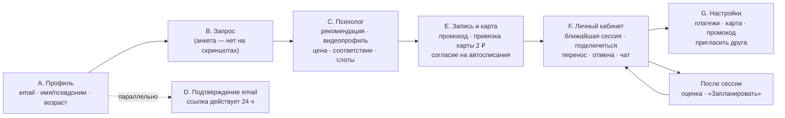

# Покадровый разбор пути клиента «Ясно»

> Источник: 45 скриншотов заказчика (11.09.2026, десктоп 1920×1080) — [индекс](../99_sources/screenshots_index.md).
> Метод: каждый экран разобран по схеме «что на экране → какую задачу решает → вывод для ТЕТА».
> Обозначения выводов: **Взять** — перенести паттерн; **Улучшить** — взять идею, реализовать лучше; **Избежать** — не повторять; **Не применимо** — противоречит ТЗ/ДНК ТЕТА.
> Уровень достоверности: всё, что ниже, — прямые наблюдения по скриншотам, если не помечено как *предположение*.

---

## Сводная карта пути

Ключевая идея воронки Ясно: **клиент доходит до выбора слота раньше, чем что-либо платит и даже раньше, чем подтверждает почту**. Регистрация, подбор и запись слиты в один мастер из трёх шагов; оплата отложена до момента за ~сутки до сессии, а на входе карта только привязывается.

---

## A. Регистрация — шаг «Профиль»

**Экраны:** [s01](../99_sources/yasno_screens/s01.png), [s02](../99_sources/yasno_screens/s02.png) · URL `/signup/profile`

| Элемент | Наблюдение |
|---|---|
| Прогресс-бар | 3 шага: **Профиль → Запрос → Психолог**; активный шаг подсвечен |
| Социальное доказательство | «1300 специалистов готовы помочь» + 5 аватаров психологов |
| Поля | «Почта», «Имя или псевдоним», «Возраст» — **без пароля** |
| CTA | «Далее» — единственная кнопка |
| Согласие | Один чекбокс «Получать информацию о сессиях, полезные материалы и персональные предложения» — **отмечен по умолчанию** (s01) |
| Прочее | Ссылка «Служба поддержки» внизу, бургер-меню в шапке, логотип без основной навигации сайта (мастер изолирован) |

**Какие задачи решает:** минимальный порог входа (3 поля), анонимность («псевдоним»), удержание фокуса (нет навигации, отвлекающей от записи).

**Выводы для ТЕТА**
- **Взять:** мастер записи с прогресс-баром; поле «Имя или псевдоним» (прямо поддерживает ценность «конфиденциальность» из ДНК ТЕТА); отсутствие навигации сайта внутри мастера.
- **Улучшить:** возраст — заменить на дату рождения или чекбокс «мне есть 18 лет» (нужно для проверки совершеннолетия и корректной работы с согласиями).
- **Избежать:** объединения транзакционных уведомлений и рекламы в одном предотмеченном чекбоксе. Для ТЕТА — раздельные согласия: (1) обработка ПДн и оферта — обязательно; (2) обработка сведений о состоянии здоровья (запрос, дневник эмоций) — обязательно для подбора, отдельной формой; (3) рекламные рассылки — добровольно, **без предотметки** (ст. 18 38-ФЗ «О рекламе»).
- **Совместимо с ТЗ:** ТЗ требует «регистрация по Email с подтверждением» — у Ясно подтверждение не блокирует путь (см. D). Рекомендуется так же.

---

## B. Шаг «Запрос» (анкета)

На скриншотах не зафиксирован (разрыв между 12:59 и 13:13). Состав анкеты описывается по публичному сайту в [yasno_product_analysis.md](yasno_product_analysis.md).

**Для ТЕТА (из ТЗ):** две альтернативы на этом шаге — анкета **или** диалог с AI-ботом «Германом»; обязательная возможность повторного анкетирования и смены психолога.

---

## C. Шаг «Психолог» — рекомендация, карточка и расписание

**Экраны:** s03–s11, s16–s23 · URL `/signup/therapist`

### C.1. Каркас экрана

| Зона | Наблюдение |
|---|---|
| Липкая верхняя панель | Слева «Предпочтение по времени» (иконка фильтра), по центру — аватар текущего рекомендованного психолога, справа «Помощь в подборе» (иконка «?») |
| Левая колонка (липкая) | Круглое **видео-аватар** с кнопкой ▶; имя; бейджи «🎯 9.9 из 10» и «✔ Опыт 9 лет»; «Индивидуальная сессия 50 мин · 4 490 ₽ ⓘ»; «Ближайшая запись **завтра в 10:00**» (ссылка); CTA «Выбрать время сессии» |
| Правая колонка | «О специалисте» (длинный текст, «Свернуть»); «Метод терапии» (ссылка на пояснение); темы работы с иконками — «Финансовые изменения», «Выгорание», «Ощущение одиночества», «Прокрастинация», «Раздражительность», «Проблемы со сном», «Ещё 1»; «Образование» — список «год — учреждение — программа» («Развернуть»); «Расписание» |
| Расписание | «🕒 Ваше время: Москва, Россия ›»; слоты-«таблетки» по датам на ~7 дней, «Ещё 4 дня»; выбранный слот подсвечивается; CTA меняет текст на «**Выбрать 16 сентября 21:00**» (s17) |

*Предположение:* аватар в центре верхней панели — переключатель между несколькими подобранными психологами (карусель рекомендаций). Каталог всех психологов доступен отдельно из меню.

**Выводы:** Ясно показывает **одного** рекомендованного психолога на весь экран вместо списка — это снижает перегрузку выбором и превращает подбор в «знакомство». Вся информация, нужная для решения (кто, как работает, сколько стоит, когда может), собрана на одном экране, CTA всегда в поле зрения.

### C.2. Модалка «Стоимость сессии» — [s06](../99_sources/yasno_screens/s06.png)

Цена 4 490 ₽ объясняется текстом «Мы внимательно анализируем показатели практики психологов, это влияет на стоимость» и чек-листом уровня:
более 4 лет опыта · подтверждённое образование · личное собеседование · рекомендации коллег и преподавателей · более 20 клиентов в Ясно · более 200 проведённых сессий в Ясно · высокий процент позитивной динамики. Кнопка «Ок, ясно».

- **Вывод:** у Ясно **уровневое ценообразование** — цена зависит от опыта и внутренних метрик психолога. По рекламе в Яндекс Почте (s12) виден и нижний уровень: 3 150 ₽ за сессию.
- **Для ТЕТА — Улучшить:** если вводятся уровни — объяснять цену так же прозрачно (соответствует ценности «честность»). Если цена единая — это сильный аргумент ДНК «доступная цена без переплат», его надо вынести в оффер. → Открытый вопрос Q-04.

### C.3. Модалка «Показатель соответствия» — [s07](../99_sources/yasno_screens/s07.png)

«9.9 из 10» — не рейтинг, а **персональный индекс совпадения**. Факторы:
1. **Соответствие запросу** — анкета сопоставляется с опытом и специализацией.
2. **Доверие к психологу** — предпочтения других клиентов и востребованность.
3. **Качество и стабильность практики** — динамика отношений психологов с клиентами (по сути — удержание клиентов).
4. **Доступность и удобство** — наличие свободных слотов.

- **Вывод:** алгоритм подбора Ясно учитывает не только анкету, но и поведенческие метрики качества (удержание, оценки клиентов — см. F.5) и загрузку.
- **Для ТЕТА — Улучшить с оглядкой на бриф:** публичные рейтинги запрещены брифом (п. 8.4). Персональный индекс соответствия — не рейтинг, но воспринимается как оценка. Рекомендация: показывать **причины рекомендации текстом** («работает с тревогой и выгоранием», «есть время вечером в будни»), без числа. → Q-09.

### C.4. Модалка «Метод терапии» — [s08](../99_sources/yasno_screens/s08.png)

Простое объяснение каждого метода психолога (экзистенциальная психотерапия, гештальт-терапия) — по абзацу. Кнопка «Ок, ясно».

- **Для ТЕТА — Взять:** справочник методов, управляемый из админки; в карточке психолога — ссылки на описания. Поддерживает тональность ДНК «профессионально, но тепло, с доказательной базой».

### C.5. Модалка «Видеопрофиль» — [s16](../99_sources/yasno_screens/s16.png)

Иллюстрация + текст: психологу задали важные вопросы, которые чаще всего интересуют клиентов; кнопка «Ясно, смотреть!».

- **Для ТЕТА — Взять:** видеовизитка психолога со стандартным набором вопросов (как проходит первая встреча, с какими запросами работаю, как понять, что терапия помогает). Сильнейший инструмент снятия «страха осуждения и недоверия» — первой боли ЦА по ДНК. Требования: загрузка и модерация видео в ЛК психолога, хранение в РФ.

### C.6. Часовой пояс — [s03](../99_sources/yasno_screens/s03.png), [s09](../99_sources/yasno_screens/s09.png), [s22](../99_sources/yasno_screens/s22.png), [s23](../99_sources/yasno_screens/s23.png)

Модалка «Выберите ваш часовой пояс» с поиском по городам («+03:00 Москва, Россия», «+04:00 Астрахань», «+06:00 Омск»…), подсказка «для корректного отображения расписания сессий психолога». Текущий пояс всегда виден над расписанием.

- **Для ТЕТА — Взять обязательно:** география «вся Россия» (11 часовых поясов) + ~15 % клиентов-мужчин за рубежом (ДНК). Все времена хранить в UTC, показывать в поясе пользователя; пояс определять автоматически и давать сменить.

### C.7. «Предпочтение по времени» — [s18](../99_sources/yasno_screens/s18.png)–[s21](../99_sources/yasno_screens/s21.png)

Переключатель из трёх режимов:
- **Любое**;
- **Ближайшее** — «сначала будут показаны терапевты, к которым можно записаться в ближайшее время»;
- **Конкретное** — выбор дня на 7 дней вперёд и часов сеткой 08:00–23:00, «Ночное и утреннее время» раскрывает 00:00–07:00; прошедшие часы неактивны; пояснение «при необходимости вы сможете договариваться об удобном расписании с вашим психологом».

- **Вывод:** время — **равноправный критерий подбора**, а не фильтр в каталоге. Предпочтение пересортировывает рекомендации.
- **Для ТЕТА — Взять:** критерий времени в анкете и в подборе (утро / день / вечер / выходные / ближайшее). Для ЦА «женщины 25–45, работающие» вечерние и выходные слоты — ключевой дефицит.

### C.8. Поддержка на шаге подбора — [s04](../99_sources/yasno_screens/s04.png), [s05](../99_sources/yasno_screens/s05.png)

Виджет чата в правом нижнем углу: шапка «Ясно · онлайн» с аватарами команды, «Здравствуйте! Чем мы можем помочь?», «Написать», пустая история «Мы с вами ещё не общались», поле ввода с эмодзи и вложениями. Кнопка «Помощь в подборе» в верхней панели.

- **Для ТЕТА — Взять:** Jivo (есть аккаунт, по брифу) доступен на всех шагах мастера; кнопка «Помощь в подборе» открывает Jivo с предзаполненным контекстом (шаг, выбранный психолог).

### C.9. Меню до подтверждения почты — [s11](../99_sources/yasno_screens/s11.png)

Красная точка на бургер-иконке → меню: оранжевая карточка-предупреждение «novokod@… · Отправили вам письмо, подтвердите почту», «Регистрация», «Служба поддержки» (зелёный индикатор «онлайн»), «Каталог психологов», «Вопросы-ответы», «Выйти».

- **Для ТЕТА — Взять:** неблокирующее напоминание о подтверждении email; индикатор доступности поддержки.

---

## D. Подтверждение email

**Экраны:** s12–s15

| Элемент | Наблюдение |
|---|---|
| Отправитель | «Ясно» `vse@yasno.live`, отправлено сразу после шага «Профиль» |
| Письмо | Иллюстрированная шапка «Подтвердите адрес электронной почты»; обращение по имени; объяснение зачем; «ссылка действительна сутки»; кнопка; подпись «команда Ясно · Сервис видеоконсультаций с психологом» |
| Футер письма | «Письмо отправлено автоматически»; связаться в мессенджере (иконка Telegram); «Скачать приложение»; соцсети |
| Страница подтверждения (s15) | «Почта подтверждена. Спасибо, подтверждение вашей почты … завершено» на основном шаблоне сайта |
| Реклама рядом (s12) | Рекламное объявление Ясно в Яндекс Почте: «Первые 3 сессии у психолога −20 %, код TRY · 2 520 ₽ вместо 3 150 ₽» |

**Хедер сайта (s15):** «Терапия», «Журнал Ясно», «Для психологов», «Для бизнеса», «🔒 Вход», CTA «Выбрать психолога».

**Футер сайта (s15)** — фактическая информационная архитектура:

| Колонка | Ссылки |
|---|---|
| Приложение | QR-код «Скачать приложение», App Store, Google Play |
| О Ясно | Вопросы-ответы · Отзывы клиентов · Контакты · Вакансии · Ясно для бизнеса |
| Полезное | Каталог психологов · Услуги психологов · Бесплатная помощь · Супервизия · Статьи о психологии · Психологические тесты · Курсы |
| Ещё | Подарочные сертификаты · Правила акций · Пользовательское соглашение · Обработка персональных данных · Согласие на обработку · Документы |
| Соцсети | VK · (иконка-звезда, *предположительно Дзен*) · Telegram · YouTube |
| Юридическая строка | «Аккредитованная IT-компания ООО «Ясно.лайв», ИНН 9703044223 … ОКВЭД 62.01 … Входит в реестр российского ПО (№19027, №28398, №29276)»; авторизованный партнёр в Республике Беларусь — «СТАРСФОРВЕБ» |
| Cookie-баннер | «Мы используем куки 🍪», ссылка на «рекомендательные технологии» и «Политику конфиденциальности», кнопка «Ясно» |

**Выводы для ТЕТА**
- **Взять:** неблокирующее подтверждение email; брендированные транзакционные письма с единым футером (поддержка, соцсети); на сайте — отдельные страницы «Бесплатная помощь» (кризисные контакты), «Правила акций», «Согласие на обработку», «Документы».
- **Взять (юридическое):** если на сайте работает алгоритм рекомендаций психологов, по ст. 10.2-2 149-ФЗ нужна публичная страница с правилами применения рекомендательных технологий — у Ясно она есть. См. [06_legal_compliance.md](../04_project_docs/06_legal_compliance.md).
- **Наблюдение о модели:** Ясно позиционируется юридически как IT-компания и продукт из реестра российского ПО, а услуги оказывают психологи. Это ориентир при выборе модели для ТЕТА (агентская схема / платформа). → Q-06.
- **Промо-механика:** стартовый промокод на первые 3 сессии (−20 %) используется в performance-рекламе. Для ТЕТА — сценарий промокода на первые сессии в модуле промокодов.

---

## E. Оформление записи и привязка карты

**Экраны:** s24–s28 · URL `/signup/card` → `yoomoney.ru/checkout/…` → `/settings/card_wait`

### E.1. Экран записи — [s24](../99_sources/yasno_screens/s24.png), [s25](../99_sources/yasno_screens/s25.png)

| Элемент | Наблюдение |
|---|---|
| Сводка | Фото и имя психолога, «16 сент., среда в 21:00» |
| Способ оплаты | Выпадающий список «Карта РФ или МИР» / «Иностранная карта» ([s38](../99_sources/yasno_screens/s38.png)) |
| Позиции | «Сессия, 50 мин — 4 490 ₽» |
| Промокод | Строка «Активировать промокод ›» → модалка «Промокод» с полем и кнопками «Назад» / «Активировать» |
| Итог | «Итого 4 490 ₽» |
| CTA | «**Добавить карту и записаться**» |
| FAQ под формой | Как перенести или отменить сессию? · Что произойдёт после добавления карты? · В какой момент будет списана стоимость сессии? · Можно ли удалить или изменить карту? · Как рассчитывается стоимость сессии в валюте? |

### E.2. Платёжная страница ЮKassa — [s26](../99_sources/yasno_screens/s26.png)–[s28](../99_sources/yasno_screens/s28.png)

- Получатель ООО «ЯСНО.ЛАЙВ», **сумма 2 ₽** — проверочный платёж для привязки карты; таймер «Завершите платёж в течение 9:57».
- Под полями карты: «ⓘ Заплатив здесь, вы **разрешите автосписания**» (ссылка на правила ЮMoney: привязка средства платежа, списания без подтверждения, отмена через поддержку магазина — s27); чекбокс «Нужна квитанция».
- Успех → «Вернуться на сайт» → `yasno.live/settings/card_wait` (ожидание подтверждения привязки).

### E.3. Когда списываются деньги — [s35](../99_sources/yasno_screens/s35.png)

В «Истории платежей» сессия 16 сент. 21:00 имеет оплату «**15 сент., 21:02 — запланировано**», статус «к оплате» — операция назначена **за 24 часа** до начала. По FAQ Ясно ([research_yasno_external.md](../99_sources/research_yasno_external.md), раздел 2) схема двухстадийная: **за 24 часа сумма блокируется (холдируется) на карте, за 12 часов — списывается**; если денег на карте нет, запись отменяется. Перенос возможен не позднее чем за 12 часов.

**Выводы для ТЕТА**
- **Взять — это ровно модель из ТЗ ТЕТА** («разовое добавление карты, автоматическое списание за 12 часов до сессии»). Паттерн подтверждён у лидера рынка.
- **Улучшить:**
  1. на экране записи показывать **точное время списания** («Спишем 4 490 ₽ 16 сентября в 09:00 — за 12 часов до сессии») и кратко правила отмены — вместо того чтобы прятать это в FAQ;
  2. явный отдельный чекбокс согласия на автосписания на стороне ТЕТА (помимо текста платёжной формы) с сохранением факта согласия;
  3. проверочный платёж — 1 ₽ с немедленным возвратом или авторизация 0 ₽ (зависит от возможностей CloudPayments) — объяснить клиенту заранее, чтобы не пугал.
- **Для ТЕТА — отличие:** платёжный провайдер — CloudPayments + CloudKassir (фискализация), а не ЮKassa. См. [05_integrations.md](../04_project_docs/05_integrations.md).
- **Иностранные карты:** Ясно принимает — релевантно для сегмента «релокация/эмиграция» из брифа и ДНК. → Q-28.

---

## F. Личный кабинет клиента

**Экраны:** s29–s34, s40–s45 · URL `/dashboard`

### F.1. Главная кабинета — [s29](../99_sources/yasno_screens/s29.png)–[s32](../99_sources/yasno_screens/s32.png)

| Зона | Наблюдение |
|---|---|
| Психолог | «Ваш терапевт · Дмитрий Дементьев» с фото |
| Герой-блок | Крупно «16 сентября / среда, 21:00»; ссылка «Перенести или отменить сессию» |
| Действия | «💬 Чат с терапевтом»; «📹 Подключиться» — неактивна, тултип «**За 5 минут до сессии** вы сможете подключиться и проверить камеру и микрофон перед звонком» ([s42](../99_sources/yasno_screens/s42.png)) |
| Карусель справа | «Узнайте себя · Психологические тесты» (плитка иллюстраций, «+5»); «Скидка 100 % · Приглашайте друзей и занимайтесь бесплатно · Узнать подробнее»; «Приложение Ясно для iOS и Android» (по ховеру — QR-код) |
| Футер кабинета | «Добавить в календарь» · Каталог психологов · Курсы · Статьи · Отзывы · Контакты · соцсети |

**Вывод:** кабинет Ясно — это **экран одной следующей сессии**, всё остальное вторично (карусель допродаж и вовлечения). Нет истории сессий, заметок, дневника — по крайней мере на главной.

### F.2. Меню зарегистрированного клиента — [s33](../99_sources/yasno_screens/s33.png)

«Пригласить друга» · «Платежи» · «Настройки» · «Подарочные сертификаты» · «Оставить отзыв» · «Служба поддержки» (онлайн) · «Выйти».

### F.3. Перенос, отмена, чат — [s40](../99_sources/yasno_screens/s40.png)–[s43](../99_sources/yasno_screens/s43.png)

| Сценарий | Наблюдение |
|---|---|
| «Перенос сессии» (s40) | Слоты того же психолога по датам; «Нет подходящего времени? **Написать психологу** или **отменить сессию**»; CTA «Выбрать время сессии» |
| «Чат с терапевтом» (s41) | Модальное окно: пустое состояние «Тут пока пусто», поле сообщения, «Отправить» — асинхронная переписка с психологом между сессиями |
| «Отмена сессии» (s43) | Удерживающий текст: «Если вы хотите перенести сессию, но не нашли подходящего времени, рекомендуем написать психологу в чат»; кнопки «Подтвердить отмену» (красная) и «💬 Написать в чат» (основная) |

**Выводы для ТЕТА**
- **Взять:** перенос в один экран со слотами того же психолога; удерживающий сценарий при отмене (предложить перенос).
- **Не применимо:** «Чат с терапевтом». ТЗ ТЕТА прямо задаёт «одностороннее сопровождение через рекомендации и дневники эмоций **без канала связи с психологом вне сессий**». Это осознанное отличие, которое соответствует ценности «строгое соблюдение границ» (ДНК).
- **Что нужно вместо чата (иначе сценарии Ясно «нет подходящего времени» и «хочу отменить» сломаются):**
  1. кнопка «Нет подходящего времени» → структурированный запрос психологу (выбор удобных дней/часов из сетки, без свободного текста) → уведомление психологу → психолог открывает дополнительный слот → клиент получает уведомление;
  2. отмена психологом — только через системное уведомление с автоматическим предложением слотов;
  3. организационные вопросы — в поддержку (Jivo), а не психологу.
  → Q-12.

### F.4. Жизненный цикл сессии на главной — [s44](../99_sources/yasno_screens/s44.png), [s45](../99_sources/yasno_screens/s45.png)

После окончания: «**Сессия завершилась.** Следующая сессия пока не запланирована» + CTA «📅 Запланировать» → модалка «Запись на сессию» со слотами того же психолога.

- **Для ТЕТА — Взять и Улучшить:** состояние «после сессии» — главный момент удержания. В ТЕТА здесь же должны появиться **рекомендации и задания психолога** (уникальная функция 6.2 ТЗ), а повторная запись — в 1–2 клика. Дополнительно: предложение записаться «на то же время через неделю» (регулярность = цель ДНК «сделать регулярную терапию доступной»).

### F.5. Оценка работы с психологом — [s34](../99_sources/yasno_screens/s34.png)

Модалка «Оцените вашу работу с психологом»: шкала из 6 эмодзи-лиц; подсказка «не оценивайте качество видеосвязи, вы сможете сделать это отдельно»; «**Эта информация недоступна психологу**».

- **Вывод:** закрытая оценка (CSAT) — источник фактора «качество и стабильность практики» в показателе соответствия (C.3). Качество связи оценивается отдельно.
- **Для ТЕТА — Взять:** приватная оценка после сессии (видна только администратору, влияет на внутренний контроль качества, не является публичным рейтингом — не противоречит брифу) + отдельная оценка качества связи. Публичные отзывы — отдельный поток с модерацией.

---

## G. Настройки, платежи, реферальная программа

**Экраны:** s35–s39 · URL `/settings/…`

### G.1. Навигация настроек

Левое меню: «Главная» · «Настройки» · «Платежи» · «Пригласить друга».

### G.2. Платежи — [s35](../99_sources/yasno_screens/s35.png)–[s38](../99_sources/yasno_screens/s38.png)

| Блок | Наблюдение |
|---|---|
| Промокод | «Активировать промокод ›» (та же модалка) |
| Карта | «Оплата производится с карты [МИР] \*1881»; кнопки «Изменить», «Удалить» |
| История платежей | Таблица: № (8002432) · Сессия (ссылка на психолога, дата) · Сумма · Оплата («15 сент., 21:02 · запланировано», подсказка «?») · Статус (бейдж «к оплате») |
| «Новая карта» | Выбор типа карты (РФ/МИР или иностранная); прайс: «Сессия, 50 мин — 4 490 ₽», «**Парная сессия, 1,5 часа — 4 850 ₽**»; «В стоимость уже включены НДС и прочие комиссии»; «Отменить» / «Добавить карту» |

**Выводы для ТЕТА**
- **Взять:** история платежей со статусами и запланированной датой списания; управление картой; прайс психолога при привязке.
- **Добавить:** ссылки на кассовые чеки (54-ФЗ, CloudKassir) в каждой строке; статусы «возврат», «списание не прошло → обновите карту».
- **Наблюдение:** у Ясно есть **парные сессии** (1,5 ч) с отдельной ценой у того же психолога. В брифе ТЕТА есть боли «отношения в семье», «трудности в отношениях» → парный формат релевантен. → Q-04.

### G.3. «Пригласить друга» — [s39](../99_sources/yasno_screens/s39.png)

| Блок | Наблюдение |
|---|---|
| Заголовок | «Пригласите друга и получите сессию» |
| Промокод | Префикс `YASNO-` + редактируемая часть (плейсхолдер `FORFRIENDS`), кнопка «Создать код» |
| Бонус пригласившему | «**Бесплатная сессия** за каждого друга, оплатившего первую сессию с вашим кодом»; счётчик «Мои бесплатные сессии: 0» |
| Бонус другу | «**−15 % на три сессии** каждому другу, применившему промокод на старте»; счётчик «Друзей применили промокод: 0» |
| FAQ | Как поделиться скидкой? · Как другу активировать? · Когда и как я получу бесплатную сессию? · Сколько бесплатных сессий можно получить? · Как узнать, что друг воспользовался? · Можно ли поменять промокод? · Суммируются ли промокоды? |

**Для ТЕТА:** бриф требует «индивидуальные» промокоды — реферальная механика Ясно является их частным случаем. Рекомендация: заложить в модуль промокодов тип «реферальный» (персональный код + бонус обеим сторонам), запуск — после MVP. Учесть этику: психологическая помощь — чувствительная тема, поэтому оффер «приглашайте друзей» подаётся бережно («поделитесь поддержкой»). → Q-15.

---

## H. Итог: паттерны «Взять / Улучшить / Избежать»

| # | Паттерн Ясно | Решение для ТЕТА | Обоснование |
|---|---|---|---|
| 1 | Мастер записи «Профиль → Запрос → Психолог» до оплаты | **Взять** | Минимум трения; анкета + AI-бот «Герман» на шаге «Запрос» (ТЗ) |
| 2 | Регистрация без пароля, псевдоним | **Взять** | Конфиденциальность (ДНК) |
| 3 | Предотмеченное согласие на рекламу вместе с уведомлениями | **Избежать** | 38-ФЗ, 152-ФЗ; раздельные согласия |
| 4 | Один рекомендованный психолог на экран | **Улучшить** | Показывать 1 главного + 2 альтернативы, причины рекомендации текстом, переход в каталог (ТЗ: подбор авто или вручную) |
| 5 | Численный «показатель соответствия» | **Улучшить** | Бриф запрещает рейтинги → текстовые причины без чисел (Q-09) |
| 6 | Прозрачное обоснование цены | **Взять** | Ценность «честность» |
| 7 | Видеовизитки психологов | **Взять** | Снятие страха и недоверия — боль № 1 ЦА |
| 8 | Справочник методов терапии | **Взять** | Доказательность, просветительская функция |
| 9 | Предпочтение по времени как критерий подбора | **Взять** | ЦА — работающие женщины; вечерние слоты |
| 10 | Выбор часового пояса | **Взять** | Вся Россия + зарубежье |
| 11 | Неблокирующее подтверждение email | **Взять** | Конверсия |
| 12 | Привязка карты + автосписание до сессии | **Взять** (12 ч по ТЗ) | Совпадает с ТЗ; показать время списания явно |
| 13 | Иностранные карты | **Рассмотреть** | Сегмент релокации (Q-28) |
| 14 | ЛК = экран следующей сессии | **Улучшить** | Добавить дневник эмоций при входе, рекомендации психолога, историю сессий |
| 15 | «Подключиться» за 5 минут + проверка камеры/микрофона | **Взять** | Снижает технические сбои |
| 16 | «Добавить в календарь» | **Взять** | Снижение неявок |
| 17 | Чат с терапевтом | **Не применимо** | ТЗ: без канала связи вне сессий; заменить структурированными запросами |
| 18 | Удержание при отмене (предложить перенос) | **Взять** | Удержание без давления |
| 19 | «Сессия завершилась → Запланировать» | **Улучшить** | + рекомендации психолога + «то же время через неделю» |
| 20 | Приватная оценка после сессии, недоступная психологу | **Взять** | Контроль качества без публичных рейтингов |
| 21 | История платежей с датой списания | **Улучшить** | + чеки 54-ФЗ, статусы ошибок и возвратов |
| 22 | Реферальная программа (сессия / −15 %) | **Позже** | Промокоды — в MVP, рефералка — R2 |
| 23 | Карусель допродаж в ЛК (тесты, рефералка, приложение) | **Улучшить** | Бережнее: вебинары, статьи, тесты; без агрессивных скидок |
| 24 | Мобильные приложения iOS/Android | **Позже** | ТЗ: PWA; бриф: десктоп + мобильный сайт для записи |
| 25 | Стартовый промокод «первые 3 сессии −20 %» в рекламе | **Взять** | Модуль промокодов с условием «первые N сессий» |
| 26 | Страница «рекомендательные технологии» и cookie-баннер | **Взять** | 149-ФЗ ст. 10.2-2, 152-ФЗ |

## I. Пробелы наблюдения

Не видны на скриншотах и требуют исследования публичного сайта / внешних источников: анкета «Запрос», каталог и его фильтры, видеокомната, «Настройки» (уведомления, профиль, удаление аккаунта), подарочные сертификаты, отзывы, «Бесплатная помощь», кабинет психолога, B2B-кабинет. Они разобраны в [yasno_product_analysis.md](yasno_product_analysis.md) с явной пометкой источника.
