# Персоны, JTBD, CJM и пользовательские сценарии

> Версия 1.0 · 11.09.2026 · Статус: черновик на утверждение
> **Персоны — гипотезы**, построенные по брифу (ЦА, боли), ДНК бренда (сегменты, доход, барьеры) и голосу клиентов конкурента ([yasno_product_analysis.md](../02_competitor_analysis/yasno_product_analysis.md), раздел 19). До дизайна рекомендуется подтвердить их 8–10 интервью с клиентами и 5 интервью с психологами.
> Связанные документы: [блоки и разделы](teta_platform_blocks.md) · [последовательности и состояния](../06_architecture/sequences_states.md) (системный уровень).

---

## 1. Персоны клиентов

### P1. Анна — «Первый шаг к психологу»

| | |
|---|---|
| Профиль | 32 года, Москва, маркетолог в IT-компании, доход ~180 тыс. ₽, живёт с партнёром |
| Запрос | Тревога, бессонница, выгорание; никогда не была у психолога |
| Контекст | Работает до 19:00, свободна вечером и в выходные; большую часть информации читает с телефона |
| Цели | Понять, что с ней происходит; найти психолога, которому сможет доверять; не потратить деньги впустую |
| Барьеры | Страх осуждения («это же не серьёзная проблема»), непонимание, как выбрать метод, сомнения в онлайн-формате, страх, что «узнают» |
| Триггер | Паническое состояние перед важной презентацией; статья в Дзене о выгорании |
| Каналы | Поиск Яндекса, Дзен, Telegram-каналы, рекомендации подруг |
| Что поможет в ТЕТА | Посадочная «Тревога» → Герман, если трудно сформулировать → подборка с причинами → видеовизитка → понятная цена и время списания → вечерний слот |
| Боли у конкурента | «Психолог молчал», «непонятно, что я оплачиваю» |

### P2. Ольга — «Регулярность без переплат»

| | |
|---|---|
| Профиль | 41 год, Екатеринбург (UTC+5), специалист по персоналу, двое детей, доход семьи ~200 тыс. ₽ |
| Запрос | Отношения в семье, конфликты с подростком, усталость |
| Контекст | Ходила к психологу офлайн — дорого и далеко, бросила после 4 встреч; время только поздно вечером или в обед |
| Цели | Продолжать работу регулярно и доступно; сохранить границы — «не хочу переписываться с психологом ночью» |
| Барьеры | Цена за длинную дистанцию, неудобные часовые пояса, форс-мажоры с детьми (отмены) |
| Что поможет в ТЕТА | Время в её поясе; запись «на то же время через неделю»; честные правила переноса; дневник эмоций для отслеживания изменений; корпоративная программа работодателя (если есть) |
| Боли у конкурента | «Деньги сгорели, когда заболел ребёнок» — правило 12 часов |

### P3. Катя — «Трудно сформулировать»

| | |
|---|---|
| Профиль | 26 лет, Санкт-Петербург, дизайнер-фрилансер, доход нестабильный 70–120 тыс. ₽ |
| Запрос | Самооценка, прокрастинация, поиск себя, «непонятные эмоции» |
| Контекст | Только телефон и ноутбук; привыкла к чатам и мессенджерам; чувствительна к цене |
| Цели | Разобраться в себе; не чувствовать себя глупо, объясняя запрос |
| Барьеры | Анкеты с медицинскими вопросами пугают; не знает методов; боится, что «не подойдёт» |
| Что поможет в ТЕТА | Диалог с Германом вместо анкеты; уровень психолога с понятной ценой; бесплатная смена психолога; рекомендации между сессиями |
| Боли у конкурента | Длинные анкеты, «слишком много рекламы у блогеров» — недоверие |

### P4. Дмитрий — «Релокация»

| | |
|---|---|
| Профиль | 35 лет, живёт в Белграде (UTC+2) третий год, разработчик, доход в валюте |
| Запрос | Адаптация, одиночество, тревога за близких в России |
| Контекст | Нужен русскоязычный психолог, понимающий контекст эмиграции; карта иностранного банка |
| Цели | Консультации в удобном поясе; оплата без сложностей |
| Барьеры | Оплата из-за рубежа (Q-28), разница часовых поясов, недоверие к «массовым» сервисам |
| Что поможет в ТЕТА | Темы «релокация/иммиграция» в справочнике; часовой пояс; иностранные карты (R2) |
| Особенность | ~15 % клиентов по ДНК — мужчины, часто за рубежом |

### P5. Марина — «Через работодателя»

| | |
|---|---|
| Профиль | 29 лет, Москва, аналитик в компании с корпоративной программой ТЕТА |
| Запрос | Стресс на работе, конфликт с руководителем |
| Барьеры | Главный страх — **что HR или руководитель узнают, что она ходит к психологу** и с чем |
| Что поможет в ТЕТА | Регистрация по личному email; HR не видит факта подключения и тем (BR-B2B-05); понятный текст о приватности на экране подключения; лимит сессий виден только ей |

## 2. Персоны профессиональных пользователей

### P6. Елена — психолог

| | |
|---|---|
| Профиль | 38 лет, КПТ и схема-терапия, 7 лет частной практики, самозанятая, 15 клиентов в неделю |
| Цели | Стабильный поток подходящих клиентов; меньше организационной рутины (переписка, напоминания, оплаты); профессиональный рост и продвижение |
| Боли | Неоплаченные отмены, клиенты «не мои», высокие комиссии агрегаторов, нет инструментов работы между сессиями, выплаты с задержками |
| Что поможет в ТЕТА | Подбор по специализации; расписание с отпусками; карточка клиента с дневником (при согласии); рекомендации из базы знаний; итоги сессии за 2 минуты; еженедельные выплаты; статьи с продвижением в Дзене |
| Опасения | «Меня будут контролировать как сотрудника», «клиенты увидят рейтинг» |

### P7. Администратор — менеджер психологов и модератор

| | |
|---|---|
| Профиль | Сотрудник ТЕТА, совмещает отбор кандидатов, модерацию и поддержку в Jivo |
| Цели | Не упускать заявки и инциденты; решать спорные ситуации по фактам; не тонуть в ручной работе |
| Что поможет | Канбан отбора, единая очередь модерации с SLA, журнал подключений в карточке сессии, шаблоны решений и писем, дашборд «требует внимания» |

### P8. Игорь — HR-менеджер (R2)

| | |
|---|---|
| Профиль | HR business partner в компании на 400 сотрудников |
| Цели | Снизить выгорание и текучесть; контролировать бюджет; показать руководству эффект |
| Барьеры | Сотрудники не пользуются из-за недоверия; сложно согласовать бюджет без отчётности |
| Что поможет | Лимиты и прогноз счёта; агрегированные отчёты; материалы для анонса; аргумент «строгая анонимность повышает вовлечённость» |

## 3. Jobs To Be Done

| Роль | Когда… | Хочу… | Чтобы… | Раздел ТЕТА |
|---|---|---|---|---|
| Клиент | мне тревожно и я не понимаю, что со мной | спокойно рассказать о состоянии и получить понятный следующий шаг | не чувствовать себя беспомощной | WIZ-02b, WIZ-03 |
| Клиент | я выбираю психолога | увидеть, как он говорит и работает, и почему он мне подходит | довериться с первой встречи | SITE-03, WIZ-03 |
| Клиент | я записываюсь | заранее знать цену, момент списания и правила отмены | не бояться неприятных сюрпризов | WIZ-06 |
| Клиент | между сессиями мне трудно | отмечать состояние и выполнять задания психолога | видеть прогресс и не терять контакт с работой | CL-01, CL-05, CL-06 |
| Клиент | психолог не подошёл | сменить его без неловкости и потерь | продолжить работу | CL-04a |
| Клиент | у меня изменились планы | перенести встречу за минуту | не терять деньги и регулярность | CL-03a |
| Психолог | ко мне записывается новый клиент | заранее понять его запрос | подготовиться к первой встрече | PRO-04 |
| Психолог | сессия закончилась | быстро зафиксировать итоги и дать клиенту задание | поддержать клиента до следующей встречи | PRO-05a, PRO-06 |
| Психолог | я ухожу в отпуск | закрыть расписание и предупредить клиентов | сохранить доверие | PRO-03 |
| Психолог | я хочу больше подходящих клиентов | публиковать экспертные статьи | меня находили по моим темам | PRO-10 |
| Администратор | приходит кандидат | провести его по этапам отбора без потерь | выдерживать планку «1 из 20» | ADM-03a |
| HR | компания подключила программу | видеть использование бюджета без персональных данных | обосновать продление | HR-01, HR-05 |

## 4. CJM клиента

| Стадия | Цели клиента | Действия | Точки контакта | Эмоции | Барьеры | Решения ТЕТА | Метрика |
|---|---|---|---|---|---|---|---|
| 1. Осознание | Понять, нужна ли помощь | Читает статью, ищет «тревога что делать» | SITE-06, SITE-08, Дзен | Растерянность, стыд | «Не так всё серьёзно» | Бережные посадочные, «когда нужна другая помощь», экстренная помощь | MET-26, MET-27 |
| 2. Выбор сервиса | Найти, кому доверять | Сравнивает сервисы, читает отзывы | SITE-01, SITE-12, SITE-13 | Сомнение | Недоверие к «массовым» сервисам | Процесс отбора «1 из 20», этический кодекс, цена заранее | MET-02 |
| 3. Формулировка запроса | Объяснить, что беспокоит | Анкета или Герман | WIZ-02a, WIZ-02b | Уязвимость | Страх вопросов, стыд | Бережные формулировки, Герман, псевдоним, объяснение приватности | MET-03 |
| 4. Выбор психолога | Найти «своего» | Смотрит подборку, видео, методы | WIZ-03, SITE-03 | Надежда, сомнение | Непонятны методы и цена | Причины рекомендации, пояснения методов и уровня | MET-04 |
| 5. Запись | Закрепить время | Выбирает слот, привязывает карту | WIZ-04, WIZ-06 | Решимость, тревога о деньгах | Страх автосписаний | Время списания, правила отмены, согласие отдельно | MET-05 |
| 6. Ожидание | Не забыть, подготовиться | Получает письма, проверяет камеру | N-CL-05, N-CL-06, ROOM-01 | Волнение | Техника, «что говорить» | Памятка первой сессии, проверка оборудования | MET-17 |
| 7. Первая сессия | Быть понятой | Видеосессия | ROOM-02 | Облегчение или разочарование | Сбои, «не мой психолог» | Стабильная связь, режим «только звук», смена психолога | MET-18, MET-10 |
| 8. Между сессиями | Сохранить эффект | Дневник, задания | CL-01, CL-05, CL-06 | Вовлечённость | «Нечего делать до встречи» | Рекомендации психолога, дневник | MET-12, MET-13 |
| 9. Регулярная работа | Двигаться к результату | Повторные записи, переносы | CL-02, CL-03 | Уверенность | Цена, форс-мажоры | «То же время через неделю», честные переносы, B2B | MET-06, MET-07 |
| 10. Завершение / смена | Завершить или найти другого | Смена психолога, завершение работы | CL-04a, CL-10 | Благодарность или неудовлетворённость | Неловкость | Бережная смена, отзыв, приглашение вернуться | MET-08, MET-09 |

### Эмоциональная кривая (гипотеза)

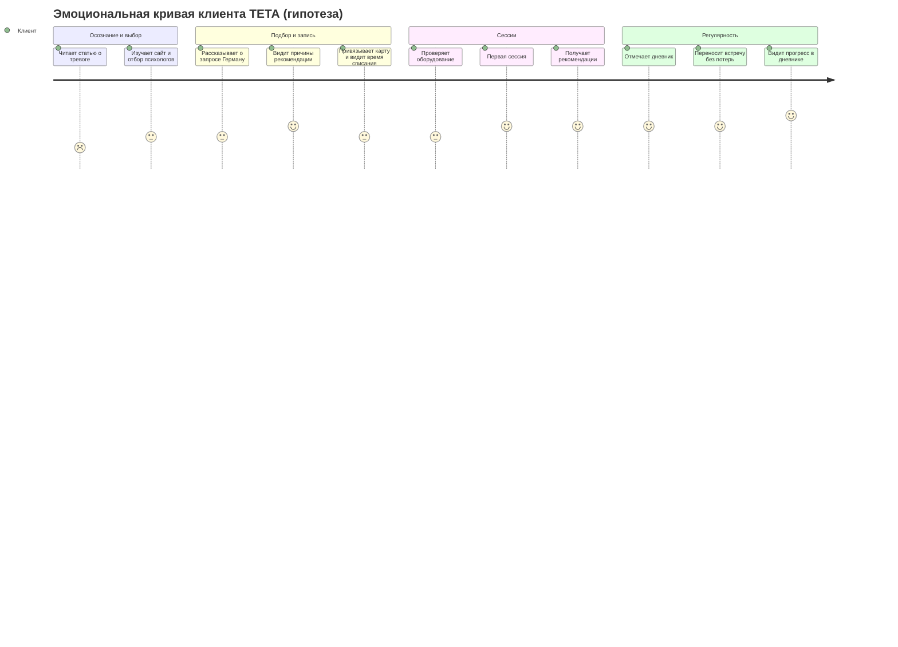

## 5. CJM психолога

| Стадия | Действия | Точки контакта | Барьеры | Решения ТЕТА |
|---|---|---|---|---|
| 1. Знакомство | Узнаёт о ТЕТА, изучает условия | SITE-11 | Недоверие к агрегаторам, комиссии | Прозрачные условия, уровни, база знаний, статьи |
| 2. Заявка | Заполняет анкету, загружает документы | PRO-01 | Долгая форма | Автосохранение, чек-лист, статус этапа |
| 3. Отбор | Собеседование, тестовая сессия | PRO-01, ADM-03a | Неясные сроки | Трекер этапов и уведомления N-PS-02 |
| 4. Старт | Оферта, реквизиты, профиль, расписание | PRO-07, PRO-09, PRO-03 | Модерация профиля | Предпросмотр, комментарии модератора |
| 5. Первые клиенты | Готовится по карточке, проводит сессии | PRO-02, PRO-04, ROOM | Неподходящие клиенты | Подбор по специализации и «с кем не работаю» |
| 6. Рутина | Итоги, рекомендации, переносы | PRO-05a, PRO-06, PRO-03 | Организационная нагрузка | Итоги за 2 минуты, шаблоны, структурированные запросы времени |
| 7. Деньги | Проверяет начисления, получает выплаты | PRO-07 | Задержки, статус НПД | Еженедельные выплаты, уведомления о проблемах |
| 8. Развитие | Статьи, база знаний, интервизия (R2) | PRO-10, PRO-11, PRO-12 | Нет времени | Продвижение автора, готовые материалы |

## 6. Ключевые пользовательские сценарии

### F1. Первая запись через анкету

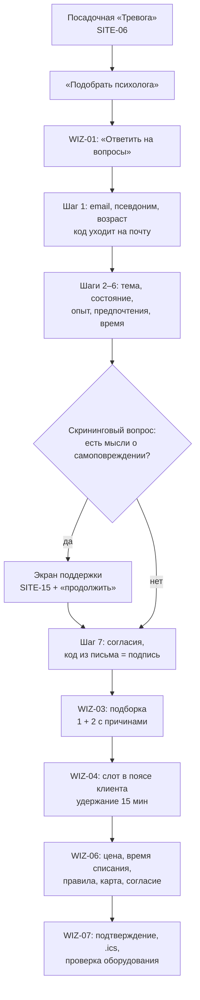

### F2. Первая запись через Германа

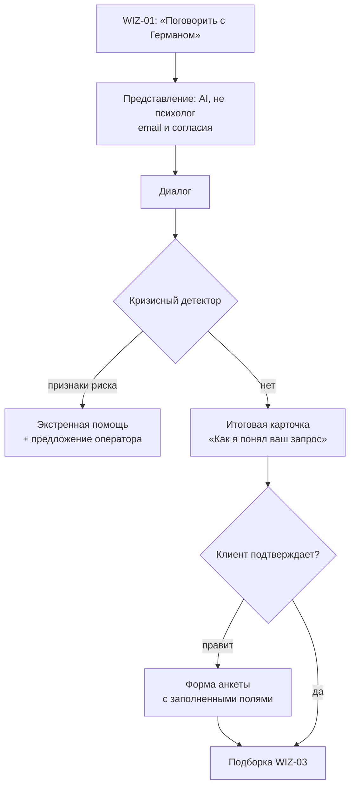

### F3. Запись из каталога или статьи

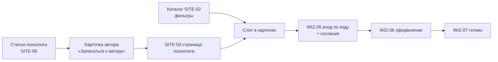

*Примечание:* при записи из каталога анкета не обязательна; согласие на сведения о здоровье запрашивается, только если клиент заполняет анкету позже.

### F4. Регулярность после сессии

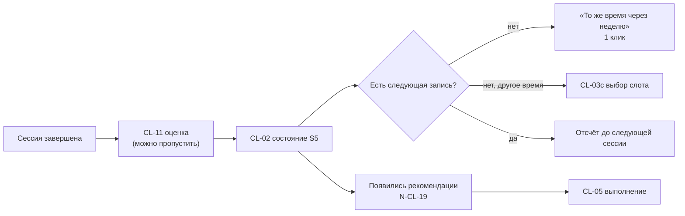

### F5. Перенос, «нет времени», отмена

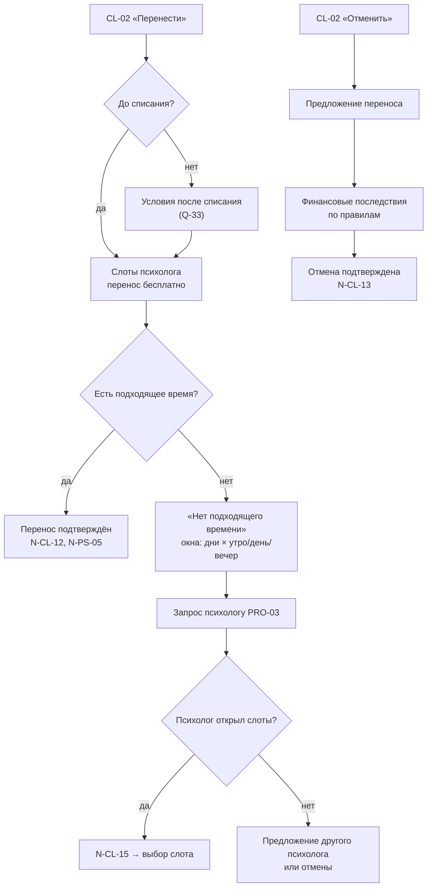

### F6. Неудачное списание

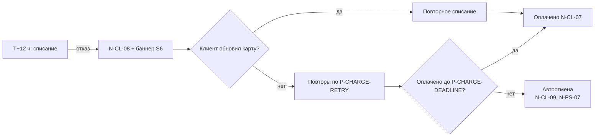

### F7. Смена психолога

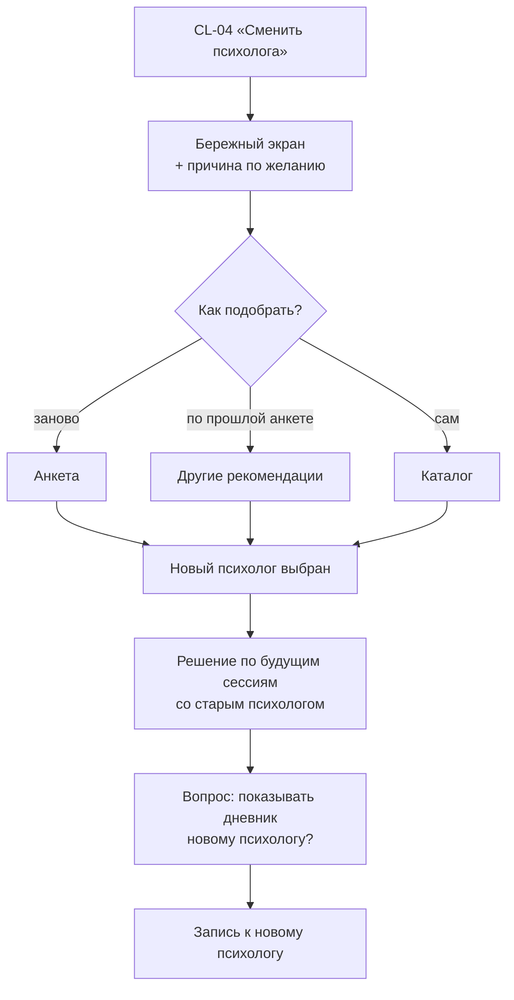

### F8. Неделя психолога

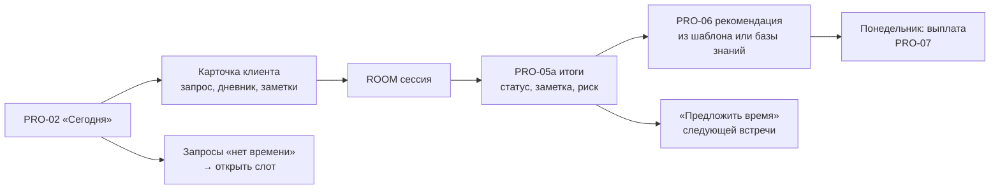

### F9. Онбординг психолога

Описан в [product_architecture.md](../06_architecture/product_architecture.md), раздел 8.3.

### F10. Публикация статьи

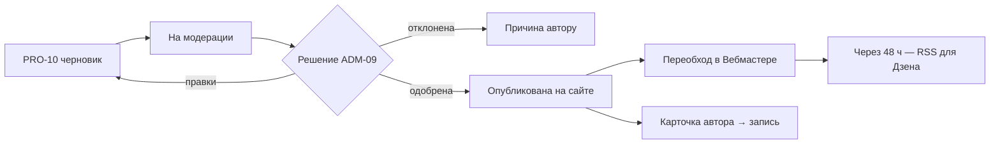

### F11. Корпоративный сотрудник

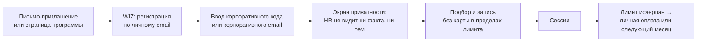

### F12. Кризисная ситуация

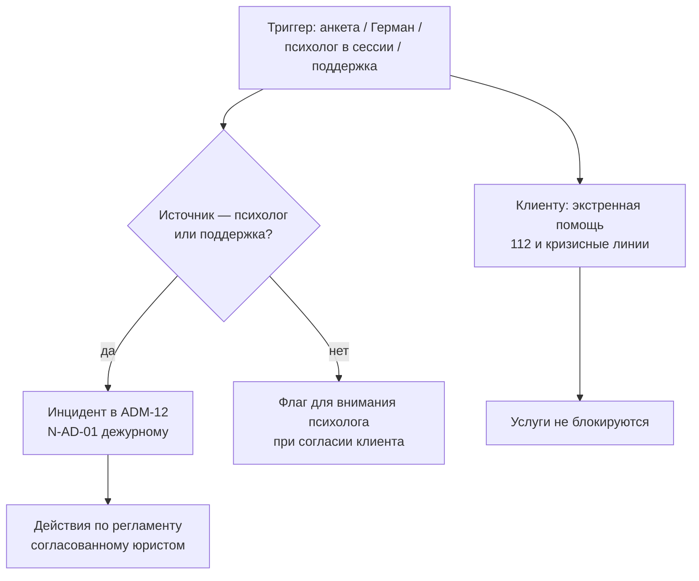

## 7. Сценарии для валидации

| № | Что проверить | Метод | Когда |
|---|---|---|---|
| 1 | Понимают ли клиенты разницу «анкета / Герман / каталог» | Юзабилити-тест прототипа WIZ, 5–8 человек из ЦА | Фаза дизайна |
| 2 | Не отпугивает ли подписание согласия кодом | Тот же тест + A/B текста (без изменения юридического содержания) | Фаза дизайна |
| 3 | Доверяют ли причинам рекомендации без рейтинга | Интервью | Фаза дизайна |
| 4 | Понятны ли время списания и правила отмены | 5-секундный тест экрана WIZ-06 | Фаза дизайна |
| 5 | Будут ли психологи заполнять итоги и рекомендации | Интервью с 5 психологами, прототип PRO-05a | Фаза дизайна |
| 6 | Как клиенты воспринимают отсутствие чата с психологом | Интервью, пилот | Пилот |
| 7 | Реальная частота записей дневника | Пилот, MET-12 | Пилот |
