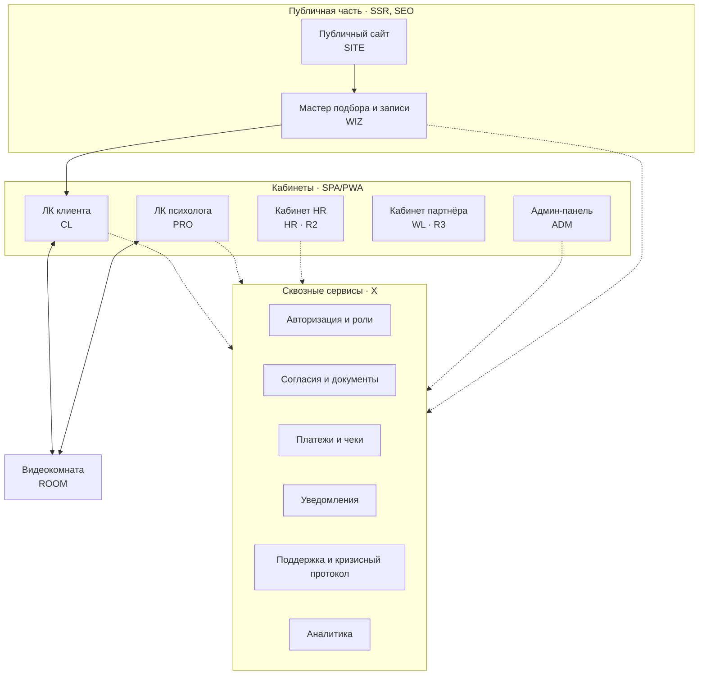
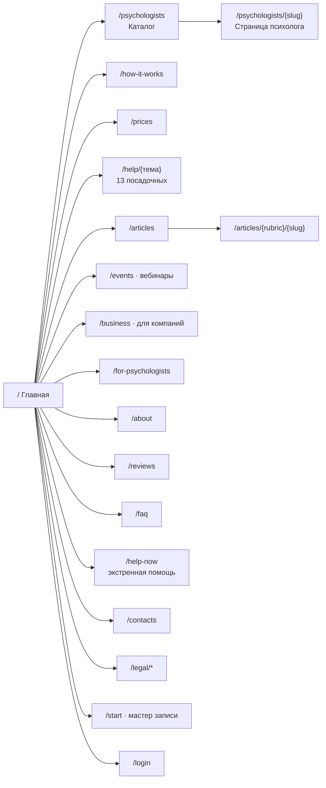
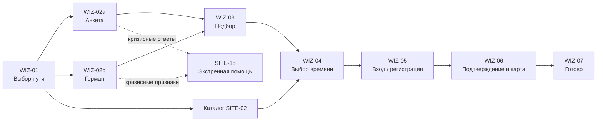

# Блоки и разделы новой платформы ТЕТА

> Версия 1.0 · 11.09.2026 · Статус: черновик на утверждение
> Документ описывает **всё, что должно быть на платформе**: каждый контур, раздел, страницу, блок, ключевые поля, действия и состояния. Это основа для wireframes, функциональных требований ([02_functional_requirements.md](../04_project_docs/02_functional_requirements.md)) и архитектуры ([product_architecture.md](../06_architecture/product_architecture.md)).

## Содержание

0. [Как читать документ](#0-как-читать-документ)
1. [Контуры платформы](#1-контуры-платформы)
2. [Публичный сайт](#2-публичный-сайт)
3. [Мастер подбора и записи](#3-мастер-подбора-и-записи)
4. [Личный кабинет клиента](#4-личный-кабинет-клиента)
5. [Видеокомната](#5-видеокомната)
6. [Личный кабинет психолога](#6-личный-кабинет-психолога)
7. [Кабинет HR компании (B2B)](#7-кабинет-hr-компании-b2b)
8. [Кабинет партнёра white-label](#8-кабинет-партнёра-white-label)
9. [Админ-панель](#9-админ-панель)
10. [Сквозные блоки и сервисы](#10-сквозные-блоки-и-сервисы)
11. [Сводка по релизам](#11-сводка-по-релизам)

---

## 0. Как читать документ

### 0.1. Идентификаторы разделов

| Префикс | Контур | Пример |
|---|---|---|
| `SITE-` | Публичный сайт | `SITE-01` Главная |
| `WIZ-` | Мастер подбора и записи | `WIZ-03` Подбор |
| `CL-` | Личный кабинет клиента | `CL-02` Главная кабинета |
| `ROOM-` | Видеокомната | `ROOM-01` Проверка оборудования |
| `PRO-` | Личный кабинет психолога | `PRO-04` Клиенты |
| `HR-` | Кабинет HR компании | `HR-02` Сотрудники и доступ |
| `WL-` | Кабинет партнёра white-label | `WL-01` Бренд |
| `ADM-` | Админ-панель | `ADM-03` Психологи |
| `X-` | Сквозные сервисы | `X-02` Согласия и документы |

### 0.2. Релизы

| Метка | Смысл |
|---|---|
| **MVP** | Необходимо для запуска: без этого платформа не выполняет обещание клиенту, психологу или владельцу |
| **R2** | Второй релиз: рост, удержание, расширение ТЗ (≈ 2–3 месяца после запуска) |
| **R3** | Масштабирование: B2B-партнёры, white-label, интеграции (≈ 6+ месяцев) |

Обоснование разбиения — в [09_roadmap_releases.md](../04_project_docs/09_roadmap_releases.md).

### 0.3. Источники требований

`[ТЗ п.]` — техническое задание · `[Бриф п.]` — бриф · `[ДНК]` — ДНК бренда · `[Ясно sNN]` — паттерн конкурента со скриншота · `[Рек.]` — рекомендация аналитика (требует согласования) · `(Q-NN)` — зависит от ответа на [открытый вопрос](../01_inputs/open_questions.md).

### 0.4. Роли

| Роль | Кто это | Контур |
|---|---|---|
| Гость | Неавторизованный посетитель | Сайт, мастер записи |
| Клиент | Зарегистрированный пользователь, получает консультации | Мастер, ЛК клиента, видеокомната |
| Корпоративный клиент | Клиент, привязанный к компании; сессии в пределах лимита оплачивает компания | То же + информация о лимите |
| Кандидат | Психолог, подавший заявку, ещё не прошедший отбор | Анкета кандидата в ЛК психолога |
| Психолог | Прошедший отбор специалист | ЛК психолога, видеокомната |
| HR-менеджер, HR-наблюдатель | Представители компании-заказчика; наблюдатель видит только отчёты | Кабинет HR (R2) |
| Партнёр (WL) | Администратор и модератор партнёрской инсталляции | Кабинет партнёра (R3) |
| Администратор | Сотрудник ТЕТА; подроли: суперадмин, менеджер психологов, модератор контента, финансист, поддержка, B2B-менеджер, аналитик (только чтение) | Админ-панель |

---

## 1. Контуры платформы

| ID контура | Контур | Для кого | Главная задача | Релиз |
|---|---|---|---|---|
| SITE | Публичный сайт | Гость | Объяснить ценность, снять страхи, привести к записи, SEO | MVP |
| WIZ | Мастер подбора и записи | Гость, клиент | От запроса до забронированной сессии с привязанной картой за 5–7 минут | MVP |
| CL | ЛК клиента | Клиент | Управлять сессиями, получать рекомендации, вести дневник эмоций, платежи | MVP |
| ROOM | Видеокомната | Клиент, психолог | Надёжная конфиденциальная видеосессия | MVP |
| PRO | ЛК психолога | Кандидат, психолог | Отбор, график, клиенты, итоги сессий, рекомендации, доход, статьи, база знаний | MVP |
| HR | Кабинет HR | HR-менеджер | Доступ сотрудников, лимиты, счета, агрегированные отчёты | R2 |
| WL | Кабинет партнёра | Партнёр | Своя брендированная инсталляция со своими психологами | R3 |
| ADM | Админ-панель | Администраторы ТЕТА | Отбор и управление психологами, модерация, финансы, выплаты, B2B, контент, настройки | MVP |
| X | Сквозные сервисы | Все | Авторизация, согласия, платежи, уведомления, поддержка, аналитика, аудит | MVP |

---

## 2. Публичный сайт

### 2.0. Карта сайта

Полный реестр страниц с URL, мета-данными и доступом — [sitemap.xlsx](../06_architecture/sitemap.xlsx).

### SITE-00. Глобальные элементы (на всех страницах сайта) · MVP

| № | Блок | Содержимое | Действия и поведение | Источник |
|---|---|---|---|---|
| 1 | Шапка | Логотип Θ │ ТЕТА; меню: «Психологи», «Как это работает», «Цены», «Статьи», «Для компаний», «Для психологов»; «Войти»; CTA «Подобрать психолога» | Липкая при прокрутке; на мобильном — бургер; для авторизованного — аватар и «В кабинет» | [Ясно s15], [Рек.] |
| 2 | Футер | Колонки: **О ТЕТА** (О проекте, Как мы отбираем психологов, Этический кодекс, Отзывы, Контакты) · **Клиентам** (Каталог психологов, С чем помогаем, Цены и оплата, FAQ, Экстренная помощь) · **Партнёрам** (Для компаний, Для психологов, Вебинары) · **Документы** (Пользовательское соглашение, Политика ПДн, Согласия, Правила рекомендаций, Правила акций, Правила отмены и возврата) · соцсети (Дзен, Telegram, VK) · реквизиты юрлица | — | [Ясно s15], [Рек.] |
| 3 | Дисклеймер | «ТЕТА оказывает психологическую помощь и не оказывает медицинскую и экстренную помощь. Если вы в опасности — [экстренная помощь]» | Ссылка на SITE-15 | [Рек.], (Q-26) |
| 4 | Cookie-баннер | Короткий текст, ссылка на политику cookies, кнопки «Принять все» / «Только необходимые» / «Настроить» | Метрика загружается только после согласия на аналитические cookies | 152-ФЗ, [Ясно s15] |
| 5 | Виджет поддержки | Jivo | Оператору передаются роль пользователя и тип раздела — без темы посадочной страницы и других сведений о состоянии | [Бриф 6.2], [ТЗ 4] |
| 6 | Хлебные крошки | На всех страницах, кроме главной | Микроразметка BreadcrumbList | SEO |
| 7 | Баннер-объявление | Узкая плашка сверху (акция, вебинар, техработы) | Управляется из ADM-10; можно закрыть | [Рек.] |

### SITE-01. Главная `/` · MVP

Цель: за один экран объяснить «кто вы, чем поможете, почему можно доверять и сколько стоит» и за два клика привести к подбору.

| № | Блок | Содержимое | CTA / поведение | Источник |
|---|---|---|---|---|
| 1 | Первый экран (hero) | Заголовок из УТП: качественная психологическая помощь без переплат, с этичным подходом и гарантией конфиденциальности; подзаголовок про отбор 1 из 20 и онлайн из любой точки; визуал: фото/иллюстрация в фирстиле + «плавающая» карточка ближайшего слота психолога | Основная: «Подобрать психолога» → WIZ; вторичная: «Поговорить с Германом» (AI-помощник) → WIZ-02b; ссылка «Выбрать самостоятельно» → SITE-02 | [ДНК УТП], [ТЗ 4], референс Cerebral |
| 2 | Полоса доверия | 4 факта: «1 из 20 кандидатов проходит отбор» · «Регулярные супервизии» · «Конфиденциально: можно под псевдонимом» · «Цена известна заранее» | Клик → соответствующий раздел | [ДНК] |
| 3 | С чем помогаем | Плитка 13 запросов из брифа с иконками: тревога и страхи, стресс и депрессия, выгорание и прокрастинация, отношения, семья, общение, самооценка, поиск себя, непонятные эмоции, апатия и потеря смысла, навязчивые мысли, РПП, релокация | Клик → посадочная `/help/{тема}` | [Бриф 2.3] |
| 4 | Как это работает | 4 шага: расскажите о запросе (анкета или Герман) → получите подборку психологов с объяснением → выберите время и привяжите карту → встречайтесь онлайн; оплата спишется за 12 часов до сессии | «Начать» → WIZ | [ТЗ 2], [Ясно] |
| 5 | Наши психологи | Карусель 6–8 психологов: фото, имя, опыт, методы, 2–3 темы, ближайшее время; кнопка видеовизитки | «Все психологи» → SITE-02; карточка → SITE-03 | [ТЗ 4] |
| 6 | Как мы отбираем психологов | Воронка отбора: анкета и документы → проверка образования → собеседование → тестовая сессия → регулярные супервизии; итог: «1 из 20» | «Подробнее» → SITE-12 | [ДНК] |
| 7 | Цены и формат | Стоимость сессии (по уровням или единая — Q-04), длительность 50 минут, видео с компьютера; условия: списание за 12 часов, бесплатная отмена до списания, чек на email | «Все условия» → SITE-05 | [ТЗ 2], (Q-04, Q-05) |
| 8 | Почему ТЕТА | 4–5 ценностей ДНК в виде «мы делаем / мы не делаем»: не даём советов и не затягиваем, не навязываем, соблюдаем границы, работаем на результат | — | [ДНК] |
| 9 | Конфиденциальность и безопасность | Псевдоним; сессии не записываются; данные хранятся в РФ и защищены; психолог не видит ваши контакты; дневник эмоций видит только с вашего согласия | «Политика конфиденциальности» | [ДНК], [Рек.] |
| 10 | Сопровождение между сессиями | Дневник эмоций и рекомендации психолога — «вы не одни между встречами», при этом границы соблюдаются | — | [ТЗ 6.1, 6.2] |
| 11 | Отзывы | 6–10 отзывов после модерации: текст, имя или псевдоним, тема (без диагнозов), к какому психологу | «Все отзывы» → SITE-13 | [Бриф 8.4] |
| 12 | Статьи | 3–6 свежих статей психологов: обложка, рубрика, автор, время чтения | «Все статьи» → SITE-07 | [ТЗ 6.4] |
| 13 | Вебинары | Ближайшие 1–3 мероприятия | «Все вебинары» → SITE-09 | [Бриф 7.5], (Q-02) |
| 14 | Для компаний | Короткий оффер корпоративной программы | «Для компаний» → SITE-10 | [Бриф 3.2] |
| 15 | FAQ | 6–8 вопросов: как проходит первая сессия, как выбрать психолога, что если не подойдёт психолог, когда списываются деньги, как отменить, что с конфиденциальностью, это медицинская помощь? | «Все вопросы» → SITE-14 | [Рек.] |
| 16 | Финальный CTA | «Первый шаг — самый сложный. Мы поможем его сделать бережно» + кнопки как в hero | → WIZ | [ДНК тональность] |

SEO: title/description, H1 = суть УТП, Organization + WebSite (SearchAction) микроразметка.

### SITE-02. Каталог психологов `/psychologists` · MVP

Ручной выбор психолога — альтернатива автоматическому подбору [ТЗ 4].

| № | Блок | Содержимое | Поведение |
|---|---|---|---|
| 1 | Заголовок и подсказка | «Психологи ТЕТА» + «Не знаете, кого выбрать? Пройдите подбор — это 3 минуты» | Ссылка → WIZ |
| 2 | Фильтры | Запрос/тема (мультивыбор из справочника) · метод (КПТ, гештальт, психоанализ, экзистенциальный и др. — справочник) · пол психолога · возраст психолога (диапазон) · уровень/цена (Q-04) · формат (индивидуальная, парная) · время: утро / день / вечер / выходные / «ближайшие 48 часов» · часовой пояс клиента | Состояние фильтров в URL (для SEO-страниц по сочетаниям — R2); сброс; счётчик найденных |
| 3 | Сортировка | «Рекомендуемые» (по умолчанию) · «Ближайшее время» · «Опыт» · «Цена» | Без сортировки по рейтингу — рейтингов нет [Бриф 8.4] |
| 4 | Карточка психолога в списке | Фото (кнопка ▶ видеовизитки), имя, опыт (лет), уровень и цена, 3 метода, 3–4 темы, бейдж «Образование проверено», ближайшие 3 слота в часовом поясе клиента | Клик по слоту → WIZ-04 с выбранным слотом; клик по карточке → SITE-03 |
| 5 | Пустой результат | «Под эти условия никого нет» + какие фильтры ослабить + «Оставить запрос — подберём вручную» | Заявка → очередь поддержки ADM-12 |
| 6 | Пагинация | Кнопка «Показать ещё» по 12 карточек + индексируемые страницы `?page=N` для поисковых систем | Согласовано с [product_architecture.md](../06_architecture/product_architecture.md), 4.2 |
| 7 | Блок доверия | Коротко об отборе психологов | → SITE-12 |

### SITE-03. Страница психолога `/psychologists/{slug}` · MVP

| № | Блок | Содержимое | Поведение | Источник |
|---|---|---|---|---|
| 1 | Шапка профиля | Фото или видеовизитка, имя, опыт работы (лет), уровень и стоимость сессии с поясняющей подсказкой «из чего складывается цена», форматы (индивидуальная/парная), бейджи «Образование проверено», «Проходит супервизии», ближайшее свободное время | CTA «Выбрать время»; прокрутка к расписанию | [ТЗ 4], [Ясно s06, s11] |
| 2 | Видеовизитка | 1–3 минуты; ответы на стандартные вопросы: как проходит первая встреча, с чем работаю, как понять, что терапия помогает | Плеер, субтитры (R2) | [Ясно s16], (Q-18) |
| 3 | О себе | Текст психолога (после модерации), свернуть/развернуть | — | [ТЗ 5] |
| 4 | С какими запросами работаю | Темы из справочника с иконками | Клик по теме → посадочная `/help/{тема}` | [Бриф 2.3] |
| 5 | Методы | Список методов; каждый — ссылка на понятное описание (модалка) | Справочник методов из ADM-05 | [Ясно s08] |
| 6 | Образование и квалификация | Базовое образование, переподготовка, курсы: год, учреждение, программа; отметка «проверено ТЕТА» | Документы публично не показываются | [ТЗ 5] |
| 7 | Супервизии и профессиональные сообщества | Членство в ассоциациях, супервизии | — | [ДНК] |
| 8 | С кем не работаю | Ограничения (например, острые состояния, зависимости) | — | [Рек.] |
| 9 | Расписание | Часовой пояс клиента (сменить); слоты на 14 дней по датам; «Показать ещё»; если слотов нет — «Сообщить, когда появится время» | Клик по слоту → WIZ-04 (слот удерживается) | [Ясно s03, s17] |
| 10 | Отзывы | Отзывы клиентов после модерации: текст, дата, псевдоним, длительность работы (например, «8 сессий»); без оценок в звёздах | Пагинация | [Бриф 8.4] |
| 11 | Статьи психолога | Карточки статей автора | → SITE-08 | [ТЗ 6.4] |
| 12 | Похожие психологи | 3 психолога с пересечением тем и методов | — | [Рек.] |
| 13 | Липкий CTA | На мобильном — нижняя панель «Выбрать время · цена» | — | [Рек.] |

SEO: title «Психолог {Имя} — {основные темы} | ТЕТА», микроразметка Person, ЧПУ-slug.

### SITE-04. Как это работает `/how-it-works` · MVP

| № | Блок | Содержимое |
|---|---|---|
| 1 | Шаги | Анкета или Герман → подборка с объяснением → выбор времени → привязка карты → видеосессия → рекомендации и дневник между сессиями |
| 2 | Первая сессия | Что происходит, как подготовиться (тихое место, наушники, компьютер с камерой), что говорить, если не знаете, с чего начать |
| 3 | Если психолог не подошёл | Бесплатная смена психолога, повторная анкета |
| 4 | Между сессиями | Дневник эмоций, рекомендации; почему нет переписки с психологом (границы терапии) |
| 5 | Техника | Требования: компьютер, браузер, камера, микрофон; проверка оборудования; почему видео только с компьютера (Q-01) |
| 6 | CTA | «Подобрать психолога» |

### SITE-05. Цены и оплата `/prices` · MVP

| № | Блок | Содержимое |
|---|---|---|
| 1 | Стоимость | Таблица форматов и уровней: индивидуальная 50 мин; парная (Q-04); что входит в цену |
| 2 | Как устроена оплата | Привязка карты при записи → автоматическое списание за 12 часов до начала → чек на email; безопасность платежей (CloudPayments, PCI DSS) |
| 3 | Отмена и перенос | Бесплатно — до момента списания; после — по правилам (Q-05); неявка психолога — полный возврат |
| 4 | Промокоды | Где ввести, условия, не суммируются |
| 5 | Корпоративная оплата | Если работодатель подключён — сессии оплачивает компания; ссылка на SITE-10 |
| 6 | Возвраты | Сроки и порядок |
| 7 | FAQ по оплате | Карта не прошла; можно ли удалить карту; иностранные карты (Q-28); чеки |

### SITE-06. Посадочные страницы по запросам `/help/{тема}` · MVP (13 шт.)

Темы — справочник из брифа (п. 2.3). Шаблон одинаковый, контент уникальный (SEO). Индекс `/help` — плитка всех тем со ссылками на посадочные.

| № | Блок | Содержимое |
|---|---|---|
| 1 | Hero | «Психолог при {тревоге}» + короткое бережное описание состояния + CTA «Подобрать психолога по этой теме» (тема передаётся в анкету) |
| 2 | Как это проявляется | Признаки без диагностических формулировок |
| 3 | Чем поможет психолог | Как выглядит работа, какие методы применяются, сколько обычно длится |
| 4 | Психологи по теме | 3–6 карточек с фильтром по теме |
| 5 | Статьи по теме | Из блога, рубрика = тема |
| 6 | Когда нужна другая помощь | Когда обращаться к психиатру/врачу, экстренная помощь |
| 7 | FAQ | 4–6 вопросов, микроразметка FAQPage |
| 8 | CTA | Повтор |

### SITE-07. Статьи (блог) `/articles`, `/articles/{rubric}` · MVP

| № | Блок | Содержимое |
|---|---|---|
| 1 | Рубрикатор | Рубрики = темы запросов + «Психогигиена», «Отношения», «О терапии» |
| 2 | Поиск по статьям | Полнотекстовый |
| 3 | Лента | Карточки: обложка, рубрика, заголовок, лид, автор (фото, имя), дата, время чтения |
| 4 | Подборки | «Популярное», «Для первого визита к психологу» |
| 5 | Подписка | Рассылка статей (согласие на рекламную рассылку — отдельно) |
| 6 | Пагинация | Номерная (SEO) |

### SITE-08. Статья `/articles/{rubric}/{slug}` · MVP

| № | Блок | Содержимое | Источник |
|---|---|---|---|
| 1 | Заголовок | H1, рубрика, дата публикации и обновления, время чтения | — |
| 2 | Автор | Карточка психолога-автора: фото, имя, опыт, методы; «Записаться к автору» | [ТЗ 6.4] — продвижение психологов |
| 3 | Содержание | Оглавление для длинных статей; текст, цитаты, изображения, врезки «Упражнение» | — |
| 4 | Дисклеймер | «Статья носит информационный характер и не заменяет консультацию специалиста» | [Рек.] |
| 5 | CTA внутри статьи | После 40–60 % текста: «Хотите разобраться с {темой} с психологом?» | [Рек.] |
| 6 | Похожие статьи | 3 по рубрике | — |
| 7 | Поделиться | Telegram, VK, копировать ссылку | — |
| 8 | Метаданные | Article + Person микроразметка, `canonical` на саму себя. Статья публикуется на сайте первой; в RSS для Дзена попадает через 48 ч со ссылкой на первоисточник — поставить `canonical` в Дзене нельзя (BR-CONTENT-06) | [Бриф 5.3] |

### SITE-09. Вебинары и курсы `/events`, `/events/{slug}` · MVP-light (Q-02)

| № | Блок | MVP-light | R2 |
|---|---|---|---|
| 1 | Список мероприятий | Предстоящие и прошедшие: тема, дата/время в поясе пользователя, спикер-психолог, формат, стоимость/бесплатно | Фильтры, курсы (серии занятий) |
| 2 | Страница мероприятия | Описание, программа, спикер, для кого, дата, CTA «Зарегистрироваться» | Оплата участия, запись эфира в ЛК |
| 3 | Регистрация | Email + согласие; письмо с ссылкой на эфир (внешняя площадка или видеосервис ТЕТА) и напоминания | Эфир во встроенной комнате ТЕТА |
| 4 | Аудитория | Клиенты (открытые вебинары) | Закрытые вебинары для психологов — в PRO-12 |

### SITE-10. Для компаний `/business` · MVP (лендинг), кабинет — R2

| № | Блок | Содержимое |
|---|---|---|
| 1 | Hero | Оффер корпоративной психологической поддержки сотрудников; CTA «Оставить заявку» |
| 2 | Проблема | Выгорание, стресс, текучесть — бережно, без запугивания |
| 3 | Как это работает | Компания подключается → сотрудники получают код/приглашение → регистрируются сами → выбирают психолога → компания оплачивает сессии ежемесячно по счёту [Бриф 3.2] |
| 4 | Конфиденциальность для сотрудников | Работодатель не видит, кто и с чем обратился; только агрегированная статистика |
| 5 | Модели | Лимит сессий на сотрудника, бюджет, софинансирование (Q-13) |
| 6 | Отчётность HR | Пример агрегированного отчёта |
| 7 | Почему ТЕТА | Отбор психологов, этичность |
| 8 | Форма заявки | Компания, контактное лицо, email, телефон, число сотрудников, комментарий, согласие на обработку ПДн → лид в ADM-08 |
| 9 | FAQ | Договор, закрывающие документы, НДС, минимальный объём |

### SITE-11. Для психологов `/for-psychologists` · MVP

| № | Блок | Содержимое |
|---|---|---|
| 1 | Hero | Приглашение в команду ТЕТА; CTA «Подать заявку» → регистрация кандидата (PRO-01) |
| 2 | Кого ищем | Требования: профильное образование, опыт практики, супервизии, личная терапия, этический кодекс (конкретные пороги — от заказчика) |
| 3 | Этапы отбора | Анкета и документы → собеседование → тестовая сессия → решение; сроки |
| 4 | Что даёт ТЕТА | Поток клиентов, гибкий график, автоматические выплаты самозанятым, база знаний, интервизии, публикация статей на портале и в Дзене |
| 5 | Условия | Модель оплаты и выплат (Q-07), статус самозанятого |
| 6 | Инструменты | Скриншоты кабинета: расписание, карточки клиентов, рекомендации, финансы |
| 7 | FAQ | — |

### SITE-12. О проекте `/about` (+ `/about/selection`, `/about/ethics`) · MVP

Блоки: миссия и суть (ДНК) · ценности · команда и методический совет · **как мы отбираем психологов** (подробно) · **этический кодекс** · реквизиты.

### SITE-13. Отзывы `/reviews` · MVP

Отзывы о платформе и психологах после модерации; фильтр по теме; форма «Оставить отзыв» только для клиентов с проведённой сессией (переход в CL-10). Правила — BR-REVIEW-01…07.

### SITE-14. Вопросы и ответы `/faq` · MVP

Разделы: первый шаг · выбор и смена психолога · сессии и техника · оплата и возвраты · конфиденциальность · для компаний · для психологов. Поиск по вопросам. Микроразметка FAQPage.

### SITE-15. Экстренная помощь `/help-now` · MVP

| № | Блок | Содержимое |
|---|---|---|
| 1 | Предупреждение | ТЕТА не оказывает экстренную помощь; если есть угроза жизни — звоните 112 |
| 2 | Бесплатные линии | Телефоны доверия и кризисные линии (актуализирует администратор в ADM-10) |
| 3 | Что делать прямо сейчас | Короткие бережные рекомендации |
| 4 | Когда станет легче | Как начать работу с психологом |

Страница доступна из футера, из мастера (при кризисных ответах), из Германа и видеокомнаты.

### SITE-16. Контакты `/contacts` · MVP

Поддержка (Jivo, email), время работы, реквизиты юрлица, для прессы, для партнёров.

### SITE-17. Юридические документы `/legal/{doc}` · MVP

Пользовательское соглашение (оферта для клиентов) · оферта для психологов · политика обработки персональных данных · согласие на обработку ПДн · согласие на обработку сведений о состоянии здоровья · согласие на получение рекламных рассылок · правила применения рекомендательных технологий · правила отмены, переноса и возврата · правила акций и промокодов · правила публикации отзывов · политика cookies. Индекс `/legal` — перечень документов с датами вступления в силу. Версионирование документов (дата вступления в силу, архив версий). Подробно — [06_legal_compliance.md](../04_project_docs/06_legal_compliance.md).

### SITE-18. Системные страницы · MVP

| Страница | Назначение |
|---|---|
| `/login` | Вход: email → одноразовый код/ссылка; пароль — опционально (Q-29); отдельный вход для психологов не нужен — роль определяется после входа |
| `/verify-email` | Подтверждение адреса (успех / ссылка устарела → отправить снова) |
| `/unsubscribe` | Центр подписок: отписка от рекламы в один клик, настройка тем рассылок |
| 404 / 500 / техработы | Бережные тексты, ссылки на главную, поддержку, экстренную помощь |
| `sitemap.xml`, `robots.txt`, `rss/dzen.xml` | SEO и лента для Дзена |

### SITE-19. Психологические тесты `/tests` · R2

Самодиагностика состояния (не медицинская): короткие опросники → результат с бережной интерпретацией → CTA подбора; результат можно передать в анкету. Лидогенерация и SEO [Ясно s29].

### SITE-20. Подарочные сертификаты `/gift` · R2 (Q-16)

Выбор номинала (N сессий) → оплата → код на email получателю → активация в CL-07.

---

## 3. Мастер подбора и записи

Сквозной сценарий от первого касания до забронированной сессии. URL `/start/…`. Работает для гостя и авторизованного клиента; адаптивный (запись с телефона обязательна [Бриф 4.4]).

Общие элементы мастера: прогресс-бар шагов; логотип без навигации сайта; «Назад»; «Помощь в подборе» (Jivo с контекстом шага); ответы сохраняются (черновик) — при возврате мастер продолжается с того же шага; на каждом шаге ссылка на экстренную помощь в футере.

### WIZ-01. Выбор пути · MVP

| Вариант | Для кого | Переход |
|---|---|---|
| «Ответить на вопросы» (3–4 минуты) | Знаю, что беспокоит | WIZ-02a |
| «Поговорить с Германом» | Сложно сформулировать, хочется просто рассказать | WIZ-02b |
| «Выбрать психолога самостоятельно» | Уже знаю, чего хочу | SITE-02 |

Если клиент пришёл с посадочной страницы темы — тема уже отмечена.

### WIZ-02a. Анкета · MVP

| Шаг | Вопросы и поля | Правила | Источник |
|---|---|---|---|
| 1. О вас | **Email** (сохранить прогресс и подписать согласия) · имя или псевдоним · возраст (или «мне есть 18 лет») · как к вам обращаться (ты/вы) — [Рек.] | Код подтверждения отправляется позже, на шаге 7; возраст < 18 → вежливый отказ и ресурсы (Q-30). До подписания согласия на шаге 7 ответы анкеты хранятся только в браузере (BR-ACC-09, Q-34) | [Ясно s01] — email на первом шаге |
| 2. Что беспокоит | Мультивыбор тем из справочника (13 тем) + «Другое» (свободный текст до 500 знаков) · что главное сейчас (выбор одной темы) | Минимум 1 тема | [Бриф 2.3] |
| 3. Состояние | Как давно беспокоит · насколько мешает жизни (шкала) · **скрининговый вопрос о безопасности**: «Бывают ли у вас мысли о том, чтобы причинить себе вред?» | Ответ «да» → экран поддержки с SITE-15 и возможностью продолжить; флаг для внимания психолога (с согласия) | [Рек.] кризисный протокол |
| 4. Опыт | Был ли опыт работы с психологом · что важно в психологе (свободно, опционально) | — | [Рек.] |
| 5. Предпочтения | Пол психолога (не важно / жен. / муж.) · возраст психолога · методы (не знаю / выбор) · формат (индивидуальная / парная) · уровень и цена (Q-04) | Все поля опциональны | [ТЗ 4] |
| 6. Время | Любое / Ближайшее / Конкретное (дни недели × утро/день/вечер/ночь) · часовой пояс (автоопределение, можно сменить) | — | [Ясно s18–s23] |
| 7. Согласия и подпись | Отдельные документы (BR-ACC-09): пользовательское соглашение (акцепт) · согласие на обработку ПДн · **согласие на обработку сведений о состоянии здоровья** — подписывается простой электронной подписью: ввод кода из письма, которое отправляется на этом шаге (он же подтверждает email; срок действия — `P-EMAIL-CODE-TTL`, код можно запросить повторно) · добровольно, без предотметки: рекламные рассылки (с подтверждением по email) | Без первых трёх подбор невозможен — объяснить почему; отказ от рассылок ни на что не влияет; ответы анкеты отправляются на сервер только после подписания | 152-ФЗ ст. 9, 10; 38-ФЗ ст. 18; ЗоЗПП ст. 16; [Ясно s01] — анти-паттерн; Q-34 |

### WIZ-02b. Диалог с AI-помощником «Германом» · MVP (Q-08)

| № | Блок | Содержимое и правила |
|---|---|---|
| 1 | Представление | Кто такой Герман: AI-помощник, **не психолог и не заменяет консультацию**; помогает сформулировать запрос и подобрать специалиста; что происходит с текстом диалога |
| 2 | Чат | Сообщения, подсказки-кнопки быстрых ответов («Тревога», «Отношения», «Не знаю, как описать»), индикатор набора; лимит длины диалога |
| 3 | Кризисный протокол | При признаках риска для жизни — остановка сценария, экран поддержки SITE-15, предложение связаться с живым оператором |
| 4 | Итоговая карточка | «Как я понял ваш запрос»: темы, состояние, предпочтения, время — клиент **подтверждает или редактирует** (открывается форма анкеты с заполненными полями) |
| 5 | Согласия | Те же, что в WIZ-02a шаг 7, до начала диалога |
| 6 | Переход | → WIZ-03 |

Хранение: сохраняется структурированный итог; полный текст диалога — ограниченный срок и доступ (решение в [06_legal_compliance.md](../04_project_docs/06_legal_compliance.md)).

### WIZ-03. Подбор психолога · MVP

| № | Блок | Содержимое | Поведение | Источник |
|---|---|---|---|---|
| 1 | Заголовок | «Мы подобрали психологов под ваш запрос» | — | — |
| 2 | Главная рекомендация | Крупная карточка: видеовизитка, имя, опыт, уровень/цена, методы, темы; **«Почему рекомендуем»** — 2–4 причины текстом (совпадение тем, метод, есть время в выбранные часы, опыт с похожими запросами); ближайшие слоты | «Выбрать время» → WIZ-04; «Подробнее» → профиль в модалке | [Ясно s07], (Q-09) |
| 3 | Альтернативы | 2 карточки поменьше с причинами | Переключение главной карточки | [Рек.] |
| 4 | Изменить критерии | Предпочтение по времени, пол, метод, уровень — быстрые фильтры без возврата в анкету | Пересчёт подборки | [Ясно s18] |
| 5 | Показать всех подходящих | → SITE-02 с применёнными фильтрами | — | [ТЗ 4] |
| 6 | Нет подходящих | Причины + «Оставить запрос — подберём вручную» (срок `P-MANUAL-MATCH-SLA`) | Заявка → ADM-12 | [Рек.] |
| 7 | Пояснение алгоритма | Ссылка «Как работает подбор» → правила рекомендательных технологий | — | 149-ФЗ ст. 10.2-2 |

### WIZ-04. Выбор времени · MVP

| № | Блок | Содержимое | Поведение |
|---|---|---|---|
| 1 | Сводка | Психолог, формат, длительность, цена | — |
| 2 | Часовой пояс | «Ваше время: {город, UTC±}» | Смена → пересчёт слотов |
| 3 | Слоты | По датам на 14 дней, «таблетки» времени; отмечены слоты «в выбранные вами часы» | Выбор слота → кнопка «Продолжить: {дата, время}» |
| 4 | Нет удобного времени | «Сообщить психологу удобные окна» (структурированный запрос, Q-12) или «Выбрать другого психолога» | Запрос → PRO-03 |
| 5 | Удержание слота | После выбора слот резервируется на 15 минут (таймер виден на WIZ-06) | Истёк → слот освобождается, предложить выбрать снова |

### WIZ-05. Вход или регистрация · MVP

Появляется, только если клиент не авторизован **и пришёл не через анкету или Германа** (например, выбрал слот в каталоге или на странице психолога). В пути через анкету email подтверждается кодом на шаге согласий (WIZ-02a, шаг 7), в пути через Германа — до начала диалога.

| Поле / элемент | Правило |
|---|---|
| Email | Проверка формата; если адрес уже зарегистрирован → вход по коду |
| Одноразовый код / магическая ссылка | Код из письма, 6 цифр, 10 минут; повторная отправка через 60 секунд |
| Подтверждение email | Ввод кода = подтверждение адреса [ТЗ 4] |
| Программа работодателя (ссылка «У меня есть программа от работодателя»): корпоративный код + рабочий email с подтверждением кодом или email корпоративного домена | Привязка к компании (BR-B2B-02, Q-13); рабочий email не показывается HR |
| Промокод (ссылка «У меня есть промокод») | Применяется на WIZ-06 |
| Согласия | Пользовательское соглашение и согласие на обработку ПДн — отдельными документами (BR-ACC-09); согласие на сведения о здоровье запрашивается, когда клиент заполняет анкету. Считается ли сама запись к психологу сведением о здоровье — [ЮРИСТ], Q-34 |

### WIZ-06. Подтверждение записи и привязка карты · MVP

| № | Блок | Содержимое | Поведение | Источник |
|---|---|---|---|---|
| 1 | Сводка записи | Фото и имя психолога, формат, дата и время в поясе клиента, длительность | «Изменить время» → WIZ-04 | [Ясно s24] |
| 2 | Стоимость | Цена; промокод «Применить» (результат: скидка, условия, срок); **итог** | Ошибки промокода — понятным текстом | [Бриф 3.1] |
| 3 | Когда спишутся деньги | «Спишем {сумма} {дата, время} — за 12 часов до начала. До этого момента отмена бесплатна» | — | [ТЗ 2], улучшение [Ясно s24] |
| 4 | Кто платит | Для корпоративного клиента: «Сессию оплачивает {компания}. Осталось {N} сессий в этом месяце»; карта нужна только при превышении лимита (Q-13) | — | [Бриф 3.2] |
| 5 | Способ оплаты | Сохранённая карта (маска) или «Привязать карту» — виджет CloudPayments; объяснение проверочного списания и его возврата | — | [ТЗ 4], (Q-06) |
| 6 | Согласие на автосписание | Отдельный чекбокс: согласие на автоматическое списание стоимости забронированных сессий с привязанной карты; ссылка на правила | Без согласия запись невозможна | [Рек.] |
| 7 | Правила отмены | Кратко + ссылка на полные правила | — | (Q-05) |
| 8 | CTA | «Привязать карту и записаться» / «Записаться» (если карта есть) | — | — |
| 9 | FAQ | Когда списание · как отменить · можно ли удалить карту · что если психолог отменит · безопасно ли | — | [Ясно s24] |
| 10 | Таймер удержания слота | «Время закреплено за вами ещё 12:34» | — | [Рек.] |

Ошибки: карта отклонена (понятная причина, попробовать другую); слот занят (предложить соседние); сбой платёжного виджета (повторить, поддержка).

### WIZ-07. Запись подтверждена · MVP

| № | Блок | Содержимое |
|---|---|---|
| 1 | Подтверждение | «Вы записаны к {психолог} на {дата, время}» |
| 2 | Добавить в календарь | Файл .ics и ссылка «Добавить в Яндекс Календарь» с нейтральным названием «Встреча ТЕТА» без имени психолога; ссылка для Google Календаря — после решения юриста (INT-CAL-05) |
| 3 | Как подготовиться | Компьютер с камерой и микрофоном, наушники, тихое место; ссылка «Проверить оборудование сейчас» → ROOM-01 (тестовый режим) |
| 4 | Что дальше | Напоминания придут на email; за 12 часов — списание; за 10 минут откроется комната |
| 5 | Первый дневник | Приглашение отметить, как вы себя чувствуете сейчас (CL-06) |
| 6 | Переход в кабинет | «Перейти в личный кабинет» |

---

## 4. Личный кабинет клиента

URL `/app/…` · Роль: клиент, корпоративный клиент · Адаптивный (все разделы работают с телефона, кроме входа в видеокомнату — Q-01).

**Навигация.** Десктоп — левое меню; мобильный — нижняя панель «Главная · Сессии · Дневник · Рекомендации · Ещё».
Пункты: Главная · Сессии · Мой психолог · Рекомендации · Дневник эмоций · Платежи · Настройки · Поддержка · *(R2: Мероприятия, Пригласить друга, Сертификаты)*. В шапке: центр уведомлений, аватар/псевдоним, выход.

**Чего в кабинете нет намеренно:** переписки с психологом. Между сессиями клиент получает рекомендации и ведёт дневник; организационные вопросы решаются структурированными действиями и через поддержку [ТЗ 2], (Q-12).

### CL-01. Отметка состояния при входе · MVP · [ТЗ 6.1], [Бриф 8.3]

| № | Элемент | Содержимое и правила |
|---|---|---|
| 1 | Триггер | Первый вход в кабинет за календарный день (в поясе клиента); не блокирует доступ |
| 2 | Вопрос | «Как вы себя чувствуете сейчас?» |
| 3 | Шкала | 5–7 эмодзи-состояний от «очень плохо» до «очень хорошо» (Q-11) |
| 4 | Метки эмоций (опционально) | Мультивыбор: спокойствие, радость, благодарность, тревога, грусть, раздражение, усталость, растерянность, одиночество, вина/стыд |
| 5 | Заметка для себя (опционально) | До 500 знаков; **видна только клиенту** — психологу не показывается никогда (BR-DIARY-03) |
| 6 | Подпись о приватности | «Ваш психолог видит динамику настроения, если вы это разрешили · Изменить» |
| 7 | Действия | «Сохранить» · «Пропустить» · «Не спрашивать при входе» (включается обратно в CL-08) |

### CL-02. Главная кабинета · MVP

| № | Блок | Содержимое | Действия | Источник |
|---|---|---|---|---|
| 1 | Ближайшая сессия | Фото и имя психолога · дата и время в поясе клиента · обратный отсчёт · формат · **статус оплаты**: «Спишем 4 490 ₽ 16.09 в 09:00» / «Оплачено» / «Оплачивает {компания}» / «Не удалось списать — обновите карту до {время}» | «Подключиться» (активна за 10 мин) · «Проверить оборудование» · «Перенести» · «Отменить» · «Добавить в календарь» | [Ясно s29, s42], [ТЗ 2] |
| 2 | Рекомендации психолога | 1–3 новые карточки (тип, заголовок, от какой сессии) | «Открыть» · «Все рекомендации» | [ТЗ 6.2] |
| 3 | Дневник | Мини-график настроения за 14 дней с отметками дат сессий | «Отметить сейчас» · «Весь дневник» | [ТЗ 6.1] |
| 4 | Следующий шаг | «Записаться на то же время через неделю» (1 клик, если слот свободен) · «Выбрать другое время» | → CL-03c | [Ясно s44], [ДНК «регулярность»] |
| 5 | Корпоративная программа | Компания · «Осталось 2 из 4 сессий в сентябре» | → CL-07 | [Бриф 3.2] |
| 6 | Материалы | 2–3 статьи по темам запроса · ближайший вебинар | — | [ТЗ 6.4] |
| 7 | Системные сообщения | Карта скоро истекает · обновились документы (нужно новое согласие) · психолог в отпуске | Действие в сообщении | [Рек.] |

**Состояния главной**

| Код | Ситуация | Что показывает главный блок |
|---|---|---|
| S1 | Подбор не завершён | «Продолжим подбор?» + шаг, на котором остановились |
| S2 | Психолог выбран, записи нет | Карточка психолога + ближайшие слоты + «Выбрать время» |
| S3 | Сессия запланирована, до начала > 10 мин | Блок 1 с отсчётом |
| S4 | Комната открыта (от −10 мин до конца сессии) | Крупная кнопка «Подключиться»; на телефоне — «Видеосессия доступна с компьютера» + «Отправить ссылку на почту» |
| S5 | Сессия только что завершилась | Оценка (CL-11) → «Рекомендации появятся здесь» → «Запланировать следующую» |
| S6 | Списание не прошло | Предупреждение + таймер до автоматической отмены + «Обновить карту» |
| S7 | Психолог отменил или перенёс сессию | Причина в общих словах + предложенные слоты + «Выбрать другого психолога» |
| S8 | Психолог в отпуске или покинул платформу | Даты возвращения / предложение подбора |
| S9 | Лимит корпоративной программы исчерпан | «Следующая сессия — за ваш счёт или с {дата}» |

### CL-03. Сессии · MVP

| Элемент | Содержимое |
|---|---|
| Вкладки | «Предстоящие» · «Прошедшие» |
| Строка сессии | Дата и время · психолог · формат · длительность · статус · сумма и кто платит · действия |
| Статусы | Забронирована · Ожидает списания · Оплачена · Идёт · Проведена · Отменена вами · Отменена психологом · Отменена из-за неоплаты · Неявка · Техническая проблема · Прервана (BR-BOOK-05). Дополнительные метки: «Перенесена» (событие истории), «Возврат оформлен» (статус платежа) |
| Действия | Подключиться · Перенести · Отменить · Чек · Оценить · Рекомендации по сессии · Сообщить о проблеме |
| Карточка сессии (боковая панель) | Хронология событий (создана → перенесена → списание → проведена), чек, рекомендации, оценка |

**CL-03a. Перенос сессии** · MVP — модальное окно

| № | Блок | Содержимое |
|---|---|---|
| 1 | Условия | «Перенос бесплатный до {время списания}» или правило после списания (Q-05) |
| 2 | Слоты психолога | 14 дней, в поясе клиента |
| 3 | Нет подходящего времени | Сетка «дни недели × утро/день/вечер» → «Отправить психологу удобные окна». Психолог получает запрос в PRO-03, клиент — уведомление, когда появятся слоты. Без свободного текста |
| 4 | Другой психолог | → CL-04a |
| 5 | CTA | «Перенести на {дата, время}» |

**CL-03b. Отмена сессии** · MVP — модальное окно

| № | Блок | Содержимое |
|---|---|---|
| 1 | Предложение переноса | «Если неудобно время — можно перенести» → CL-03a |
| 2 | Финансовые последствия | «Отмена бесплатна» / после списания — текст формируется из параметров правил отмены (`P-LATE-CANCEL-REFUND`, BR-CANC-02, Q-33), например «Вернём 50 % суммы» |
| 3 | Причина (опционально) | Выбор из списка; психологу не показывается |
| 4 | Подтверждение | «Отменить сессию» (второстепенная кнопка) · «Оставить» (основная) |

**CL-03c. Новая запись** · MVP — слоты текущего психолога; *R2:* «повторять каждую неделю» (серия записей).

### CL-04. Мой психолог · MVP

| № | Блок | Содержимое | Действия |
|---|---|---|---|
| 1 | Карточка | Фото, имя, методы, темы, видеовизитка | «Профиль психолога» |
| 2 | Наша работа | С какого числа, сколько сессий, ближайшая сессия | «Записаться» |
| 3 | Смена психолога | Бережный текст: «Искать своего специалиста — нормально» | «Сменить психолога» → CL-04a |
| 4 | История | Предыдущие психологи (имя, период, число сессий) | — |

**CL-04a. Смена психолога** · MVP · [ТЗ 4]

1. Опционально — причина (не совпали по подходу / неудобное время / не почувствовал(а) контакт / другое); **психологу не показывается**, используется для контроля качества.
2. Выбор пути: пройти анкету заново · показать другие рекомендации по прежней анкете · каталог.
3. Что будет с запланированными сессиями: список + «Отменить бесплатно» (до списания).
4. Новый психолог и дневник: отдельный вопрос «Показывать динамику дневника новому психологу?» (по умолчанию — только новые записи).
5. Прежний психолог теряет доступ к новым данным клиента; его заметки остаются только у него.

### CL-05. Рекомендации и задания · MVP · [ТЗ 6.2]

| Элемент | Содержимое |
|---|---|
| Список | Карточки: тип (упражнение · техника · материал для чтения · аудио/медитация · наблюдение), заголовок, психолог, от какой сессии, срок (если указан), статус (новая · просмотрена · выполнена) |
| Фильтры | Активные · Выполненные · Все; по психологу |
| Карточка рекомендации | Текст психолога · вложения (PDF, аудио, видео, ссылка) · материал из базы знаний · «Отметить выполненным» · заметка «для себя» (психологу не видна) |
| Подпись | «Вопросы по заданию обсудите с психологом на следующей встрече» — вместо переписки |
| Уведомление | Email и отметка в CL-14, когда психолог добавил рекомендацию |

### CL-06. Дневник эмоций · MVP · [ТЗ 6.1]

| № | Блок | Содержимое |
|---|---|---|
| 1 | График | Настроение по шкале за неделю / месяц / 3 месяца; точки сессий на оси времени |
| 2 | Частые эмоции | Топ-метки за период |
| 3 | Записи | Лента: дата, эмодзи, метки, заметка |
| 4 | Добавить запись | Та же форма, что CL-01; несколько записей в день допустимы |
| 5 | Видимость | «Показывать динамику психологу {имя}» — переключатель, дата согласия, что именно видно (шкала и метки, **без заметок**) |
| 6 | Экспорт | *R2* — PDF для себя |

### CL-07. Платежи · MVP

| № | Блок | Содержимое | Действия |
|---|---|---|---|
| 1 | Карта | Платёжная система, маска, срок действия | «Заменить» · «Удалить» — доступно всегда; при предстоящих оплачиваемых сессиях система предлагает привязать другую карту, иначе они отменяются без удержаний (BR-PAY-08, BR-PAY-11) |
| 2 | Предстоящие списания | Сессия · сумма · дата и время списания | — |
| 3 | История операций | Дата · назначение · сумма · скидка · статус (успешно · ошибка · возврат · отменено) · **чек** | «Открыть чек» (ссылка CloudKassir) |
| 4 | Промокоды | Поле ввода · активные промокоды с условиями и сроком | «Применить» |
| 5 | Корпоративная программа | Компания · условия · использовано / доступно в месяце | *R2:* отвязка |
| 6 | Сертификаты | *R2* — активация кода, баланс сессий | — |

### CL-08. Настройки · MVP

| Подраздел | Поля и действия |
|---|---|
| Профиль | Имя или псевдоним · email (смена с подтверждением) · часовой пояс · обращение (ты/вы) · телефон — опционально |
| Уведомления | Транзакционные (запись, перенос, списание) — всегда включены · напоминания за 24 ч и за 1 ч — переключатели · рекламные рассылки — согласие вкл/выкл · темы рассылок |
| Приватность и согласия | Список согласий с датами · отзыв согласия с объяснением последствий · видимость дневника · отметка состояния при входе вкл/выкл · *R2:* выгрузка моих данных |
| Безопасность | Активные устройства · «Выйти везде» · пароль (если включён) |
| Удаление аккаунта | Что удаляется и что хранится по закону · отмена будущих сессий · подтверждение кодом из письма |

### CL-09. Мероприятия · R2 (в MVP — только письма со ссылками)

Мои регистрации · ссылка на эфир · записи прошедших вебинаров · оплаченные курсы.

### CL-10. Отзывы · MVP · [Бриф 8.4]

| Элемент | Правило |
|---|---|
| Доступность | Только после хотя бы одной проведённой сессии с этим психологом |
| Форма | Текст (от 100 знаков) · подпись: псевдоним или «анонимно» · согласие на публикацию |
| Подсказка | Не указывайте имена, контакты и диагнозы — модератор их удалит |
| Статусы | На модерации · опубликован · отклонён (с причиной) · редактирование → повторная модерация |

### CL-11. Оценка после сессии · MVP · [Ясно s34]

| № | Вопрос | Формат | Кто видит |
|---|---|---|---|
| 1 | «Как вам работа с психологом сегодня?» | 5 эмодзи | **Только ТЕТА** (контроль качества), психолог не видит |
| 2 | «Как было со связью?» | Хорошо / проблемы со звуком / с видео / обрывы | Техподдержка |
| 3 | Комментарий для ТЕТА | Текст, опционально | Только ТЕТА |

Показывается после выхода из комнаты или при следующем входе; «Пропустить» доступно всегда.

### CL-12. Поддержка · MVP

Jivo-чат · FAQ · «Сообщить о проблеме»: выбор сессии и типа (техническая проблема · психолог не пришёл · жалоба на психолога · вопрос по оплате · другое) → обращение в ADM-12 · «Экстренная помощь» → SITE-15.

### CL-13. Пригласить друга · R2 · [Ясно s39], (Q-15)

Персональный промокод · бонусы обеим сторонам · счётчики · FAQ. Подача бережная: «Поделитесь поддержкой».

### CL-14. Центр уведомлений · MVP

Колокольчик в шапке: записи, переносы, отмены, списания, рекомендации, статусы отзывов, системные. Прочитано / не прочитано; клик ведёт к объекту.

---

## 5. Видеокомната

URL `/room/{sessionId}` · Роли: клиент и психолог — участники сессии · Технология — WebRTC (Jitsi или аналог, [05_integrations.md](../04_project_docs/05_integrations.md)).

**Правила доступа:** только авторизованные участники конкретной сессии · комната открывается за 10 минут до начала и закрывается через 15 минут после окончания (настраивается) · **сессии не записываются** · в MVP — только десктоп-браузеры (Chrome, Edge, Firefox, Safari последних двух версий); на телефоне — экран-заглушка (Q-01).

### ROOM-01. Проверка оборудования · MVP

| № | Блок | Содержимое |
|---|---|---|
| 1 | Превью камеры | Своё изображение |
| 2 | Устройства | Выбор камеры, микрофона, динамиков; индикатор уровня микрофона; «Проверить звук» |
| 3 | Проверка среды | Совместимость браузера, разрешения на камеру/микрофон с инструкцией, если доступ запрещён; *R2:* тест качества сети |
| 4 | Статус собеседника | «Психолог уже в комнате» / «Клиент ещё не подключился» |
| 5 | Напоминание | «Сессия не записывается. Найдите тихое место и наденьте наушники» |
| 6 | CTA | «Войти в сессию» |
| 7 | Тестовый режим | Доступен без сессии (из WIZ-07, CL-02) — только проверка устройств |

### ROOM-02. Сессия · MVP

| № | Элемент | Клиент | Психолог |
|---|---|---|---|
| 1 | Видео | Собеседник крупно, своё превью | То же |
| 2 | Управление | Микрофон · камера · устройства · полный экран · завершить | То же + демонстрация экрана |
| 3 | Таймер | Время до окончания | Время до окончания + мягкое уведомление за 5 минут |
| 4 | Качество связи | Индикатор; «Проблемы со связью?» — советы, переподключение, режим «только звук» | То же |
| 5 | Потеря соединения | «Ждём, пока собеседник переподключится…» | То же |
| 6 | Панель психолога | — | Приватные заметки к сессии (автосохранение) · запрос клиента из анкеты · динамика дневника (при согласии) — [Рек.] |
| 7 | Экстренная ситуация | Ссылка «Экстренная помощь» | Кнопка «Сообщить о риске» → кризисный протокол |
| 8 | *R2* | Размытие фона | Размытие фона, текстовый чат без сохранения |

### ROOM-03. Завершение · MVP

| Роль | Что происходит |
|---|---|
| Клиент | Оценка (CL-11) → главная кабинета в состоянии S5 с кнопкой «Запланировать следующую» |
| Психолог | Форма итогов сессии PRO-05a: статус · заметка · рекомендации · флаг риска · предложить клиенту время следующей встречи |
| Система | Журнал подключений (кто, когда вошёл и вышел) — для разбора спорных ситуаций в ADM-04; содержимое разговора не сохраняется |

---

## 6. Личный кабинет психолога

URL `/pro/…` · Роли: кандидат (только заявка и её статус), психолог · Десктоп — основной сценарий; расписание, уведомления и итоги сессий доступны с телефона.

**Навигация:** Сегодня · Расписание · Клиенты · Сессии · Рекомендации · Финансы · Статистика · Профиль · Статьи · База знаний · *(R2: Интервизия, Мероприятия)* · Настройки · Поддержка.

**Принципы:** психолог не видит контакты клиентов (BR-PSY-05) · заметки психолога приватны и шифруются · всё, что видно о клиенте, определяется согласиями клиента · обязательная 2FA.

### PRO-01. Заявка кандидата и статус отбора · MVP · [ТЗ 5], [ДНК «1 из 20»]

Многошаговая форма с автосохранением; отправляется, когда заполнены обязательные шаги.

| Шаг | Поля | Проверки и правила |
|---|---|---|
| 1. Аккаунт | Email · телефон (для связи менеджера) · настройка 2FA | Подтверждение email |
| 2. О себе | ФИО (для договора) · дата рождения · город и часовой пояс · фото (требования к фото) · гражданство (Q) | Возраст, формат фото |
| 3. Образование | Базовое психологическое/медицинское: вуз, специальность, год, **скан диплома** · переподготовка и дополнительное образование: программа, часы, год, файл · обучение методу: метод, организация, **часы** | Обязательные документы; порог часов по методу — настраивается (у Ясно — 500 ч) |
| 4. Практика | Стаж платной практики · средняя нагрузка · форматы (индивидуальная, парная) · темы из справочника · с кем не работает · опыт онлайн-работы | Порог стажа — настраивается |
| 5. Супервизия и личная терапия | Текущая супервизия (регулярность, часы) · личная терапия (часы) · профессиональные ассоциации | Обязательность — по критериям отбора |
| 6. Этика | Ответы на 2–3 этических кейса · согласие с этическим кодексом ТЕТА | — |
| 7. Статус налогоплательщика | Самозанятый / ИП · ИНН · подтверждение, что кандидат не работал в ТЕТА по трудовому договору последние 2 года | Проверка статуса НПД через ФНС (BR-PAYOUT-03); правило «2 лет» 422-ФЗ; для ИП — BR-PAYOUT-09 |
| 8. Видеовизитка | Загрузка видео по сценарию вопросов (опционально на этапе заявки) | Формат, длительность до 3 мин (Q-18) |
| 9. Проверка и отправка | Чек-лист полноты · согласие на обработку ПДн | — |

**Трекер статуса заявки:** этапы `Заявка подана → Проверка документов → Собеседование → Тестовая сессия → Решение` (BR-PSY-01) · что нужно сделать сейчас (догрузить документ, выбрать время собеседования из календаря менеджера) · комментарии менеджера · ориентировочные сроки · после одобрения — акцепт оферты для психологов, заполнение реквизитов и расписания, публикация профиля.

### PRO-02. Сегодня (главная) · MVP

| № | Блок | Содержимое | Действия |
|---|---|---|---|
| 1 | Сессии сегодня | Время (в поясе психолога) · клиент (псевдоним) · номер встречи («5-я встреча», метка «первая») · формат · статус оплаты | «Войти» (активна за 10 мин) · «Карточка клиента» |
| 2 | Требует действия | Незаполненные итоги сессий (с дедлайном) · запросы клиентов «нет подходящего времени» · новые переносы и отмены · решения модерации (профиль, статьи) · проблемы со статусом НПД или реквизитами | Переход к объекту |
| 3 | Неделя в цифрах | Проведено сессий · загрузка расписания % · начислено ₽ · следующая выплата | → PRO-07, PRO-08 |
| 4 | Новости платформы | Супервизионные и интервизионные группы, вебинары для психологов, изменения правил | — |

### PRO-03. Расписание · MVP

| № | Блок | Содержимое и правила |
|---|---|---|
| 1 | Календарь | Вид день / неделя / месяц; сессии (цвет по статусу), свободные слоты, исключения, отпуска; клик по сессии — карточка сессии |
| 2 | Рабочие часы | Шаблон недели: интервалы по дням; часовой пояс психолога; какие форматы доступны в интервалах (индивидуальные / парные) |
| 3 | Правила записи | Минимальное время до записи (не меньше платформенного `P-BOOK-MIN-LEAD`) · горизонт записи (не больше `P-BOOK-HORIZON`) · перерыв между сессиями (не меньше `P-BUFFER`) |
| 4 | Исключения | Разово открыть или закрыть окно на конкретную дату |
| 5 | Отпуск и отсутствие | Период · список затронутых сессий с действиями «предложить перенос» / «отменить» · сохранение невозможно, пока затронутые сессии не решены (BR-SCHED-04) |
| 6 | Пауза | «Не принимаю новых клиентов» — профиль исчезает из подбора, текущие клиенты записываются как обычно |
| 7 | Запросы клиентов | «Нет подходящего времени»: клиент (псевдоним), удобные окна, дата запроса · «Открыть слот» (клиент получает уведомление) · «Отклонить» |
| 8 | Перенос и отмена психологом | Выбор сессии → причина (видна администратору) → новые слоты для клиента → предупреждение об инциденте, если до сессии < 24 ч (BR-CANC-05) |
| 9 | Синхронизация | Подписка на личную iCal-ленту (сервер в РФ, в событиях нет имён и псевдонимов клиентов) · *R2:* чтение занятости из Яндекс Календаря; зарубежные календари — после решения юриста (INT-CAL-09, BR-ACC-10) |

### PRO-04. Клиенты · MVP · [ТЗ 5 «карточки клиентов и заметки»]

**Список клиентов:** псевдоним · статус (новый · активный · пауза > 30 дней · завершил работу · сменил психолога) · дата первой сессии · всего сессий · следующая сессия · отметка «дневник доступен» · отметка риска. Поиск, фильтры, сортировка.

**Карточка клиента**

| № | Блок | Содержимое | Кто и что видит |
|---|---|---|---|
| 1 | Шапка | Псевдоним · возраст · часовой пояс · с какого числа · число сессий · следующая сессия | Контактов нет (BR-PSY-05) |
| 2 | Запрос | Темы и ответы анкеты или подтверждённый итог диалога с Германом · предпочтения · опыт терапии · отметка скринингового вопроса — только при согласии клиента (WIZ-02a) | Только то, что клиент заполнил при подборе к этому психологу |
| 3 | Динамика дневника | График настроения, частые метки, отметки сессий | Только при активном согласии (BR-DIARY-03); заметки клиента не видны |
| 4 | История сессий | Даты, статусы, ссылки на итоги | — |
| 5 | Заметки | Хронологический журнал заметок психолога; шаблон «тема · наблюдения · гипотезы · план»; поиск по заметкам | **Только автор-психолог.** Не видны клиенту и администраторам; хранятся зашифрованными |
| 6 | Цели работы | Сформулированные с клиентом цели и отметки прогресса (приватно) | Поддерживает принцип ДНК «не затягиваем терапию» — [Рек.] |
| 7 | Рекомендации | Отправленные рекомендации и статусы «просмотрена / выполнена» | — |
| 8 | Действия | «Предложить время» (клиент получает приглашение со слотами) · «Добавить рекомендацию» · «Отметить: работа завершена» · «Сообщить о риске» | — |

### PRO-05. Сессии · MVP

Список всех сессий с фильтрами (период, статус, клиент); карточка сессии: участники, время, статус, оплата (без суммы клиента, если скидка — информация о начислении), журнал подключений.

**PRO-05a. Итоги сессии** — форма открывается после выхода из комнаты; напоминание, если не заполнена за `P-OUTCOME-DEADLINE`.

| № | Поле | Значения и правила |
|---|---|---|
| 1 | Статус | Проведена · клиент не пришёл · техническая проблема · прервана по другой причине (BR-BOOK-06, BR-CANC-04) |
| 2 | Фактическая длительность | Подставляется из журнала подключений |
| 3 | Заметка | Сохраняется в журнал заметок клиента |
| 4 | Рекомендации | Создание прямо из формы (PRO-06) |
| 5 | Риск | Отметка и краткое описание → инцидент кризисного протокола (BR-CRISIS-03) |
| 6 | Следующая встреча | «Клиент уже записан» · «Предложить время» · «Работа завершена» |

### PRO-06. Рекомендации · MVP · [ТЗ 6.2]

| Блок | Содержимое |
|---|---|
| Создание | Клиент · сессия (в пределах `P-RECO-WINDOW`) · тип (упражнение · техника · материал для чтения · аудио/медитация · наблюдение) · заголовок · текст · вложения (PDF, аудио, видео, ссылка) · материал из базы знаний · срок (опционально) |
| Шаблоны | Личная библиотека шаблонов психолога; создание шаблона из отправленной рекомендации |
| Отправленные | Список со статусами «доставлена · просмотрена · выполнена» |

### PRO-07. Финансы · MVP · [ТЗ 5 «статистика и доход», «автоматический вывод на карту СЗ»]

| № | Блок | Содержимое |
|---|---|---|
| 1 | Сводка | Начислено за период · к выплате · выплачено · удержания · дата следующей выплаты |
| 2 | Начисления | Сессия (дата, клиент-псевдоним, формат) · цена сессии · комиссия платформы · скидка и кто её финансирует · сумма к начислению · статус (ожидает периода · включено в выплату · выплачено · удержано) |
| 3 | Выплаты | Период · сумма · дата · статус (сформирована · отправлена · выплачена · ошибка · приостановлена с причиной) · чек НПД (ссылка или загрузка — по схеме Q-06) · документ-отчёт |
| 4 | Реквизиты | Карта самозанятого (маска) или счёт ИП · ИНН · статус НПД с датой проверки · смена реквизитов с подтверждением 2FA (BR-PAYOUT-04) |
| 5 | Лимит НПД | Доход на платформе с начала года и предупреждение при приближении к лимиту (BR-PAYOUT-08) |
| 6 | Документы | Оферта для психологов (версия, дата акцепта) · отчёты и акты · справка о доходе на платформе |

### PRO-08. Статистика · MVP

Сессии по месяцам (проведено · отменено клиентом · отменено психологом · неявки) · загрузка расписания (% занятых слотов) · новые клиенты · удержание (доля клиентов с 4+ встречами) · средняя продолжительность работы с клиентом · доход по месяцам · просмотры статей. *Приватные оценки клиентов психологу не показываются (BR-REVIEW-05).*

### PRO-09. Профиль · MVP

| Блок | Содержимое |
|---|---|
| Публичные поля | Фото · видеовизитка · о себе · темы · методы · образование · опыт · супервизии и ассоциации · с кем не работаю · форматы |
| Модерация | Опубликованная версия и версия на модерации рядом; статус и комментарий модератора (BR-PSY-03) |
| Уровень и цена | Только просмотр: назначает администратор; ссылка на критерии уровней (Q-04) |
| Отзывы | Опубликованные отзывы о психологе; «Запросить повторную проверку» (BR-REVIEW-04) |
| Предпросмотр | «Как видят клиенты» — страница SITE-03 |

### PRO-10. Статьи · MVP · [ТЗ 5, 6.4]

| Блок | Содержимое |
|---|---|
| Список | Статьи со статусами: черновик · на модерации · нужны правки · опубликована · отклонена · снята с публикации |
| Редактор | Заголовок · лид · обложка (требования к размеру и правам) · рубрика и темы · визуальный редактор (заголовки, списки, цитаты, изображения, врезка «Упражнение») · SEO-заголовок и описание (опционально) · флажок «Публиковать в Дзен» · предпросмотр · «Отправить на модерацию» |
| Правила | Памятка автора: без обещаний излечения, без медицинских рекомендаций, клиентские истории — только обезличенно (BR-CONTENT-04) |
| Комментарии модератора | Замечания по тексту, история правок |
| Статистика | Просмотры · *R2:* дочитывания, переходы в запись к автору |

### PRO-11. База знаний · MVP · [ТЗ 5, 6.3]

| Блок | Содержимое |
|---|---|
| Категории | Психологические техники · тесты и опросники · медитации · тексты аутотренингов · регламенты платформы (этический кодекс, кризисный протокол, правила работы) |
| Поиск и фильтры | По теме запроса, методу, формату (текст, PDF, аудио, видео) |
| Карточка материала | Описание · содержимое или файл · источник и автор · права использования (можно ли отправлять клиенту) · «Добавить в рекомендацию» · «В избранное» |
| Избранное | Личная подборка |

### PRO-12. Интервизия · R2 · [ТЗ 5, 10]

Лента веток по категориям (случаи — только обезличенно · методы · этика · организационные вопросы) · создание ветки с обязательным подтверждением обезличивания · экспертные комментарии · отметка «полезно» · подписки и уведомления · жалоба модератору. *R3:* групповые интервизии по видео по расписанию.

### PRO-13. Мероприятия для психологов · R2 · [ТЗ 10]

Вебинары и курсы для психологов (регистрация, записи) · заявка на проведение вебинара для клиентов.

### PRO-14. Настройки · MVP

Аккаунт (email, телефон, пароль, **2FA обязательна**) · уведомления по email (новые записи, переносы, отмены, запросы времени, напоминания о сессиях, модерация, выплаты) · часовой пояс · документы и оферта · «Завершить сотрудничество» (заявка менеджеру, BR-PSY-06).

### PRO-15. Поддержка · MVP

Отдельная линия поддержки для психологов (Jivo) · FAQ для психологов · «Сообщить о проблеме с сессией или клиентом» · кризисный протокол: инструкция и кнопка инцидента · контакт закреплённого менеджера.

---

## 7. Кабинет HR компании (B2B)

URL `/hr/…` (адрес `/business` занят публичным лендингом SITE-10) · Роли: HR-менеджер (владелец договора), HR-наблюдатель (только отчёты) · **R2**. В MVP корпоративные программы ведёт администратор в ADM-08, а компания получает счета и отчёты по email.

**Главный принцип — конфиденциальность сотрудников** (BR-B2B-05): HR не видит, кто из сотрудников зарегистрировался, записывался и по какой теме. Все данные — только агрегированные, тематическая статистика — группами не менее `P-B2B-K-ANON`.

### HR-01. Обзор · R2

Приглашено и подключено сотрудников (числа) · активных за месяц (≥ 1 сессия, число) · сессий в текущем месяце · использование лимита или бюджета · прогноз счёта · динамика по месяцам.

### HR-02. Доступ сотрудников · R2

| Блок | Содержимое |
|---|---|
| Корпоративный код | Код программы · перевыпуск кода (старый перестаёт действовать для новых подключений) |
| Корпоративные домены | Список доменов email; подключение по подтверждённому корпоративному адресу |
| Приглашения | Загрузка списка email (CSV) → система отправляет приглашения; HR видит только число отправленных |
| Стоп-лист | Email уволенных сотрудников → система сверяет с рабочими email, подтверждёнными при подключении (BR-B2B-02), и отключает оплату компанией (BR-B2B-06); HR не видит, был ли человек подключён |

### HR-03. Условия программы · R2

Модель (лимит сессий на сотрудника в месяц / общий бюджет) · лимит · форматы и уровни психологов · разрешена ли доплата сверх лимита · период действия · «Запросить изменение условий» → аккаунт-менеджеру.

### HR-04. Счета и акты · R2

Список счетов (период · число сессий · сумма · статус оплаты) · скачать счёт и акт (PDF) · детализация: дата, формат, стоимость — **без идентификаторов сотрудников**.

### HR-05. Отчёты · R2

Вовлечённость · сессии по месяцам · темы запросов в агрегате (k-анонимность) · агрегированная удовлетворённость · выгрузка PDF/XLSX.

### HR-06. Материалы для сотрудников · R2

Ссылка на промо-страницу программы · шаблон письма-анонса · баннеры для внутреннего портала · FAQ для сотрудников · заявка на вебинар для команды.

### HR-07. Пользователи и реквизиты · R2

HR-пользователи и роли · реквизиты компании · договор (номер, срок) · контакт аккаунт-менеджера · поддержка.

---

## 8. Кабинет партнёра white-label

URL — домен партнёра + `/partner/…` · Роли: администратор партнёра, модератор партнёра · **R3**. В MVP закладывается только мультиарендная модель данных (BR-WL-01).

| ID | Раздел | Содержимое |
|---|---|---|
| WL-01 | Бренд и домен | Название · логотип · цветовые токены дизайн-системы · фавикон · домен или поддомен · email-отправитель · реквизиты и юридические документы партнёра |
| WL-02 | Психологи партнёра | Приглашение · анкеты и модерация (если делегирована, BR-WL-02) · уровни и цены в разрешённых пределах |
| WL-03 | Клиенты партнёра | Список без чувствительных данных · агрегированная статистика |
| WL-04 | Цены и промо | Цены сессий · промокоды · корпоративные программы партнёра |
| WL-05 | Платежи | Собственный платёжный аккаунт или расчёты через ТЕТА · чеки |
| WL-06 | Контент | Страницы · FAQ · баннеры · блог партнёра |
| WL-07 | Отчёты и взаиморасчёты | Оборот · сессии · вознаграждение ТЕТА · акты |
| WL-08 | Пользователи и роли | Администраторы и модераторы партнёра |

---

## 9. Админ-панель

URL `/admin/…` · Роли: суперадмин · менеджер психологов · модератор контента · финансист · специалист поддержки · B2B-менеджер · аналитик (только чтение). Матрица прав — [roles_permissions.xlsx](roles_permissions.xlsx).

**Принципы доступа к данным**
1. Минимально необходимый доступ: каждая подроль видит только свои разделы.
2. Сведения о состоянии здоровья (анкета, итог Германа, дневник, кризисные флаги) скрыты по умолчанию; открываются по кнопке «Показать» с обязательным указанием причины и записью в журнал аудита.
3. **Заметки психологов недоступны никому**, включая суперадмина.
4. 2FA обязательна; все изменения и просмотры ПДн журналируются (ADM-17).

**Навигация:** Дашборд · Клиенты · Психологи (Отбор · Психологи) · Сессии · Подбор и справочники · Финансы · Промо · Корпоративные клиенты · Модерация · Контент · Уведомления · Поддержка и инциденты · Отчёты · Аналитика · *(R3: Партнёры)* · Настройки · Администраторы и аудит.

### ADM-01. Дашборд · MVP

| № | Блок | Содержимое |
|---|---|---|
| 1 | Период и сравнение | Сегодня · 7 дней · 30 дней · произвольный; сравнение с прошлым периодом |
| 2 | Ключевые показатели | Регистрации · завершили подбор · первые записи · проведённые сессии · выручка и оборот (GMV) · комиссия · средний чек · отмены (клиент / психолог) · неявки · неудачные списания · активные клиенты (сессия за 30 дней) · доля дошедших до 2-й и 4-й сессии · загрузка психологов · новые заявки кандидатов |
| 3 | Воронка | Визит → начал подбор → получил подборку → выбрал слот → привязал карту → провёл первую сессию → вторая сессия |
| 4 | Требует внимания | Неудачные списания по сессиям ближайших 12 ч · кризисные инциденты · инциденты качества · просроченные очереди модерации · ошибки интеграций (CloudPayments, CloudKassir, почта, видео) · приостановленные выплаты |

### ADM-02. Клиенты · MVP

| Блок | Содержимое и действия |
|---|---|
| Список | Поиск по email, псевдониму, ID · фильтры: статус аккаунта, дата регистрации, этап воронки, есть психолог, компания B2B, промокод |
| Карточка: профиль | Псевдоним, email, часовой пояс, дата регистрации, статус; действия: заблокировать, завершить все сеансы входа, сменить email по заявке |
| Карточка: согласия | Действующие и отозванные согласия с версиями документов и датами |
| Карточка: подбор | Итог подбора и история анкет — **скрыто, открывается с указанием причины** |
| Карточка: психологи | Текущий и прежние психологи, причины смены (без доступа к заметкам) |
| Карточка: сессии и платежи | Сессии, списания, чеки, возвраты; действие «Оформить возврат» (полный/частичный, причина) |
| Карточка: промо и B2B | Применённые промокоды, привязка к компании |
| Карточка: обращения | Обращения в поддержку, инциденты |
| Карточка: уведомления | Журнал отправленных писем и статусы доставки |
| Запросы субъекта ПДн | Выгрузка данных клиента по запросу · удаление аккаунта по запросу (BR-ACC-07) · отметка сроков исполнения |

### ADM-03. Психологи · MVP

**ADM-03a. Отбор кандидатов**

| Блок | Содержимое и действия |
|---|---|
| Канбан воронки | Колонки по этапам BR-PSY-01; счётчики; просрочка этапа подсвечивается |
| Карточка кандидата | Анкета · документы с отметками «проверено / есть вопрос» · чек-лист критериев отбора · видеовизитка |
| Собеседование | Назначение (календарь интервьюеров, ссылка на видеовстречу) · оценочная форма по критериям с баллами и комментариями нескольких интервьюеров |
| Тестовая сессия | Назначение, оценка по форме |
| Решение | Одобрить (с назначением уровня и комиссии) · вернуть на доработку · отклонить (шаблон причины) · письма по шаблонам |
| Метрики отбора | Конверсия по этапам, доля одобренных («1 из 20»), сроки прохождения |

**ADM-03b. Психологи**

| Блок | Содержимое и действия |
|---|---|
| Список | Статус · уровень · загрузка · активные клиенты · сессии за 30 дней · удержание клиентов · средняя приватная оценка · инциденты · статус НПД |
| Профиль | Публичный профиль; ожидающие модерации изменения (→ ADM-09) |
| Уровень и условия | Уровень, цена, индивидуальная комиссия; история изменений |
| Работа | Расписание (просмотр) · сессии · число клиентов (без доступа к заметкам и карточкам клиентов) |
| Финансы | Начисления и выплаты психолога — просмотр; приостановка выплат — финансист в ADM-06 (BR-PAYOUT-07) |
| Качество | Приватные оценки в агрегате · инциденты (отмены < 24 ч, неявки) · жалобы · причины ухода клиентов · отметки о супервизиях |
| Документы | Дипломы, оферта, реквизиты |
| Действия | Пауза · блокировка · завершение сотрудничества со сценарием отмены сессий и предложения подбора клиентам (BR-PSY-06) |

### ADM-04. Сессии · MVP

| Блок | Содержимое и действия |
|---|---|
| Реестр | Фильтры: дата, статус, психолог, клиент, компания B2B, промокод, «есть проблема» |
| Карточка сессии | Участники · история статусов · цена, скидка, кто платит · списание, чек, возврат · журнал подключений к видеокомнате · статус из итогов психолога (без заметки) · оценка связи клиентом · связанные обращения |
| Действия | Перенести · отменить от имени клиента или психолога · изменить статус (неявка, техническая проблема) · оформить возврат · все действия — с обязательной причиной |

### ADM-05. Подбор и справочники · MVP

| Раздел | Содержимое |
|---|---|
| Темы запросов | Справочник (13 тем из брифа + подтемы), иконки, SEO-slug посадочных, связь с рубриками блога |
| Методы | Названия и описания для клиентов (показываются в модалке на SITE-03) |
| Форматы сессий | Индивидуальная, парная: длительность, доступность |
| Уровни психологов | Критерии, цены по форматам, комиссия по умолчанию (Q-04) |
| Конструктор анкеты | Вопросы, типы ответов, порядок, обязательность, связь ответов с темами и предпочтениями, скрининговый вопрос |
| Алгоритм подбора | Веса факторов (BR-MATCH-03) · «Проверить подбор» на тестовой анкете · тексты причин рекомендации |
| AI-помощник «Герман» | Инструкции и ограничения · кризисные триггеры · тестовый стенд · обезличенный журнал качества диалогов (Q-08) |
| Правила рекомендательных технологий | Связь с публичной страницей документа |

### ADM-06. Финансы · MVP

| Раздел | Содержимое и действия |
|---|---|
| Платежи | Все операции (привязка карты, списание, возврат) · статусы и коды ошибок провайдера · повторные попытки · ручной возврат · сверка с реестром CloudPayments и отчёт о расхождениях |
| Чеки | Статусы фискализации CloudKassir · повторная отправка · ошибки |
| Монитор списаний | Сессии ближайших 24 ч: запланированные списания, риски (истекающая карта, прошлые ошибки) |
| Начисления | По сессиям; ручная корректировка с причиной |
| Выплаты | Реестр периода: сформировать → проверить → утвердить → отправить · статусы · ошибки · приостановленные (нет статуса НПД) · контроль чеков НПД · выгрузка для бухгалтерии |
| Комиссии | По уровням и индивидуальные |
| Счета B2B | Ежемесячная генерация счетов и актов · статусы оплаты · корректировочные документы |
| Финансовые отчёты | Выручка · оборот · комиссия · возвраты · скидки по промокодам и источникам финансирования · по психологам · по компаниям · по каналам привлечения |

### ADM-07. Промо · MVP (рефералка и сертификаты — R2)

Промокоды: создание по BR-PROMO-01…06 · пакетная генерация персональных кодов · лимиты и сроки · статистика использований, выручки и скидок · деактивация. *R2:* реферальная программа (условия бонусов, антифрод), подарочные сертификаты (номиналы, продажи, активации).

### ADM-08. Корпоративные клиенты · MVP (базово), кабинет HR — R2

| Блок | Содержимое |
|---|---|
| Лиды | Заявки с SITE-10, статусы работы с лидом |
| Компании | Реквизиты · договор · условия программы (BR-B2B-01) · корпоративные коды и домены · стоп-лист · HR-пользователи (R2) |
| Использование | Агрегированные показатели по компании |
| Счета и акты | По месяцам (связь с ADM-06) |
| Отчёт для HR | Генерация агрегированного отчёта PDF (в MVP отправляется HR по email) |

### ADM-09. Модерация · MVP

| Блок | Содержимое и действия |
|---|---|
| Единая очередь | Типы: отзывы · статьи · изменения профилей психологов · видеовизитки · *R2:* посты интервизии · фильтры · индикатор SLA (`P-REVIEW-SLA`) |
| Карточка объекта | Содержимое · сравнение с опубликованной версией · автор · чек-лист правил |
| Решения | Одобрить · вернуть с комментарием · отклонить (шаблон причины) · отредактировать и одобрить (статьи и профили) · для отзывов — только скрыть персональные данные с пометкой, смысл не меняется (BR-REVIEW-02) · журнал решений |

### ADM-10. Контент · MVP

| Раздел | Содержимое |
|---|---|
| Статьи | Все статьи · редактирование · публикация и снятие · отметка и статус выгрузки в Дзен · SEO-поля · импорт статей из Дзена (разовая миграция, Q-19) |
| Страницы | Управляемые блоки главной · посадочные по темам · FAQ · «О проекте», «Для компаний», «Для психологов» · «Экстренная помощь» (телефоны линий) |
| Юридические документы | Версии · дата вступления в силу · публикация · признак «требует повторного согласия» |
| Мероприятия | Создание вебинаров · спикеры · регистрации · рассылка ссылок на эфир |
| База знаний | Материалы · категории · права использования · видимость |
| Баннеры и объявления | Верхняя плашка сайта, карточки в кабинетах |
| Медиа-библиотека | Изображения и файлы с метаданными прав |
| SEO | Шаблоны мета-тегов · редиректы со старого сайта · sitemap · robots |

### ADM-11. Уведомления и рассылки · MVP

| Раздел | Содержимое |
|---|---|
| Транзакционные шаблоны | Редактор писем с переменными · предпросмотр · тестовая отправка · версии |
| Тайминги | Напоминания (`P-REMINDERS`), письма после сессии |
| Журнал отправок | Статусы доставки, ошибки, повторная отправка |
| Маркетинг | Сегменты (этап воронки, давность последней сессии, B2B, согласие на рекламу) · сценарии: приветственная серия, брошенный подбор, «не записался после сессии N дней», реактивация · синхронизация с DashaMail · статистика · отписки. **Темы запросов клиентов для рекламных сегментов не используются** [Рек.] |

### ADM-12. Поддержка и инциденты · MVP

| Раздел | Содержимое |
|---|---|
| Обращения | Источники: CL-12, PRO-15, «подберите вручную» (WIZ-03, SITE-02) · тип, приоритет, ответственный, статус, SLA · связь с сессией и платежом · шаблоны ответов · ссылка на диалог в Jivo |
| Инциденты качества | Отмены психологом < 24 ч, неявки психологов, жалобы (BR-CANC-05, 06, 08) · разбор и решение |
| Кризисные инциденты | Отдельная очередь с ограниченным доступом · регламент действий · журнал (BR-CRISIS) |

### ADM-13. Отчёты и выгрузки · MVP

Конструктор отчётов: сущность (сессии · платежи · выплаты · клиенты · психологи · промокоды · компании) → фильтры по заданным параметрам → колонки → экспорт XLSX/CSV [ТЗ 7] · сохранённые отчёты · *R2:* регулярная отправка по email. Выгрузки с ПДн доступны только ролям с правом и журналируются.

### ADM-14. Аналитика · MVP (базово), R2 (когорты)

Воронка подбора и записи · удержание (2-я, 4-я, 8-я сессия) · качество подбора (доля клиентов, оставшихся с первым психологом после 3 сессий) · причины смены психолога · загрузка психологов · эффективность статей (переходы в запись) · *R2:* когортный анализ, BI-дашборды. Подробно — [08_analytics_metrics.md](../04_project_docs/08_analytics_metrics.md).

### ADM-15. Партнёры white-label · R3

Тенанты · настройки бренда и доменов · лимиты функций · психологи и модерация партнёров · взаиморасчёты.

### ADM-16. Настройки платформы · MVP

Параметры бизнес-правил ([03_business_rules.md](../04_project_docs/03_business_rules.md), раздел 1) · интеграции (ключи и статусы подключений: CloudPayments, CloudKassir, партнёр выплат и проверка статуса НПД, Jivo, DashaMail, Яндекс Метрика, Яндекс Вебмастер, видеосервис, LLM, объектное хранилище; *R2:* Яндекс ID и VK ID) · реквизиты юрлица · режим технических работ · флаги функций (включение модулей по релизам).

### ADM-17. Администраторы и аудит · MVP

Пользователи админ-панели · роли и права (конструктор ролей) · обязательная 2FA · журнал аудита: кто, когда, что просматривал и изменял, с выделением доступа к ПДн и сведениям о здоровье, экспорт журнала · *R2:* ограничение входа по IP.

---

## 10. Сквозные блоки и сервисы

| ID | Сервис | Что входит | Где используется | Релиз |
|---|---|---|---|---|
| X-01 | Авторизация и роли | Вход по email-коду или ссылке; пароль — опционально; 2FA (TOTP) для психологов и администраторов; управление сеансами; мультироли; контекст тенанта. *R2:* вход через Яндекс ID / VK ID | Все контуры | MVP |
| X-02 | Согласия и документы | Реестр документов и версий; фиксация согласий (что, какая версия, когда, IP, канал); запрос повторного согласия; отзыв; cookie-согласие; выгрузка для проверок | WIZ, CL, PRO, SITE, ADM | MVP |
| X-03 | Платежи и чеки | Привязка карты, токены, списания по расписанию, повторы, возвраты, чеки CloudKassir, вебхуки, сверка. *R2:* СБП, иностранные карты | WIZ, CL, ADM | MVP |
| X-04 | Уведомления | Транзакционные email, центр уведомлений в кабинетах, маркетинговые рассылки через DashaMail. *R2:* Telegram-бот, web-push | Все контуры | MVP |
| X-05 | Расписание и время | Движок слотов, удержание слота, часовые пояса, iCal | WIZ, CL, PRO | MVP |
| X-06 | Видеосвязь | Комнаты, токены доступа, TURN-серверы в РФ, журнал подключений, без записи | ROOM | MVP |
| X-07 | Поддержка и кризисный протокол | Jivo с передачей идентификатора пользователя, обращения, инциденты | Все контуры | MVP |
| X-08 | Модерация | Единая очередь и шаблоны решений | PRO, CL, ADM | MVP |
| X-09 | Поиск | Каталог психологов, статьи, база знаний, поиск в админке | SITE, PRO, ADM | MVP |
| X-10 | Файлы и медиа | Хранилище фото, видео, документов, вложений; антивирусная проверка; приватные ссылки с истечением; конвертация видеовизиток | PRO, CL, ADM | MVP |
| X-11 | Аналитика и события | Яндекс Метрика (цели, электронная коммерция) после cookie-согласия; серверные продуктовые события; UTM-атрибуция записей | Все контуры | MVP |
| X-12 | Аудит и безопасность | Журнал аудита, шифрование чувствительных полей, резервное копирование, мониторинг | Все контуры | MVP |
| X-13 | SEO-инфраструктура | SSR, шаблоны мета-тегов, микроразметка, sitemap, редиректы, RSS для Дзена, `canonical` | SITE | MVP |
| X-14 | Дизайн-система | Токены цветов фирстиля, типографика с кириллицей (Q-17), компоненты и состояния, доступность WCAG 2.2 AA | Все контуры | MVP |
| X-15 | Мультиарендность | Признак тенанта во всех сущностях; изоляция данных; брендирование | Все контуры | Модель — MVP, функции — R3 |

---

## 11. Сводка по релизам

### 11.1. Состав по контурам

| Контур | MVP | R2 | R3 |
|---|---|---|---|
| Сайт | SITE-00…18: главная, каталог, психолог, как это работает, цены, 13 посадочных, блог, вебинары (облегчённо), для компаний, для психологов, о проекте, отзывы, FAQ, экстренная помощь, контакты, документы, системные | SITE-19 тесты, SITE-20 сертификаты, SEO-страницы по сочетаниям фильтров, полноценный модуль курсов | Страницы партнёров |
| Мастер записи | WIZ-01…07, включая Германа | Регулярная запись серией, вход через Яндекс ID / VK ID | — |
| ЛК клиента | CL-01…08, CL-10…12, CL-14 | CL-09 мероприятия, CL-13 пригласить друга, сертификаты, экспорт дневника и данных, Telegram-напоминания | Интеграция с Apple Health / Google Fit |
| Видеокомната | ROOM-01…03 (десктоп) | Мобильные браузеры, размытие фона, тест сети | Групповые форматы |
| ЛК психолога | PRO-01…11, PRO-14, PRO-15 | PRO-12 интервизия, PRO-13 мероприятия, синхронизация календарей, расширенная статистика статей | Групповые интервизии по видео |
| Кабинет HR | Ведение программ в ADM-08, отчёты по email | HR-01…07 | — |
| White-label | Мультиарендная модель данных | — | WL-01…08, ADM-15 |
| Админ-панель | ADM-01…14, ADM-16, ADM-17 (базово) | Рефералка и сертификаты, когорты и BI, регулярные отчёты, IP-ограничения | ADM-15 |

### 11.2. Что ТЕТА намеренно не делает

| Не делаем | Почему | Источник |
|---|---|---|
| Переписка клиента с психологом между сессиями | Одностороннее сопровождение и границы терапии | ТЗ п. 2, ДНК |
| Публичные рейтинги и звёзды психологов | Решение заказчика | Бриф 8.4 |
| Запись видеосессий | Конфиденциальность | ДНК |
| Подписка с пробным периодом | Решение заказчика | Бриф 3.4 |
| Нативные мобильные приложения в MVP | PWA и адаптивный веб в ТЗ; экономия бюджета | ТЗ п. 8 |
| Использование тем запросов клиентов для рекламных рассылок | Сведения о здоровье, этика | 152-ФЗ, [Рек.] |
| AI-компаньон для переписки между сессиями | Противоречит принципу «без канала связи вне сессий»; сопровождение между встречами — дневник эмоций и рекомендации психолога | ТЗ п. 2, [Рек.] |
| Медицинская помощь, диагнозы, экстренная помощь | Вне компетенции психологической платформы | [Рек.], Q-26 |

### 11.3. Отличия ТЕТА от «Ясно» на уровне блоков

| Блок ТЕТА | У «Ясно» | Ценность |
|---|---|---|
| Дневник эмоций (CL-01, CL-06) и динамика у психолога (PRO-04) | Нет (по данным сторов и отзывов на 09.2026) | Сопровождение между сессиями без нарушения границ |
| Рекомендации и задания после сессии (CL-05, PRO-06) | Нет | «Не затягиваем терапию»: работа между встречами |
| AI-помощник «Герман» для формулировки запроса (WIZ-02b) | Нет публичных AI-функций | Снижение порога входа |
| Причины рекомендации текстом (WIZ-03) | Числовой «показатель соответствия» | Прозрачность без рейтингов |
| Время списания и правила отмены на экране записи (WIZ-06) | Спрятано в FAQ; жалобы на правило 12 часов | Честность, меньше конфликтов |
| Статьи психологов с автопостингом в Дзен (PRO-10) | Блог сервиса | Продвижение психологов и SEO |
| База знаний для психологов (PRO-11) | Семинары и супервизионные группы | Инструменты для работы с клиентом |
| Конфиденциальность B2B: HR не видит даже факта подключения (HR-02) | HR видит стоп-лист и отчёты о вовлечённости | Доверие сотрудников |
| White-label (WL) | Нет | Новый B2B-канал |

