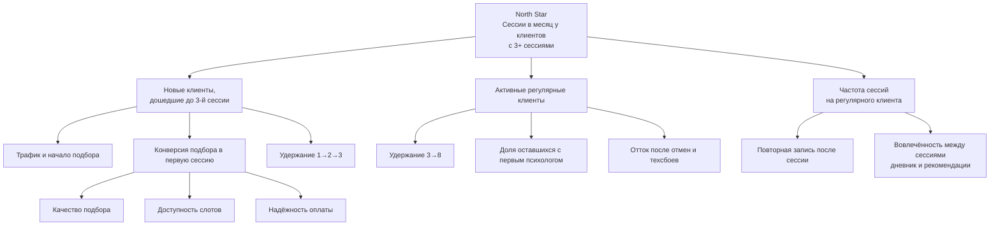

# Метрики и аналитика

> Версия 1.0 · 11.09.2026 · Статус: черновик на утверждение
> Связанные документы: [концепция и цели](01_vision_scope.md) · [интеграции](05_integrations.md) (Яндекс Метрика) · [юридический контур](06_legal_compliance.md) · [блоки](../03_product/teta_platform_blocks.md) (ADM-01, ADM-13, ADM-14, PRO-08, HR-05)

---

## 1. Цели аналитики

1. Измерять выполнение обещаний ДНК: **регулярность** терапии, **качество** психологов, **доверие** и честность условий.
2. Управлять воронкой «визит → первая сессия → регулярная работа» и предложением психологов.
3. Давать операционным ролям сигналы: неудачные списания, инциденты, просроченная модерация.
4. Делать это **без нарушения приватности** клиентов.

## 2. Принципы приватной аналитики

| № | Принцип |
|---|---|
| 1 | В Яндекс Метрику и любые внешние системы **не передаются** темы запросов, ответы анкеты, итоги Германа, значения дневника, заметки, кризисные флаги, email, телефон, имя |
| 2 | Метрика загружается только после согласия на аналитические cookies (идентификаторы cookies — ПДн по позиции РКН) и только на страницах SITE и шагах WIZ-01, WIZ-07; Вебвизор включается только на публичных страницах сайта без форм |
| 3 | Продуктовые события хранятся на серверах ТЕТА в РФ; идентификатор пользователя в событиях — внутренний, без контактов |
| 4 | Аналитика по темам запросов — только агрегированно внутри платформы, для ролей с правом, без выгрузки персональных строк |
| 5 | B2B-отчёты — только группы не меньше `P-B2B-K-ANON` |
| 6 | Сырые события хранятся 13 месяцев, агрегаты — бессрочно [допущение] |
| 7 | Эксперименты не проводятся на кризисных сценариях и на текстах согласий |

## 3. Дерево метрик

## 4. Каталог метрик

| ID | Метрика | Формула / определение | Разрезы | Частота | Где смотреть | Ориентир |
|---|---|---|---|---|---|---|
| MET-01 | **North Star** | Число проведённых сессий за месяц у клиентов, у которых на конец месяца ≥ 3 проведённых сессий | Тенант, канал, B2B | Ежемесячно | ADM-01 | Рост м/м |
| MET-02 | Визит → старт подбора | Уникальные начавшие мастер / уникальные посетители сайта | Канал, посадочная, устройство | Еженедельно | ADM-14 | ≥ 8 % |
| MET-03 | Старт подбора → подписание согласия | Подписавшие согласие на сведения о здоровье / начавшие | Путь (анкета/Герман) | Еженедельно | ADM-14 | ≥ 60 % |
| MET-04 | Подбор → запись | Создавшие бронь / получившие подборку | Путь, наличие слотов | Еженедельно | ADM-14 | ≥ 40 % |
| MET-05 | Старт подбора → первая сессия | Провели 1-ю сессию в течение 14 дней / начавшие | Канал, путь | Еженедельно | ADM-01 | ≥ 25 % |
| MET-06 | Удержание 1→2 | Клиенты со 2-й сессией в течение 21 дня после 1-й / провели 1-ю | Психолог (агрегат), уровень, B2B | Еженедельно | ADM-14 | ≥ 70 % |
| MET-07 | Удержание до 4-й сессии | Клиенты с 4+ сессиями / провели 1-ю (когорта месяца) | Когорта | Ежемесячно | ADM-14 | ≥ 45 % |
| MET-08 | Качество подбора | Клиенты, провёвшие 3 сессии с первым подобранным психологом / провели 3 сессии | Путь подбора | Ежемесячно | ADM-14 | ≥ 75 % |
| MET-09 | Смена психолога | Смены / активные клиенты; распределение причин | Причина, психолог (агрегат) | Ежемесячно | ADM-03b, ADM-14 | Снижение |
| MET-10 | Приватная оценка сессии | Средняя оценка (1–5) | Психолог, уровень | Еженедельно | ADM-03b | ≥ 4,5 |
| MET-11 | Повторная запись после сессии | Записи в течение 48 ч после завершения / завершённые сессии без будущей записи | Психолог, «то же время через неделю» | Еженедельно | ADM-14 | Рост |
| MET-12 | Вовлечённость в дневник | Клиенты с ≥ 1 записью дневника за 7 дней / активные клиенты | — | Еженедельно | ADM-14 | ≥ 40 % [допущение] |
| MET-13 | Выполнение рекомендаций | Рекомендации «выполнена» / отправленные | Тип рекомендации | Ежемесячно | ADM-14 | Рост |
| MET-14 | Отмены клиентом | До списания / после списания, на 100 сессий | Время до сессии | Еженедельно | ADM-14 | ≤ 10 после списания |
| MET-15 | Неявки | Неявки клиента и психолога на 100 сессий | Роль | Еженедельно | ADM-01 | ≤ 3 / ≤ 0,5 |
| MET-16 | Инциденты качества | Инциденты на 100 сессий | Тип | Еженедельно | ADM-12 | ≤ 1 |
| MET-17 | Неудачные списания | Сессии с неуспешной первой попыткой / запланированные списания; и доля неисправленных к `P-CHARGE-DEADLINE` | Банк-эмитент (агрегат), тип карты | Ежедневно | ADM-06 | ≤ 8 % / ≤ 2 % |
| MET-18 | Техпроблемы видео | Сессии со статусом «техническая проблема» или оценкой связи «проблемы» / проведённые | Браузер, ОС | Еженедельно | ADM-04 | ≤ 2 % |
| MET-19 | Загрузка психологов | Забронированные слоты / опубликованные слоты | Психолог, уровень, время суток | Еженедельно | ADM-03b, PRO-08 | 60–80 % |
| MET-20 | Дефицит слотов | Доля подборок, где у рекомендованных нет слотов в предпочтительное время | Время суток, тема (агрегат) | Еженедельно | ADM-14 | Снижение |
| MET-21 | Воронка отбора психологов | Заявки → одобренные; время прохождения | Этап | Ежемесячно | ADM-03a | «1 из 20» |
| MET-22 | Выплаты вовремя | Выплаты, отправленные в срок периода / все | — | По периоду | ADM-06 | ≥ 99 % |
| MET-23 | Оборот (GMV) и выручка | Сумма оплат; комиссия ТЕТА | Уровень, формат, B2B, промокод | Ежемесячно | ADM-06 | План заказчика |
| MET-24 | Средний чек и скидки | Средняя оплата за сессию; доля скидок; кто финансирует | Промокод | Ежемесячно | ADM-06 | — |
| MET-25 | Возвраты | Сумма и доля возвратов; причины | Причина | Ежемесячно | ADM-06 | — |
| MET-26 | Органический трафик | Доля органики в визитах; записи из органики | Кластер темы | Ежемесячно | Метрика, ADM-14 | ≥ 40 % через 6 мес |
| MET-27 | Контент → запись | Переходы из статей в каталог/мастер и записи к автору | Статья, автор | Ежемесячно | ADM-14, PRO-10 | Рост |
| MET-28 | Модерация в срок | Решения в пределах `P-REVIEW-SLA` / все | Тип объекта | Еженедельно | ADM-09 | ≥ 95 % |
| MET-29 | Обращения в поддержку | Обращения на 100 сессий; время первого ответа | Тип обращения | Еженедельно | ADM-12 | ≤ 5; ≤ 1 ч в рабочее время |
| MET-30 | B2B-вовлечённость | Подключившиеся / приглашённые; активные / подключившиеся (агрегат) | Компания | Ежемесячно | ADM-08, HR-05 | Цели договора |
| MET-31 | Отказ от рассылок | Отписки / отправленные маркетинговые письма | Сценарий | По кампании | ADM-11 | ≤ 0,5 % |

## 5. Воронки

### 5.1. Клиент: от визита до регулярной работы

| Шаг | Событие | Метрика шага |
|---|---|---|
| 1 | Визит на сайт (Метрика) | — |
| 2 | `wizard_started` | MET-02 |
| 3 | `consent_health_signed` | MET-03 |
| 4 | `matching_shown` | — |
| 5 | `slot_selected` | — |
| 6 | `card_bound` или `b2b_eligibility_confirmed` | — |
| 7 | `booking_created` | MET-04 |
| 8 | `charge_succeeded` / `b2b_session_covered` | MET-17 |
| 9 | `session_completed` (1-я) | MET-05 |
| 10 | `session_completed` (2-я) | MET-06 |
| 11 | `session_completed` (4-я) | MET-07 |

### 5.2. Психолог: от заявки до практики

`candidate_application_submitted` → `candidate_stage_changed(documents_ok)` → `candidate_stage_changed(interview_passed)` → `candidate_stage_changed(test_session_passed)` → `candidate_approved` → `psychologist_profile_published` → `schedule_published` → первая `session_completed`.

### 5.3. Контент

`article_submitted` → `article_published` → `article_rss_exported` → просмотр (Метрика) → `article_cta_clicked` → `wizard_started` (источник — статья) → `booking_created`.

## 6. Событийная модель продукта

**Соглашения**
- Имя: `объект_действие` в snake_case, прошедшее время.
- Общие свойства: `event_id`, `occurred_at` (UTC), `tenant_id`, `user_id` (внутренний) или `anonymous_id`, `role`, `device_type`, `source` (utm-метки сохраняются при старте мастера), `app_version`.
- **Запрещённые свойства:** темы, тексты, ответы анкеты, значения дневника, заметки, содержимое рекомендаций, контакты.

| Событие | Когда | Специфичные свойства | Модуль |
|---|---|---|---|
| `wizard_started` | Открыт WIZ-01 | `entry_point` (главная/посадочная/статья/каталог) | ANALYTICS |
| `wizard_path_selected` | Выбран путь | `path` (form/aibot/catalog) | MATCH |
| `consent_health_signed` | Подписано согласие ПЭП | `document_version` | CONSENT |
| `questionnaire_completed` | Анкета отправлена | `questions_count`, `duration_s` | MATCH |
| `aibot_dialog_started` / `aibot_summary_confirmed` | Диалог начат / итог подтверждён | `turns_count`, `edited` (bool) | AIBOT |
| `crisis_resources_shown` | Показан экран экстренной помощи | `trigger` (form/aibot/room) — без содержания | CRISIS |
| `matching_shown` | Показана подборка | `candidates_count`, `has_slots_in_preferred_time` | MATCH |
| `manual_matching_requested` | «Подберите вручную» | — | SUPPORT |
| `psychologist_card_viewed` | Открыт профиль | `psychologist_id`, `from` | CATALOG |
| `video_intro_played` | Видеовизитка запущена | `psychologist_id` | CATALOG |
| `slot_selected` / `slot_hold_expired` | Выбран слот / удержание истекло | `lead_time_h` | SCHED |
| `card_bound` / `card_bind_failed` | Карта привязана / ошибка | `reason_code` | PAY |
| `promo_applied` / `promo_rejected` | Промокод | `promo_type`, `reason` | PROMO |
| `booking_created` | Сессия забронирована | `format`, `price_level`, `payer` (client/company), `lead_time_h` | BOOK |
| `charge_scheduled` / `charge_succeeded` / `charge_failed` | Списание | `attempt`, `reason_code` | PAY |
| `booking_auto_cancelled` | Автоотмена из-за неоплаты | — | BOOK |
| `booking_rescheduled` | Перенос | `actor`, `before_charge` (bool) | BOOK |
| `booking_cancelled` | Отмена | `actor`, `before_charge`, `reason_code` | BOOK |
| `time_request_sent` / `time_request_resolved` | Запрос времени | `resolution` (slots_opened/declined) | SCHED |
| `room_joined` / `room_left` | Вход / выход из комнаты | `role`, `browser` | VIDEO |
| `session_completed` / `session_no_show` / `session_tech_issue` | Итог сессии | `duration_min`, `actor_missing` | BOOK |
| `session_rated` | Приватная оценка | `score_bucket`, `connection_ok` (bool) | REVIEW |
| `outcome_submitted` | Итоги психологом | `on_time` (bool), `risk_flag` (bool) | BOOK |
| `reco_created` / `reco_viewed` / `reco_done` | Рекомендации | `reco_type` | RECO |
| `diary_entry_created` | Запись дневника | `source` (login_prompt/diary_page) — без значения | DIARY |
| `diary_share_changed` | Согласие на видимость | `enabled` (bool) | DIARY |
| `psychologist_changed` | Смена психолога | `reason_code` | BOOK |
| `review_submitted` / `review_published` / `review_rejected` | Отзывы | `reason_code` | REVIEW |
| `b2b_member_joined` / `b2b_member_disabled` | Корпоративная программа | `company_id`, `method` (code/domain) | B2B |
| `article_submitted` / `article_published` / `article_rss_exported` | Статьи | `author_id`, `rubric` | CONTENT |
| `article_cta_clicked` | Клик CTA в статье | `article_id` | CONTENT |
| `candidate_application_submitted` / `candidate_stage_changed` / `candidate_approved` | Отбор | `stage` | PSY |
| `payout_created` / `payout_paid` / `payout_suspended` | Выплаты | `reason_code` | PAYOUT |
| `support_ticket_created` | Обращение | `type`, `channel` | SUPPORT |
| `marketing_consent_changed` | Согласие на рекламу | `enabled`, `channel` | CONSENT |

## 7. Яндекс Метрика

### 7.1. Цели (счётчик загружается только на страницах SITE и шагах WIZ-01 и WIZ-07; на шагах анкеты и оплаты, в кабинетах, видеокомнате и админке его нет)

| Идентификатор цели | Когда срабатывает |
|---|---|
| `cta_find_psychologist` | Клик «Подобрать психолога» |
| `cta_talk_german` | Клик «Поговорить с Германом» |
| `wizard_start` | Открыт мастер записи |
| `catalog_filter_used` | Применён фильтр каталога (без значения темы) |
| `psychologist_profile_view` | Просмотр страницы психолога |
| `slot_click` | Клик по слоту |
| `booking_success` | Страница WIZ-07 (без параметров о клиенте) |
| `b2b_lead_sent` | Отправлена форма для компаний |
| `candidate_lead_sent` | Отправлена заявка психолога (переход в PRO-01) |
| `article_cta_click` | Клик CTA в статье |
| `help_now_view` | Просмотр экстренной помощи (для контроля доступности; не для ретаргетинга) |

### 7.2. Электронная коммерция
- Товар: «Сессия · {формат} · {уровень}»; категория — формат; цена — зафиксированная цена брони.
- События: просмотр товара (страница психолога), добавление (выбор слота), покупка (`booking_success`, `id` = внутренний номер брони).
- Без тем, без имени психолога в названии товара [Рек.], без ПДн клиента.

### 7.3. Офлайн-конверсии (R2)
- При старте мастера сохраняется ClientID Метрики (если есть согласие на cookies).
- Выгрузка раз в сутки: `session_completed` (1-я сессия) и «B2B-договор заключён» — по ClientID, без ПДн.

### 7.4. Ретаргетинг
Аудитории ретаргетинга по посещению тематических посадочных **не создаются** — это косвенно раскрывает состояние человека [Рек.].

## 8. Отчёты и дашборды

| Где | Для кого | Содержание | Обновление |
|---|---|---|---|
| ADM-01 Дашборд | Все администраторы | MET-01, 05, 06, 15, 17, 18, 23 + алерты | Каждый час |
| ADM-14 Аналитика | Суперадмин, аналитик | Воронки, удержание, качество подбора, контент, дефицит слотов | Ежедневно |
| ADM-03b Психологи | Менеджер психологов | MET-10, 19, 9, 16 по психологу | Ежедневно |
| ADM-06 Финансы | Финансист | MET-17, 22–25 | Ежедневно |
| ADM-13 Отчёты | Роли с правом | Конструктор выгрузок по фильтрам | По запросу |
| PRO-08 Статистика | Психолог | Сессии, загрузка, удержание своих клиентов, доход, просмотры статей | Ежедневно |
| HR-05 Отчёты (R2) | HR | MET-30 и агрегаты с k-анонимностью | Ежемесячно |

## 9. Алерты

| Алерт | Условие | Получатель |
|---|---|---|
| Рост неудачных списаний | MET-17 первой попытки > 15 % за сутки | Финансист, суперадмин |
| Сбои видео | > 3 сессий с технической проблемой за час | Суперадмин |
| Неявка психолога | Любой случай | Поддержка, менеджер психологов |
| Кризисный инцидент | Любой случай | Дежурный администратор |
| Просроченная модерация | Объекты старше `P-REVIEW-SLA` | Модератор |
| Ошибки интеграций | Доля ошибок вызовов > 5 % за 15 мин | Суперадмин |

## 10. Эксперименты (R2)

- Разрешено: тексты и порядок блоков публичных страниц, варианты карточек подбора, напоминания (время отправки), онбординг кабинета.
- Запрещено: кризисные сценарии, тексты согласий и правил оплаты, цены для отдельных клиентов без публичных условий.
- Минимальная длительность — полная неделя; решение — по заранее заданной метрике и порогу.
