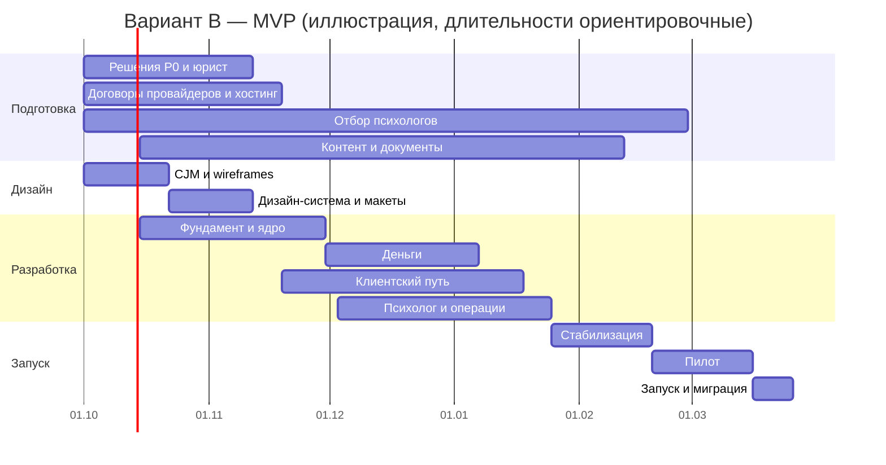
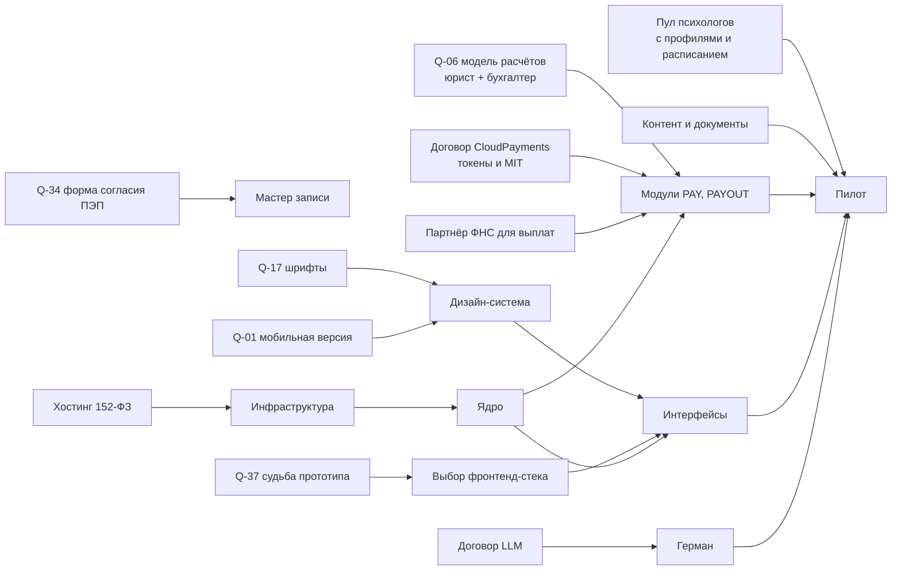

# Роадмап и релизы

> Версия 1.0 · 11.09.2026 · Статус: черновик на утверждение
> Все сроки — **оценки аналитика** для планирования; уточняются после выбора команды, решений P0 ([open_questions.md](../01_inputs/open_questions.md)) и оценки разработчиками. Состав релизов — [teta_platform_blocks.md](../03_product/teta_platform_blocks.md), раздел 11.

---

## 1. Реалистичность сроков ТЗ

ТЗ (раздел 11) закладывает **13 недель** на проектирование, дизайн, бэкенд, фронтенд, видео, дневник, рекомендации, админку, тестирование и запуск. Бриф добавляет вебинары и курсы на старте, промокоды, корпоративные тарифы, автопостинг в Дзен.

| Что входит в объём ТЗ + брифа | Масштаб |
|---|---|
| Интерфейсы | Сайт (SSR, ≈ 30 шаблонов и страниц) + мастер записи + 3 кабинета + видеокомната + админ-панель (17 разделов) |
| Функциональные модули ядра | 32 ([product_architecture.md](../06_architecture/product_architecture.md), раздел 3) |
| Интеграции | CloudPayments, CloudKassir, выплаты самозанятым и проверка НПД, видеосервер, Jivo, DashaMail, Дзен, Метрика, LLM |
| Правовой контур | Спецкатегории ПДн, ПЭП-согласия, 54-ФЗ, НПД, ИСПДн — с документами и уведомлением РКН |
| Не-разработка | Отбор психологов, контент (13 посадочных, FAQ, документы, статьи), миграция с Tilda и OnDoc |

**Вывод:** за 13 недель реалистичен только **строгий пилотный MVP** (вариант A ниже). Полный MVP по документации — **≈ 24–28 недель** при параллельной работе 4–6 разработчиков. Разработка с помощью Claude Code сокращает время написания кода, но не сокращает сроки юридических решений, договоров с провайдерами, отбора психологов, дизайна, тестирования и пилота.

## 2. Варианты плана

| Параметр | Вариант A — «Пилот за 13–16 недель» | **Вариант B — «MVP по документации» (рекомендуется)** |
|---|---|---|
| Срок до запуска | 13–16 недель | 24–28 недель |
| Подбор | Анкета + ручной подбор; **без Германа** | Анкета + Герман + алгоритм с причинами |
| Оплата | Привязка карты и списание за 12 ч, чеки | То же + двухстадийная опция, монитор списаний |
| Выплаты | Реестр выплат выгружается финансистом, чеки НПД вручную | Автоматические еженедельные выплаты через партнёра ФНС |
| Видео | Встраиваемый Jitsi (минимальная кастомизация) | Собственная видеокомната на выбранном SFU (ADR) |
| Кабинет клиента | Сессии, перенос/отмена, платежи, дневник, рекомендации | Полный CL (MVP) |
| Кабинет психолога | Расписание, клиенты и заметки, итоги, рекомендации, профиль | Полный PRO (MVP), включая статьи и базу знаний |
| Контент | Статьи редакции, RSS в Дзен | Статьи психологов с модерацией, 13 посадочных |
| B2B | Нет | Корпоративные коды и счета в админке |
| Вебинары | Внешние ссылки на странице | Облегчённый модуль мероприятий |
| Админка | Минимум: клиенты, психологи, сессии, платежи, модерация, промокоды | ADM MVP полностью |
| Риски | Ручные операции, технический долг, повторная работа над видео и выплатами | Дольше до первой выручки |

## 3. План варианта B по фазам

| Фаза | Содержание | Длительность | Выход (критерии) |
|---|---|---|---|
| **0. Подготовка** (параллельно фазам 1–3) | Решения P0 (Q-01, Q-04–Q-08, Q-12–Q-14, Q-17, Q-33, Q-34, Q-37); юрист: модель расчётов, оферты, согласия, ПЭП; договоры CloudPayments (токены, MIT, выплаты), партнёра ФНС, хостинга 152-ФЗ, LLM; уведомление РКН; старт отбора психологов; контент-план | 4–6 недель (юридическая часть до 8) | Все P0 закрыты; договоры подписаны или в финальной стадии |
| **1. Дизайн** | CJM и wireframes по [teta_platform_blocks.md](../03_product/teta_platform_blocks.md); дизайн-система (кириллические шрифты, токены, компоненты, состояния, WCAG); макеты сайта, мастера, CL, ROOM, PRO, ADM; юзабилити-тест прототипа мастера записи на 5–8 респондентах из ЦА | 5–6 недель | Утверждённые макеты ключевых сценариев; UI-кит |
| **2. Фундамент и ядро** | Инфраструктура в РФ, CI/CD, окружения; AUTH, CONSENT (ПЭП), TENANT, AUDIT, FILES, ADMIN (параметры, модерация профилей психологов); PSY (заявка, отбор, публикация профиля), SCHED (слоты, удержание), BOOK (жизненный цикл) | 6–7 недель (стартует на 3-й неделе дизайна) | Сквозной сценарий «психолог опубликован → слот → бронь» через API |
| **3. Деньги** | PAY (привязка, планировщик T−12 ч, ретраи, возвраты, CloudKassir), PROMO, PAYOUT (начисления, проверка НПД, реестр, выплаты), B2B-базово | 5–6 недель (параллельно фазе 4) | Тестовые операции в песочнице проходят: списание, отказ, возврат, чек, выплата |
| **4. Клиентский путь** | SITE (шаблоны, CMS, SEO), WIZ (анкета, согласия, подбор, запись), MATCH, AIBOT и CRISIS (детерминированный кризисный детектор, псевдонимизация), CL, VIDEO/ROOM, DIARY, RECO, REVIEW, NOTIF (транзакционные письма) | 8–9 недель | Клиент проходит путь до видеосессии и повторной записи |
| **5. Психолог и операции** | PRO (расписание, клиенты, CRM-заметки, итоги, финансы, статистика, статьи, база знаний), CONTENT (модерация, RSS Дзена), ADM (все MVP-разделы), SUPPORT, CRISIS (очередь инцидентов и регламент), ANALYTICS (события, Метрика), SEARCH | 7–8 недель (перекрывается с фазой 4) | Психолог и администраторы работают без обходных путей |
| **6. Стабилизация** | Сквозные e2e-тесты, нагрузочные тесты видео и списаний, security review и пентест, доступность, SEO-аудит, миграция данных и редиректы | 3–4 недели | Нет блокирующих дефектов; пентест без критичных замечаний |
| **7. Пилот** | Закрытая бета: 10–15 психологов, 30–60 клиентов (включая сотрудников дружественной компании) | 3–4 недели | Метрики пилота (раздел 6) достигнуты или понятны корректировки |
| **8. Запуск** | Переключение домена, редиректы, отключение Tilda-корзины, период параллельной работы OnDoc | 1–2 недели | Трафик и записи идут через новую платформу |

### 3.1. Календарный план (иллюстрация)

Дата старта условная — «после утверждения документации».

## 4. Состав релизов

### 4.1. MVP
Полный перечень — [teta_platform_blocks.md, раздел 11](../03_product/teta_platform_blocks.md#11-сводка-по-релизам). Ключевое:
- сайт с каталогом, 13 посадочными, статьями, документами и экстренной помощью;
- мастер записи: анкета и Герман, подбор с причинами, запись с привязкой карты;
- кабинет клиента: сессии, дневник эмоций, рекомендации, платежи, согласия;
- видеосессии на десктопе;
- кабинет психолога: отбор, расписание, клиенты и заметки, итоги, рекомендации, выплаты, статьи, база знаний;
- админ-панель: отбор, модерация, финансы и выплаты, промокоды, корпоративные программы (базово), поддержка и инциденты, отчёты, аудит.

### 4.2. R2 (≈ 10–12 недель после запуска)

| Направление | Состав |
|---|---|
| Рост | Реферальная программа, подарочные сертификаты, психологические тесты, SEO-страницы сочетаний фильтров |
| Удержание | Telegram-бот и web-push для напоминаний, регулярная запись серией, экспорт дневника |
| Мобильность | Видеосессии в мобильных браузерах |
| B2B | Кабинет HR (HR-01…07), корпоративные вебинары |
| Психологи | Интервизия, мероприятия для психологов, синхронизация календарей, расширенная статистика статей |
| Платежи | Иностранные карты, СБП (по возможностям провайдера), абонементы — после валидации цен |
| Аналитика | Когорты, BI-дашборды, регулярные отчёты |
| Вход | Вход через Яндекс ID / VK ID (X-01) |

### 4.3. R3 (≈ 6+ месяцев после запуска)

| Направление | Состав |
|---|---|
| White-label | Кабинет партнёра (WL-01…08), ADM-15, отчёты по взаиморасчётам (WL-07; сами расчёты — вне автоматического биллинга, BR-WL-03) |
| Форматы | Групповые форматы, групповые интервизии по видео |
| Интеграции | Apple Health / Health Connect (при появлении нативного приложения) |
| Каналы (исследование) | ДМС и EAP-партнёрства — бизнес-направление; требования будут описаны отдельно |

## 5. Критический путь и зависимости

| Зависимость | Почему критична | Срок решения |
|---|---|---|
| Модель расчётов (Q-06) | Определяет чеки, выплаты, оферты, налоги | До старта фазы 3 |
| Форма согласия (Q-34) и политика отмены (Q-33) | Влияют на мастер записи и оферту | До wireframes мастера |
| Шрифты (Q-17), мобильная версия (Q-01) | Меняют дизайн-систему и объём макетов | До фазы 1 |
| Прототип test.teta.su (Q-37) | Выбор фронтенд-стека и CMS | До фазы 2 |
| Договоры CloudPayments и партнёра ФНС | Без MIT-списаний и выплат нет модели ТЗ | До фазы 3 |
| Пул психологов | Без слотов подбор пуст (RISK-05) | К пилоту: 10–15 психологов; к запуску — по плану заказчика |

## 6. Пилот: цели и метрики

| Метрика | Порог успеха пилота |
|---|---|
| Доля клиентов пилота, прошедших путь до первой сессии без помощи поддержки | ≥ 80 % |
| Доля сессий с технической проблемой | ≤ 5 % |
| Неудачные списания, не исправленные до начала сессии | ≤ 3 % |
| Средняя приватная оценка сессии | ≥ 4,3 из 5 |
| Доля клиентов, записавшихся на вторую сессию | ≥ 60 % |
| Психологи: итоги сессий заполнены в срок | ≥ 90 % |
| Критичные дефекты безопасности и ПДн | 0 |
| Качественная обратная связь | Интервью с 8–10 клиентами и 5 психологами |

## 7. Сопоставление с этапами ТЗ

| Этап ТЗ | Недели по ТЗ | Соответствие в варианте B | Комментарий |
|---|---|---|---|
| 1. Проектирование и дизайн | 1–3 | Фаза 0 + фаза 1 (≈ 6 недель) | Добавлены юридические решения и дизайн-система с кириллицей |
| 2. Бэкенд (база) | 2–3 | Фаза 2 (≈ 7 недель) | Добавлены согласия с ПЭП, мультиарендность, аудит |
| 3. Фронтенд, кабинеты, расписание, платежи | 4–7 | Фазы 3–4 | Платежи выделены: планировщик списаний, чеки, выплаты |
| 4. Видео, дневник, рекомендации | 8–11 | Фаза 4 | — |
| 5. Админка, тестирование, запуск | 12–13 | Фазы 5–8 | Добавлены пентест, пилот, миграция |

## 8. Рекомендуемый состав команды (вариант B)

| Роль | Загрузка |
|---|---|
| Продуктовый менеджер / аналитик (владелец документации) | 1 |
| UX/UI-дизайнер | 1 (фазы 1, 4–5 — частично) |
| Техлид / архитектор | 1 |
| Бэкенд-разработчики | 2 |
| Фронтенд-разработчики | 2 |
| QA-инженер | 1 (с фазы 3) |
| DevOps / ИБ | 0,5 + внешний пентест |
| Юрист, бухгалтер | Консультации (фаза 0 и перед запуском) |
| Контент: Дарья + редактор | Параллельно |
| Менеджер психологов | Параллельно с фазы 0 |

## 9. Контрольные точки согласования с заказчиком

| КТ | Когда | Что утверждается |
|---|---|---|
| КТ-0 | Сейчас | Документация, вариант плана, ответы на P0 |
| КТ-1 | Конец фазы 1 | Макеты и дизайн-система |
| КТ-2 | Середина фаз 3–4 | Демонстрация сквозного сценария записи и оплаты на тестовом стенде |
| КТ-3 | Конец фазы 6 | Готовность к пилоту, отчёт по безопасности |
| КТ-4 | Конец пилота | Решение о запуске, корректировки R2 |
