# Архитектура продукта ТЕТА

> Версия 1.0 · 11.09.2026 · Статус: черновик на утверждение
> Документ описывает **продуктовую (блочную) архитектуру**: из каких контуров, разделов и функциональных модулей состоит платформа, как они связаны и какие роли ими пользуются.
> Детализация до блоков и полей — [teta_platform_blocks.md](../03_product/teta_platform_blocks.md). Техническая реализация (сервисы, стек, инфраструктура) — [technical_architecture.md](technical_architecture.md). Модель данных — [data_model.md](data_model.md). Последовательности и состояния — [sequences_states.md](sequences_states.md).

## Уровни описания

| Уровень | Что показывает | Раздел |
|---|---|---|
| L0 | Платформа в окружении: пользователи и внешние системы | 1 |
| L1 | Контуры продукта и функциональные модули | 2, 3 |
| L2 | Структура каждого контура: сайт, мастер записи, кабинет клиента, видеокомната, кабинет психолога, админ-панель, кабинет HR, кабинет партнёра | 4–11 |
| L3 | Блоки, поля, состояния | [teta_platform_blocks.md](../03_product/teta_platform_blocks.md) |

---

## 1. L0 — платформа в окружении

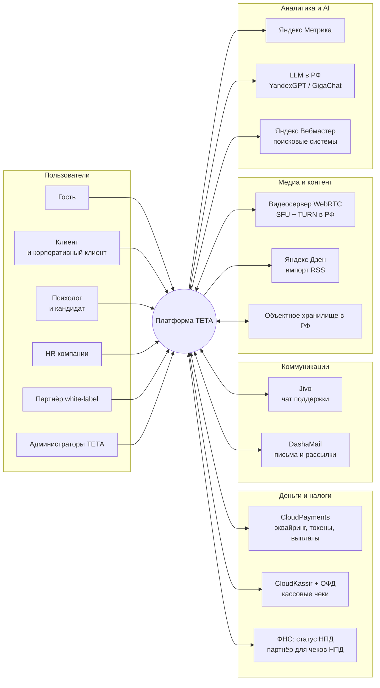

| Внешняя система | Что получает от ТЕТА | Что отдаёт ТЕТА | Ограничения по данным |
|---|---|---|---|
| CloudPayments | Запросы на привязку карты, списания, возвраты, выплаты | Токены, статусы (вебхуки Check/Pay/Fail/Confirm/Refund/Cancel) | Реквизиты карт в ТЕТА не попадают |
| CloudKassir + ОФД | Состав чека, признаки агента и поставщика (по модели Q-06) | Фискальные данные, ссылка на чек | — |
| ФНС (статус НПД) / партнёр ФНС | ИНН психолога, данные выплаты | Статус НПД, чек НПД | ПДн психологов |
| Jivo | Непрозрачный токен пользователя, роль, ссылка на карточку в админке | Диалоги, события чатов | **Без тем запросов и сведений о здоровье** |
| DashaMail | Транзакционные письма; маркетинговые подписчики с согласием | Статусы доставки, отписки | Сегменты без чувствительных атрибутов |
| Видеосервер (self-hosted) | Токены доступа в комнату | Журнал подключений | Медиа не записывается |
| Яндекс Дзен | RSS-лента опубликованных статей | — | Только публичный контент |
| Объектное хранилище | Фото, видеовизитки, документы психологов, вложения рекомендаций | — | Документы — приватный доступ |
| Яндекс Метрика | Цели и электронная коммерция после cookie-согласия | Отчёты | Вебвизор отключён в кабинетах; без ПДн и тем |
| LLM | Псевдонимизированный текст диалога с Германом | Структурированный итог запроса | Логирование у провайдера отключено |
| Яндекс Вебмастер | Sitemap, переобход страниц | Индексация | — |

---

## 2. L1 — контуры продукта

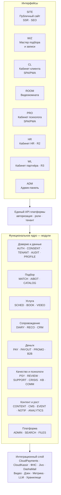

**Принцип:** все интерфейсы — клиенты одного API и одного функционального ядра. Контур не содержит собственной бизнес-логики; правила (BR) живут в модулях ядра. Это позволяет выпускать кабинет HR и white-label, не переписывая сессии, платежи и подбор.

| Контур | Роли | Технический формат | Главные модули | Релиз |
|---|---|---|---|---|
| SITE — публичный сайт | Гость, все | Серверный рендеринг (SEO) | CATALOG, CONTENT, CMS, EVENT, SEARCH, CONSENT | MVP |
| WIZ — мастер подбора и записи | Гость, клиент | Серверный рендеринг + интерактивные шаги | MATCH, AIBOT, SCHED, BOOK, PAY, PROMO, AUTH, CONSENT, CRISIS | MVP |
| CL — кабинет клиента | Клиент, корпоративный клиент | SPA/PWA, адаптив | BOOK, DIARY, RECO, PAY, REVIEW, NOTIF, SUPPORT, CONSENT, PROFILE | MVP |
| ROOM — видеокомната | Клиент, психолог | Web, WebRTC, десктоп | VIDEO, BOOK, CRM (панель психолога), CRISIS | MVP |
| PRO — кабинет психолога | Кандидат, психолог | SPA/PWA, десктоп-первый | PSY, SCHED, CRM, RECO, PAYOUT, CONTENT, KB, COMM, FILES | MVP |
| HR — кабинет HR | HR-менеджер, наблюдатель | SPA | B2B, ANALYTICS, NOTIF | R2 |
| WL — кабинет партнёра | Администратор партнёра | SPA | TENANT, PSY, CMS, PAY | R3 |
| ADM — админ-панель | 7 подролей администраторов | SPA | Все модули | MVP |

---

## 3. Функциональные модули ядра

Коды модулей едины для всех документов: функциональные требования (`FR-<КОД>-NNN`), техническая архитектура, бэклог.

| Код | Модуль | Ответственность | Ключевые сущности | Релиз |
|---|---|---|---|---|
| AUTH | Идентификация и доступ | Регистрация, вход по коду/ссылке, пароль, 2FA, сеансы, роли и мультироли | Пользователь, роль, сеанс | MVP |
| CONSENT | Документы и согласия | Версии документов, фиксация и отзыв согласий, ПЭП-подписание, cookie-согласие | Документ, версия, согласие | MVP |
| TENANT | Мультиарендность | Тенант, брендирование, изоляция данных | Тенант, настройки бренда | Модель MVP, функции R3 |
| AUDIT | Аудит | Журнал действий и просмотров чувствительных данных, «показать с причиной» | Запись аудита | MVP |
| PROFILE | Профиль клиента | Псевдоним, часовой пояс, настройки уведомлений, удаление аккаунта | Профиль клиента | MVP |
| MATCH | Подбор | Справочники тем и методов, конструктор анкеты, анкеты клиентов, алгоритм ранжирования, причины рекомендаций | Тема, метод, анкета, ответ, подборка | MVP |
| AIBOT | AI-помощник «Герман» | Диалог, псевдонимизация, итоговая карточка запроса, ограничения | Диалог, итог запроса | MVP |
| CATALOG | Каталог | Публичные профили, фильтры, сортировка, похожие психологи | Публичный профиль | MVP |
| PSY | Психологи | Заявка кандидата, этапы отбора, собеседования, статусы, уровни, модерация профиля, документы | Кандидат, этап отбора, психолог, уровень | MVP |
| SCHED | Расписание | Рабочие часы, исключения, отпуска, генерация слотов, удержание слота, запросы «нет времени», iCal | Шаблон недели, исключение, отпуск, слот, запрос времени | MVP |
| BOOK | Сессии | Бронирование, жизненный цикл сессии, перенос, отмена, неявка, смена психолога, итоги | Сессия, история статусов, итоги сессии | MVP |
| VIDEO | Видеосвязь | Комнаты, токены, проверка оборудования, журнал подключений | Комната, подключение | MVP |
| DIARY | Дневник эмоций | Записи, шкала и метки, согласия на видимость, графики | Запись дневника, доступ психолога | MVP |
| RECO | Рекомендации | Рекомендации к сессиям, вложения, шаблоны, статусы | Рекомендация, шаблон | MVP |
| CRM | Карточка клиента у психолога | Список клиентов, заметки (шифрование), цели, флаги | Отношение «клиент — психолог», заметка, цель | MVP |
| PAY | Платежи | Способы оплаты (токены), планировщик списаний, повторы, возвраты, чеки, сверка | Способ оплаты, платёж, чек, согласие на автосписание | MVP |
| PAYOUT | Выплаты | Начисления, периоды, реестры выплат, проверка НПД, чеки НПД, удержания | Начисление, выплата, реквизиты | MVP |
| PROMO | Промо | Промокоды, условия, использования; рефералка и сертификаты — R2 | Промокод, использование | MVP |
| B2B | Корпоративные программы | Компании, договоры, условия, коды и домены, стоп-лист, лимиты, счета, отчёты | Компания, программа, участие, счёт | MVP базово, R2 кабинет |
| REVIEW | Отзывы и оценки | Отзывы о психологах, модерация, приватные оценки сессий | Отзыв, оценка сессии | MVP |
| CONTENT | Статьи | Статьи психологов и редакции, рубрики, статусы, RSS для Дзена | Статья, рубрика, версия | MVP |
| KB | База знаний | Материалы, категории, права использования, избранное | Материал базы знаний | MVP |
| COMM | Интервизия | Ветки, комментарии, модерация | Ветка, комментарий | R2 |
| EVENT | Мероприятия | Вебинары, регистрации, ссылки на эфир; курсы — R2 | Мероприятие, регистрация | MVP облегчённо |
| NOTIF | Уведомления | Шаблоны, триггеры, отправка email, центр уведомлений, синхронизация с DashaMail | Шаблон, уведомление, подписка | MVP |
| SUPPORT | Поддержка | Обращения, SLA, интеграция Jivo, инциденты качества | Обращение, инцидент | MVP |
| CRISIS | Кризисный протокол | Скрининг, детектор признаков, инциденты, ресурсы помощи | Кризисный флаг, инцидент | MVP |
| CMS | Управляемый контент | Страницы и блоки, FAQ, баннеры, юридические тексты, SEO-шаблоны, редиректы | Страница, блок, редирект | MVP |
| SEARCH | Поиск | Индексы психологов, статей, базы знаний, админ-поиск | Поисковый индекс | MVP |
| FILES | Файлы | Загрузка, антивирус, приватные ссылки, конвертация видео | Файл | MVP |
| ANALYTICS | Аналитика | Продуктовые события, метрики, отчёты, конструктор выгрузок, отправка в Метрику | Событие, отчёт | MVP |
| ADMIN | Администрирование | Параметры бизнес-правил, роли администраторов, флаги функций, интеграции | Параметр, роль администратора, флаг | MVP |

> **Сквозные сервисы без отдельного модуля:** единая очередь модерации (X-08) реализуется в ADMIN, а объекты модерации принадлежат CONTENT, REVIEW и PSY; брендирование тенанта — TENANT; дизайн-система (X-14) — общий фронтенд-пакет, а не модуль ядра.

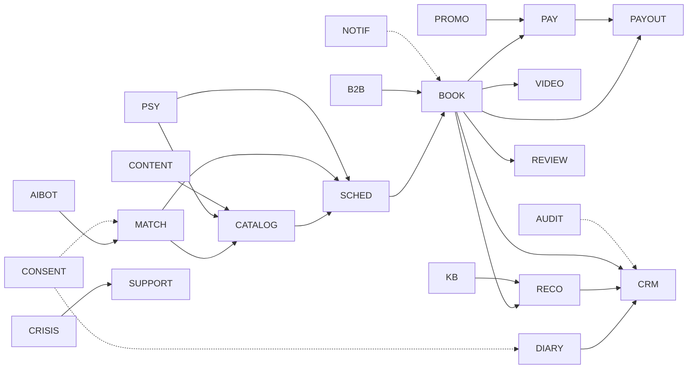

*Стрелка — «использует данные или события». Пунктир — «ограничивает доступ или реагирует на события».*

---

## 4. L2 — публичный сайт (SITE)

### 4.1. Дерево разделов

```mermaid
flowchart TB
  ROOT["teta.su"]
  ROOT --> HOME["Главная · SITE-01"]
  ROOT --> PSY["Психологи"]
  PSY --> CAT["Каталог · SITE-02<br/>/psychologists"]
  CAT --> PCARD["Страница психолога · SITE-03<br/>/psychologists/slug"]
  ROOT --> CLIENTS["Клиентам"]
  CLIENTS --> HOW["Как это работает · SITE-04"]
  CLIENTS --> PRICES["Цены и оплата · SITE-05"]
  CLIENTS --> HELP["С чем помогаем · SITE-06<br/>13 посадочных /help/тема"]
  CLIENTS --> FAQ["Вопросы и ответы · SITE-14"]
  CLIENTS --> SOS["Экстренная помощь · SITE-15"]
  ROOT --> MEDIA["Материалы"]
  MEDIA --> BLOG["Статьи · SITE-07<br/>/articles/рубрика"]
  BLOG --> ART["Статья · SITE-08"]
  MEDIA --> EVENTS["Вебинары · SITE-09"]
  MEDIA --> TESTS["Тесты · SITE-19 · R2"]
  ROOT --> PARTNERS["Партнёрам"]
  PARTNERS --> BIZ["Для компаний · SITE-10"]
  PARTNERS --> FORPSY["Для психологов · SITE-11"]
  ROOT --> ABOUT["О ТЕТА · SITE-12<br/>отбор психологов · этический кодекс"]
  ROOT --> REVIEWS["Отзывы · SITE-13"]
  ROOT --> CONTACTS["Контакты · SITE-16"]
  ROOT --> LEGAL["Документы · SITE-17"]
  ROOT --> SYS["Системные · SITE-18<br/>вход · подтверждение email · отписка · 404"]
  ROOT --> GIFT["Сертификаты · SITE-20 · R2"]
  ROOT --> START["Мастер записи · WIZ<br/>/start"]
```

### 4.2. Шаблоны страниц

| Шаблон | Страницы | Особенности |
|---|---|---|
| Главная | SITE-01 | Управляемые блоки из CMS |
| Листинг с фильтрами | SITE-02, SITE-07, SITE-09 | Состояние фильтров в URL, номерная пагинация |
| Карточка психолога | SITE-03 | Живое расписание, микроразметка Person |
| Посадочная темы | SITE-06 ×13 | Хаб SEO-кластера: психологи по теме + статьи рубрики + FAQ |
| Статья | SITE-08 | Карточка автора с CTA, микроразметка Article |
| Лендинг | SITE-10, SITE-11, SITE-04, SITE-05 | Блоки из CMS, формы заявок |
| Текстовая страница | SITE-12, SITE-14, SITE-15, SITE-16 | CMS |
| Юридический документ | SITE-17 | Версии, дата вступления в силу, архив |
| Системная | SITE-18 | Минимальный каркас |

### 4.3. SEO-архитектура: кластеры по запросам

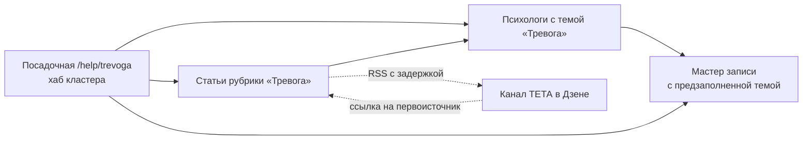

13 кластеров = 13 тем из брифа. Перелинковка «тема ↔ психологи ↔ статьи» строится автоматически по справочнику тем (модуль MATCH): одна сущность управляет анкетой, фильтрами каталога, рубриками блога и посадочными.

### 4.4. Навигационная модель
- **Шапка:** Психологи · Как это работает · Цены · Статьи · Для компаний · Для психологов · Войти · CTA «Подобрать психолога».
- **Футер:** О ТЕТА · Клиентам · Партнёрам · Документы · соцсети · реквизиты · дисклеймер.
- **Сквозные входы в мастер записи:** CTA на всех страницах; тема и психолог передаются в мастер как параметры.
- **Экстренная помощь** — ссылка в футере каждой страницы, в мастере, в кабинетах, в видеокомнате.

---

## 5. L2 — мастер подбора и записи (WIZ)

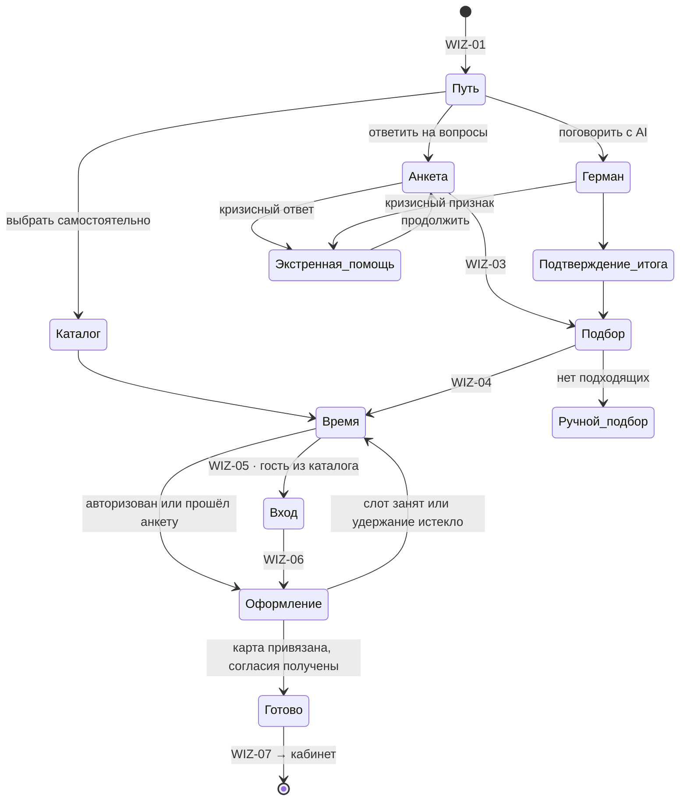

| Шаг | Раздел | Модули | Данные, которые создаются |
|---|---|---|---|
| Выбор пути | WIZ-01 | ANALYTICS | Событие начала подбора, источник |
| Анкета | WIZ-02a | MATCH, CONSENT, AUTH, CRISIS | Черновик в браузере до подписания; пользователь с подтверждённым email; подписанные согласия; анкета; кризисный флаг |
| Диалог с Германом | WIZ-02b | AIBOT, CRISIS, CONSENT | Диалог (ограниченный срок хранения), итог запроса |
| Подбор | WIZ-03 | MATCH, CATALOG, SCHED | Подборка с причинами (для правил рекомендательных технологий) |
| Время | WIZ-04 | SCHED | Удержание слота |
| Вход (только путь через каталог) | WIZ-05 | AUTH, B2B, PROMO | Пользователь, подтверждённый email, участие в корпоративной программе |
| Оформление | WIZ-06 | BOOK, PAY, PROMO, B2B, CONSENT | Сессия, способ оплаты, согласие на автосписание, использование промокода, задание на списание |
| Готово | WIZ-07 | NOTIF | Письмо-подтверждение, файл календаря |

---

## 6. L2 — кабинет клиента (CL)

### 6.1. Структура

```mermaid
flowchart TB
  CL["Кабинет клиента /app"]
  CL --> ENTRY["Отметка состояния при входе · CL-01"]
  CL --> MAIN["Главная · CL-02<br/>ближайшая сессия · рекомендации · дневник · следующий шаг"]
  CL --> SES["Сессии · CL-03"]
  SES --> RESCH["Перенос · CL-03a"]
  SES --> CANCEL["Отмена · CL-03b"]
  SES --> NEWB["Новая запись · CL-03c"]
  CL --> MYPSY["Мой психолог · CL-04"]
  MYPSY --> CHANGE["Смена психолога · CL-04a"]
  CL --> RECO["Рекомендации · CL-05"]
  CL --> DIARY["Дневник эмоций · CL-06"]
  CL --> PAYM["Платежи · CL-07<br/>карта · списания · чеки · промокоды · B2B"]
  CL --> SET["Настройки · CL-08<br/>профиль · уведомления · согласия · безопасность · удаление"]
  CL --> REV["Отзывы · CL-10"]
  CL --> RATE["Оценка после сессии · CL-11"]
  CL --> SUP["Поддержка · CL-12"]
  CL --> NOTIFC["Центр уведомлений · CL-14"]
  CL --> R2["R2: мероприятия · пригласить друга · сертификаты"]
  MAIN --> ROOM["Видеокомната · ROOM"]
```

### 6.2. Модель навигации
- Десктоп: левое меню из 8 пунктов + центр уведомлений в шапке.
- Телефон: нижняя панель «Главная · Сессии · Дневник · Рекомендации · Ещё».
- Модальные сценарии (перенос, отмена, запись, смена психолога, оценка) открываются из любого раздела и возвращают туда, откуда вызваны.

### 6.3. Главная как конечный автомат
Главная кабинета не статична: её главный блок определяется состоянием клиента.

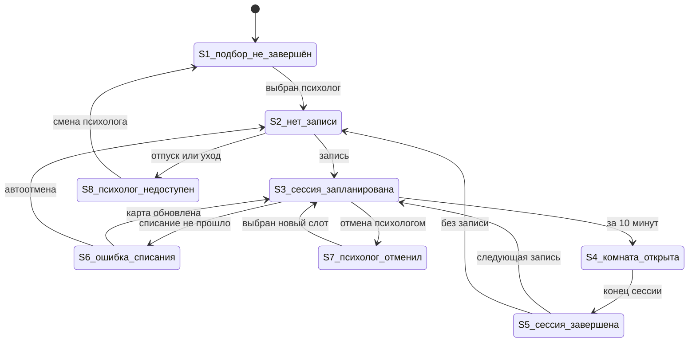

S9 (лимит корпоративной программы исчерпан) — модификатор поверх S2/S3: меняет только блок оплаты.

---

## 7. L2 — видеокомната (ROOM)

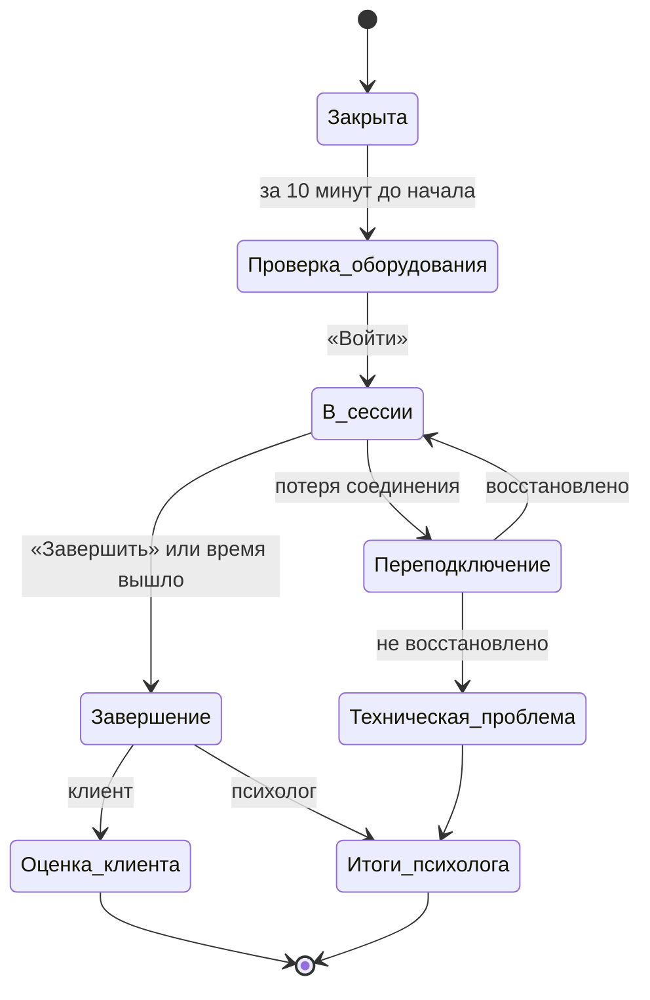

| Компонент | Клиент | Психолог |
|---|---|---|
| Проверка оборудования | ✔ | ✔ |
| Видео, микрофон, камера, устройства | ✔ | ✔ |
| Демонстрация экрана | R2 | ✔ |
| Таймер | ✔ | ✔ + предупреждение за 5 мин |
| Панель «запрос, дневник, заметки» | — | ✔ (по согласиям клиента) |
| Кнопка кризисной ситуации | Ссылка на экстренную помощь | Инцидент |
| Журнал подключений | Автоматически | Автоматически |

---

## 8. L2 — кабинет психолога (PRO)

### 8.1. Структура

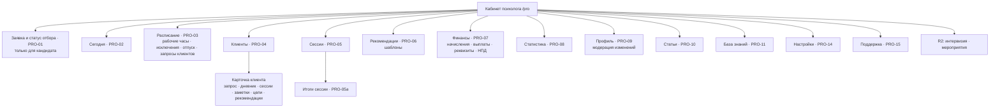

### 8.2. Рабочий цикл психолога

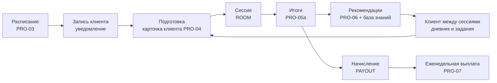

### 8.3. Путь кандидата

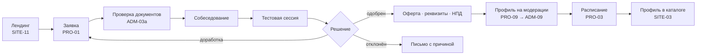

---

## 9. L2 — админ-панель (ADM)

### 9.1. Структура по рабочим местам

```mermaid
flowchart TB
  ADM["Админ-панель /admin"]
  ADM --> DASH["Дашборд · ADM-01"]

  ADM --> WS_PSY["Рабочее место<br/>менеджера психологов"]
  WS_PSY --> A03a["Отбор кандидатов · ADM-03a"]
  WS_PSY --> A03b["Психологи · ADM-03b"]
  WS_PSY --> A05["Подбор и справочники · ADM-05"]

  ADM --> WS_MOD["Рабочее место<br/>модератора контента"]
  WS_MOD --> A09["Модерация · ADM-09"]
  WS_MOD --> A10["Контент · ADM-10"]

  ADM --> WS_FIN["Рабочее место<br/>финансиста"]
  WS_FIN --> A06["Финансы · ADM-06"]
  WS_FIN --> A07["Промо · ADM-07"]

  ADM --> WS_SUP["Рабочее место<br/>поддержки"]
  WS_SUP --> A02["Клиенты · ADM-02"]
  WS_SUP --> A04["Сессии · ADM-04"]
  WS_SUP --> A12["Поддержка и инциденты · ADM-12"]

  ADM --> WS_B2B["Рабочее место<br/>B2B-менеджера"]
  WS_B2B --> A08["Корпоративные клиенты · ADM-08"]

  ADM --> WS_AN["Аналитик"]
  WS_AN --> A13["Отчёты и выгрузки · ADM-13"]
  WS_AN --> A14["Аналитика · ADM-14"]

  ADM --> WS_SA["Суперадмин"]
  WS_SA --> A11["Уведомления · ADM-11"]
  WS_SA --> A16["Настройки · ADM-16"]
  WS_SA --> A17["Администраторы и аудит · ADM-17"]
  WS_SA --> A15["Партнёры · ADM-15 · R3"]
```

### 9.2. Разделы × подроли (сводно; детально — [roles_permissions.xlsx](../03_product/roles_permissions.xlsx))

| Раздел | Суперадмин | Менеджер психологов | Модератор | Финансист | Поддержка | B2B-менеджер | Аналитик |
|---|---|---|---|---|---|---|---|
| ADM-01 Дашборд | ● | ● | ● | ● | ● | ● | ● |
| ADM-02 Клиенты | ● | ○ | — | ○ | ● | ○ | ○ агрегаты |
| ADM-03 Психологи | ● | ● | ○ профиль | ○ финансы | ○ | — | ○ агрегаты |
| ADM-04 Сессии | ● | ○ | — | ○ | ● | — | ○ |
| ADM-05 Подбор и справочники | ● | ● | ○ методы | — | — | — | ○ |
| ADM-06 Финансы | ● | — | — | ● | ○ возвраты | ○ счета B2B | ○ отчёты |
| ADM-07 Промо | ● | — | — | ● | ○ | ○ | ○ |
| ADM-08 Корпоративные клиенты | ● | — | — | ○ счета | — | ● | ○ |
| ADM-09 Модерация | ● | ○ профили | ● | — | — | — | — |
| ADM-10 Контент | ● | ○ база знаний | ● | — | — | — | — |
| ADM-11 Уведомления | ● | — | ○ шаблоны | — | ○ журнал | — | ○ |
| ADM-12 Поддержка и инциденты | ● | ○ качество | — | — | ● | — | — |
| ADM-13 Отчёты | ● | ○ | — | ● | ○ | ○ | ● |
| ADM-14 Аналитика | ● | ○ | ○ | ○ | — | ○ | ● |
| ADM-15 Партнёры (R3) | ● | ○ психологи партнёров | — | ○ взаиморасчёты | — | — | ○ |
| ADM-16 Настройки | ● | — | — | ○ комиссии | — | — | — |
| ADM-17 Администраторы и аудит | ● | — | — | — | — | — | ○ чтение журнала |

● полный доступ · ○ ограниченный доступ (указано к чему) · — нет доступа. Сведения о здоровье открываются только с указанием причины и журналируются; заметки психологов недоступны никому.

---

## 10. L2 — кабинет HR (R2) и кабинет партнёра (R3)

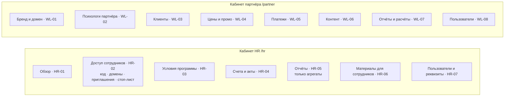

**Граница данных HR:** кабинет HR получает из ядра только агрегаты модулей B2B и ANALYTICS; обращения к данным отдельных сотрудников архитектурно недоступны (нет эндпоинтов), а не просто скрыты в интерфейсе.

**Граница данных партнёра:** все запросы кабинета партнёра выполняются в контексте его тенанта (BR-WL-01).

---

## 11. Сквозные процессы между контурами

### 11.1. Цикл клиента

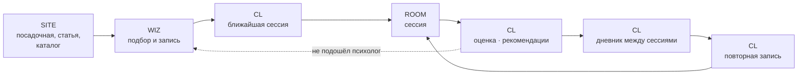

### 11.2. Цикл денег

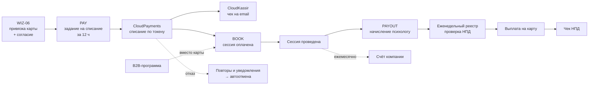

### 11.3. Цикл контента

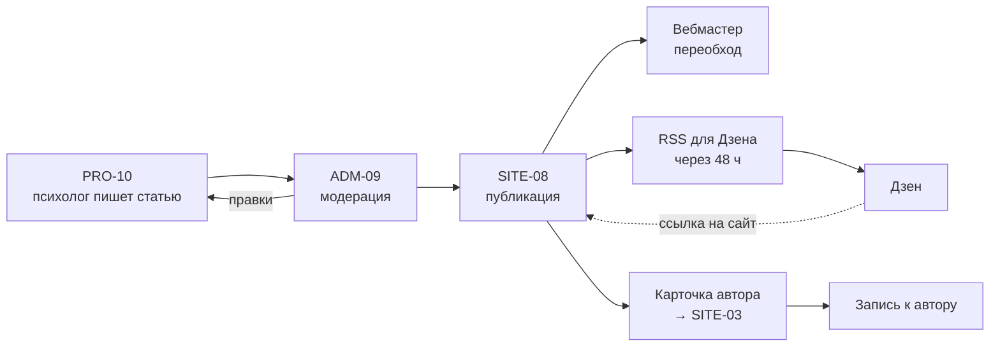

### 11.4. Цикл качества

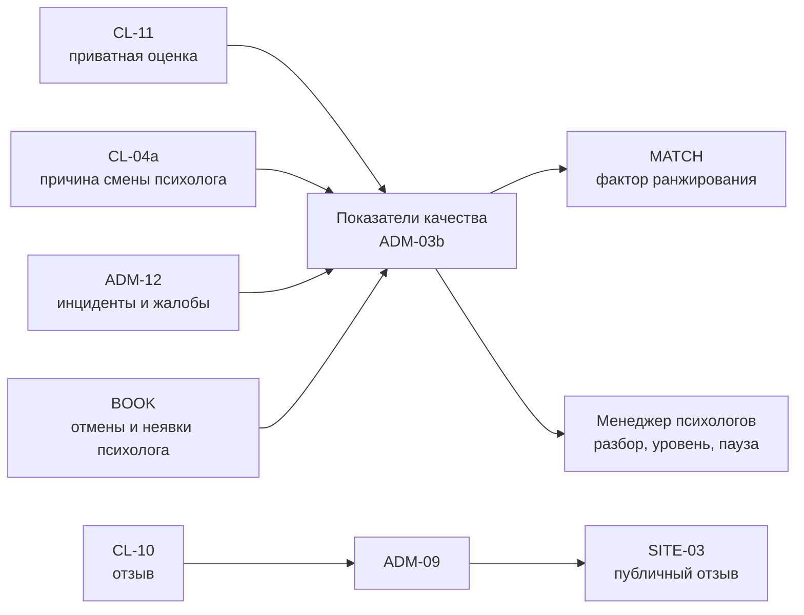

### 11.5. Цикл корпоративной программы

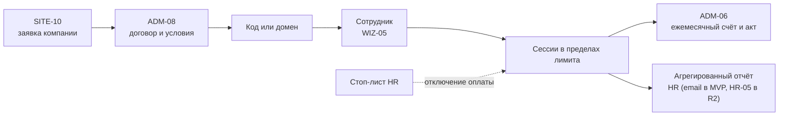

---

## 12. Матрица «контур × модуль»

| Модуль | SITE | WIZ | CL | ROOM | PRO | HR | WL | ADM |
|---|---|---|---|---|---|---|---|---|
| AUTH | ○ | ● | ● | ● | ● | ● | ● | ● |
| CONSENT | ● | ● | ● | ○ | ● | ○ | ○ | ● |
| TENANT | ○ | ○ | ○ | ○ | ○ | ○ | ● | ● |
| AUDIT | — | — | — | — | ○ | — | ○ | ● |
| PROFILE | — | ● | ● | — | — | — | — | ● |
| MATCH | ○ | ● | ○ | — | ○ | — | — | ● |
| AIBOT | — | ● | — | — | ○ | — | — | ● |
| CATALOG | ● | ● | ○ | — | ○ | — | ○ | ● |
| PSY | ○ | — | — | — | ● | — | ● | ● |
| SCHED | ● | ● | ● | — | ● | — | — | ● |
| BOOK | — | ● | ● | ● | ● | ○ | ○ | ● |
| VIDEO | — | ○ | ○ | ● | ○ | — | — | ● |
| DIARY | — | ○ | ● | ○ | ● | — | — | ○ |
| RECO | — | — | ● | — | ● | — | — | ○ |
| CRM | — | — | — | ● | ● | — | — | — |
| PAY | ○ | ● | ● | — | — | — | ● | ● |
| PAYOUT | — | — | — | — | ● | — | ○ | ● |
| PROMO | ○ | ● | ● | — | — | — | ● | ● |
| B2B | ○ | ● | ● | — | — | ● | ○ | ● |
| REVIEW | ● | — | ● | — | ● | — | — | ● |
| CONTENT | ● | — | ○ | — | ● | — | ○ | ● |
| KB | — | — | ○ | — | ● | — | — | ● |
| COMM | — | — | — | — | ● R2 | — | — | ● |
| EVENT | ● | — | ○ | — | ○ | ○ | — | ● |
| NOTIF | — | ● | ● | — | ● | ● | ● | ● |
| SUPPORT | ● | ● | ● | ● | ● | ● | ● | ● |
| CRISIS | ● | ● | ● | ● | ● | — | — | ● |
| CMS | ● | ○ | ○ | — | — | — | ● | ● |
| SEARCH | ● | — | — | — | ● | — | — | ● |
| FILES | ○ | — | ○ | — | ● | ○ | ● | ● |
| ANALYTICS | ● | ● | ● | ● | ● | ● | ● | ● |
| ADMIN | — | — | — | — | — | — | — | ● |

● основной пользователь модуля · ○ использует частично · — не использует. Модуль CRM (заметки психолога) недоступен админ-панели намеренно.

---

## 13. Архитектурные принципы продукта

| № | Принцип | Как проявляется |
|---|---|---|
| 1 | Одно ядро — много интерфейсов | Все контуры работают через единый API; бизнес-правила — в модулях |
| 2 | Конфиденциальность как свойство архитектуры | Сведения о здоровье — отдельные хранилища/поля с шифрованием; доступ по согласиям и ролям; «показать с причиной»; заметки психологов вне админки; HR без эндпоинтов персональных данных |
| 3 | Мультиарендность с первого дня | Признак тенанта во всех сущностях; ТЕТА — тенант по умолчанию |
| 4 | Настраиваемость без кода | Параметры правил, справочники, анкета, шаблоны писем, страницы — в админке |
| 5 | Выпуск по релизам через флаги функций | Модули R2/R3 разрабатываются в том же ядре и включаются флагами |
| 6 | SEO для публичной части, SPA для кабинетов | Серверный рендеринг сайта и посадочных; кабинеты — приложение с PWA |
| 7 | Всё время — в UTC | Отображение в поясе пользователя (BR-SCHED-01) |
| 8 | События как основа уведомлений и аналитики | Изменения статусов сессий, платежей, модерации публикуют события; уведомления и аналитика на них подписаны |
| 9 | Данные в РФ | Все хранилища, видеосервер, LLM и сервисы с ПДн — в РФ (BR-ACC-10) |
| 10 | Бережный UX как требование | Состояния ошибок, пустые состояния и удерживающие сценарии проектируются вместе с основными |
